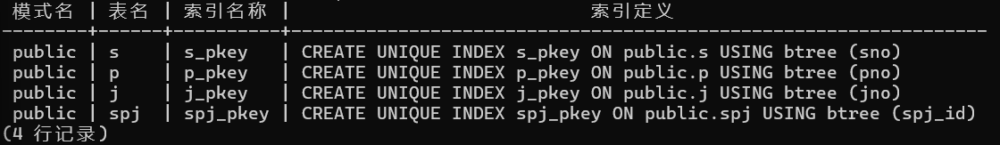
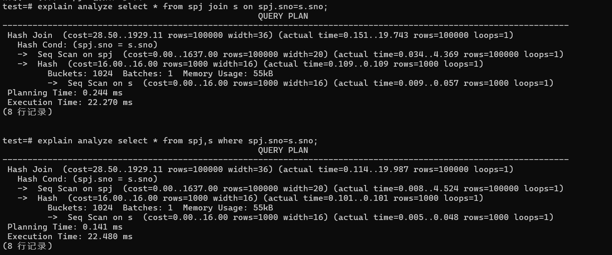
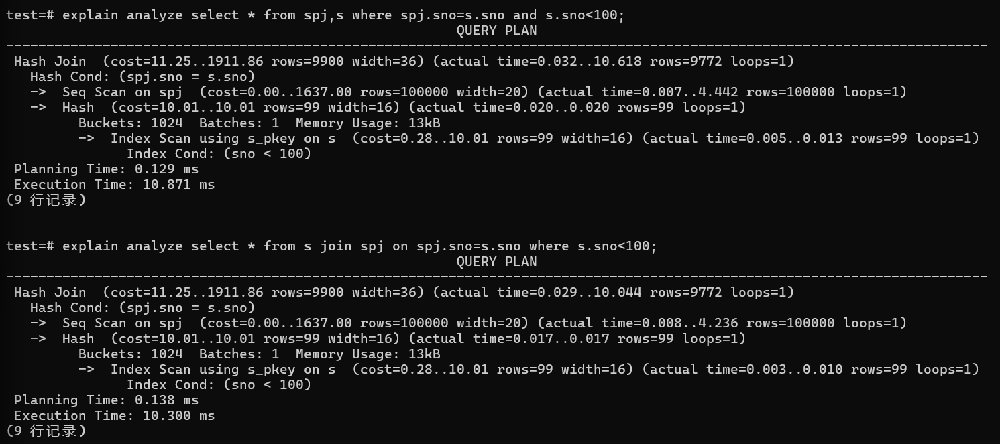
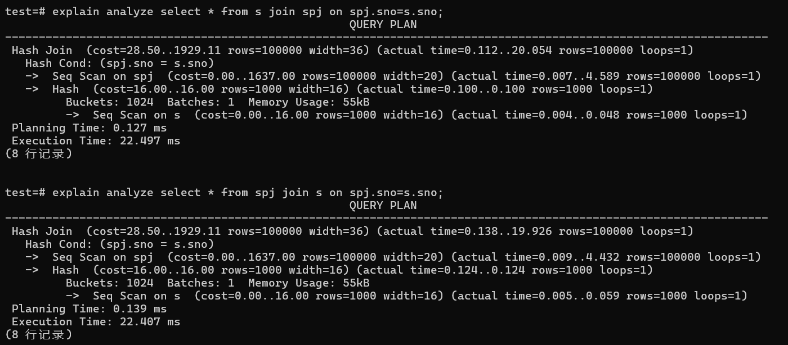
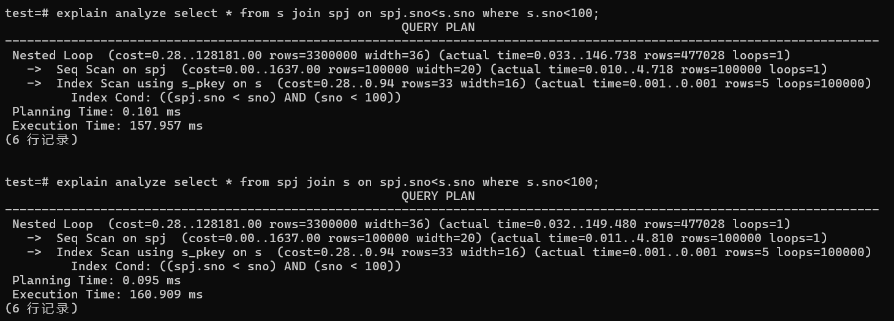

#### 1.多表连接使用inner join还是where的效率测试

虽然使用inner join和where可以达到一样的效果,但我们比较好奇其效率是否会有差别

> 参考lab6 pg 查询优化与执行计划初探,
>
> 使用explain语句测试,
>
> 数据与索引格式与lab6相同.
>
> ```SQL
> create table S (Sno int , Sname char(6), City char(4), primary key(Sno));
> create table P (Pno int , Pname char(6), weight int, primary key(Pno));
> create table J (Jno int , Jname char(6), City char(4), primary key(Jno));
> create table SPJ ( SPJ_ID int, Sno int, Pno int, Jno int, QTY int, 
>                    primary key(SPJ_ID), foreign key(Sno) references S(Sno),
>                    foreign key(Pno) references P(Pno), foreign key(Jno) references J(Jno));
> ```

s表数据1000条,p表数据50条,j表数据5000条,spj表数据100000条.

索引仅建在各表的主键



在这里,我们只讨论inner join on和where的效率区别,

因为outer join和where 返回的数据并不一样,在实际使用时按需选择即可


##### ①普通不使用索引的连接



多次尝试均为此结果, 证明,使用join和where连接实际上效率是一致的(查询计划也完全相同)


###### ②增加where过滤条件,使用部分索引



同样,查询计划完全相同


##### ③A join B与B join A 



查询计划完全相同,

这表明A join B还是B join A都会被数据库优化以最高效率执行,我们无需关心



在使用较为复杂的查询时,虽然随着where语句和on的筛选条件的改变,可能改变表的大小和连接方式

(比如使用`on spj.sno<s.sno`会变成嵌套扫描连接)

但在不改变其他语句的情况下,A join B或是B join A仍然会以同样的最佳查询计划执行.

会被数据库优化.


##### ④ 关于数据特征导致的查询变化


where中使用spj.sno<100还是s.sno<100会改变查询计划,

这其实很显然,因为在s.sno上有索引可以用来扫描.

spj.sno<100还是s.sno<100会返回一样的结果(因为`join on spj.sno=s.sno`),似乎在有索引的表s上筛选条件之后再连接会效果更好

但其实因为在sno表上筛选会大大降低哈希连接时spj表的大小(从100000降至9972),这个效果可以使连接操作耗时更短.

这有一定启发性,说明在涉及到连接操作时,进行筛选,可能应该更优先需要在最大的表上筛掉一些值,从而降低连接的耗时, 即使是其他表上存在索引可以用于筛选!

(当然,是否可以这么做非常关系到数据的分布实际情况)


##### 总结

我们的实验证明, inner join和where的效率是一样的(见①和②)

且A join B还是B join A没有区别(见③)

连接时,如果存在一个表很大，可能优先考虑是否能将其筛选条件直接应用在大表上,即使小表上存在索引(见④)

此外,因为where属于隐连接,还是推荐使用join来写sql.


#### 8.将已经完成的订单定期转存到old_order

new_order表需要保证可以容许较大吞吐量,也需要建立索引.但现在的版本中存储了很多过去已经received或canceled的订单,这影响了新订单的插入速度,且这些旧订单不可能被更改,仅仅可以提供给用户来查询

因此,我们把已经完成的订单转存于old_order中,并设计相似的接口.

这样可以保证用户激情下单时,插入new_order的速度.

