#### 1.多表连接使用inner join还是where的效率测试

虽然使用inner join和where可以达到一样的效果,但我们比较好奇其效率是否会有差别

> 参考lab6 pg 查询优化与执行计划初探,
>
> 使用explain语句测试,
>
> 数据与索引格式与lab6相同.
>
> ```SQL
> create table S (Sno int , Sname char(6), City char(4), primary key(Sno));
> create table P (Pno int , Pname char(6), weight int, primary key(Pno));
> create table J (Jno int , Jname char(6), City char(4), primary key(Jno));
> create table SPJ ( SPJ_ID int, Sno int, Pno int, Jno int, QTY int, 
>                    primary key(SPJ_ID), foreign key(Sno) references S(Sno),
>                    foreign key(Pno) references P(Pno), foreign key(Jno) references J(Jno));
> ```

s表数据1000条,p表数据50条,j表数据5000条,spj表数据100000条.

索引仅建在各表的主键


在这里,我们只讨论inner join on和where的效率区别,

因为outer join和where 返回的数据并不一样,在实际使用时按需选择即可


##### ①普通不使用索引的连接


多次尝试均为此结果, 证明,使用join和where连接实际上效率是一致的(查询计划也完全相同)


###### ②增加where过滤条件,使用部分索引


同样,查询计划完全相同


##### ③A join B与B join A 


查询计划完全相同,

这表明A join B还是B join A都会被数据库优化以最高效率执行,我们无需关心


在使用较为复杂的查询时,虽然随着where语句和on的筛选条件的改变,可能改变表的大小和连接方式

(比如使用`on spj.sno<s.sno`会变成嵌套扫描连接)

但在不改变其他语句的情况下,A join B或是B join A仍然会以同样的最佳查询计划执行.

会被数据库优化.


##### ④ 关于数据特征导致的查询变化


where中使用spj.sno<100还是s.sno<100会改变查询计划,

这其实很显然,因为在s.sno上有索引可以用来扫描.

spj.sno<100还是s.sno<100会返回一样的结果(因为`join on spj.sno=s.sno`),似乎在有索引的表s上筛选条件之后再连接会效果更好

但其实因为在sno表上筛选会大大降低哈希连接时spj表的大小(从100000降至9972),这个效果可以使连接操作耗时更短.

这有一定启发性,说明在涉及到连接操作时,进行筛选,可能应该更优先需要在最大的表上筛掉一些值,从而降低连接的耗时, 即使是其他表上存在索引可以用于筛选!

(当然,是否可以这么做非常关系到数据的分布实际情况)


##### 总结

我们的实验证明, inner join和where的效率是一样的(见①和②)

且A join B还是B join A没有区别(见③)

连接时,如果存在一个表很大，可能优先考虑是否能将其筛选条件直接应用在大表上,即使小表上存在索引(见④)

此外,因为where属于隐连接,还是推荐使用join来写sql.


#### 8.将已经完成的订单定期转存到old_order

new_order表需要保证可以容许较大吞吐量,查询原因也需要建立索引.但现在的版本中存储了很多过去已经received或canceled的订单,这影响了新订单的插入速度,且这些旧订单不可能被更改,仅仅可以提供给用户来查询

因此,我们把已经完成的订单转存于old_order中,并设计相似的接口.

这样可以保证用户激情下单时,插入new_order的速度.


具体来说,我们在订单被卖家或者买家canceled或者被received时,将订单从new_order表中delete并插入old_order.

```python
cur.execute('insert into old_order select * from new_order where order_id=%s',(order_id,))
cur.execute('delete from new_order where order_id=%s',(order_id,))
```

并在search_order等一些操作中加入对old_older的考虑.

```python
#也在已完成的订单中查找
cur.execute("SELECT order_id FROM old_order WHERE buyer_id = %s", (user_id,))
orders = cur.fetchall()
for od in orders:
    result.append(od[0])
```


#### 10.安全限制:金额上限

为了尽量保证我们的程序不需要处理十分"例外"的情况,并防止数据库中某些数值溢出, 我们对于一些操作设置了安全上限,

并在test中有对应的测试.

这些参数我写在了*bookstore\be\conf.py*中,  在其他代码中调用*conf.py*的值,

若需修改仅修改conf即可

```python
Store_book_type_limit=100
Add_amount_limit=10000000000
Order_amount_limit=100000000
Order_book_type_limit=100
```


##### ①单个订单选择的书本类别的数量上限

*bookstore\be\model\buyer.py*

```python
#订单书本类型数目超限
if len(id_and_count)>Order_book_type_limit:
	return error.error_order_book_type_ex(order_id)+ (order_id, )
```


##### ②单个订单总金额上限

*bookstore\be\model\buyer.py*

```python
#订单金额超限
if sum_price>Order_amount_limit:
	return error.error_order_amount_ex(order_id)+ (order_id, )
```


##### ③商店书类别总量上限

*bookstore\be\model\seller.py*

```python
#书籍超出Store_type_limit
cur.execute('select count(1) from book_info where store_id=%s',(store_id,))
ret=cur.fetchone()
if ret[0]>=Store_book_type_limit:
	return error.error_store_book_type_ex(store_id)
```

PS:我们把Store_book_type_limit设置为100,是因为对应测试会持续在一个商店中插入超过Store_book_type_limit的书,  并检测的确返回了`error_store_book_type_ex`错误,  因此设置limit较低可以尽量减少这个测试的时间

实际使用时,可以将Store_book_type_limit设置为1000或更高, 意为一个店中最多有1000种书.


#####  ④用户单次充值上限

*bookstore\be\model\buyer.py*

```python
elif add_value>Add_amount_limit:#用户添加金额超限
	return error.error_add_amount_ex()
```


实际上,业务级别的项目需要对于这样的上限做更完备的考虑.


#### 15.大文本/图片存nosql数据库, sql数据库和文件系统的效率对比

测试了大文件的存储效率

测试代码位于*Project_1\test_where_picture.py*, 与*bookstore*文件夹处于同一目录下

图片数据比较具有代表性,我们测试了图片存储的方法.

对比了三种:存储于mongodb, postgres, 文件系统

结果如图:

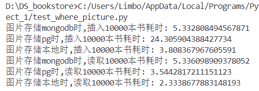

结论为存储在本地效率最佳


具体测试方法:


##### 1)表结构设置

###### ①图片存储于mongodb时,

mongodb中应该有img"表",   属性为bid(string),pic(base64)

并在bid上建立索引

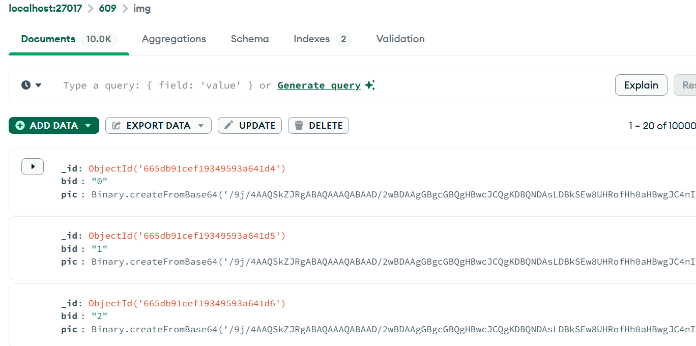

postgres中有test_img_1表, 属性为bid(varchar),  info(varchar)

(此表模拟存储book信息,info属性为book表中存储的一些相关信息如标题,作者等)


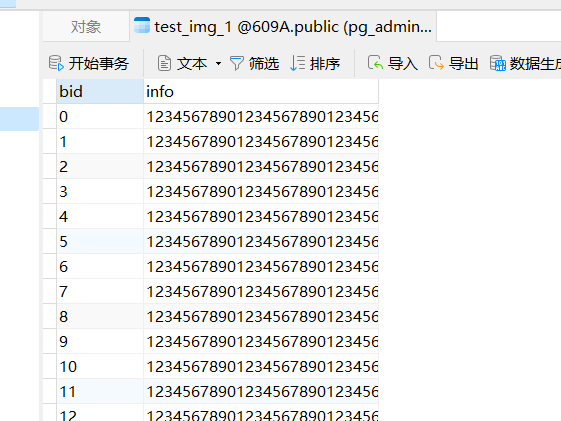


###### ②图片存储于postgres时,

应该只使用一张test_img_2表, 属性为bid(varchar),  info(varchar), pic(TEXT)  存储base64编码.

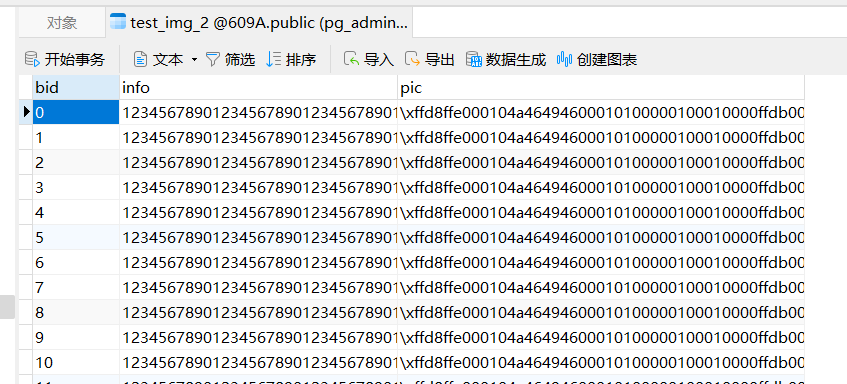


###### ③图片存储于本地时,

本地存储图片于文件夹中,此外使用一张test_img_3 ,属性为bid(varchar),  info(varchar) 模拟book信息

(类似test_img_1)

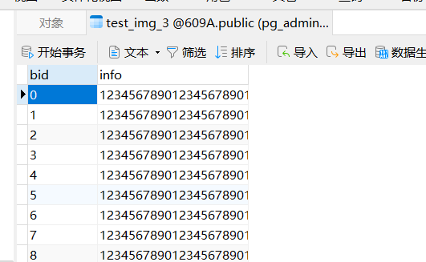


##### 2)插入10000书籍测试

###### ①mongodb

一本书插入的逻辑为:  先插入pg中test_img_1信息,  再插入mongodb中img

重复10000次,记录总用时

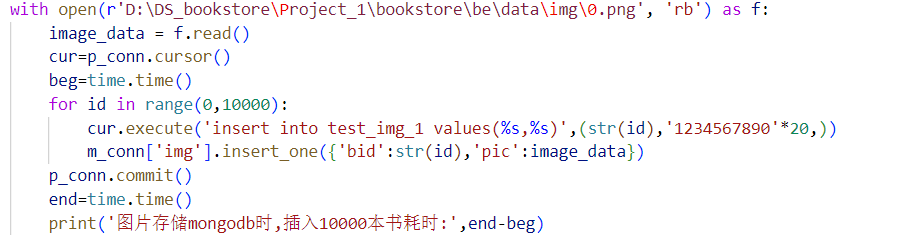

###### ②pg

一本书插入的逻辑为:  将bid,info,img一并插入到test_img_2中

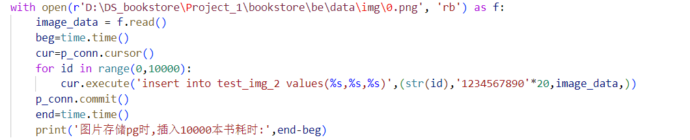


###### ③文件系统

一本书插入的逻辑为:  将bid,info,插入到test_img_3中, 将图片保存在文件夹中

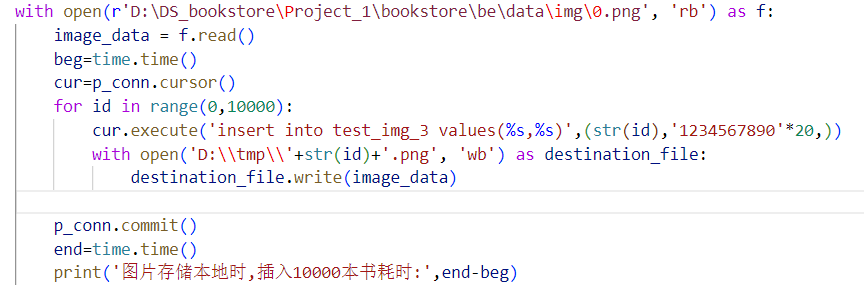


##### 3)读取10000本测试

###### ①mongodb

读取一本书:  先读取pg中test_img_1,再读取mongo中对应img

###### ②pg

读取一本书:  读取pg中test_img_2,即可全部读出

###### ③文件系统

读取一本书:  先读取pg中test_img_3,再读取本地文件


##### 4)结果分析

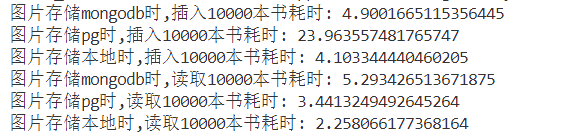

结果证明,图片保存在本地的速度略快于保存在mongodb中的速度.

保存在pg中的速度非常慢


读出图片时,保存在pg中快于保存在mongodb中,

这是因为保存在pg中仅仅需要读取一次即可读出全部数据.

而保存在mongodb时,  需要读取pg数据再读取mongodb数据,读取两次

但保存在文件系统中依旧最快.只需要在pg中读取少量数据一次.


综上,我们将img(书封面), book_intro(书籍简介), auth_intro(作者简介), content(书籍目录)这四类比较大的文件保存在了本地.目录结构如下:

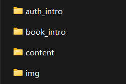

*bookstore\be\data\auth_intro*文件夹  存储作者简介 ,文件名为*id.txt*

*bookstore\be\data\book_intro*文件夹  存储书籍简介 ,文件名为*id.txt*

*bookstore\be\data\content*文件夹  存储目录 ,文件名为*id.txt*

eg:

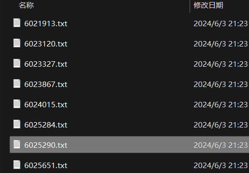

*bookstore\be\data\img*文件夹  存储作者简介 ,文件名为*id.png*

eg:


