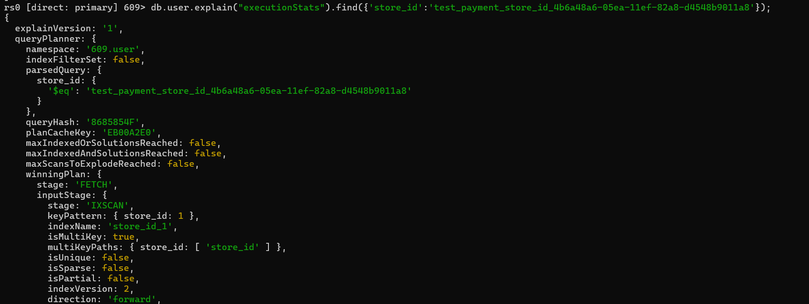
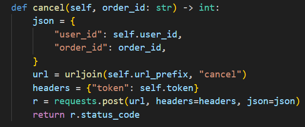
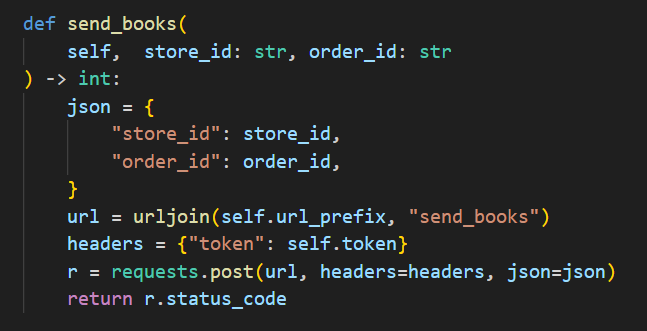
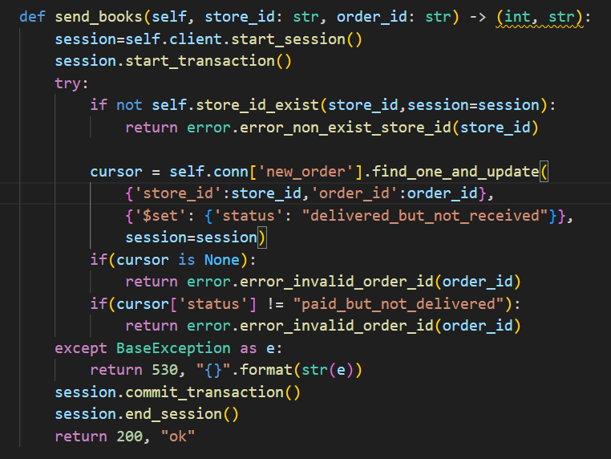
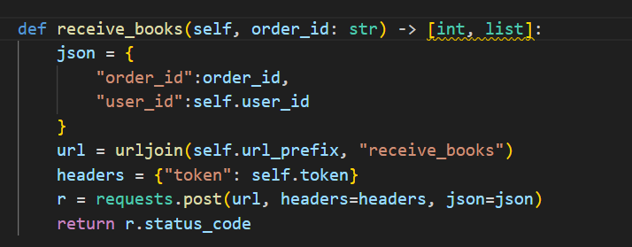
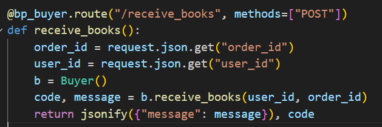
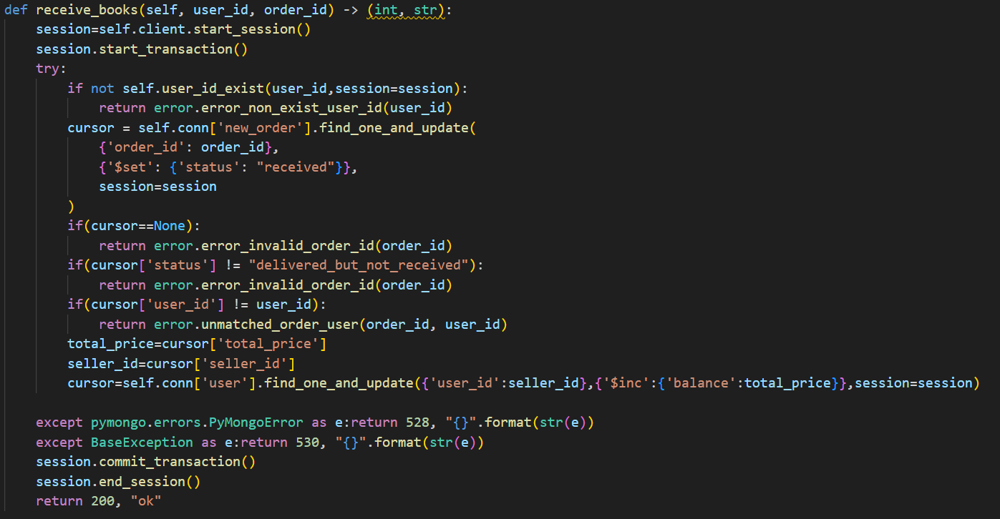

---

---

# 华东师范大学数据科学与工程学院实验报告

| 课程名称：数据管理系统       | 年级：2022级 | 实践日期：2024.4 |
| ---------------------------- | ------------ | ---------------- |
| 实践名称：Project1 bookstore | 组别:     五 |                  |

---


## 环境配置

### 1.

由于本项目将所有原sqlite数据（包括book.db和book_lx.db）迁移到了mongodb中，因此请确保在运行前在您的环境的mongodb的“609”数据库中创建名为book和book_lx的集合，并在其中填入适当的数据。具体数据可以使用原项目提供的book_lx.db的数据。

### 2.

由于本项目使用了mongodb的事务处理功能以确保正确性，所以请确保在运行前将您的环境的mongodb切换成分片模式（mongodb不支持单机状态的事务处理）。

具体步骤：

1.找到mongodb/bin目录下的mongod.cfg文件，并向其中加入：

```
replication:
  replSetName: rs0
```

2.重启mongodb服务（如果无法重启也可以选择重启电脑来完成“硬核”重启）

3.打开shell，执行mongosh命令，并输入：

```
rs.initiate()
```

如果返回成功信息即可。

参考教程：[mongoDB5以上实现单机事务_springboot mongodb实现事务-CSDN博客](https://blog.csdn.net/qq_41369135/article/details/129204920)

只需要执行该教程的前两步。

##  Ⅰ 组员信息与分工

### 组员

本小组为第五组,组员为

XXX 10225101XXX

XXX 10225101XXX

XXX 10225101XXX


### 分工

#### 小人鱼 10225101483

实现查找书籍功能及其测试

增加事务处理

重新实现buyer原有功能，即创建新订单与支付模块

#### 徐翔宇 10225101535

实现功能：主动取消订单、卖家发货、买家收货、搜索买家订单、搜索卖家订单、搜索订单详细信息，以及各功能测试

在性能测试增加对取消订单、发货、收货的测试以及正确性检查

增加多个用户对热门书并发购买的正确性测试

设计部分索引

以及部分bug fix，代码改进/更新，和mongodb语句优化。

#### XXX 10225101XXX

(分工内容)

#### XXX 10225101XXX

(分工内容)

## Ⅱ  设计


## Ⅲ  功能&亮点

### 1 书本查询功能

功能参考当当网、中图网的高级搜索页面以及豆瓣的图书搜索页面：


#### 后端接口

代码路径：be/view/book.py

```
@bp_auth.route("/search_book",methods=["POST"])
def search_book():
    searchbook=searchBook()
    page_no=request.json.get("page_no","")
    page_size=request.json.get("page_size","")
    foozytitle=request.json.get("foozytitle",None)
    reqtags=request.json.get("reqtags",None)
    id=request.json.get("id",None)
    isbn=request.json.get("isbn",None)
    author=request.json.get("author",None)
    lowest_price=request.json.get("lowest_price",None)
    highest_price=request.json.get("highest_price",None)
    lowest_pub_year=request.json.get("lowest_pub_year",None)
    highest_pub_year=request.json.get("highest_pub_year",None)
    store_id=request.json.get("store_id",None)
    publisher=request.json.get("publisher",None)
    translator=request.json.get("translator",None)
    binding=request.json.get("binding",None)
    order_by_method=request.json.get("order_by_method",None)
    having_stock=request.json.get("having_stock",None)
```

前端调用时必须填写的参数包括当前页数以及页大小（每页显示几本书信息），其他为可选参数，如模糊标题、标签列表、书本id等。

特殊参数：

foozytitle意为书本title必须包含该子串。

reqtags意为书本的tags必须包含reqtags中的所有tags（例如查找即“浪漫”又“哲学”的书）。

lowest_price是最低价格，highest_price是最高价格。

lowest_pub_year是最早发布年份，highest_pub_year是最晚发布年份。

order_by_method是排序参数。可以选择按照书本的现货量，销量，发布年份，价格 四种方式排序，并且可以选择排序顺序（正序或倒序）。

having_stock表明要筛选出现在有货的书本。

store_id表明要查询的书属于的商店，如果为空则查询所有商店。

#### 后端逻辑：

后端实现为返回所有要求的交集。例如：

​	参数：page_no=1,page_size=7,lowest_price=1,highest_price=10,having_stock=True,author="小强",order_by_method=("price",-1)

返回的是价格在1\~10之间且有货且作者为小强的七本书本，他们是满足这些条件的书本中价格第8\~14贵的（page_no起始为0，因此这是第二页的七本书；排序参数中的-1表示倒序）。

返回值以json格式的列表呈现。列表中的每个元素是一个json格式的书本信息。书本信息本身是字典。

#### 数据库操作：

代码路径：be/model/book.py

```python
cursor = self.conn['store'].find(conditions,limit=page_size,skip=page_size*page_no,sort=sort)
```

其中conditions是所有参数要求的交集。详细到每个参数的实现请见代码本身。

sort为排序规则。

另一种等价实现：

```python
cursor = self.conn['store'].find(conditions).limit(xxx).skip(xxx).sort(xxx)
```

在实现过程中误以为将limit、skip、sort写在find内会更高效，但后续经过实验验证两者应该是等效的。且后者的limit，skip，sort的先后顺序是没有影响的。

#### 代码测试

代码路径：fe/test/test_search_book.py

对上述参数都有测试。包括但不限于：模糊标题，翻译者，标签，出版商，是否有存货，指定商家，是否有货，正序倒序排序等。

错误检查测试包含有指定商家参数的情况下对商家是否存在的检查。没有满足查询需求的书的情况（例如查找的作家不存在）不视为错误情况。

#### 亮点：索引

所有索引：

```
self.conn["store"].create_index({"store_id":1})
        self.conn["store"].create_index({"book_info.translator":1})
        self.conn["store"].create_index({"book_info.publisher":1})
        self.conn["store"].create_index({"book_info.stock_level":1})
        self.conn["store"].create_index({"book_info.price":1})
        self.conn["store"].create_index({"book_info.pub_year":1})
        self.conn["store"].create_index({"book_info.id":1})
        self.conn["store"].create_index({"book_info.isbn":1})
        self.conn["store"].create_index({"book_info.author":1})
        self.conn["store"].create_index({"book_info.binding":1})
        self.conn['store'].create_index({'book_info.title':'text'})
```

1.

对book_info.title创建全文索引。mongodb的中文全文索引的逻辑和英文全文索引一样，是以空格分隔的单词为粒度的（例如"a good day"被分为a，good，day）。因此其能力较弱，如查询“生”无法查找到“生死遗言”。但可以通过查询“小品”查找到“小品 1”。


使用explain可以发现全文索引被使用。


2.

对其他会使用到的需求建立普通索引。由于大部分情况下单个条件就足以有选择性，能够筛选出少量满足效果的数据，因此不考虑建立复合索引。

### 创建新订单

#### 后端接口

```
@bp_buyer.route("/new_order", methods=["POST"])
def new_order():
    user_id: str = request.json.get("user_id")
    store_id: str = request.json.get("store_id")
    books: [] = request.json.get("books")
```

参数为买家id，目标商店id，购买的书的id以及数量的列表。

#### 后端逻辑

在user表中查询商店属于的卖家。（利用数组索引加速查询）

对书籍列表中的每本书尝试将其数量减少相应的购买数量，如果书本数量不足则回滚事务，保证了整个操作的原子性和正确性。（查询方面使用store_id或book_id索引查询并更新）

在new_order 表中插入该订单，包含了买家，卖家，商店，书籍与购买数量列表。

#### 数据库操作

代码路径：be/model/buyer.py 的 new_order 函数

```python
		   session=self.client.start_session()
            session.start_transaction()
            if not self.user_id_exist(user_id,session=session):
                return error.error_non_exist_user_id(user_id) + (order_id,)

            res=self.conn['user'].find_one({'store_id':store_id},{'user_id':1},session=session)
            if res is None:
                return error.error_non_exist_store_id(store_id) + (order_id,)
            seller_id=res['user_id']

            uid = "{}_{}_{}".format(user_id, store_id, str(uuid.uuid1()))
            sum_price=0
            for book_id, count in id_and_count:
                cursor=self.conn['store'].find_one_and_update({'store_id':store_id,'book_id':book_id},{"$inc":{"stock_level":-count,"sales":count}},session=session)
                results=cursor
                if results==None:
                    return error.error_non_exist_book_id(book_id) + (order_id,)
                stock_level = int(results['stock_level'])
                book_info = results['book_info']
                price = book_info["price"]
                if stock_level < count:
                    return error.error_stock_level_low(book_id) + (order_id,)
                sum_price += price * count
            self.conn['new_order'].insert_one({'order_id':uid,'store_id':store_id,'seller_id':seller_id,'user_id':user_id,'status':'unpaid','order_time':int(time.time()),'total_price':sum_price,'detail':id_and_count},session=session)
            session.commit_transaction()
```

使用find_one_and_update对单本书同时进行查询和更新，将两次查询简化为一次查询。并且由于做了事务处理，所以更新后stock_level如果变为负数，或者之后的某本书库存不足，所有书也会被回滚至原先状态。

#### 代码测试

代码路径：fe/test/test_new_order.py

是原本代码中已写好的test。包括了正确执行的检查，和对非法的书id，用户id，商店id，以及书库存不足的错误处理检查。

#### 亮点：表结构改动与索引

用户与商店的从属关系不再使用原先额外的user_store表记录，而是给每个卖家user记录其管理的商店列表（如果一个user不是卖家，则它的文档中没有这一属性）。另一种没有采用的方案是在store表中给每个商店记录其卖家。但由于store表中一个文档代表着一个store中的一本book，所以存储的user数量会等于book数量，因此造成了冗余。例如：10个用户，每个用户有2家商店，每家商店10本书，则每个用户的id在store表中要存20次（2*10），总数为10\*20=200次。而我们的设计并无冗余，因为每家商店仅属于一个用户。

在这种表结构的基础上，我们计划对store_id列表建立数组索引来加快通过store_id查询其所属卖家的user_id的查询。

通过explain可以看到根据store_id的查询使用了我们对store_id建立的索引。



### 支付功能

我们的逻辑是用户支付后的钱并不会立刻转达给商家，仅在用户收到货物后才给商家增加相应的金额。

#### 后端接口

```python
@bp_buyer.route("/payment", methods=["POST"])
def payment():
    user_id: str = request.json.get("user_id")
    order_id: str = request.json.get("order_id")
    password: str = request.json.get("password")
```

参数为支付的用户id，订单id以及用户密码。

#### 后端逻辑

```python
cursor=conn['new_order'].find_one_and_update({'order_id':order_id,'status':"unpaid"},{'$set':{'status':'paid_but_not_delivered'}},session=session)
            if cursor is None:
                return error.error_invalid_order_id(order_id)
            order_id = cursor['order_id']
            buyer_id = cursor['user_id']
            seller_id = cursor['seller_id']
            if not self.user_id_exist(seller_id,session=session):
                return error.error_non_exist_user_id(seller_id)
            total_price = cursor['total_price']
            if buyer_id != user_id:
                return error.error_authorization_fail()
            cursor=conn['user'].find_one_and_update({'user_id':user_id},{'$inc':{'balance':-total_price}},session=session)
            if cursor is None:
                return error.error_non_exist_user_id(buyer_id)
            if password != cursor['password']:
                return error.error_authorization_fail()
            if(cursor['balance']<total_price):
                return error.error_not_sufficient_funds(order_id)
```

正确性检查：检查用户是否存在，用户密码是否存在，用户金额是否充足，订单是否存在且状态是否正确，订单是否属于该用户，订单对应的卖家是否仍然存在。

通过正确性检查后，给用户减少订单对应的金额数，并改变订单的状态为“已支付，未发货”（该状态下用户仍能够主动取消订单）。

由于使用了事务处理和find_one_and_update，可以将原本的多条查询语句（检查用户合法，检查订单合法，更新用户金额，更新订单状态）合并成两句查询且仍能够保证操作的正确性。并且由于在新的表结构中我们的new_order中存入了订单对应的总价格，因此不需要通过遍历

#### 数据库操作

#### 代码测试

#### 亮点


### 2 买家取消订单

由买家主动发起


#### 前端接口：

代码路径：fe\access\buyer.py



前端须填写的参数包括用户id：`user_id`和订单号：`order_id`。


#### 后端接口：

代码路径：be/view/buyer.py


#### 后端逻辑：

若订单处于未支付状态，买家可以直接取消订单，书籍会加回店铺的库存中；若买家已支付订单但尚未发货，则会将支付的扣款返还买家的账户，书籍同样会加回店铺的库存中。只有买家本人可以主动取消订单。

状态码code：默认200，结束状态message：默认"ok"


#### 数据库操作：

代码路径：be/model/buyer.py

```python
cursor=self.conn['new_order'].find_one_and_update({'order_id':order_id},{'$set': {'status': "canceled"}},session=session)
```

该sql作用为：通过对应`order_id`找到唯一订单，将该订单状态`status`更新为`canceled`，使用`session`防止订单状态异常。


```python
detail=list(cursor['detail'])
self.conn['store'].update_one({'book_id':i[0],'store_id':store_id},{'$inc':{"stock_level":i[1],"sales":-i[1]}},session=session)
```

该sql作用为：将生成订单时扣除的相应书籍库存信息恢复。此处`i`为`cursor['detail']`中每个迭代对象，在`new_order`中，`detail`储存一个二维`list`包含该订单购买书籍的book_id和对应数量。


```python
total_price=cursor['total_price']
if(current_status=="paid_but_not_delivered"):
	cursor=self.conn['user'].find_one_and_update(
		'user_id':user_id},{'$inc':{'balance':total_price}},session=session)
```

该sql作用为：若订单已支付，将生成订单时扣除的金额返还买家的账户。在`user`中，`balance`储存买家的账户资金；在`new_order`中，`total_price`储存该订单支付的总金额。


#### 代码测试：

代码路径：fe/test/test_cancel_order.py

对多种场景都有测试。包括：成功取消未支付订单、成功取消已支付未发货订单、检查买家账户金额是否正常退还、检查店铺相应书籍库存是否正常恢复。

错误检查测试包含：取消错误订单号订单、取消已取消订单、取消正在运输的订单、非购买用户无权取消订单。


#### 亮点：事务处理

事务处理保证了多个数据库操作要么全部执行，要么全部不执行，在数据库发生错误或者并发环境下项目的可靠性。


### 3 卖家发货

由卖家主动发起


#### 前端接口：

代码路径：fe\access\seller.py



前端须填写的参数包括店铺id：`store_id`和订单号：`order_id`。


#### 后端接口：

代码路径：be/view/seller.py


#### 后端逻辑：

若已支付订单但尚未发货，则会将订单状态更新为`delivered_but_not_received`。

状态码code：默认200，结束状态message：默认"ok"



#### 数据库操作：

代码路径：be/model/seller.py

```python
cursor = self.conn['new_order'].find_one_and_update(
    {'store_id':store_id,'order_id':order_id},
    {'$set': {'status': "delivered_but_not_received"}},
	session=session)
```

该sql作用为：通过对应`order_id`找到唯一订单，将该订单状态`status`从`paid_but_not_delivered`更新为`delivered_but_not_received`.


#### 代码测试：

代码路径：fe/test/test_send_order.py

测试功能正确运行：成功发货（`test_ok`）。

对多种错误场景都有测试，错误检查测试包含：对未支付订单执行发货、对不存在的订单号执行发货、对不存在的`store_id`执行发货、对不匹配的`store_id`和`order_id`执行发货。


#### 亮点：事务处理帮助定位错误

数据库更新使用了`find_one_and_update`，只要满足基本条件`{'store_id':store_id,'order_id':order_id}`就会更新订单状态。但是此处仍需检查订单的原状态是否是已支付。

巧思在于：没有将订单状态为`paid_but_not_delivered`放入筛选条件，因为数据库不会返回具体的检索失败的原因。将筛选的时机从在数据库中变为在项目中，这样就可以在搜索失败的情况下定位错误原因，而不是只知道这个订单不能发送，事务处理很好地帮助我们实现了定位检索失败原因的功能，只有各种条件筛选通过才会执行数据库操作，且如果某个筛选条件出错，可以返回对应的错误码。


### 4 买家收货

由买家主动发起


#### 前端接口：

代码路径：fe\access\buyer.py



前端须填写包括用户id：`user_id`和订单号：`order_id`


#### 后端接口：

代码路径：be/view/buyer.py




#### 后端逻辑：

若订单已发货，则会将订单状态更新为`received`。

状态码code：默认200，结束状态message：默认"ok"




#### 数据库操作：

代码路径：be/model/buyer.py

```python
cursor = self.conn['new_order'].find_one_and_update(
                {'order_id': order_id},
                {'$set': {'status': "received"}},
                session=session)
```

该sql作用为：通过对应`order_id`找到唯一订单，将该订单状态`status`从`delivered_but_not_received`更新为`received`.


```python
cursor=self.conn['user'].find_one_and_update(
    {'user_id':seller_id},
    {'$inc':{'balance':total_price}},
    session=session)
```

该sql作用为：通过对应`seller_id`找到卖家账户，将该订单赚取的`total_price`加入卖家的账户资金`balance`.


#### 代码测试：

代码路径：fe/test/test_receive_order.py

测试功能正确运行：成功收货（`test_ok`）。

对多种错误场景都有测试，错误检查测试包含：对未发货订单执行收货、对不存在的订单号`order_id`执行收货、对不存在的`user_id`执行收货、对不匹配的`user_id`和`order_id`执行收货。


#### 亮点：事务处理帮助定位错误

类似卖家发货，将筛选的时机从在数据库中变为在项目中，因为数据库不会返回具体的检索失败的原因，需要通过代码找到导致检索失败错误源头，并返回错误信息。事务处理很好地帮助我们实现了定位检索失败原因的功能，只有各种条件筛选通过才会执行数据库操作，且如果某个筛选条件出错，可以返回对应的错误码。

同时，事务处理保证了不会出现类似订单状态已更新但卖家没收到资金的情况，即只执行第一句sql，没执行第二句sql就被中断。


### 5 买家搜索订单

买家搜索所有自己购买的订单


#### 前端接口：

代码路径：fe\access\buyer.py


前端须填写包括用户id：`user_id`和订单号：`order_id`


#### 后端接口：

代码路径：be/view/buyer.py


#### 后端逻辑：

若订单已发货，则会将订单状态更新为`received`。

状态码code：默认200，结束状态message：默认"ok"


#### 数据库操作：

代码路径：be/model/buyer.py

```python
cursor = self.conn['new_order'].find_one_and_update(
                {'order_id': order_id},
                {'$set': {'status': "received"}},
                session=session)
```

该sql作用为：通过对应`order_id`找到唯一订单，将该订单状态`status`从`delivered_but_not_received`更新为`received`.


```python
cursor=self.conn['user'].find_one_and_update(
    {'user_id':seller_id},
    {'$inc':{'balance':total_price}},
    session=session)
```

该sql作用为：通过对应`seller_id`找到卖家账户，将该订单赚取的`total_price`加入卖家的账户资金`balance`.


#### 代码测试：

代码路径：fe/test/test_receive_order.py

测试功能正确运行：成功收货（`test_ok`）。

对多种错误场景都有测试，错误检查测试包含：对未发货订单执行收货、对不存在的订单号`order_id`执行收货、对不存在的`user_id`执行收货、对不匹配的`user_id`和`order_id`执行收货。


#### 亮点：事务处理帮助定位错误

类似卖家发货，将筛选的时机从在数据库中变为在项目中，因为数据库不会返回具体的检索失败的原因，需要通过代码找到导致检索失败错误源头，并返回错误信息。事务处理很好地帮助我们实现了定位检索失败原因的功能，只有各种条件筛选通过才会执行数据库操作，且如果某个筛选条件出错，可以返回对应的错误码。

同时，事务处理保证了不会出现类似订单状态已更新但卖家没收到资金的情况，即只执行第一句sql，没执行第二句sql就被中断。


## Ⅳ  亮点


