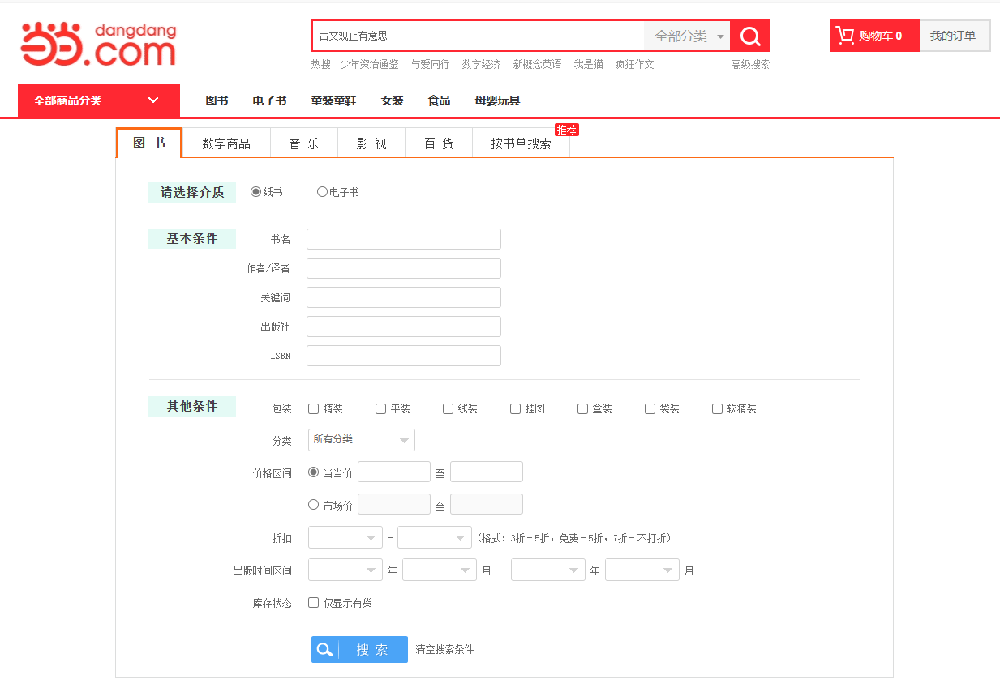
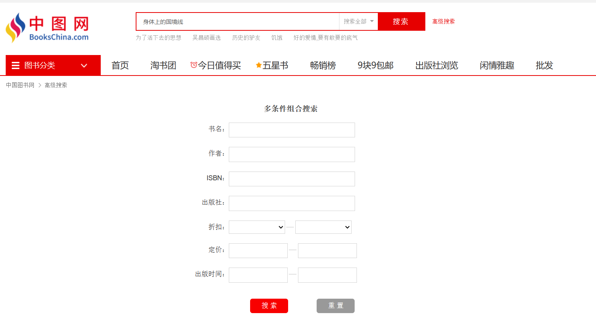
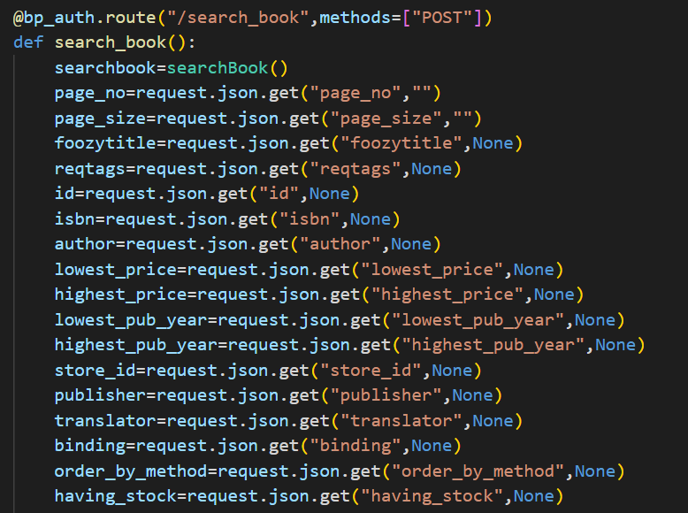
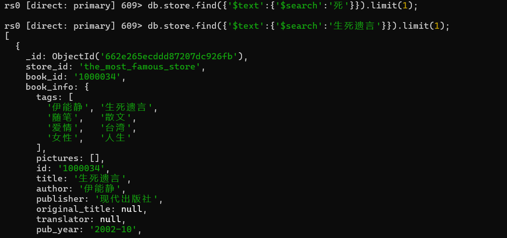
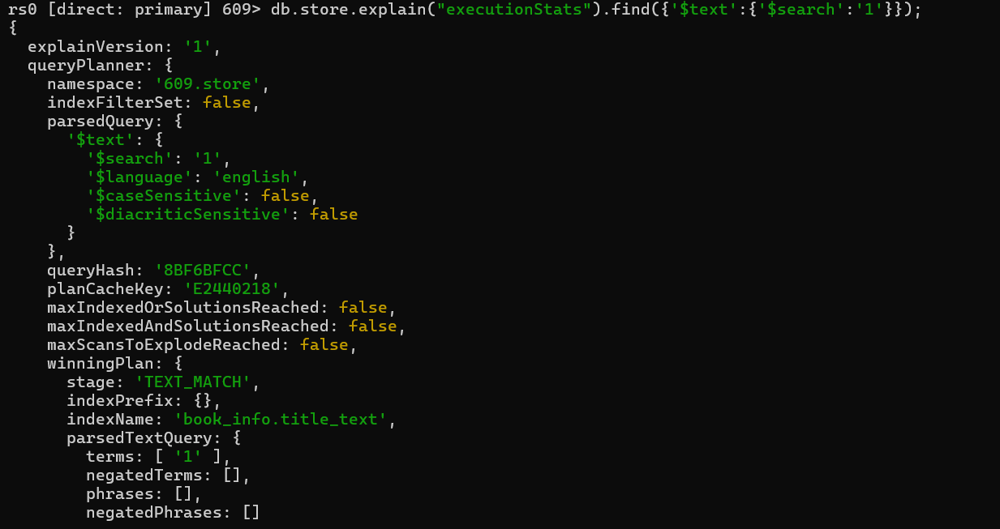
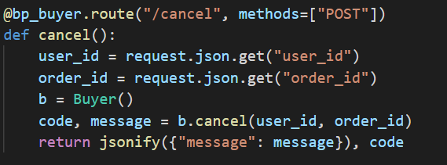
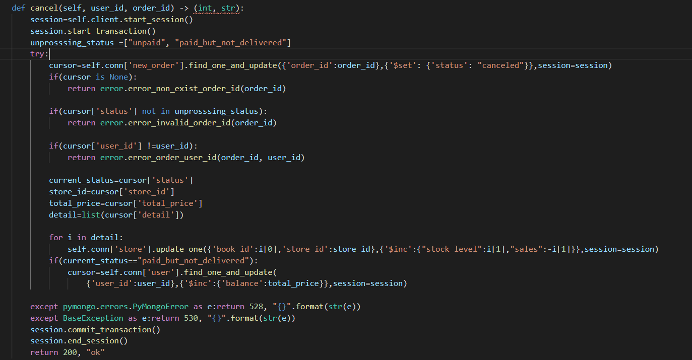
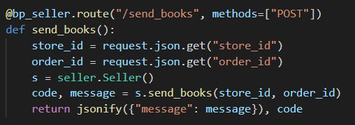
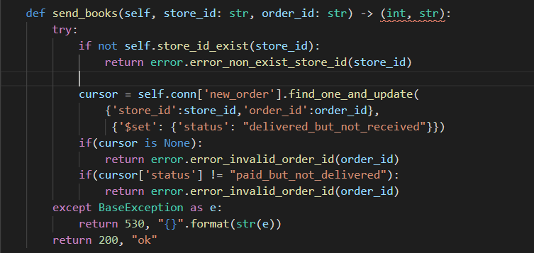

---

---

# 华东师范大学数据科学与工程学院实验报告

| 课程名称：数据管理系统       | 年级：2022级 | 实践日期：2024.4 |
| ---------------------------- | ------------ | ---------------- |
| 实践名称：Project1 bookstore | 组别:     五 |                  |

---


## 环境配置

### 1.

由于本项目将所有原sqlite数据（包括book.db和book_lx.db）迁移到了mongodb中，因此请确保在运行前在您的环境的mongodb的“609”数据库中创建名为book和book_lx的集合，并在其中填入适当的数据。具体数据可以使用原项目提供的book_lx.db的数据。

### 2.

由于本项目使用了mongodb的事务处理功能以确保正确性，所以请确保在运行前将您的环境的mongodb切换成分片模式（mongodb不支持单机状态的事务处理）。

具体步骤：

1.找到mongodb/bin目录下的mongod.cfg文件，并向其中加入：

```
replication:
  replSetName: rs0
```

2.重启mongodb服务（如果无法重启也可以选择重启电脑来完成“硬核”重启）

3.打开shell，执行mongosh命令，并输入：

```
rs.initiate()
```

如果返回成功信息即可。

参考教程：[mongoDB5以上实现单机事务_springboot mongodb实现事务-CSDN博客](https://blog.csdn.net/qq_41369135/article/details/129204920)

只需要执行该教程的前两步。

##  Ⅰ 组员信息与分工

### 组员

本小组为第五组,组员为

XXX 10225101XXX

XXX 10225101XXX

XXX 10225101XXX


### 分工

#### 小人鱼 10225101483

实现查找书籍功能，实现爬虫获取book.db数据。

(分工内容)

#### XXX 10225101XXX

(分工内容)

#### XXX 10225101XXX

(分工内容)


## Ⅱ  设计


## Ⅲ  功能&亮点

### 1 书本查询功能

功能参考当当网、中图网的高级搜索页面以及豆瓣的图书搜索页面：






#### 后端接口：

代码路径：be/view/book.py



前端调用时必须填写的参数包括当前页数以及页大小（每页显示几本书信息），其他为可选参数，如模糊标题、标签列表、书本id等。

特殊参数：

foozytitle意为书本title必须包含该子串。

reqtags意为书本的tags必须包含reqtags中的所有tags（例如查找即“浪漫”又“哲学”的书）。

lowest_price是最低价格，highest_price是最高价格。

lowest_pub_year是最早发布年份，highest_pub_year是最晚发布年份。

order_by_method是排序参数。可以选择按照书本的现货量，销量，发布年份，价格 四种方式排序，并且可以选择排序顺序（正序或倒序）。

having_stock表明要筛选出现在有货的书本。

store_id表明要查询的书属于的商店，如果为空则查询所有商店。

#### 后端逻辑：

后端实现为返回所有要求的交集。例如：

​	参数：page_no=1,page_size=7,lowest_price=1,highest_price=10,having_stock=True,author="小强",order_by_method=("price",-1)

返回的是价格在1\~10之间且有货且作者为小强的七本书本，他们是满足这些条件的书本中价格第8\~14贵的（page_no起始为0，因此这是第二页的七本书；排序参数中的-1表示倒序）。

返回值以json格式的列表呈现。列表中的每个元素是一个json格式的书本信息。书本信息本身是字典。

#### 数据库操作：

代码路径：be/model/book.py

```python
cursor = self.conn['store'].find(conditions,limit=page_size,skip=page_size*page_no,sort=sort)
```

其中conditions是所有参数要求的交集。详细到每个参数的实现请见代码本身。

sort为排序规则。

另一种等价实现：

```python
cursor = self.conn['store'].find(conditions).limit(xxx).skip(xxx).sort(xxx)
```

在实现过程中误以为将limit、skip、sort写在find内会更高效，但后续经过实验验证两者应该是等效的。且后者的limit，skip，sort的先后顺序是没有影响的。

#### 代码测试：

代码路径：fe/test/test_search_book.py

对上述参数都有测试。包括但不限于：模糊标题，翻译者，标签，出版商，是否有存货，指定商家，是否有货，正序倒序排序等。

错误检查测试包含有指定商家参数的情况下对商家是否存在的检查。没有满足查询需求的书的情况（例如查找的作家不存在）不视为错误情况。

#### 亮点：索引

所有索引：

```
self.conn["store"].create_index({"store_id":1})
        self.conn["store"].create_index({"book_info.translator":1})
        self.conn["store"].create_index({"book_info.publisher":1})
        self.conn["store"].create_index({"book_info.stock_level":1})
        self.conn["store"].create_index({"book_info.price":1})
        self.conn["store"].create_index({"book_info.pub_year":1})
        self.conn["store"].create_index({"book_info.id":1})
        self.conn["store"].create_index({"book_info.isbn":1})
        self.conn["store"].create_index({"book_info.author":1})
        self.conn["store"].create_index({"book_info.binding":1})
        self.conn['store'].create_index({'book_info.title':'text'})
```

1.

对book_info.title创建全文索引。mongodb的中文全文索引的逻辑和英文全文索引一样，是以空格分隔的单词为粒度的（例如"a good day"被分为a，good，day）。因此其能力较弱，如查询“生”无法查找到“生死遗言”。但可以通过查询“小品”查找到“小品 1”。




使用explain可以发现全文索引被使用。



2.

对其他会使用到的需求建立普通索引。由于大部分情况下单个条件就足以有选择性，能够筛选出少量满足效果的数据，因此不考虑建立复合索引。


### 2 买家取消订单

由买家主动发起


#### 后端接口：

代码路径：be/view/buyer.py



前端调用时必须填写的参数包括用户id：`user_id`和订单号：`order_id`。


#### 后端逻辑：

若订单处于未支付状态，买家可以直接取消订单，书籍会加回店铺的库存中；若买家已支付订单但尚未发货，则会将支付的扣款返还买家的账户，书籍同样会加回店铺的库存中。只有买家本人可以主动取消订单。

状态码code：默认200，结束状态message：默认"ok"




#### 数据库操作：

代码路径：be/model/buyer.py

```python
cursor=self.conn['new_order'].find_one_and_update({'order_id':order_id},{'$set': {'status': "canceled"}},session=session)
```

该sql作用为：通过对应`order_id`找到唯一订单，将该订单状态`status`更新为`canceled`，使用`session`防止订单状态异常。


```python
detail=list(cursor['detail'])
self.conn['store'].update_one({'book_id':i[0],'store_id':store_id},{'$inc':{"stock_level":i[1],"sales":-i[1]}},session=session)
```

该sql作用为：将生成订单时扣除的相应书籍库存信息恢复。此处`i`为`cursor['detail']`中每个迭代对象，在`new_order`中，`detail`储存一个二维`list`包含该订单购买书籍的book_id和对应数量。


```python
total_price=cursor['total_price']
if(current_status=="paid_but_not_delivered"):
	cursor=self.conn['user'].find_one_and_update(
		'user_id':user_id},{'$inc':{'balance':total_price}},session=session)
```

该sql作用为：若订单已支付，将生成订单时扣除的金额返还买家的账户。在`user`中，`balance`储存买家的账户资金；在`new_order`中，`total_price`储存该订单支付的总金额。


#### 代码测试：

代码路径：fe/test/test_cancel_order.py

对多种场景都有测试。包括：成功取消未支付订单、成功取消已支付未发货订单、检查买家账户金额是否正常退还、检查店铺相应书籍库存是否正常恢复。

错误检查测试包含：取消错误订单号订单、取消已取消订单、取消正在运输的订单、非购买用户无权取消订单。


#### 亮点：事务处理

事务处理保证了多个数据库操作要么全部执行，要么全部不执行，在数据库发生错误或者并发环境下项目的可靠性。


### 3 卖家send_books

由卖家主动发起


#### 后端接口：

代码路径：be/view/seller.py



前端调用时必须填写的参数包括店铺id：`store_id`和订单号：`order_id`。


#### 后端逻辑：

若已支付订单但尚未发货，则会订单状态更新为`delivered_but_not_received`。

状态码code：默认200，结束状态message：默认"ok"



#### 数据库操作：

代码路径：be/model/seller.py

```python
cursor = self.conn['new_order'].find_one_and_update(
    {'store_id':store_id,'order_id':order_id},
    {'$set': {'status': "delivered_but_not_received"}})
```

该sql作用为：通过对应`order_id`找到唯一订单，将该订单状态`status`从`paid_but_not_delivered`更新为`delivered_but_not_received`.


#### 代码测试：

代码路径：fe/test/test_send_order.py

测试功能正确运行：成功发货（`test_ok`）。

对多种错误场景都有测试，错误检查测试包含：对未支付订单执行发货、对错误订单号订单执行发货、对错误`store_id`订单执行发货。


#### 亮点：事务处理

事务处理保证了多个数据库操作要么全部执行，要么全部不执行，在数据库发生错误或者并发环境下项目的可靠性。


## Ⅳ  亮点

