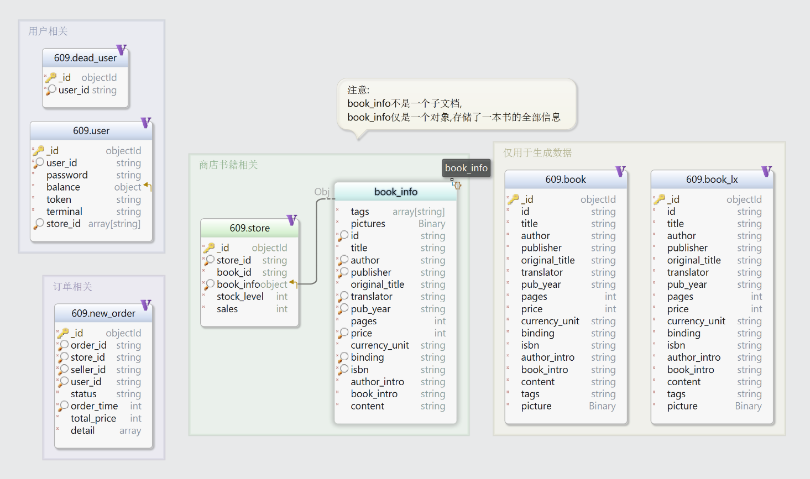

# 华东师范大学数据科学与工程学院实验报告

| 课程名称：数据管理系统       | 年级：2022级 | 实践日期：2024.4 |
| ---------------------------- | ------------ | ---------------- |
| 实践名称：Project1 bookstore | 组别:     五 |                  |

---

[limboy058/bookstore (github.com)](https://github.com/limboy058/bookstore)

这是我们的代码仓库.(当前为private, 待作业提交后将会公开)


## 环境配置

#### 1.bookdb数据放置

由于本项目将所有原sqlite数据（包括book.db和book_lx.db）迁移到了mongodb中，因此请确保在运行前在您的环境的mongodb的“609”数据库中创建名为book和book_lx的集合，并在其中填入适当的数据。


建议使用代码文件中附带的*609.book.json*,使用mongodb的importdata工具从json文件导入本地609数据库

以下是详细步骤:

①下载随项目提交的代码文件中的*609.book.json* (大小约为35MB)

② 下载Mongodb的importdata工具, 或者使用图形化工具Mongodb compass

③ 将数据导入至609数据库下的book文档.   book文档即可创建完成.


book文档和book_lx文档并没有格式的不同,只不过数据量分别为1000和40000,

因此您也可以直接用book.json创建名为book_lx的文档

您也可以从网盘下载完整的数据 609.book_lx.json (其大小约为3GB)

https://pan.baidu.com/s/14wyX-6fgPwSl_ZcfyxxEZQ?pwd=609A 


#### 2.MongoDB单机事务设置

由于本项目使用了mongodb的事务处理功能以确保正确性，所以请确保在运行前将您的环境的mongodb切换成分片模式（mongodb不支持单机状态的事务处理）。

具体步骤：

1.找到mongodb/bin目录下的mongod.cfg文件，并向其中加入：

```
replication:
  replSetName: rs0
```

2.重启mongodb服务（如果无法重启也可以选择重启电脑来完成“硬核”重启）

3.打开shell，执行mongosh命令，并输入：

```
rs.initiate()
```

如果返回成功信息即可。

参考教程：[mongoDB5以上实现单机事务_springboot mongodb实现事务-CSDN博客](https://blog.csdn.net/qq_41369135/article/details/129204920)

只需要执行该教程的前两步。


##  Ⅰ 组员信息与分工

### 组员

本小组为第五组,组员为

##### 小人鱼 10225101483

##### 需香芋 10225101535

##### 太阳花 10225101XXX


### 分工

#### 小人鱼 10225101483

实现查找书籍功能及其测试

增加事务处理

重新实现buyer原有功能，即创建新订单与支付模块


#### 徐翔宇 10225101535

实现功能：主动取消订单、卖家发货、买家收货、搜索买家订单、搜索卖家订单、搜索订单详细信息，以及各功能测试

在性能测试增加对取消订单、发货、收货的测试以及正确性检查

增加多个用户对热门书并发购买的正确性测试

设计部分索引

以及部分bug fix，代码改进/更新，和mongodb语句优化。


#### YouKnowWho 10225101529

##### ① 数据库schema设计

详见PART Ⅱ 数据库schema

以及进一步代码中重构了查询数据的逻辑

##### ②  book.db存入本地Mongodb数据库

(此数据仅用于生成测试数据)

以及对应sql查询修改为pymongo查询

##### ③ user.py与seller.py实现

参考原先代码改进, 使用MongoDB查询, 并补充了功能和一些检查

(并附带相关test) 

(其中不涉及订单查询和发货操作)

##### ④ 延时取消功能的实现

 使用一个可永久运行的进程定时扫描order的time

(并附带相关test) 

##### ⑤ 杂项讨论和debug工作

我们是一个团队,在实现很多功能时进行了一些讨论,以及调整部分功能

比如修改钱款逻辑为买家收货时才将其支付的钱转给卖家 , 以及类似的代码建议和完善


## Ⅱ  数据库schema



(此图片使用Dbschema生成)


### 表(文档)介绍及字段含义

#### user表

存储了用户的信息:

`user_id`   (string, )是用户的唯一id, 并建立唯一索引加速查询 

`password`   (string, 用于用户登录验证)

`balance`   (int, 为该用户的余额, 主要用于钱款交易)

`token`   (string , 根据时间,设备等信息生成,  用于一段时间用户内登录的状态持续有效)

`terminal`   (string , 用户登录的终端id )

`store_id`   (array,  其中每个对象是string, 存储该用户的商店的id)   并建立数组索引加速查询

在我们设计的版本中,商店并没有被独立出一个表, 商店的全部信息只有一个id, 商店附属于用户存在.


#### new_order表

存储订单信息:

`order_id` (string)为订单id,不会重复, 并建立唯一索引

`store_id` (string) 为用户从这家商店购物的商店id, 并建立索引

`seller_id` (string) 为该商店的老板的user_id, 并建立索引 (当然,这实际上是一个略微冗余的信息,用于加速查询)

`user_id` (string)存储下单用户的id ,并建立索引

`status` (string)为订单状态, 比如"unpaid","canceled"等

`order_time` (int)为订单时间, 实际上存储了精确到秒的时间戳,并建立索引便于查询.

`total_price` (int)为这笔订单订单的总价钱

`detail` (array) 为一个数组,存储了订单的具体信息,实际上是二维数组,

eg:`[ ['bookid1',10], ['bookid2',5] ] `表示  id为 bookid1的书10本, id为 bookid2 的书5本


#### store表

存储商店信息 (实际上是`store_id---book`的二元组)

在这里, 为了便于查询每个商品,实际上就是某本书, 

这个表的存储对象实际上可以说是book,    store_id只不过是book的一个属性


`store_id`   (string)是商店的唯一id, 建立索引便于查询 (这个商店里有多少书,商店id就会被存多少次)

`book_id`  (string) 是书的id,可能会重复, 相当于不同商店上架了同一本书, 但每个商店内book_id不会重复

换句话说, store_id和book_id二元组才可以唯一确定某件商品

`book_info` (object) 是一个子文档:

​		存储了`tag` (array[string]),  `picture` (二进制文件Base64) , `id`(string), `title` (string) , `author` (string) ,`publisher` (string), `original_title`(string)是可能有的原本标题(比如外国书籍), `translator`(string) , `pub_year`(string) , `pages`(int), `price` (int), `currency_unit` (string)表示价格单位(目前均为'元'), `binding` (string)表示装订信息(精装或平装), `isbn`(string) , `author_intro`(string)为作者介绍是一段文字, `book_intro`(string)是书籍简介,`content`(string)为目录信息,.

​		其中,在标题上建立了文本索引.  作者,价格,出版社,装订,isbn,出版年份,翻译者上建立了普通索引.

`stock_level` (int)是书籍的库存,建立索引

`sales` (int) 是书籍的售出数量 


#### 其他表

##### dead_user

在用户注销时我们会从user文档中删除这条数据, 而仅将用户id放入dead_user中,这个文档仅仅存储了注销的id

这是为了防止被注销的id被其他用户重新注册, 甚至可能获取到该id之前拥有的商店和订单信息

##### book与book_lx

相当原先的book.db数据,其中的对象与book_info涉及的一致.这仅仅是用于生成测试数据


### 设计中的一些考量

#### 与sqlite版本的差异

在先前的sqlite版本中,实现有5张表 (不计算book.db用于生成数据), 分别是user, user_store, new_order, new_order_detail, store. 

我们决定删去new_order_detail(仅用于存储某个订单买的 书和数量)和user_store(仅用于存储 user_id到store_id的二元组).

很大程度上,之前sql的实现需要这样设计, 主要因为sql不适合存储列表类的元素,  但人并不是唯一拥有商店,  订单的具体购买书籍的种类也不相同,

而使用mongodb文档数据库我们则没有这样的限制. 可以将user_store直接放入user表, new_order_detail直接放入new_order表中, 减少了不必要的交互和多次查询.

仅将表结构重新构建,  便可以在test_bench中表现出增加了**1/5**的吞吐率.

您可以在我们的github仓库releases中下载v-1.0版本和v1.1版本来验证这个效果.

值得注意的是, 由于其是开发中的版本,可能运行中有一些未知错误.


#### 冗余字段或特殊字段的用处

##### new_order文档中, 字段seller_id与store_id

可以仅存储其一,然后通过user文档来得到另一个值. 不过其各有用处,

比如订单被收货时,需要读取seller_id来为卖家加钱;   当用户注销时,需要检查其涉及到的订单(卖家或者买家的形式)是否都已经完成或取消

store_id用于订单被取消时,迅速找到需要增加回库存的书店;  以及用户查询自己在某家店的历史订单

均存储这两个值,可以减少程序在某些情况下的与数据库的交互次数,

且关于订单的交互很可能是书店数据库吞吐率的瓶颈点,所以我们决定保留两个字段来简化查询流程.

##### total_price

在原先的sqlite实现中,每次要支付或者退款时, 订单的价钱需要从订单detail中逐个计算出,  求出总和.

这完全是不必要的重复查询,我们只需要在用户下单时,  在修改商店内每本书的库存时顺便返回这本书的价格,计算出这笔订单的总价格,  并存储该字段在new_order文档中即可,无需每次需要钱款交付时重新统计.

##### 索引设计

我们在所有的id类的字段上都设置了索引, 因为这些字段几乎不会被更改且经常用于查询.

(user文档中的store_id为数组索引)

在new_order中的order_time也设计了索引, 因为我们实现的自动取消需要扫描一段历史时间内的订单

关于store文档中的book_info子文档上的索引,我们也根据书本查询的实际需要,在某些字段上设计了索引.具体可以参考功能部分中的书本查询功能的索引介绍.


## Ⅲ  功能&亮点


### 0 包装数据库连接的类

#### store.py

用于封装MongoDB连接,部分代码如下

```python
class Store:
    database: str

    def __init__(self):
        self.client= pymongo.MongoClient()
        self.conn=self.client['609']
```

同时定义了一些函数,用于进行一些快捷操作,比如清空数据库,建立索引等.其部分代码如下:

```python
    def clear_tables(self):  #清空表,包括索引
        self.conn["user"].drop()
        self.conn["store"].drop()
        self.conn["new_order"].drop()
        self.conn["dead_user"].drop()
        self.conn["user"]
        self.conn["store"]
        self.conn["new_order"]
        self.conn["dead_user"]    
        
    def clean_tables(self): #清空表数据
        self.conn["user"].delete_many({})
        self.conn["store"].delete_many({})
        self.conn["new_order"].delete_many({})
        self.conn["dead_user"].delete_many({})
            
    def build_tables(self): #建立索引
        self.conn["store"].create_index({"store_id":1})
        self.conn["store"].create_index({"book_info.translator":1})
        self.conn["store"].create_index({"book_info.publisher":1})
        self.conn["store"].create_index({"stock_level":1})
        self.conn["store"].create_index({"book_info.price":1})
        self.conn["store"].create_index({"book_info.pub_year":1})
        self.conn["store"].create_index({"book_info.id":1})
        self.conn["store"].create_index({"book_info.isbn":1})
        self.conn["store"].create_index({"book_info.author":1})
        self.conn["store"].create_index({"book_info.binding":1})
        self.conn['store'].create_index({'book_info.title':'text'})

        self.conn["user"].create_index([("user_id",1)],unique=True)
        self.conn["user"].create_index({"stroe_id":1})

        self.conn["dead_user"].create_index([("user_id",1)],unique=True)

        self.conn["new_order"].create_index([("order_id",1)],unique=True)
        self.conn["new_order"].create_index({"store_id":1})
        self.conn["new_order"].create_index({"user_id":1})
        self.conn["new_order"].create_index({"order_time":1})
        self.conn["new_order"].create_index({"seller_id":1})
        
    def get_db_client(self):
         return self.client

    def get_db_conn(self):
        return self.conn
```

#### db_conn.py

封装了一些基于已有连接, 查询id是否存在的操作.例如

```python
class DBConn:
    def __init__(self):
        self.conn = store.get_db_conn()
        self.client=store.get_db_client()
        
    def user_id_exist(self, user_id,session=None):
        res=None
        res=self.conn['user'].find_one({'user_id': user_id},session=session)
        if res is None:
            return False
        else:
            return True
```

下文中, 基本上所有实现的类都继承DBConn类.


### 1 用户注册

用户可以使用id,password注册.

**(注意在user相关的内容中,有较多些实现代码以及对应test借用了已有的实现)**

#### 后端接口

```python
@bp_auth.route("/register", methods=["POST"])
def register():
    user_id = request.json.get("user_id", "")
    password = request.json.get("password", "")
    u = user.User()
    code, message = u.register(user_id=user_id, password=password)
    return jsonify({"message": message}), code
```

前端调用时,需要填写user_id, password. 然后声明一个User对象, 调用register函数并传参,返回结果

#### 后端逻辑

##### 用户类定义:

```python
class User(db_conn.DBConn):
    token_lifetime: int = 3600  # 3600 second

    def __init__(self):
        db_conn.DBConn.__init__(self)
```

##### 注册函数

```python
    def register(self, user_id: str, password: str):
        session=self.client.start_session()
        session.start_transaction()
        try:
            ret = self.conn['user'].find_one({'user_id':user_id},session=session)
            if ret is not None:
                return error.error_exist_user_id(user_id)
            ret = self.conn['dead_user'].find_one({'user_id':user_id},session=session)
            if ret is not None:
                return error.error_exist_user_id(user_id)
            terminal = "terminal_{}".format(str(time.time()))
            token = jwt_encode(user_id, terminal)
            ret=self.conn['user'].insert_one({'user_id':user_id,'password':password,'balance':0,'token':token,'terminal':terminal},session=session)
            if not ret.acknowledged:  return 528, "{}".format(str(ret))
        except BaseException as e:return 530, "{}".format(str(e))
        session.commit_transaction()
        session.end_session()
        return 200, "ok"
```

首先开始事务 , 尝试在user表和dead_user表中寻找此用户想要注册的id,如果找到了则返回该id已存在的错误.

此处,dead_user中的id是已经注销的用户曾经使用的id

然后生成terminal和token,将结果插入数据库,根据插入的结果进行异常处理

##### 关于token

```python
# encode a json string like:
#   {
#       "user_id": [user name],
#       "terminal": [terminal code],
#       "timestamp": [ts]} to a JWT
#   }
def jwt_encode(user_id: str, terminal: str) -> str:
    encoded = jwt.encode(
        {"user_id": user_id, "terminal": terminal, "timestamp": time.time()},
        key=user_id,
        algorithm="HS256",
    )
    return encoded.encode("utf-8").decode("utf-8")

# decode a JWT to a json string like:
#   {
#       "user_id": [user name],
#       "terminal": [terminal code],
#       "timestamp": [ts]} to a JWT
#   }
def jwt_decode(encoded_token, user_id: str) -> str:
    decoded = jwt.decode(encoded_token, key=user_id, algorithms="HS256")
    return decoded

# 这是User类下的函数,用于检查token
	def __check_token(self, user_id, db_token, token) -> bool:
        try:
            if db_token != token:
                return False
            jwt_text = jwt_decode(encoded_token=token, user_id=user_id)
            ts = jwt_text["timestamp"]
            if ts is not None:
                now = time.time()
                if self.token_lifetime > now - ts >= 0:
                    return True
        except jwt.exceptions.InvalidSignatureError as e:
            logging.error(str(e))
            return False
```

#### 数据库操作

```python
ret = self.conn['user'].find_one({'user_id':user_id},session=session)
ret = self.conn['dead_user'].find_one({'user_id':user_id},session=session)
            ret=self.conn['user'].insert_one({'user_id':user_id,'password':password,'balance':0,'token':token,'terminal':terminal},session=session)
```

在user和dead_user中查询id, 用于检查id唯一性

在user中插入一条用户的数据.id,password, balance即余额, token以及terminal.

#### 代码测试

```python
class TestRegister:
    @pytest.fixture(autouse=True)
    def pre_run_initialization(self):
        self.user_id = "test_register_user_{}".format(time.time())
        self.store_id = "test_payment_store_id_{}".format(time.time())
        self.password = "test_register_password_{}".format(time.time())
        self.auth = auth.Auth(conf.URL)
        yield
        
	def test_register_ok(self):
        code = self.auth.register(self.user_id, self.password)
        assert code == 200
        
    def test_register_error_exist_user_id(self): #测试注册被取消过的id
        code = self.auth.register(self.user_id, self.password)
        assert code == 200

        code = self.auth.register(self.user_id, self.password)
        assert code != 200

        code = self.auth.unregister(self.user_id, self.password)
        assert code == 200

        code = self.auth.register(self.user_id, self.password)
        assert code != 200
```

#### 亮点

在id上建立了索引,加速查询

额外检查了被注销过的id,保证不会继承上一个id的store以及order信息等


### 2 用户登录登出

用户使用id和密码登录

使用id和token登出

#### 后端接口

```python
@bp_auth.route("/login", methods=["POST"])
def login():
    user_id = request.json.get("user_id", "")
    password = request.json.get("password", "")
    terminal = request.json.get("terminal", "")
    u = user.User()
    code, message, token = u.login(
        user_id=user_id, password=password, terminal=terminal
    )
    return jsonify({"message": message, "token": token}), code

@bp_auth.route("/logout", methods=["POST"])
def logout():
    user_id: str = request.json.get("user_id")
    token: str = request.headers.get("token")
    u = user.User()
    code, message = u.logout(user_id=user_id, token=token)
    return jsonify({"message": message}), code
```

#### 后端逻辑

```python
    def login(self, user_id: str, password: str, terminal: str) -> (int, str, str):
        session=self.client.start_session()
        session.start_transaction()
        token = ""
        try:
            code, message = self.check_password(user_id, password,session=session)
            if code != 200:
                return code, message, ""

            token = jwt_encode(user_id, terminal)
            self.conn['user'].update_one({'user_id':user_id},{'$set':{'token':token,'terminal':terminal}},session=session)
        except pymongo.errors.PyMongoError as e:return 528, "{}".format(str(e)),""
        except BaseException as e:return 530, "{}".format(str(e)), ""
        session.commit_transaction()
        session.end_session()
        return 200, "ok", token
```

根据传入参数,先check密码正确, 然后更新user表的token和session

check函数如下:

```python
    def check_password(self,user_id: str,password: str,session=None) -> (int, str):
        ret = self.conn['user'].find_one({'user_id': user_id}, {
                '_id': 0,
                'password': 1
            },
            session=session)
        
        if ret is None:
            return error.error_authorization_fail()

        if password != ret['password']:
            return error.error_authorization_fail()

        return 200, "ok"
```

logout则类似login

```python
    def logout(self, user_id: str, token: str) -> bool:
        session=self.client.start_session()
        session.start_transaction()
        try:
            code, message = self.check_token(user_id, token,session=session)
            if code != 200:
                return code, message
            terminal = "terminal_{}".format(str(time.time()))
            dummy_token = jwt_encode(user_id, terminal)
            ret=self.conn['user'].update_one({'user_id':user_id},{'$set':{'token':dummy_token,'terminal':terminal}},session=session)
        except pymongo.errors.PyMongoError as e:return 528, "{}".format(str(e))
        except BaseException as e:return 530, "{}".format(str(e))
        session.commit_transaction()
        session.end_session()
        return 200, "ok"
```

#### 数据库操作

```python
ret = self.conn['user'].find_one({'user_id': user_id}, {'_id': 0,'password': 1},session=session)
self.conn['user'].update_one({'user_id':user_id},{'$set':{'token':token,'terminal':terminal}},session=session)
```

查询user表得到密码, 更新token和terminal

#### 代码测试

检查了正常注册后登录,使用错误id和错误token登出, 使用错误id和错误密码登录

```python
class TestLogin:
    @pytest.fixture(autouse=True)
    def pre_run_initialization(self):
        self.auth = auth.Auth(conf.URL)
        # register a user
        self.user_id = "test_login_{}".format(time.time())
        self.password = "password_" + self.user_id
        self.terminal = "terminal_" + self.user_id
        assert self.auth.register(self.user_id, self.password) == 200
        yield

    def test_ok(self):
        code, token = self.auth.login(self.user_id, self.password, self.terminal)
        assert code == 200

        code = self.auth.logout(self.user_id + "_x", token)
        assert code == 401

        code = self.auth.logout(self.user_id, token + "_x")
        assert code == 401

        code = self.auth.logout(self.user_id, token)
        assert code == 200

    def test_error_user_id(self):
        code, token = self.auth.login(self.user_id + "_x", self.password, self.terminal)
        assert code == 401

    def test_error_password(self):
        code, token = self.auth.login(self.user_id, self.password + "_x", self.terminal)
        assert code == 401
```


### 3 用户修改密码

用户使用id 旧密码 新密码来修改密码.

#### 后端接口

```python
@bp_auth.route("/password", methods=["POST"])
def change_password():
    user_id = request.json.get("user_id", "")
    old_password = request.json.get("oldPassword", "")
    new_password = request.json.get("newPassword", "")
    u = user.User()
    code, message = u.change_password(
        user_id=user_id, old_password=old_password, new_password=new_password
    )
    return jsonify({"message": message}), code
```

#### 后端逻辑

```python
    def change_password(
        self, user_id: str, old_password: str, new_password: str
    ) -> bool:
        session=self.client.start_session()
        session.start_transaction()
        try:
            code, message = self.check_password(user_id, old_password,session=session)
            if code != 200:
                return code, message
            terminal = "terminal_{}".format(str(time.time()))
            token = jwt_encode(user_id, terminal)
            self.conn['user'].update_one({'user_id':user_id},{'$set':{'password':new_password,'token':token,'terminal':terminal}},session=session)
        except pymongo.errors.PyMongoError as e:return 528, "{}".format(str(e))
        except BaseException as e:return 530, "{}".format(str(e))
        session.commit_transaction()
        session.end_session()
        return 200, "ok"
```

只需要检查password,然后update新的password即可

#### 数据库操作

与login时跟数据库的交互一致

#### 代码测试

```python
    def test_ok(self):
        code = self.auth.password(self.user_id, self.old_password, self.new_password)
        assert code == 200

        code, new_token = self.auth.login(
            self.user_id, self.old_password, self.terminal
        )
        assert code != 200

        code, new_token = self.auth.login(
            self.user_id, self.new_password, self.terminal
        )
        assert code == 200

        code = self.auth.logout(self.user_id, new_token)
        assert code == 200

    def test_error_password(self):
        code = self.auth.password(
            self.user_id, self.old_password + "_x", self.new_password
        )
        assert code != 200

        code, new_token = self.auth.login(
            self.user_id, self.new_password, self.terminal
        )
        assert code != 200

    def test_error_user_id(self):
        code = self.auth.password(
            self.user_id + "_x", self.old_password, self.new_password
        )
        assert code != 200

        code, new_token = self.auth.login(
            self.user_id, self.new_password, self.terminal
        )
        assert code != 200
```


### 4 用户注销

用户可以主动注销账号,该账号在user中将会删除,不过store和order记录仍可被查询

#### 后端接口

```python
@bp_auth.route("/unregister", methods=["POST"])
def unregister():
    user_id = request.json.get("user_id", "")
    password = request.json.get("password", "")
    u = user.User()
    code, message = u.unregister(user_id=user_id, password=password)
    return jsonify({"message": message}), code
```

#### 后端逻辑

```python
    def unregister(self, user_id: str, password: str) -> (int, str):
        session=self.client.start_session()
        session.start_transaction()
        try:
            code, message = self.check_password(user_id, password,session=session)
            if code != 200:
                return code, message
              
            cursor = self.conn['new_order'].find({'$or':[{'seller_id': user_id},{'user_id': user_id}]},session=session)
            for item in cursor:
                if item['status'] !='received' and item['status'] != 'canceled':
                    if item['user_id']==user_id:
                        return error.error_unfished_buyer_orders()
                    if item['seller_id']==user_id:
                        return error.error_unfished_seller_orders()
                
            ret=self.conn['user'].find_one({'user_id': user_id},{'store_id':1},session=session)
            if len(ret) ==2:
                store_list=list(ret['store_id'])
                if len(store_list)!=0:          
                    ret = self.conn['store'].update_many({'store_id': {'$in':store_list}},{'$set':{'stock_level':0}},session=session) #修改书库存

            ret = self.conn['user'].delete_one({'user_id': user_id},session=session)
            self.conn['dead_user'].insert_one({'user_id': user_id},session=session)
        except pymongo.errors.PyMongoError as e:return 528, "{}".format(str(e))
        except BaseException as e:return 530, "{}".format(str(e))
        session.commit_transaction()
        session.end_session()
        return 200, "ok"
```

首先,我们需要检查密码正确性,

然后搜索数据库new_order表,检查是否有该用户作为user_id(即买家)或者seller_id(卖家)的订单,且该订单未完成

即该订单状态不为'recieved'且不为'canceled'

相应的,作为卖家或者买家订单未完成, 则会返回对应的不同错误码和信息

检查订单后,将此用户下所有商店的所有库存书籍的库存设置为0.

最后从user表中删除该用户, 将用户id加入dead_user表中

#### 数据库操作

```python
ret = self.conn['user'].find_one({'user_id': user_id}, {'_id': 0,'password': 1},session=session) # 检查密码正确

# 查询user_id作为new_order表中seller或者user存在的订单, 用到了or查询
cursor = self.conn['new_order'].find({'$or':[{'seller_id': user_id},{'user_id': user_id}]},session=session)
            for item in cursor:# 进行逐一判断

#查询出该用户拥有的所有商店id,如果此字段为空即不会返回
ret=self.conn['user'].find_one({'user_id': user_id},{'store_id':1},session=session)
    
#查询store表, 将store_id在store_list中的书籍的库存设置为0
ret = self.conn['store'].update_many({'store_id': {'$in':store_list}},{'$set':{'stock_level':0}},session=session) #修改书库存

#从user表中删除此用户,并将user_id插入dead_user表
ret = self.conn['user'].delete_one({'user_id': user_id},session=session)
self.conn['dead_user'].insert_one({'user_id': user_id},session=session)
```

#### 代码测试

```python
    #测试unreg功能正常
    def test_unregister_ok(self):
        code = self.auth.register(self.user_id, self.password)
        assert code == 200

        code = self.auth.unregister(self.user_id, self.password)
        assert code == 200
    
    #测试unreg但是传入了错误的id或者密码
    def test_unregister_error_authorization(self):
        code = self.auth.register(self.user_id, self.password)
        assert code == 200

        code = self.auth.unregister(self.user_id + "_x", self.password)
        assert code != 200

        code = self.auth.unregister(self.user_id, self.password + "_x")
        assert code != 200
        
    #测试unreg,尝试注销持有未完成订单的卖家和买家,并在取消订单后再次测试注销功能
    def test_unregister_with_buyer_or_seller_order(self):

        buyer = register_new_buyer(self.user_id+'b', self.user_id+'b')
        gen_book = GenBook(self.user_id+'s', self.store_id)

        ok, buy_book_id_list = gen_book.gen(non_exist_book_id=False,
                                                 low_stock_level=False)
        assert ok
    
        code, order_id = buyer.new_order(self.store_id, buy_book_id_list)
        assert code == 200

        code = self.auth.unregister(self.user_id+'b', self.user_id+'b')
        assert code == 526

        code = self.auth.unregister(self.user_id+'s', self.user_id+'s')
        assert code == 527

        code = buyer.cancel(order_id)
        assert code == 200

        code = self.auth.unregister(self.user_id+'b', self.user_id+'b')
        assert code == 200

        code = self.auth.unregister(self.user_id+'s',self.user_id+'s')
        assert code == 200
```

#### 亮点

注销时,补充进行了很完善的检查,并清空了库存,更符合逻辑和实际需求.


### 5 卖家创建书店

每个用户都可以创建书店.

#### 后端接口

```python
@bp_seller.route("/create_store", methods=["POST"])
def seller_create_store():
    user_id: str = request.json.get("user_id")
    store_id: str = request.json.get("store_id")
    s = seller.Seller()
    code, message = s.create_store(user_id, store_id)
    return jsonify({"message": message}), code
```

#### 后端逻辑

```python
    def create_store(self, user_id: str, store_id: str) -> (int, str):
        session=self.client.start_session()
        session.start_transaction()
        try:
            if not self.user_id_exist(user_id,session=session):
                return error.error_non_exist_user_id(user_id)
            if self.store_id_exist(store_id,session=session):
                return error.error_exist_store_id(store_id)
            ret = self.conn['user'].update_one({'user_id':user_id},{'$push':{'store_id':store_id}},session=session)
            if not ret.acknowledged:  return 528, "{}".format(str(ret))
        except BaseException as e:
            return 530, "{}".format(str(e))
        session.commit_transaction()
        session.end_session()
        return 200, "ok"
```

检查用户id存在, 检查store_id是否已经存在,

然后更新user表,在该用户下的store_id字段push一个store_id

#### 数据库操作

```python
#检查用户id存在
res=self.conn['user'].find_one({'user_id': user_id},session=session)
#检查storeid存在
res=self.conn['user'].find_one({'store_id':store_id},session=session)

#在user表的对应user的store_id字段中push一个store_id,使用了数组push操作
ret = self.conn['user'].update_one({'user_id':user_id},{'$push':{'store_id':store_id}},session=session)
```

#### 代码测试

```python
    def test_ok(self):
        self.seller = register_new_seller(self.user_id, self.password)
        code = self.seller.create_store(self.store_id)
        assert code == 200

    def test_error_exist_store_id(self):
        self.seller = register_new_seller(self.user_id, self.password)
        code = self.seller.create_store(self.store_id)
        assert code == 200

        code = self.seller.create_store(self.store_id)
        assert code != 200
```

测试了正常创建以及创建已有store

#### 亮点

我们将store存储在了用户下,这可能是一个独特的点.

因为store的全部信息只有一个id,   且嵌入可以减少查询次数.

在store_id上建立了多键(数组)索引.可以加快查询


### 6 卖家上架书本

#### 后端接口

```python
@bp_seller.route("/add_book", methods=["POST"])
def seller_add_book():
    user_id: str = request.json.get("user_id")
    store_id: str = request.json.get("store_id")
    book_info: str = request.json.get("book_info")
    stock_level: str = request.json.get("stock_level", 0)

    s = seller.Seller()
    code, message = s.add_book(
        user_id, store_id, book_info.get("id"), json.dumps(book_info),
        stock_level
    )

    return jsonify({"message": message}), code
```

#### 后端逻辑

```python
    def add_book(
        self,
        user_id: str,
        store_id: str,
        book_id: str,
        book_json: str,
        stock_level: int,
    ):
        session=self.client.start_session()
        session.start_transaction()
        try:
            if not self.user_id_exist(user_id,session=session):
                return error.error_non_exist_user_id(user_id)
            if not self.store_id_exist(store_id,session=session):
                return error.error_non_exist_store_id(store_id)
            if self.conn['user'].find_one({'store_id':store_id},session=session)['user_id']!=user_id:
                return error.error_authorization_fail()
            if self.book_id_exist(store_id, book_id,session=session):
                return error.error_exist_book_id(book_id)

            ret = self.conn['store'].insert_one({'store_id':store_id,'book_id':book_id,'book_info':json.loads(book_json),'stock_level':stock_level,'sales':0},session=session)
            if not ret.acknowledged:
                return 528, "{}".format(str(ret))
        except BaseException as e:
            return 530, "{}".format(str(e))
        session.commit_transaction()
        session.end_session()
        return 200, "ok"
```

首先检查user_id存在,检查store_id存在, 检查store_id的主人是user_id

在store表中插入一条数据,代表一本书.

#### 数据库操作

```python
#检查用户id存在
res=self.conn['user'].find_one({'user_id': user_id},session=session)
#检查storeid存在
res=self.conn['user'].find_one({'store_id':store_id},session=session)
#检查store_id归属
self.conn['user'].find_one({'store_id':store_id},session=session)['user_id']!=user_id
#插入store表中这本书
ret = self.conn['store'].insert_one({'store_id':store_id,'book_id':book_id,'book_info':json.loads(book_json),'stock_level':stock_level,'sales':0},session=session)
```

#### 代码测试

```python
    def test_ok(self):
        for b in self.books:
            code = self.seller.add_book(self.store_id, 0, b)
            assert code == 200

    def test_error_non_exist_store_id(self):
        for b in self.books:
            # non exist store id
            code = self.seller.add_book(self.store_id + "x", 0, b)
            assert code != 200

    def test_error_exist_book_id(self):
        for b in self.books:
            code = self.seller.add_book(self.store_id, 0, b)
            assert code == 200
        for b in self.books:
            # exist book id
            code = self.seller.add_book(self.store_id, 0, b)
            assert code != 200

    def test_error_non_exist_user_id(self):
        for b in self.books:
            # non exist user id
            self.seller.seller_id = self.seller.seller_id + "_x"
            code = self.seller.add_book(self.store_id, 0, b)
            assert code != 200
```

根据不同的错误进行了检查


### 7 卖家更改库存

卖家可以增加或减少某一本的库存

#### 后端接口

```python
@bp_seller.route("/add_stock_level", methods=["POST"])
def add_stock_level():
    user_id: str = request.json.get("user_id")
    store_id: str = request.json.get("store_id")
    book_id: str = request.json.get("book_id")
    add_num: str = request.json.get("add_stock_level", 0)
    s = seller.Seller()
    code, message = s.add_stock_level(user_id, store_id, book_id, add_num)

    return jsonify({"message": message}), code
```

#### 后端逻辑

```python
    def add_stock_level(
        self, user_id: str, store_id: str, book_id: str, add_stock_level: int
    ):
        session=self.client.start_session()
        session.start_transaction()
        try:
            if not self.user_id_exist(user_id,session=session):
                return error.error_non_exist_user_id(user_id)
            if not self.store_id_exist(store_id,session=session):
                return error.error_non_exist_store_id(store_id)
            if not self.book_id_exist(store_id, book_id,session=session):
                return error.error_non_exist_book_id(book_id)
            ret = self.conn['store'].find_one_and_update({'store_id':store_id,'book_id':book_id,'stock_level':{'$gte':-add_stock_level}},{'$inc': {'stock_level': add_stock_level}},session=session)
            if ret is None:
                return error.error_out_of_stock(book_id)
        except BaseException as e:
            return 530, "{}".format(str(e))
        session.commit_transaction()
        session.end_session()
        return 200, "ok"
```

分别检查id存在性,

根据条件增加(也可能是减少)对应书籍的库存.

#### 数据库操作

```python
#检查user,store,book存在

#增加书籍
            ret = self.conn['store'].find_one_and_update({'store_id':store_id,'book_id':book_id,'stock_level':{'$gte':-add_stock_level}},{'$inc': {'stock_level': add_stock_level}},session=session)
```

这里有gte条件的原因是卖家减少书籍数量不能减少为负数,我们也设计了对应的的测试

#### 代码测试

```python
    def test_error_user_id(self):
        for b in self.books:
            book_id = b.id
            code = self.seller.add_stock_level(
                self.user_id + "_x", self.store_id, book_id, 10
            )
            assert code != 200

    def test_error_store_id(self):
        for b in self.books:
            book_id = b.id
            code = self.seller.add_stock_level(
                self.user_id, self.store_id + "_x", book_id, 10
            )
            assert code != 200

    def test_error_book_id(self):
        for b in self.books:
            book_id = b.id
            code = self.seller.add_stock_level(
                self.user_id, self.store_id, book_id + "_x", 10
            )
            assert code != 200

    def test_ok(self):
        for b in self.books:
            book_id = b.id
            code = self.seller.add_stock_level(self.user_id, self.store_id, book_id, 10)
            assert code == 200

    def test_error_book_stock(self):
        for b in self.books:
            book_id = b.id
            cursor=self.dbconn.conn['store'].find_one({'store_id':self.store_id,'book_id':book_id})
            code = self.seller.add_stock_level(self.user_id, self.store_id, book_id, -(cursor['stock_level']+1))#-(cursor['stock_level']+1)
            assert code != 200
```

分别检查了三种id错误情况, 正常执行结果, 下架了多余原本数量的书籍的错误情况.

#### 亮点

一个补充性的判定,保证了书籍不会被减少至负数,更符合逻辑.


### 1 书本查询功能

功能参考当当网、中图网的高级搜索页面以及豆瓣的图书搜索页面：


#### 后端接口

代码路径：be/view/book.py

```python
@bp_auth.route("/search_book",methods=["POST"])
def search_book():
    searchbook=searchBook()
    page_no=request.json.get("page_no","")
    page_size=request.json.get("page_size","")
    foozytitle=request.json.get("foozytitle",None)
    reqtags=request.json.get("reqtags",None)
    id=request.json.get("id",None)
    isbn=request.json.get("isbn",None)
    author=request.json.get("author",None)
    lowest_price=request.json.get("lowest_price",None)
    highest_price=request.json.get("highest_price",None)
    lowest_pub_year=request.json.get("lowest_pub_year",None)
    highest_pub_year=request.json.get("highest_pub_year",None)
    store_id=request.json.get("store_id",None)
    publisher=request.json.get("publisher",None)
    translator=request.json.get("translator",None)
    binding=request.json.get("binding",None)
    order_by_method=request.json.get("order_by_method",None)
    having_stock=request.json.get("having_stock",None)
```

前端调用时必须填写的参数包括当前页数以及页大小（每页显示几本书信息），其他为可选参数，如模糊标题、标签列表、书本id等。

特殊参数：

foozytitle意为书本title必须包含该子串。

reqtags意为书本的tags必须包含reqtags中的所有tags（例如查找即“浪漫”又“哲学”的书）。

lowest_price是最低价格，highest_price是最高价格。

lowest_pub_year是最早发布年份，highest_pub_year是最晚发布年份。

order_by_method是排序参数。可以选择按照书本的现货量，销量，发布年份，价格 四种方式排序，并且可以选择排序顺序（正序或倒序）。

having_stock表明要筛选出现在有货的书本。

store_id表明要查询的书属于的商店，如果为空则查询所有商店。

#### 后端逻辑：

后端实现为返回所有要求的交集。例如：

​	参数：page_no=1,page_size=7,lowest_price=1,highest_price=10,having_stock=True,author="小强",order_by_method=("price",-1)

返回的是价格在1\~10之间且有货且作者为小强的七本书本，他们是满足这些条件的书本中价格第8\~14贵的（page_no起始为0，因此这是第二页的七本书；排序参数中的-1表示倒序）。

返回值以json格式的列表呈现。列表中的每个元素是一个json格式的书本信息。书本信息本身是字典。

#### 数据库操作：

代码路径：be/model/book.py

```python
cursor = self.conn['store'].find(conditions,limit=page_size,skip=page_size*page_no,sort=sort)
```

其中conditions是所有参数要求的交集。详细到每个参数的实现请见代码本身。

sort为排序规则。

另一种等价实现：

```python
cursor = self.conn['store'].find(conditions).limit(xxx).skip(xxx).sort(xxx)
```

在实现过程中误以为将limit、skip、sort写在find内会更高效，但后续经过实验验证两者应该是等效的。且后者的limit，skip，sort的先后顺序是没有影响的。

#### 代码测试

代码路径：fe/test/test_search_book.py

对上述参数都有测试。包括但不限于：模糊标题，翻译者，标签，出版商，是否有存货，指定商家，是否有货，正序倒序排序等。

错误检查测试包含有指定商家参数的情况下对商家是否存在的检查。没有满足查询需求的书的情况（例如查找的作家不存在）不视为错误情况。

#### 亮点：索引

所有索引：

```
self.conn["store"].create_index({"store_id":1})
        self.conn["store"].create_index({"book_info.translator":1})
        self.conn["store"].create_index({"book_info.publisher":1})
        self.conn["store"].create_index({"book_info.stock_level":1})
        self.conn["store"].create_index({"book_info.price":1})
        self.conn["store"].create_index({"book_info.pub_year":1})
        self.conn["store"].create_index({"book_info.id":1})
        self.conn["store"].create_index({"book_info.isbn":1})
        self.conn["store"].create_index({"book_info.author":1})
        self.conn["store"].create_index({"book_info.binding":1})
        self.conn['store'].create_index({'book_info.title':'text'})
```

1.

对book_info.title创建全文索引。mongodb的中文全文索引的逻辑和英文全文索引一样，是以空格分隔的单词为粒度的（例如"a good day"被分为a，good，day）。因此其能力较弱，如查询“生”无法查找到“生死遗言”。但可以通过查询“小品”查找到“小品 1”。


使用explain可以发现全文索引被使用。


2.

对其他会使用到的需求建立普通索引。由于大部分情况下单个条件就足以有选择性，能够筛选出少量满足效果的数据，因此不考虑建立复合索引。

### 创建新订单

#### 后端接口

```
@bp_buyer.route("/new_order", methods=["POST"])
def new_order():
    user_id: str = request.json.get("user_id")
    store_id: str = request.json.get("store_id")
    books: [] = request.json.get("books")
```

参数为买家id，目标商店id，购买的书的id以及数量的列表。

#### 后端逻辑

在user表中查询商店属于的卖家。（利用数组索引加速查询）

对书籍列表中的每本书尝试将其数量减少相应的购买数量，如果书本数量不足则回滚事务，保证了整个操作的原子性和正确性。（查询方面使用store_id或book_id索引查询并更新）

在new_order 表中插入该订单，包含了买家，卖家，商店，书籍与购买数量列表。

#### 数据库操作

代码路径：be/model/buyer.py 的 new_order 函数

```python
		   session=self.client.start_session()
            session.start_transaction()
            if not self.user_id_exist(user_id,session=session):
                return error.error_non_exist_user_id(user_id) + (order_id,)

            res=self.conn['user'].find_one({'store_id':store_id},{'user_id':1},session=session)
            if res is None:
                return error.error_non_exist_store_id(store_id) + (order_id,)
            seller_id=res['user_id']

            uid = "{}_{}_{}".format(user_id, store_id, str(uuid.uuid1()))
            sum_price=0
            for book_id, count in id_and_count:
                cursor=self.conn['store'].find_one_and_update({'store_id':store_id,'book_id':book_id},{"$inc":{"stock_level":-count,"sales":count}},session=session)
                results=cursor
                if results==None:
                    return error.error_non_exist_book_id(book_id) + (order_id,)
                stock_level = int(results['stock_level'])
                book_info = results['book_info']
                price = book_info["price"]
                if stock_level < count:
                    return error.error_stock_level_low(book_id) + (order_id,)
                sum_price += price * count
            self.conn['new_order'].insert_one({'order_id':uid,'store_id':store_id,'seller_id':seller_id,'user_id':user_id,'status':'unpaid','order_time':int(time.time()),'total_price':sum_price,'detail':id_and_count},session=session)
            session.commit_transaction()
```

使用find_one_and_update对单本书同时进行查询和更新，将两次查询简化为一次查询。并且由于做了事务处理，所以更新后stock_level如果变为负数，或者之后的某本书库存不足，所有书也会被回滚至原先状态。

#### 代码测试

代码路径：fe/test/test_new_order.py

是原本代码中已写好的test。包括了正确执行的检查，和对非法的书id，用户id，商店id，以及书库存不足的错误处理检查。

#### 亮点：表结构改动与索引

用户与商店的从属关系不再使用原先额外的user_store表记录，而是给每个卖家user记录其管理的商店列表（如果一个user不是卖家，则它的文档中没有这一属性）。另一种没有采用的方案是在store表中给每个商店记录其卖家。但由于store表中一个文档代表着一个store中的一本book，所以存储的user数量会等于book数量，因此造成了冗余。例如：10个用户，每个用户有2家商店，每家商店10本书，则每个用户的id在store表中要存20次（2*10），总数为10\*20=200次。而我们的设计并无冗余，因为每家商店仅属于一个用户。

在这种表结构的基础上，我们计划对store_id列表建立数组索引来加快通过store_id查询其所属卖家的user_id的查询。

通过explain可以看到根据store_id的查询使用了我们对store_id建立的索引。


### 未知序号 订单超时自动取消

这是一个扫描器,可以持续扫描数据库中的订单,超时则更改状态为canceled

#### 后端逻辑

```python
class Scanner(db_conn.DBConn):
    def __init__(self,live_time=1200,scan_interval=10):
        #默认订单有效时间为1200秒,扫描间隔为10秒
        db_conn.DBConn.__init__(self)
        self.live_time=live_time
        self.scan_interval=scan_interval

    def keep_running(self,keep=False):# 当keep参数为True时,扫描器会永久运行
        t=0
        while t<10:
            session=self.client.start_session()
            session.start_transaction()
            try:
                # ret=self.conn['new_order'].find()
                # for item in ret:
                #     print('此订单时间为',datetime.datetime.fromtimestamp(item['order_time']),'状态为',item['status'])
                cur_time=int(time.time())
                #获取当前时间,取整数,即精确到秒
                cursor=self.conn['new_order'].find(
                    {
                        'order_time': {
                            '$gte': cur_time - self.live_time - self.scan_interval,
                            '$lt': cur_time - self.live_time + self.scan_interval
                        },
                        'status': 'unpaid'
                    },
                    {'order_id':1,'store_id':1,'detail':1},
                    session=session
                )#查询时间在这段区间内且状态为unpaid的订单
                for i in cursor:
                    detail=list(i['detail'])
                    store_id=i['store_id']
                    for j in detail:
                        self.conn['store'].update_many({'store_id':store_id,'book_id':j[0]},{'$inc':{'stock_level':j[1],'sales':-j[1]}},session=session)#将书籍库存加回
                ret = self.conn['new_order'].update_many(
                    {
                        'order_time': {
                            '$gte': cur_time - self.live_time - self.scan_interval,
                            '$lt': cur_time - self.live_time + self.scan_interval
                        },
                        'status': 'unpaid'
                    },
                    {
                        '$set': {
                            'status': 'canceled'
                        }
                    },
                    session=session
                )#更改在这段区间内且状态为unpaid的订单状态为canceled
                yield 200,ret.modified_count #以迭代器的形式返回此次查询的结果
                #return
            except pymongo.errors.PyMongoError as e:
                yield 528, "{}".format(str(e))
                return
            except Exception as e:
                yield 530, "{}".format(str(e))
                return
            session.commit_transaction()
            session.end_session()
            time.sleep(self.scan_interval) #睡眠一定时间
            if not keep: #如果keep参数为false,则t会增加.t>10会退出.
                t+=1
```

可以参考注释代码:

首先扫描一段时间的状态未支付的订单,

更改其对应的书籍的库存和销售记录

更改这些订单的状态为已取消,

返回操作结果(即取消了的数量)

睡眠一段时间

#### 数据库操作

```python
cursor=self.conn['new_order'].find(
                    {
                        'order_time': {
                            '$gte': cur_time - self.live_time - self.scan_interval,
                            '$lt': cur_time - self.live_time + self.scan_interval
                        },
                        'status': 'unpaid'
                    },
                    {'order_id':1,'store_id':1,'detail':1},
                    session=session
                )#查询时间在这段区间内且状态为unpaid的订单

self.conn['store'].update_many({'store_id':store_id,'book_id':j[0]},{'$inc':{'stock_level':j[1],'sales':-j[1]}},session=session)#将书籍库存加回
    
ret = self.conn['new_order'].update_many(
                    {
                        'order_time': {
                            '$gte': cur_time - self.live_time - self.scan_interval,
                            '$lt': cur_time - self.live_time + self.scan_interval
                        },
                        'status': 'unpaid'
                    },
                    {
                        '$set': {
                            'status': 'canceled'
                        }
                    },
                    session=session
                )#更改在这段区间内且状态为unpaid的订单状态为canceled
```

#### 代码测试

```python
    def test_auto_cancel(self):
        ok, buy_book_id_list = self.gen_book.gen(non_exist_book_id=False,
                                                 low_stock_level=False)
        assert ok
        code, order_id = self.buyer.new_order(self.store_id, buy_book_id_list)
        assert code == 200

        g = self.scanner.keep_running()
        chk = False
        for i in range(self.live_time // self.scan_interval + 3):
            try:
                s = next(g)
                print(s)
                if s[1] != 0:
                    chk = True
            except:
                assert 0
        assert chk
        code,lst,_=self.auth.searchbook(0,len(buy_book_id_list),store_id=self.store_id)
        for i in lst:
                res=json.loads(i)
                assert(res['sales']==0)
        code = self.buyer.cancel(order_id)
        assert code == 518
```

在这个test中,我设置live_time=10, scan_interval=2

首先生成书并创建订单,然后扫描一段略多于有效期的时间,并检查时候取消成功.

最后检查书籍的销售记录是否已经被还原,以及订单状态是否为已经取消(若已经取消则无法再次取消)

#### 亮点

这个扫描器是一个延时取消订单的简易实现, 具有一定的可定义参数设置.

最大的优点是便于实现, 且在一般的项目中可以胜任任务

扫描数据库的操作会带来一定的性能损耗,

因此如果是大型项目的实现,应该考虑消息队列或其他形式来做.


### 支付功能

我们的逻辑是用户支付后的钱并不会立刻转达给商家，仅在用户收到货物后才给商家增加相应的金额。

#### 后端接口

```python
@bp_buyer.route("/payment", methods=["POST"])
def payment():
    user_id: str = request.json.get("user_id")
    order_id: str = request.json.get("order_id")
    password: str = request.json.get("password")
```

参数为支付的用户id，订单id以及用户密码。

#### 后端逻辑

```python
cursor=conn['new_order'].find_one_and_update({'order_id':order_id,'status':"unpaid"},{'$set':{'status':'paid_but_not_delivered'}},session=session)
            if cursor is None:
                return error.error_invalid_order_id(order_id)
            order_id = cursor['order_id']
            buyer_id = cursor['user_id']
            seller_id = cursor['seller_id']
            if not self.user_id_exist(seller_id,session=session):
                return error.error_non_exist_user_id(seller_id)
            total_price = cursor['total_price']
            if buyer_id != user_id:
                return error.error_authorization_fail()
            cursor=conn['user'].find_one_and_update({'user_id':user_id},{'$inc':{'balance':-total_price}},session=session)
            if cursor is None:
                return error.error_non_exist_user_id(buyer_id)
            if password != cursor['password']:
                return error.error_authorization_fail()
            if(cursor['balance']<total_price):
                return error.error_not_sufficient_funds(order_id)
```

正确性检查：检查用户是否存在，用户密码是否存在，用户金额是否充足，订单是否存在且状态是否正确，订单是否属于该用户，订单对应的卖家是否仍然存在。

通过正确性检查后，给用户减少订单对应的金额数，并改变订单的状态为“已支付，未发货”（该状态下用户仍能够主动取消订单）。

由于使用了事务处理和find_one_and_update，可以将原本的多条查询语句（检查用户合法，检查订单合法，更新用户金额，更新订单状态）合并成两句查询且仍能够保证操作的正确性。并且由于在新的表结构中我们的new_order中存入了订单对应的总价格，因此不需要通过遍历

#### 数据库操作

#### 代码测试

#### 亮点


### 2 买家取消订单

由买家主动发起


#### 前端接口：

代码路径：fe\access\buyer.py


前端须填写的参数包括用户id：`user_id`和订单号：`order_id`。


#### 后端接口：

代码路径：be/view/buyer.py


#### 后端逻辑：

若订单处于未支付状态，买家可以直接取消订单，书籍会加回店铺的库存中；若买家已支付订单但尚未发货，则会将支付的扣款返还买家的账户，书籍同样会加回店铺的库存中。只有买家本人可以主动取消订单。

状态码code：默认200，结束状态message：默认"ok"


#### 数据库操作：

代码路径：be/model/buyer.py

```python
cursor=self.conn['new_order'].find_one_and_update({'order_id':order_id},{'$set': {'status': "canceled"}},session=session)
```

该sql作用为：通过对应`order_id`找到唯一订单，将该订单状态`status`更新为`canceled`，使用`session`防止订单状态异常。


```python
detail=list(cursor['detail'])
self.conn['store'].update_one({'book_id':i[0],'store_id':store_id},{'$inc':{"stock_level":i[1],"sales":-i[1]}},session=session)
```

该sql作用为：将生成订单时扣除的相应书籍库存信息恢复。此处`i`为`cursor['detail']`中每个迭代对象，在`new_order`中，`detail`储存一个二维`list`包含该订单购买书籍的book_id和对应数量。


```python
total_price=cursor['total_price']
if(current_status=="paid_but_not_delivered"):
	cursor=self.conn['user'].find_one_and_update(
		'user_id':user_id},{'$inc':{'balance':total_price}},session=session)
```

该sql作用为：若订单已支付，将生成订单时扣除的金额返还买家的账户。在`user`中，`balance`储存买家的账户资金；在`new_order`中，`total_price`储存该订单支付的总金额。


#### 代码测试：

代码路径：fe/test/test_cancel_order.py

对多种场景都有测试。包括：成功取消未支付订单、成功取消已支付未发货订单、检查买家账户金额是否正常退还、检查店铺相应书籍库存是否正常恢复。

错误检查测试包含：取消错误订单号订单、取消已取消订单、取消正在运输的订单、非购买用户无权取消订单。


#### 亮点：事务处理

事务处理保证了多个数据库操作要么全部执行，要么全部不执行，在数据库发生错误或者并发环境下项目的可靠性。


### 3 卖家发货

由卖家主动发起


#### 前端接口：

代码路径：fe\access\seller.py


前端须填写的参数包括店铺id：`store_id`和订单号：`order_id`。


#### 后端接口：

代码路径：be/view/seller.py


#### 后端逻辑：

若已支付订单但尚未发货，则会将订单状态更新为`delivered_but_not_received`。

状态码code：默认200，结束状态message：默认"ok"


#### 数据库操作：

代码路径：be/model/seller.py

```python
cursor = self.conn['new_order'].find_one_and_update(
    {'store_id':store_id,'order_id':order_id},
    {'$set': {'status': "delivered_but_not_received"}},
	session=session)
```

该sql作用为：通过对应`order_id`找到唯一订单，将该订单状态`status`从`paid_but_not_delivered`更新为`delivered_but_not_received`.


#### 代码测试：

代码路径：fe/test/test_send_order.py

测试功能正确运行：成功发货（`test_ok`）。

对多种错误场景都有测试，错误检查测试包含：对未支付订单执行发货、对不存在的订单号执行发货、对不存在的`store_id`执行发货、对不匹配的`store_id`和`order_id`执行发货。


#### 亮点：事务处理帮助定位错误

数据库更新使用了`find_one_and_update`，只要满足基本条件`{'store_id':store_id,'order_id':order_id}`就会更新订单状态。但是此处仍需检查订单的原状态是否是已支付。

巧思在于：没有将订单状态为`paid_but_not_delivered`放入筛选条件，因为数据库不会返回具体的检索失败的原因。将筛选的时机从在数据库中变为在项目中，这样就可以在搜索失败的情况下定位错误原因，而不是只知道这个订单不能发送，事务处理很好地帮助我们实现了定位检索失败原因的功能，只有各种条件筛选通过才会执行数据库操作，且如果某个筛选条件出错，可以返回对应的错误码。


### 4 买家收货

由买家主动发起


#### 前端接口：

代码路径：fe\access\buyer.py


前端须填写包括用户id：`user_id`和订单号：`order_id`


#### 后端接口：

代码路径：be/view/buyer.py


#### 后端逻辑：

若订单已发货，则会将订单状态更新为`received`。

状态码code：默认200，结束状态message：默认"ok"


#### 数据库操作：

代码路径：be/model/buyer.py

```python
cursor = self.conn['new_order'].find_one_and_update(
                {'order_id': order_id},
                {'$set': {'status': "received"}},
                session=session)
```

该sql作用为：通过对应`order_id`找到唯一订单，将该订单状态`status`从`delivered_but_not_received`更新为`received`.


```python
cursor=self.conn['user'].find_one_and_update(
    {'user_id':seller_id},
    {'$inc':{'balance':total_price}},
    session=session)
```

该sql作用为：通过对应`seller_id`找到卖家账户，将该订单赚取的`total_price`加入卖家的账户资金`balance`.


#### 代码测试：

代码路径：fe/test/test_receive_order.py

测试功能正确运行：成功收货（`test_ok`）。

对多种错误场景都有测试，错误检查测试包含：对未发货订单执行收货、对不存在的订单号`order_id`执行收货、对不存在的`user_id`执行收货、对不匹配的`user_id`和`order_id`执行收货。


#### 亮点：事务处理帮助定位错误

类似卖家发货，将筛选的时机从在数据库中变为在项目中，因为数据库不会返回具体的检索失败的原因，需要通过代码找到导致检索失败错误源头，并返回错误信息。事务处理很好地帮助我们实现了定位检索失败原因的功能，只有各种条件筛选通过才会执行数据库操作，且如果某个筛选条件出错，可以返回对应的错误码。

同时，事务处理保证了不会出现类似订单状态已更新但卖家没收到资金的情况，即只执行第一句sql，没执行第二句sql就被中断。


### 5 买家搜索订单

买家搜索所有自己购买的订单


#### 前端接口：

代码路径：fe\access\buyer.py


前端须填写包括用户id：`user_id`和订单号：`order_id`


#### 后端接口：

代码路径：be/view/buyer.py


#### 后端逻辑：

若订单已发货，则会将订单状态更新为`received`。

状态码code：默认200，结束状态message：默认"ok"


#### 数据库操作：

代码路径：be/model/buyer.py

```python
cursor = self.conn['new_order'].find_one_and_update(
                {'order_id': order_id},
                {'$set': {'status': "received"}},
                session=session)
```

该sql作用为：通过对应`order_id`找到唯一订单，将该订单状态`status`从`delivered_but_not_received`更新为`received`.


```python
cursor=self.conn['user'].find_one_and_update(
    {'user_id':seller_id},
    {'$inc':{'balance':total_price}},
    session=session)
```

该sql作用为：通过对应`seller_id`找到卖家账户，将该订单赚取的`total_price`加入卖家的账户资金`balance`.


#### 代码测试：

代码路径：fe/test/test_receive_order.py

测试功能正确运行：成功收货（`test_ok`）。

对多种错误场景都有测试，错误检查测试包含：对未发货订单执行收货、对不存在的订单号`order_id`执行收货、对不存在的`user_id`执行收货、对不匹配的`user_id`和`order_id`执行收货。


#### 亮点：事务处理帮助定位错误

类似卖家发货，将筛选的时机从在数据库中变为在项目中，因为数据库不会返回具体的检索失败的原因，需要通过代码找到导致检索失败错误源头，并返回错误信息。事务处理很好地帮助我们实现了定位检索失败原因的功能，只有各种条件筛选通过才会执行数据库操作，且如果某个筛选条件出错，可以返回对应的错误码。

同时，事务处理保证了不会出现类似订单状态已更新但卖家没收到资金的情况，即只执行第一句sql，没执行第二句sql就被中断。


## Ⅳ  其他亮点

