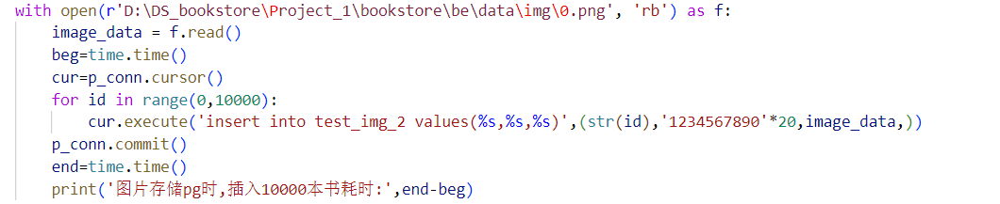
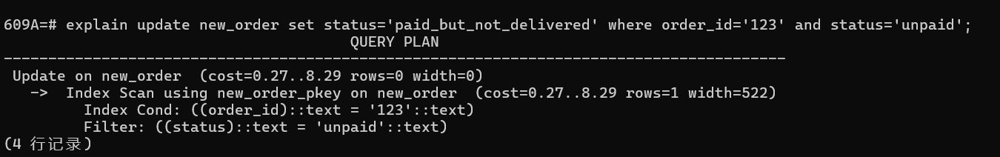
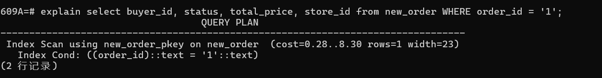
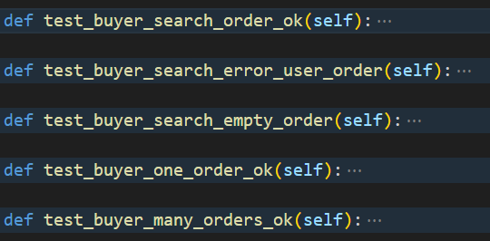
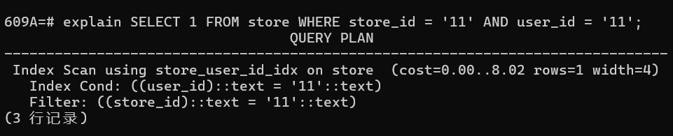
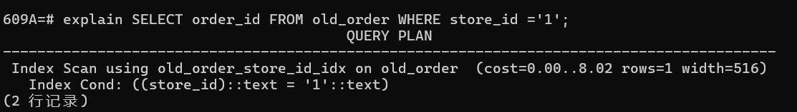

# 华东师范大学数据科学与工程学院实验报告

| 课程名称：数据管理系统              | 年级：2022级                           | 实践日期：2024.6 |
| ----------------------------------- | -------------------------------------- | ---------------- |
| 实践名称：Project2_1    bookstore_2 | 组别:     三（谢瑞阳、徐翔宇、田亦海） |                  |

---

[limboy058/bookstore (github.com)](https://github.com/limboy058/bookstore)

这是我们的代码仓库.(当前为private, 待作业提交后可能会公开)


##  环境配置

#### 1.bookdb数据

使用代码文件中附带的 *Project_1\bookstore\fe\data\book.db*,（大小为45MB，含有约500本书）

其表结构未变化.


 我们已经将*Project_1\bookstore\fe\access\book.py*中的db_l也重定向到book.db（原本应该指向book_lx.db）

```python
        parent_path = os.path.dirname(os.path.dirname(__file__))
        self.db_s = os.path.join(parent_path, "data/book.db") 
        self.db_l = os.path.join(parent_path, "data/book.db") #原本为book_lx.db
```


> 如果您确实要下载并使用3.5GB  的book_lx.db，请将db_l重定向到`data/book_lx.db`
>


#### 2.postgreSQL设置

①安装postgreSQL (version>=11.2即可)

②创建我们数据库所需的用户和数据库

执行如下语句

```postgresql
create user mamba with password 'out';
create database "609A" owner mamba;
select datname from pg_database;
```

第三句执行后出现609A即成功

③设置隔离级别

我们的项目经过了一定的对正确性的考量，使用乐观锁机制保证在读已提交隔离性下依然能够保证金额以及订单相关内容的数据正确性。因此，使用读已提交、可重复读、可串行化三种隔离级别均可以成功通过我们的测试，并且可以投入生产环境。

如果您对其他数据的正确性也有较高的需求，可以设置隔离级别为可串行化。

设置隔离级别方式如下：

```sql
SELECT current_setting('default_transaction_isolation');
ALTER DATABASE "609A" SET default_transaction_isolation TO 'read committed';
```

第一句为显示当前默认隔离性。第二句为设置我们的609A数据库默认隔离性为读已提交。您可以将read committed改为serializable(可串行化)或repeatable read(可重复读)。在设置后，请重启postgres服务，再进行第一句语句查看隔离级别是否更改成功。


##  Ⅰ 组员信息与分工

### 组员

本小组为第三组,组员为

##### 谢瑞阳 10225101483

##### 徐翔宇 10225101535

##### 田亦海 10225101529


### 分工

#### 谢瑞阳 10225101483

##### 1. 书本查询功能实现及对应函数测试

##### 2.用户创建订单、支付、增加金额功能实现及对应函数测试

##### 3.表结构设计测试：books的tags作为数组属性（使用gin索引）或新建新表（使用哈希索引）的效率对比

详见Ⅲ2

##### 4.隔离性测试：验证数据库隔离性可选项

详见Ⅲ3

##### 5.使用乐观锁保证数据正确性

详见Ⅲ3

##### 6.解决捕捉可串行化隔离级别下的事务并发冲突导致的异常：实现常数次等待重试机制解决此类异常。

详见Ⅲ5

##### 7.表结构设计测试：订单order_detail压缩为字符串属性存储或新建新表的效率对比

详见Ⅲ7

##### 8.索引设计测试：对仅涉及等值查询的字段进行哈希索引和b+树索引的效率对比

详见Ⅲ9

##### 9.数据库索引设计，部分属性设计，表结构设计

##### 10 .ER图实现

##### 11.性能测试实现及更新

##### 12.部分其他代码实现、优化及debug


#### 徐翔宇 10225101535

##### 函数重写：

买家取消订单

卖家发货

买家收货

买家搜索订单

卖家搜索订单

搜索订单详情信息

##### 新函数：

卖家取消订单

卖家设置缺货

**新增货修改以上函数相关测试**

**前端密码加密**

**本地图片、长文本数据检查。**


#### 田亦海 10225101529

##### ① ER图设计，数据库schema设计

详见PART Ⅱ 数据库schema


##### ② user.py与seller.py实现

使用PostgreSQL查询, 并补充了功能和一些检查

(并附带相关test) 

(其中不涉及订单查询和发货操作)

##### ③ 延时取消功能的实现

 使用一个可永久运行的进程，定时扫描order的time

(并附带相关test) 


##### ④ 图片/大文本的本地存储

在数据库中存储相对路径,

本地文件中保存文件.

目录为*bookstore\be\data*


在文件夹中，以  store_id+book_id命名

eg.


##### ⑤ 测试：大文本/图片存nosql数据库, sql数据库和文件系统的效率对比

测试了图片存储在Mongodb、pg、本地文件的存入效率和读出效率，

证明了存储本地时，存入和读出效率均为最高

详见 PART Ⅲ 效率测试与设计考量

##### ⑥ 测试：多表连接使用inner join和where的效率

使用explain analyze 测试sql查询的性能，

详见 PART Ⅲ 效率测试与设计考量


#####   ⑦new_order表中已完成订单转存到old_order

new_order表需要保证较大吞吐量,因此不能存储过多历史订单

已经完成的订单只有查询功能,应放在old_order中

##### ⑧ 安全限制：上限

设置了单个订单选择的书本类别的数量上限，单个订单总金额上限，商店书类别总量上限，用户单次充值上限。

参数位于*bookstore\be\conf.py*

```python
Store_book_type_limit=100
Add_amount_limit=10000000000
Order_amount_limit=100000000
Order_book_type_limit=100
```

详见 PART Ⅲ 效率测试与设计考量


##### ⑨ 讨论和debug

我们是一个团队,在实现很多功能时进行了一些讨论,以及调整部分功能和代码


## Ⅱ  数据库schema

### （1）  ER图


### （2）表结构


(此图片使用navicat生成)


#### 表(文档)介绍及字段含义

##### user表

存储了用户的信息:

`user_id`   (varchar255, )是用户的唯一id,   **主键**

`password`   (varchar255, 用于用户登录验证，存储用户密码的密文

（前端用户输入明文，使用SHA256进行加密，在网络上传递密文，数据库校验密文)

`balance`   (int8, 为该用户的余额，相当于实际余额（元）*100（以分为单位。不使用小数单位，避免精度误差） , 主要用于钱款交易)

`token`   (varchar1023 ,  根据时间,设备等信息生成,  用于一段时间用户内登录的状态持续有效)

`terminal`   (varchar255 , 用户登录的终端id )


##### new_order表

存储订单信息:

`order_id` (varchar255)为订单id,不会重复,    **主键**

`store_id` (varchar255) 为用户从这家商店购物的商店id,   并建立**哈希索引**

`buyer_id` (varchar255)存储下单用户的id ,    并建立**哈希索引**

`status` (varchar255)为订单状态, 比如"unpaid","canceled"等

`time`  (timestamp(6))为订单时间, 实际上存储了精确到秒的小数点后六位的时间信息   ,并建立**b+树索引**便于查询.

`total_price` (int8)为这笔订单订单的总价钱

`order_detail` (TEXT)   存储了订单的具体信息,实际上是压缩的文本

eg: id为 bid1 的书10本, id为 bid2 的书5本 将被存储为`bid1 10\nbid2 5`

` 空格`分割id和count，`\n`分割不同种类的书


##### store表

存储商店信息：

`store_id`（varchar255）商店id  **主键**

`user_id`（varchar255） 存储商店主人的id  **哈希索引**


可以很方便的扩展这个表的属性，来增加例如商店名称、商店图片、商店等级、商店交易数等信息。


##### book_info表

这个表的存储对象是book,    

(store_id，book_id)是**联合主键**

`book_id`  (varcahr255) 是书的id,   并建立**b+树索引**，book_id可能重复, 相当于不同商店上架了同一本书, 但每个商店内book_id不会重复

`store_id`   (varchar255)是商店的唯一id ，无需创建索引，可以使用主键索引

`price` （int4） 存储书籍的实际金额*100的整数值， 并建立**b+树索引**

`stock_level` (int4) 书本剩余库存 ，并建立**b+树索引**，

`sales` (int4)  书本售出数量， 并建立**b+树索引**，

`title` (varchar255)  书标题， 并建立**b+树索引**，

`author`(varchar255)  作者名字， 并建立**哈希索引**，

`tags`(TEXT) 标签，设置**倒排索引**， 设置原因可以参考PART Ⅲ 测试，设置索引的sql如下

```postgresql
create index book_info_tags_idx on book_info using GIN(tags) with (fastupdate = true)
```

`publisher`(varchar255) 出版社，设置**哈希索引**，

`original_title`(varchar255) 原标题（主要用于外文书籍），设置 **哈希索引**，

`translator`(varchar255) ，翻译者，设置 **哈希索引**，

`pub_year`(varchar255)  出版年份，设置**b+树索引**，

`pages`(int4)   书的页数

`currency_unit`(varchar255)   书价格的单位，eg：元，USD，NTD，GBP

`binding`(varchar255) 书的装订 eg:  精装 平装，设置 **哈希索引**，

`isbn` (int8)     isbn号.设置**b+树索引**，

`author_intro`(varchar255)  作者简介txt的相对路径

`book_intro`(varchar255)   书籍简介txt的相对路径

`content`(varchar255)   书籍目录txt的相对路径

`picture`(varchar255)    图片文件png的相对路径


##### 其他表

###### dead_user

存储已注销的用户id


###### old_order

存储已完成的订单

表结构与new_order相同,  但未创建time属性上的索引


### （3）设计考量

#### 1.  从ER图到数据库设计

##### 实体

我们的ER图中有四类实体，user、store、book、order

显然，我们可以创建对应的四张表，分别存储各自的属性

##### 关系：

user--store为1--m（一个用户拥有多个商店），存储user_id于store中

store--book为1--m（一个商店拥有多本书），存储store_id于book中

user--order为1--m（一个用户拥有多个订单），存储user_id于order中

store--order为1--m（一个商店有多个相关的订单），存储store_id于order中


book--order为n--m (一本书可以被多个订单买，一个订单可以买多本书)，

理论上，应该新建一个关系表存储这个关系。

但实际设计时，我们权衡后，仅记录book--order的n--1关系信息 ，因为由一个订单id查询订单买的商品，这是最主要的操作。由一本书查询所有相关的订单，这是个较为少见的操作。

只记录n--1的信息好处是降低了新建订单操作的复杂性，压缩order_detail为单值属性还可以进一步大大减少操作数据库次数。

这样做的缺点是会让我们损失（或者说很难查询）一些信息，比如假设有一个需求是商店老板想分析自己的商品都被销售到了什么地区，那么就需要查询book所关联的order的地址来统计。我们没有提供这个功能。

总之，我们把book--order的关系的`n--1信息`作为单值属性（其形式大概为`book1,10本;book2,5本;book3,15本`）存储在order表上。


##### 多值属性

1.关于存储多值属性order_detail（其形式大概为`book1,10本;book2,5本;book3,15本`）

我们决定将其压缩为一个TEXT存储在一个属性中，原因如下：

优点：若order_detail单独创建为一个表，那么创建一个购买50种书的订单需要插入此表50次，严重降低了数据库性能，且创建订单的操作要求很高的吞吐率。优点是降低插表次数，提高性能

缺点：取消订单时，需要在python程序中解析这个字段，进而将书本库存一一返回，降低了取消订单的效率。并且无法支持通过书本查找对应订单的功能。

考虑到取消订单的操作远少于创建订单的操作，并且我们的书店项目无需支持通过书本查找对应订单的功能。因此压缩为单值属性是值得的。

详见PART Ⅲ  7.表结构设计改进

2.tag 

我们决定将其作为数组属性存储，原因如下：

对于tag我们的查询需求为，找到拥有所有用户查询的tags的书籍，并返回其具体信息。在使用数组属性存储的条件下，我们的查询速度比使用新表并使用无关子查询进行查询的速度要提升五倍左右。并且在插入时采用数组属性也有更好的表现。因此，我们决定将tag作为数组属性存储。

详见Ⅲ2.表结构设计测试

3.title

在项目1中，我们对书本标题使用倒排索引，实现了加快模糊搜索标题的功能。然而由于倒排索引的存储需求以及分词准确度对于我们的标题而言实际上并不算很高，并且通过参考现有书店网站（如当当网），我们发现实际上书店网站大多支持的都是对用户搜索内容的前缀匹配。因此，我们在项目二中将原先的模糊搜索功能改为了前缀匹配搜索功能，并采用b+树索引加快title的前缀匹配。

#### 2.   其他表设计

##### dead_uesr

在用户注销时我们会从user 表中删除这条数据, 而仅将用户id放入dead_user中,dead_user仅仅存储了注销的id

这是为了防止被注销的id被其他用户重新注册, 甚至获取到该id之前拥有的商店和订单信息


##### old_order和new_order

new_order表需要保证可以容许较大吞吐量,查询原因也需要建立索引.但现在的版本中存储了很多过去已经received或canceled的订单,这影响了新订单的插入速度,且这些旧订单不可能被更改,仅仅可以提供给用户来查询

因此,我们把已经完成的订单转存于old_order中,并设计相似的查询接口.

这样可以保证用户下单时,插入new_order的速度.

详见 PART Ⅲ 效率测试与设计考量


#### 3.   字段大小设计

##### ①设置为varchar(255)

查阅网络资料,得知postgreSQL中varchar大小的设置与性能关系并不大

[PostgreSQL: Re: performance cost for varchar(20), varchar(255), and text](https://www.postgresql.org/message-id/486FA10E.3040004@Sheeky.Biz)

甚至varchar的性能与text近似


因此对于大小<255的字符串,我们直接设置其为varchar(255).

(使用这个数字只是惯例, 在MySQL中varchar类型会有一个长度位存长度大小 ,当定义varchar长度小于等于255时，长度标识位仅需要一个字节)

对于长度>255的字符串,我们设置其为varchar(1023)


##### ②balance和total_price设置为int8

我们把金额乘以100，以整数方式存储在数据库中，这样性能最佳。

由于卖家会从卖出的书得到余额，为了防止用户余额超出int4范围，我们选择了int8

（实际上，这几乎没有可能发生，但假设真的有一个垄断级别的商店呢？）

订单总金额total_price同理。


#### 4.  索引设计

我们在所有的id类的字段上都设置了哈希索引, 因为这些字段几乎不会被更改且经常用于精确匹配的查询/连接

在new_order中的order_time设置了b+树索引, 因为我们的自动取消需要扫描一段历史时间内的订单

在book_info上，也根据范围查询或者精确查询的需要选择了b+树索引和哈希索引，tag字段使用了倒排索引（在功能亮点：8.书本查询功能介绍中，将进行更详细的说明）


#### 5.  冗余等其他设计

①new_order中字段total_price

这是一个冗余信息，可以提高性能

在普通的实现中,每次要支付或者退款时, 订单的价钱需要从订单detail中逐个计算出,  求出总和.

这是不必要的重复查询,我们只需要在用户下单时,  在修改商店内每本书的库存时顺便返回这本书的价格,计算出这笔订单的总价格,  并存储该字段在new_order表中即可,无需每次需要钱款交付时重新统计.


## Ⅲ  效率测试与设计考量

我们的测试代码位于*Project_1\test_for_design*文件夹中


### 1.sql测试：多表连接使用inner join还是where的效率测试

虽然使用inner join和where可以达到一样的效果,但我们比较好奇其效率是否会有差别

> 参考lab6 pg 查询优化与执行计划初探,
>
> 使用explain语句测试,
>
> 数据与索引格式与lab6相同.
>
> ```SQL
> create table S (Sno int , Sname char(6), City char(4), primary key(Sno));
> create table P (Pno int , Pname char(6), weight int, primary key(Pno));
> create table J (Jno int , Jname char(6), City char(4), primary key(Jno));
> create table SPJ ( SPJ_ID int, Sno int, Pno int, Jno int, QTY int, 
>              primary key(SPJ_ID), foreign key(Sno) references S(Sno),
>              foreign key(Pno) references P(Pno), foreign key(Jno) references J(Jno));
> ```

s表数据1000条,p表数据50条,j表数据5000条,spj表数据100000条.

索引仅建在各表的主键


在这里,我们只讨论inner join on和where的效率区别,

因为outer join和where 返回的数据并不一样,在实际使用时按需选择即可


##### ①普通不使用索引的连接


多次尝试均为此结果, 证明,使用join和where连接实际上效率是一致的(查询计划也完全相同)


##### ②增加where过滤条件,使用部分索引


同样,查询计划完全相同


##### ③A join B与B join A


查询计划完全相同,

这表明A join B还是B join A都会被数据库优化以最高效率执行,我们无需关心


在使用较为复杂的查询时,虽然随着where语句和on的筛选条件的改变,可能改变表的大小和连接方式

(比如使用`on spj.sno<s.sno`会变成嵌套扫描连接)

但在不改变其他语句的情况下,A join B或是B join A仍然会以同样的最佳查询计划执行.

会被数据库优化.


##### ④ 关于数据特征导致的查询变化


where中使用spj.sno<100还是s.sno<100会改变查询计划,

这其实很显然,因为在s.sno上有索引可以用来扫描.

spj.sno<100还是s.sno<100会返回一样的结果(因为`join on spj.sno=s.sno`),似乎在有索引的表s上筛选条件之后再连接会效果更好

但其实因为在sno表上筛选会大大降低哈希连接时spj表的大小(从100000降至9972),这个效果可以使连接操作耗时更短.

这有一定启发性,说明在涉及到连接操作时,进行筛选,可能应该更优先需要在最大的表上筛掉一些值,从而降低连接的耗时, 即使是其他表上存在索引可以用于筛选!

(当然,是否可以这么做非常关系到数据的分布实际情况)


##### 总结

我们的实验证明, inner join和where的效率是一样的(见①和②)

且A join B还是B join A没有区别(见③)

连接时,如果存在一个表很大，可能优先考虑是否能将其筛选条件直接应用在大表上,即使小表上存在索引(见④)

此外,因为where属于隐连接,还是推荐使用join来写sql.


### 2.表结构设计测试：books的tags作为数组属性（使用gin索引）或新建新表（使用哈希索引）的效率对比

测试文件：

test_gin_index_on_tags.py

我们认为书本的标签（tags）在关系型数据库下有两种存储方式。

第一种是对每本书添加一个tags属性，该属性为数组属性。我们在该表上对数组属性建gin索引（倒排索引）。

第二种是新建一个tags表，表中每个元组为原书本id与其的一个tag。我们在该表上对tag建普通索引（b+树索引）。

我们在大数据量的情况下对两种存储方式分别进行了查询性能比较与插入性能比较。

测试结果：


#### 查询测试

在查询性能上，第一种存储方式性能为第二种存储方式性能的五倍左右。

我们认为可能的原因如下：

1.我们的业务需求为：用户给出若干标签，我们筛选出拥有所有这些标签的书籍信息。

在该测试中设计的是一个store对应一系列tag。在我们项目中实际是一个book对应一系列tag，这里仅为命名上的区别，并且表结构做了简化，省去了book的其他属性。

使用第一种方式的sql如下：

```py
cur.execute("select * from test_tags where tags @> %s",[[1,2,3],])
```

使用postgres针对数组等属性提供的@>比较符号进行包含匹配。

使用第二种方式的sql大体如下：

```python
cur.execute("select * from test_tags_store where store_id in ( select store_id from test_tags_tag where tag in (%s,%s,%s) group by store_id having count(1)=3 )",[1,2,3])#
```

由于每本书的tag不会重复，所以我们查询拥有这些tag且拥有的tag数量等于所查找tag数量的store_id。

我们使用无关子查询来进行查询，但可能由于该语句逻辑上比前者比较复杂，并且涉及两表连接，所以性能上不如第一种方式。

#### 插入测试

第一种方式的插入如下：

```
cur.execute("insert into test_tags values(100000000,%s)",[['abc','cba','acc']])
```

第二种方式的插入如下：

```
cur.execute("insert into test_tags_store values(100000000)")
cur.execute("insert into test_tags_tag values(100000000,'abc')")
cur.execute("insert into test_tags_tag values(100000000,'cba')")
cur.execute("insert into test_tags_tag values(100000000,'acc')")
```

经过测试，前者插入效率比后者要快两至三倍。

#### 结论

经过查询测试和插入测试，我们决定使用数组属性与倒排索引结合的方式实现书本的tags信息。并且在数据库中我们设置了book_info的tags属性的fastupdate参数为true。该参数使得数组索引并不会在每个元组更改或插入时立刻更新，而是等待一段时间或积累一定的更新量后统一更新索引，以增强插入响应速度。


### 3.隔离级别测试

测试代码：test_isolation_level.py

我们希望我们的项目可以支持pg所提供的全部三种隔离级别，包括read-committed隔离级别。使用读已提交隔离级别比使用可重复读或可串行化隔离级别能够支持更好的串行性能。

但我们也需要考虑，在当前项目的代码中，是否存在读已提交隔离级别下可能会导致的错误。

因此，我们进行了一个简单的隔离级别测试。

我们使用多个线程并发执行以下代码。

```
self.cur.execute("select cnt from test_isolation where id=1")
        cnt=self.cur.fetchone()[0]
        if(cnt>=5):
            self.cur.execute("update test_isolation set cnt=cnt-5 where id=1")
```

在读已提交隔离性下，这段代码会发生错误，最终id=1的元组的cnt属性有概率将<0。原因是因为读已提交隔离性下的不可重复读错误。在第一次select和第二次update中间，id=1的元组的cnt属性降低了。

而这段代码的复杂版在我们项目的很多处都有涉及，以下将以创建新订单的例子作为说明。

在创建新订单时，我们将先读取所有目标书籍的价格与库存，确定书籍的总价格，以及每本书籍的库存是否足够。

```
cur.execute("select price,stock_level,book_id from book_info where store_id=%s and book_id in %s;",[store_id,tuple(book_id_lst)])
...
for book_id, count in id_and_count:
                        cur.execute("update book_info set stock_level=stock_level-%s, sales=sales+%s where store_id=%s and book_id=%s",[count,count,store_id,book_id])
                    
```

这个写法实际上就等同于我们的测试。因为在第一个select中即使每本书都满足了库存大于new_order所需的数量，但在update时，其库存有可能已经不足。

对于这种问题，我们有两种解决方案。

第一种，使用悲观锁。即，在第一次读取将要修改的数据时，在语句最后增加"for update"。这样会让读操作在元组上尝试获取写锁。在获取锁前保持等待。这个操作可以保证在事务接下来的update操作之前，这个元组上的内容将不会被改动。

```
cur.execute("select price,stock_level,book_id from book_info where store_id=%s and book_id in %s for update;",[store_id,tuple(book_id_lst)])
...
for book_id, count in id_and_count:
                        cur.execute("update book_info set stock_level=stock_level-%s, sales=sales+%s where store_id=%s and book_id=%s",[count,count,store_id,book_id])
                    
```

第二种，使用乐观锁。我们不获取写锁，而是需要在update时再次检查其数量是否满足。这是乐观锁的解决方式。

```
cur.execute("select price,stock_level,book_id from book_info where store_id=%s and book_id in %s for update;",[store_id,tuple(book_id_lst)])
...
for book_id, count in id_and_count:
	cur.execute("update book_info set stock_level=stock_level-%s, sales=sales+%s where store_id=%s and book_id=%s and stock_level>=%s",[count,count,store_id,book_id,count])
                    
```

我们认为对于我们的书店场景下，数量发生变更导致无法满足的情况是比较少见的，因此我们在类似的场景中统一采取了乐观锁的解决方式。

如果在业务中使用我们的项目，并且需要经常面对同一个商品同时被大量用户并发抢购的场景，则您可能需要考虑使用悲观锁机制。

### 4.前端密码加密

我们假定用户主机是可信任的，并使用前端加密的方式防止通信过程中用户隐私被窃取。sha256是sha-2的一个变体，sha-2至今仍未被攻破，是一种十分安全的单向哈希函数。

在前端`fe/access`处，涉及向后端发送密码时，会使用`sha256`将密码加密。后端存储与校验密码时操作的对象都是已经被加密过的内容。因此即使拥有查看数据库权限的人员（无修改权限）也无法获取用户的原密码信息。

```python
import hashlib

class Auth:
    def login(self, user_id: str, password: str, terminal: str) -> (int, str):
        hashed_password = hashlib.sha256(password.encode()).hexdigest()
        json = {"user_id": user_id, "password": hashed_password, "terminal": terminal}
        url = urljoin(self.url_prefix, "login")
        r = requests.post(url, json=json)
        return r.status_code, r.json().get("token")

    def register(self, user_id: str, password: str) -> int:
        hashed_password = hashlib.sha256(password.encode()).hexdigest()
        json = {"user_id": user_id, "password": hashed_password}
        url = urljoin(self.url_prefix, "register")
        r = requests.post(url, json=json)
        return r.status_code

    def password(self, user_id: str, old_password: str,
                 new_password: str) -> int:
        old_hashed_password = hashlib.sha256(old_password.encode()).hexdigest()
        new_hashed_password = hashlib.sha256(new_password.encode()).hexdigest()
        json = {
            "user_id": user_id,
            "oldPassword": old_hashed_password,
            "newPassword": new_hashed_password,
        }
        url = urljoin(self.url_prefix, "password")
        r = requests.post(url, json=json)
        return r.status_code

    def unregister(self, user_id: str, password: str) -> int:
        hashed_password = hashlib.sha256(password.encode()).hexdigest()
        json = {"user_id": user_id, "password": hashed_password}
        url = urljoin(self.url_prefix, "unregister")
        r = requests.post(url, json=json)
        return r.status_code
    
class Buyer:
    def __init__(self, url_prefix, user_id, password):
        self.url_prefix = urljoin(url_prefix, "buyer/")
        self.user_id = user_id
        self.password = password
        self.token = ""
        self.terminal = "my terminal"
        self.auth = Auth(url_prefix)
        code, self.token = self.auth.login(self.user_id, self.password,
                                           self.terminal)#auth.login中会对传入的密码加密
        assert code == 200
        hashed_password = hashlib.sha256(password.encode()).hexdigest()
        self.password = hashed_password#buyer中其他函数会使用密码，需要对其加密
        
class Seller:
    def __init__(self, url_prefix, seller_id: str, password: str):
        self.url_prefix = urljoin(url_prefix, "seller/")
        self.seller_id = seller_id

        self.password = password
        self.terminal = "my terminal"
        self.auth = Auth(url_prefix)
        code, self.token = self.auth.login(self.seller_id, self.password,
                                           self.terminal)#auth.login中会对传入的密码加密
        assert code == 200
        hashed_password = hashlib.sha256(password.encode()).hexdigest()
        self.password = hashed_passwordd#seller中其他函数会使用密码，需要对其加密
```

数据库里表`user`中记录的加密过的密码：


### 5.针对高并发函数设计重试机制

```python
def new_order(self, user_id: str, store_id: str,
                  id_and_count: [(str, int)]) -> (int, str, str):
        order_id = ""
        attempt=0
        while(True):
            try:
				###这里为业务实现内容，为节省篇幅不再黏贴，详见Ⅳ功能&亮点部分
            except psycopg2.Error as e:
                if e.pgcode=="40001" and attempt<Retry_time:
                    attempt+=1
                    time.sleep(random.random()*attempt)
                    continue
                else: return 528, "{}".format(str(e.pgerror)), ""
            except BaseException as e:  return 530, "{}".format(str(e)), ""
            return 200, "ok", order_id
```

当我们的数据库隔离级别设置为可串行化时，我们在test_bench性能测试过程中，随着并发数增大，会捕捉到许多psycopg2的抛错。经过添加临时代码进行测试，我们发现该类抛错的pgcode均等于40001，而它们抛出的perror描述有以下两种：

```

02-05-2024 17:08:33 root:INFO:错误:  由于多个事务间的读/写依赖而无法串行访问
DETAIL:  Reason code: Canceled on identification as a pivot, during conflict in checking.
HINT:  该事务如果重试，有可能成功.

02-05-2024 17:08:34 root:INFO:错误:  由于同步更新而无法串行访问

```

其中第二种抛错比较罕见，而第一种抛错比较常见。

经过perror的提示与分析，我们认为这是由于事物之间的冲突导致的抛错。于是我们采取常数次等待重试机制处理该类抛错。

在操作系统课程中，我们学习过 指数退避 的重试机制，但由于我们的书店系统无法忍受指数级别的等待时间，因此我们采取了类似 线性退避 的重试机制，每次抛错后的平均等待时间将随失败次数增加而线性增长。若超过参数设置的最大尝试次数则将抛错。

最大尝试次数可在fe/conf.py中设置：

```python
URL = "http://127.0.0.1:5000/"
Book_Num_Per_Store = 90
Store_Num_Per_User = 2
Seller_Num = 5
Buyer_Num = 10
Session = 5
Request_Per_Session = 100
Default_Stock_Level = 1000000
Default_User_Funds = 100000000
Data_Batch_Size = 45
Use_Large_DB = True
Retry_time=10	#<---这里
```


### 6.表结构设计改进：将已经完成的订单定期转存到old_order

new_order表需要保证可以容许较大吞吐量,查询原因也需要建立索引.但现在的版本中存储了很多过去已经received或canceled的订单,这影响了新订单的插入速度,且这些旧订单不可能被更改,仅仅可以提供给用户来查询

因此,我们把已经完成的订单转存于old_order中,并设计相似的接口.

这样可以保证用户激情下单时,插入new_order的速度.

具体来说,我们在订单被卖家或者买家canceled或者被received时,将订单从new_order表中delete并插入old_order.

```python
cur.execute('insert into old_order select * from new_order where order_id=%s',(order_id,))
cur.execute('delete from new_order where order_id=%s',(order_id,))
```

并在search_order等一些操作中加入对old_older的考虑.

```python
#也在已完成的订单中查找
cur.execute("SELECT order_id FROM old_order WHERE buyer_id = %s", (user_id,))
orders = cur.fetchall()
for od in orders:
    result.append(od[0])
```

这样做的优点是减少了new_order表中的订单数，提高了许多操作的性能（比如新建订单、用户注销(需要检查是否有未完成的订单)、订单定时取消的扫描操作）

但也存在一点问题，从new_order表中删除引入了额外的复杂度，比如需要修改b+树索引

不过，即使从new_order中将表移出会造成额外的资源消耗，好处也是大于坏处的。

更好的设计可以是延时到每天定时凌晨四点将new_order中的订单转存到old_order，status其实就相当于“软删除” 的标志位。


### 7.表结构设计测试：订单order_detail压缩为字符串属性存储或新建新表的效率对比

测试代码：test_order_detail.py

在我们查询订单时，我们需要查找该订单所包含的所有书的id。因此我们有两种选择。

第一种，将oder-book关系存储到新的表中，查询书id语句为：

```
cur.execute("select test_detail.book_id from test_order inner join test_detail on test_order.id=test_detail.id where test_order.id=%s",[1234567,])
```

第二种，将book-count键值对以字符串形式作为order表中的一个属性存入，查询语句为：

```
cur.execute("select * from test_order_detail where id=%s",[1234567,])
```

字符串在项目中构造如下：

```
order_detail=""
     for book_id, count in id_and_count:
         order_detail+=book_id+" "+str(count)+"\n"
```

经过测试，第二种存放方式的查询效率是第一种存放方式的查询效率的两倍，这个区别并不太大。但就插入而言，第一种存放方式需要在new_order中插入一条后再在新表中插入等于购买书籍种类的数量条元组，因此其性能不如第二种存放方式。

第一种存放方式的优势为，可以通过在book_id上建立索引来支持 通过书籍id找到购买该书籍的所有订单信息 的功能。二第二种存放方式无法支持这种功能。但我们的项目并不需要支持该功能。即，订单与书籍的多对多关系对于我们的项目只用到了其中订单到书籍的一对多关系。因此，我们采取了第二种存放方式。


### 8.  新功能设计：安全限制上限

为了尽量保证我们的程序不需要处理十分"例外"的情况,并防止数据库中某些数值溢出, 我们对于一些操作设置了安全上限,

并在test中有对应的测试.

这些参数我写在了*bookstore\be\conf.py*中,  在其他代码中调用*conf.py*的值,

若需修改仅修改conf即可

```python
Store_book_type_limit=100
Add_amount_limit=10000000000
Order_amount_limit=100000000
Order_book_type_limit=100
```


##### ①单个订单选择的书本类别的数量上限

*bookstore\be\model\buyer.py*

```python
#订单书本类型数目超限
if len(id_and_count)>Order_book_type_limit:
	return error.error_order_book_type_ex(order_id)+ (order_id, )
```


##### ②单个订单总金额上限

*bookstore\be\model\buyer.py*

```python
#订单金额超限
if sum_price>Order_amount_limit:
	return error.error_order_amount_ex(order_id)+ (order_id, )
```


##### ③商店书类别总量上限

*bookstore\be\model\seller.py*

```python
#书籍超出Store_type_limit
cur.execute('select count(1) from book_info where store_id=%s',(store_id,))
ret=cur.fetchone()
if ret[0]>=Store_book_type_limit:
	return error.error_store_book_type_ex(store_id)
```

PS:我们把Store_book_type_limit设置为100,是因为对应测试会持续在一个商店中插入超过Store_book_type_limit的书,  并检测的确返回了`error_store_book_type_ex`错误,  因此设置limit较低可以尽量减少这个测试的时间

实际使用时,可以将Store_book_type_limit设置为1000或更高, 意为一个店中最多有1000种书.


#####  ④用户单次充值上限

*bookstore\be\model\buyer.py*

```python
elif add_value>Add_amount_limit:#用户添加金额超限
	return error.error_add_amount_ex()
```


业务级别的项目需要对于这样的上限做更完备的考虑.


### 9.索引设计测试：对仅涉及等值查询的字段进行哈希索引和b+树索引的效率对比

测试文件：

test_hash_bplus.py

我们知道，哈希索引只能针对等值查询进行优化。如果要对字段进行排序或者范围查询，则使用b+树索引更为合适。而在我们的项目中，有许多只涉及等值查询的字段，例如book_info中的author、publisher等。因此我们想要针对等值连接在两种索引下的性能进行测试，由于两种索引的查询实际都十分快速，因此我们借助pg自身的explain功能，来看pg在相同的条件下会优先选择哈希索引还是b+树索引。

在测试文件中，我们对相同字段建立两种索引，一种b+树，一种哈希。

在尚未对表进行任何一次查询前，pg对等值查询会使用bitmap scan筛选出含目标元组的页，再使用b+树索引。

但在表上进行过一次真实查询后，pg将在表上直接使用hash索引进行查询。

将hash索引删除后pg将会使用b+树索引直接进行查询。

通过explain发现，在pg的代价模型中，hash索引的代价在此处是小于b+树索引的。因此，我们认为在实际操作中，哈希索引在等值查询下会更优。

因此我们在创建表结构时，针对只会进行等值查询而不会进行范围查询或排序的字段（如book_info的author，publisher等）创建了哈希索引。


### 10.表结构设计测试：大文本/图片存nosql数据库, sql数据库和文件系统的效率对比

测试了大文件的存储效率

测试代码位于*Project_1\test_for_design\test_where_picture.py*,

图片数据比较具有代表性,我们测试了图片存储的方法.

对比了三种:存储于mongodb, postgres, 文件系统

结果如图:


结论为存储在本地效率最佳


具体测试方法:


#### 1)表结构设置

##### ①图片存储于mongodb时,

mongodb中应该有img"表",   属性为bid(string),pic(base64)

并在bid上建立索引


postgres中有test_img_1表, 属性为bid(varchar),  info(varchar)

(此表模拟存储book信息,info属性为book表中存储的一些相关信息如标题,作者等)


##### ②图片存储于postgres时,

应该只使用一张test_img_2表, 属性为bid(varchar),  info(varchar), pic(TEXT)  存储base64编码.


##### ③图片存储于本地时,

本地存储图片于文件夹中,此外使用一张test_img_3 ,属性为bid(varchar),  info(varchar) 模拟book信息

(类似test_img_1)


#### 2)插入10000书籍测试

##### ①mongodb

一本书插入的逻辑为:  先插入pg中test_img_1信息,  再插入mongodb中img

重复10000次,记录总用时


##### ②pg

一本书插入的逻辑为:  将bid,info,img一并插入到test_img_2中




##### ③文件系统

一本书插入的逻辑为:  将bid,info,插入到test_img_3中, 将图片保存在文件夹中


#### 3)读取10000本测试

详见代码

##### ①mongodb

读取一本书:  先读取pg中test_img_1,再读取mongo中对应img

##### ②pg

读取一本书:  读取pg中test_img_2,即可全部读出

##### ③文件系统

读取一本书:  先读取pg中test_img_3,再读取本地文件


#### 4)结果分析


结果证明,图片保存在本地的速度略快于保存在mongodb中的速度.

保存在pg中的速度非常慢


读出图片时,保存在pg中快于保存在mongodb中,

这是因为保存在pg中仅仅需要读取一次即可读出全部数据.

而保存在mongodb时,  需要读取pg数据再读取mongodb数据,读取两次

但保存在文件系统中依旧最快.只需要在pg中读取少量数据一次.


综上,我们将img(书封面), book_intro(书籍简介), auth_intro(作者简介), content(书籍目录)这四类比较大的文件保存在了本地.目录结构如下:


*bookstore\be\data\auth_intro*文件夹  存储作者简介 ,文件名为*store_id_book_id.txt*

*bookstore\be\data\book_intro*文件夹  存储书籍简介 ,文件名为*store_id_book_id.txt*

*bookstore\be\data\content*文件夹  存储目录 ,文件名为*store_id_book_id.txt*

eg:


*bookstore\be\data\img*文件夹  存储作者简介 ,文件名为*store_id_book_id.png*

eg:


## Ⅳ  功能&亮点

### 0 包装数据库连接的类

#### store.py

用于封装postgres连接,进行连接的代码如下：

```python
class Store:
    database: str

        def get_db_conn(self):
        return psycopg2.connect(
            host="localhost",
            database="609A",
            user=self.user_name,
            password=self.user_password
        )
```

同时定义了一些函数,用于进行一些快捷操作,比如清空数据库,建立索引等.这些功能会在测试开始时或是性能测试开始时被调用。其部分代码如下:

```python
def clear_tables(self):
        conn=self.get_db_conn()
        cur=conn.cursor()
        cur.execute("drop table if exists \"store\";")
        cur.execute("drop table if exists \"user\";")
        cur.execute("drop table if exists \"dead_user\";")
        cur.execute("drop table if exists \"new_order\";")
        cur.execute("drop table if exists \"old_order\";")
        cur.execute("drop table if exists \"order_detail\";")
        cur.execute("drop table if exists \"book_info\";")
        conn.commit()
        cur.close()
        conn.close()

    def clean_tables(self):
        conn=self.get_db_conn()
        cur=conn.cursor()
        cur.execute("delete from \"store\";")
        cur.execute("delete from \"user\";")
        cur.execute("delete from \"dead_user\";")
        cur.execute("delete from \"new_order\";")
        cur.execute("delete from \"old_order\";")
        #cur.execute("delete from \"order_detail\";")
        cur.execute("delete from \"book_info\";")
        current_file_path = os.path.abspath(__file__)
        current_directory = os.path.dirname(current_file_path)
        parent_directory = os.path.abspath(os.path.join(current_directory, os.pardir))
        data_path=os.path.abspath(parent_directory+'/data')
        shutil.rmtree(data_path)  
        os.mkdir(data_path)  
        conn.commit()
        cur.close()
        conn.close()
def build_tables(self):
        conn=self.get_db_conn()
        cur=conn.cursor()

        cur.execute("create table store("+
            "store_id varchar(255),user_id varchar(255),primary key(store_id)"        
        +")")
        cur.execute("create index store_user_id_idx on store using hash(user_id)")

        cur.execute("create table book_info("+
            "book_id varchar(255),store_id varchar(255),price int,stock_level int,sales int, "+
            "title varchar(255),author varchar(255), tags TEXT[], "+
            "publisher varchar(255),original_title varchar(255),translator varchar(255),"+   
            "pub_year varchar(255),pages int,currency_unit varchar(255),"+         
            "binding varchar(255),isbn bigint,author_intro varchar(255),"+     
            "book_intro varchar(255),content varchar(255),picture varchar(255),"+ 
            #"title_idx tsvector,"+
            " primary key(store_id,book_id)"+    
        ")")
        #对有排序需求和范围查询需求的字段做b+tree索引，只等值连接的字段做哈希索引
        cur.execute("create index book_info_book_id_idx on book_info using hash(book_id)")
        cur.execute("create index book_info_price_idx on book_info (price)")
        cur.execute("create index book_info_stock_level_idx on book_info (stock_level)")
        cur.execute("create index book_info_sales_idx on book_info (sales)")
        cur.execute("create index book_info_tags_idx on book_info using GIN(tags) with (fastupdate = true)")
        cur.execute("create index book_info_author_idx on book_info using hash(author)")
        cur.execute("create index book_info_publisher_idx on book_info using hash(publisher)")
        cur.execute("create index book_info_original_title_idx on book_info using hash(original_title)")
        cur.execute("create index book_info_translator_idx on book_info using hash(translator)")
        cur.execute("create index book_info_pub_year_idx on book_info (pub_year)")
        cur.execute("create index book_info_binding_idx on book_info using hash(binding)")
        cur.execute("create index book_info_isbn_idx on book_info (isbn)")
        cur.execute("create index book_info_title_idx on book_info (title varchar_pattern_ops)")

        cur.execute("create table dead_user("+
            "user_id varchar(255),primary key(user_id)"        
        +")")

        cur.execute("create table \"user\"("+
            "user_id varchar(255),password varchar(255),balance bigint,token varchar(1023),terminal varchar(255), primary key(user_id)"        
        +")")

        cur.execute("create table new_order("+
            "order_id varchar(255),store_id varchar(255),buyer_id varchar(255),status varchar(255),time timestamp,total_price bigint,order_detail Text, primary key(order_id)"        
        +")")
        cur.execute("create index new_order_store_id_idx on new_order using hash(store_id)")
        cur.execute("create index new_order_buyer_id_idx on new_order using hash(buyer_id)")
        cur.execute("create index new_order_time_id_idx on new_order (time)")

        cur.execute("create table old_order("+
            "order_id varchar(255),store_id varchar(255),buyer_id varchar(255),status varchar(255),time timestamp,total_price bigint,order_detail Text, primary key(order_id)"        
        +")")
        cur.execute("create index old_order_store_id_idx on old_order using hash(store_id)")
        cur.execute("create index old_order_buyer_id_idx on old_order using hash(buyer_id)")

        # cur.execute("create table order_detail("+
        #     "order_id varchar(255),book_id varchar(255), count int,primary key(order_id,book_id)"        
        # +")")

        cur.close()
        conn.commit()
        conn.close()

```

#### db_conn.py

封装了一些基于已有连接, 查询id是否存在的操作.例如

```python
def get_conn(self):#when you need a connection
        return store.get_db_conn()
    def user_id_exist(self, user_id, cur):
        res = None
        cur.execute("select count(1) from \"user\" where user_id=%s",[user_id])
        res=cur.fetchone()
        return res[0]!=0
```

下文中, 基本上所有实现的类都继承DBConn类.


### 1 用户注册

用户可以使用id,password注册.

#### 后端接口

```python
@bp_auth.route("/register", methods=["POST"])
def register():
    user_id = request.json.get("user_id", "")
    password = request.json.get("password", "")
    u = user.User()
    code, message = u.register(user_id=user_id, password=password)
    return jsonify({"message": message}), code
```

前端调用时,需要填写user_id, password. 然后声明一个User对象, 调用register函数并传参,返回结果

#### 后端逻辑

##### 用户类定义:

```python
class User(db_conn.DBConn):
    token_lifetime: int = 3600  # 3600 second

    def __init__(self):
        db_conn.DBConn.__init__(self)
```

##### 注册函数

```python
def register(self, user_id: str, password: str):
    try:
        with self.get_conn() as conn:
            with conn.cursor() as cur:
                conn.autocommit = False

                cur.execute('select user_id from "user" where user_id=%s',
                            (user_id,))
                ret = cur.fetchone()
                if ret is not None:
                    return error.error_exist_user_id(user_id)

                cur.execute(
                    'select user_id from dead_user where user_id=%s' ,
                    (user_id,))
                ret = cur.fetchone()
                if ret is not None:
                    return error.error_exist_user_id(user_id)

                terminal = "terminal_{}".format(str(time.time()))
                token = jwt_encode(user_id, terminal)
                cur.execute(
                    'insert into "user" (user_id, password, balance, token, terminal) VALUES (%s, %s, %s, %s, %s)'
                    ,(user_id, password, 0, token, terminal,))
                conn.commit()
    except psycopg2.Error as e:
        return 528, "{}".format(str(e))
    except BaseException as e:
        return 530, "{}".format(str(e))
    return 200, "ok"
```

with获取连接 

尝试在user表和dead_user表中寻找此用户想要注册的id,如果找到了则返回该id已存在的错误.

此处,dead_user中的id是已经注销的用户曾经使用的id

然后生成terminal和token,将结果插入数据库,代表用户注册成功

##### 关于token

```python
# encode a json string like:
#   {
#       "user_id": [user name],
#       "terminal": [terminal code],
#       "timestamp": [ts]} to a JWT
#   }
def jwt_encode(user_id: str, terminal: str) -> str:
    encoded = jwt.encode(
        {"user_id": user_id, "terminal": terminal, "timestamp": time.time()},
        key=user_id,
        algorithm="HS256",
    )
    return encoded.encode("utf-8").decode("utf-8")

# decode a JWT to a json string like:
#   {
#       "user_id": [user name],
#       "terminal": [terminal code],
#       "timestamp": [ts]} to a JWT
#   }
def jwt_decode(encoded_token, user_id: str) -> str:
    decoded = jwt.decode(encoded_token, key=user_id, algorithms="HS256")
    return decoded

# 这是User类下的函数,用于检查token
	def __check_token(self, user_id, db_token, token) -> bool:
        try:
            if db_token != token:
                return False
            jwt_text = jwt_decode(encoded_token=token, user_id=user_id)
            ts = jwt_text["timestamp"]
            if ts is not None:
                now = time.time()
                if self.token_lifetime > now - ts >= 0:
                    return True
        except jwt.exceptions.InvalidSignatureError as e:
            logging.error(str(e))
            return False
```

#### 数据库操作

```sql
select user_id from "user" where user_id=%s
select user_id from dead_user where user_id=%s
            
insert into "user" (user_id, password, balance, token, terminal) VALUES (%s, %s, %s, %s, %s)
```

在user和dead_user中查询id, 用于检查id唯一性

在user中插入一条用户的数据.id,password, balance即余额, token以及terminal.

psycopg2自动进行事务处理，这可以保证操作的原子性，防止了一些攻击或意外，在with语句块结束后自动提交，函数结束时被动释放获取的pg连接。

#### 代码测试

```python
class TestRegister:
    @pytest.fixture(autouse=True)
    def pre_run_initialization(self):
        self.user_id = "test_register_user_{}".format(time.time())
        self.store_id = "test_payment_store_id_{}".format(time.time())
        self.password = "test_register_password_{}".format(time.time())
        self.auth = auth.Auth(conf.URL)
        yield
        
	def test_register_ok(self):
        code = self.auth.register(self.user_id, self.password)
        assert code == 200
        
    def test_register_error_exist_user_id(self): #测试注册被取消过的id
        code = self.auth.register(self.user_id, self.password)
        assert code == 200

        code = self.auth.register(self.user_id, self.password)
        assert code != 200

        code = self.auth.unregister(self.user_id, self.password)
        assert code == 200

        code = self.auth.register(self.user_id, self.password)
        assert code != 200
```

#### 亮点

在id上建立了索引,加速查询

额外检查了被注销过的id,保证不会继承上一个id的store以及order信息等


### 2 用户登录登出

用户使用id和密码登录

使用id和token登出

#### 后端接口

```python
@bp_auth.route("/login", methods=["POST"])
def login():
    user_id = request.json.get("user_id", "")
    password = request.json.get("password", "")
    terminal = request.json.get("terminal", "")
    u = user.User()
    code, message, token = u.login(
        user_id=user_id, password=password, terminal=terminal
    )
    return jsonify({"message": message, "token": token}), code

@bp_auth.route("/logout", methods=["POST"])
def logout():
    user_id: str = request.json.get("user_id")
    token: str = request.headers.get("token")
    u = user.User()
    code, message = u.logout(user_id=user_id, token=token)
    return jsonify({"message": message}), code
```

#### 后端逻辑

```python
def login(self, user_id: str, password: str,
          terminal: str) -> (int, str, str):
    try:
        with self.get_conn() as conn:
            with conn.cursor() as cur:
                conn.autocommit = False

                code, message = self.check_password(user_id, password, cur)
                if code != 200:
                    return code, message, ""

                token = jwt_encode(user_id, terminal)
                cur.execute(
                    'update "user" set token=%s ,terminal=%s where user_id=%s'
                    , (token, terminal, user_id,))

                conn.commit()
    except psycopg2.Error as e:
        return 528, "{}".format(str(e)), ""
    except BaseException as e:
        return 530, "{}".format(str(e)), ""
    return 200, "ok", token
```

根据传入参数,先check密码正确, 然后更新user表的token和session

check函数如下:

```python
def check_password(self, user_id: str, password: str, cur) -> (int, str):

    cur.execute('select password from "user" where user_id=%s' , (user_id,))
    ret = cur.fetchone()

    if ret is None:
        return error.error_authorization_fail()

    if password != ret[0]:
        return error.error_authorization_fail()

    return 200, "ok"
```

logout则类似login

```python
def logout(self, user_id: str, token: str) -> bool:
    try:
        with self.get_conn() as conn:
            with conn.cursor() as cur:
                conn.autocommit = False

                code, message = self.check_token(user_id, token, cur)
                if code != 200:
                    return code, message

                terminal = "terminal_{}".format(str(time.time()))
                dummy_token = jwt_encode(user_id, terminal)
                cur.execute(
                    'update "user" set token=%s ,terminal=%s where user_id=%s'
                    , (dummy_token, terminal, user_id,))
                conn.commit()
    except psycopg2.Error as e:
        return 528, "{}".format(str(e))
    except BaseException as e:
        return 530, "{}".format(str(e))
    return 200, "ok"
```

#### 数据库操作

```sql
select password from "user" where user_id=%s

update "user" set token=%s ,terminal=%s where user_id=%s
```

查询user表得到密码, 更新token和terminal

#### 代码测试

检查了正常注册后登录,使用错误id和错误token登出, 使用错误id和错误密码登录

```python
class TestLogin:
    @pytest.fixture(autouse=True)
    def pre_run_initialization(self):
        self.auth = auth.Auth(conf.URL)
        # register a user
        self.user_id = "test_login_{}".format(time.time())
        self.password = "password_" + self.user_id
        self.terminal = "terminal_" + self.user_id
        assert self.auth.register(self.user_id, self.password) == 200
        yield

    def test_ok(self):
        code, token = self.auth.login(self.user_id, self.password, self.terminal)
        assert code == 200

        code = self.auth.logout(self.user_id + "_x", token)
        assert code == 401

        code = self.auth.logout(self.user_id, token + "_x")
        assert code == 401

        code = self.auth.logout(self.user_id, token)
        assert code == 200

    def test_error_user_id(self):
        code, token = self.auth.login(self.user_id + "_x", self.password, self.terminal)
        assert code == 401

    def test_error_password(self):
        code, token = self.auth.login(self.user_id, self.password + "_x", self.terminal)
        assert code == 401
```


### 3 用户修改密码

用户使用id 旧密码 新密码来修改密码.

#### 后端接口

```python
@bp_auth.route("/password", methods=["POST"])
def change_password():
    user_id = request.json.get("user_id", "")
    old_password = request.json.get("oldPassword", "")
    new_password = request.json.get("newPassword", "")
    u = user.User()
    code, message = u.change_password(
        user_id=user_id, old_password=old_password, new_password=new_password
    )
    return jsonify({"message": message}), code
```

#### 后端逻辑

```python
def change_password(self, user_id: str, old_password: str,
                    new_password: str) -> bool:
    try:
        with self.get_conn() as conn:
            with conn.cursor() as cur:
                conn.autocommit = False

                code, message = self.check_password(user_id,
                                            old_password,
                                            cur)
                if code != 200:
                    return code, message

                terminal = "terminal_{}".format(str(time.time()))
                token = jwt_encode(user_id, terminal)
                cur.execute('update "user" set password=%s ,token=%s,terminal=%s where user_id=%s',(new_password,token,terminal,user_id,))
                conn.commit()
    except psycopg2.Error as e:
        return 528, "{}".format(str(e))
    except BaseException as e:
        return 530, "{}".format(str(e))
    return 200, "ok"
```

只需要检查password,然后update新的password即可

#### 数据库操作

与login时跟数据库的交互一致

```sql
update "user" set password=%s ,token=%s,terminal=%s where user_id=%s
```


#### 代码测试

```python
def test_ok(self):
    code = self.auth.password(self.user_id, self.old_password, self.new_password)
    assert code == 200

    code, new_token = self.auth.login(
        self.user_id, self.old_password, self.terminal
    )
    assert code != 200

    code, new_token = self.auth.login(
        self.user_id, self.new_password, self.terminal
    )
    assert code == 200

    code = self.auth.logout(self.user_id, new_token)
    assert code == 200

def test_error_password(self):
    code = self.auth.password(
        self.user_id, self.old_password + "_x", self.new_password
    )
    assert code != 200

    code, new_token = self.auth.login(
        self.user_id, self.new_password, self.terminal
    )
    assert code != 200

def test_error_user_id(self):
    code = self.auth.password(
        self.user_id + "_x", self.old_password, self.new_password
    )
    assert code != 200

    code, new_token = self.auth.login(
        self.user_id, self.new_password, self.terminal
    )
    assert code != 200
```


### 4 用户注销

用户可以主动注销账号,该账号在user中将会删除,不过store和order记录仍可被查询

#### 后端接口

```python
@bp_auth.route("/unregister", methods=["POST"])
def unregister():
    user_id = request.json.get("user_id", "")
    password = request.json.get("password", "")
    u = user.User()
    code, message = u.unregister(user_id=user_id, password=password)
    return jsonify({"message": message}), code
```

#### 后端逻辑

```python
def unregister(self, user_id: str, password: str) -> (int, str):
    try:
        with self.get_conn() as conn:
            with conn.cursor() as cur:
                conn.autocommit = False

                code, message = self.check_password(user_id, password, cur)
                if code != 200:
                    return code, message

                cur.execute('''
                            select new_order.buyer_id, store.user_id 
                            from new_order 
                            inner join store on new_order.store_id=store.store_id 
                            where (buyer_id =%s or user_id=%s ) and (status !='recieved' and status !='canceled') 
                            ''',(user_id,user_id,))
                ret=cur.fetchone()
                if ret is not None:
                    if ret[0]==user_id:
                        return error.error_unfished_buyer_orders()
                    elif ret[1]==user_id:
                        return error.error_unfished_seller_orders()

                cur.execute('''
                            UPDATE book_info 
                            SET stock_level = 0 
                            WHERE store_id IN (SELECT store_id FROM store WHERE user_id = %s)
                            ''',(user_id,))

                cur.execute('delete from "user" where user_id=%s',(user_id,))
                cur.execute('INSERT INTO dead_user (user_id) VALUES (%s)',(user_id,))

                conn.commit()
    except psycopg2.Error as e:
        return 528, "{}".format(str(e))
    except BaseException as e:
        return 530, "{}".format(str(e))
    return 200, "ok"
```

首先,我们需要检查密码正确性,


然后搜索数据库new_order表,检查是否有该用户作为user_id(即买家)或者seller_id(卖家)的订单,且该订单未完成

(即该订单状态不为'recieved'且不为'canceled')

相应的,作为卖家或者买家订单未完成, 则会返回对应的不同错误码和信息


将此用户下所有商店的所有库存书籍的库存设置为0.


最后从user表中删除该用户, 将用户id加入dead_user表中

#### 数据库操作

```sql
# 查询user_id作为new_order表中   buyer或者store的user 存在的未完成订单, 用到了inner join
select new_order.buyer_id, store.user_id 
from new_order 
inner join store on new_order.store_id=store.store_id 
where (buyer_id =%s or user_id=%s ) and (status !='recieved' and status !='canceled')

# 将该用户下的所有书店的库存清空，用到了IN子查询
UPDATE book_info 
SET stock_level = 0 
WHERE store_id IN (SELECT store_id FROM store WHERE user_id = %s)

#从user表中删除此用户,并将user_id插入dead_user表
delete from "user" where user_id=%s
INSERT INTO dead_user (user_id) VALUES (%s)
```

#### 代码测试

```python
#测试unreg功能正常
def test_unregister_ok(self):
    code = self.auth.register(self.user_id, self.password)
    assert code == 200

    code = self.auth.unregister(self.user_id, self.password)
    assert code == 200

#测试unreg但是传入了错误的id或者密码
def test_unregister_error_authorization(self):
    code = self.auth.register(self.user_id, self.password)
    assert code == 200

    code = self.auth.unregister(self.user_id + "_x", self.password)
    assert code != 200

    code = self.auth.unregister(self.user_id, self.password + "_x")
    assert code != 200

#测试unreg,尝试注销持有未完成订单的卖家和买家,并在取消订单后再次测试注销功能
def test_unregister_with_buyer_or_seller_order(self):

    buyer = register_new_buyer(self.user_id+'b', self.user_id+'b')
    gen_book = GenBook(self.user_id+'s', self.store_id)

    ok, buy_book_id_list = gen_book.gen(non_exist_book_id=False,
                                             low_stock_level=False)
    assert ok

    code, order_id = buyer.new_order(self.store_id, buy_book_id_list)
    assert code == 200

    code = self.auth.unregister(self.user_id+'b', self.user_id+'b')
    assert code == 526

    code = self.auth.unregister(self.user_id+'s', self.user_id+'s')
    assert code == 527

    code = buyer.cancel(order_id)
    assert code == 200

    code = self.auth.unregister(self.user_id+'b', self.user_id+'b')
    assert code == 200

    code = self.auth.unregister(self.user_id+'s',self.user_id+'s')
    assert code == 200
```

#### 亮点

注销时,补充进行了很完善的检查,并清空了库存,更符合逻辑和实际需求.


### 5 卖家创建书店

每个用户都可以创建书店.

#### 后端接口

```python
@bp_seller.route("/create_store", methods=["POST"])
def seller_create_store():
    user_id: str = request.json.get("user_id")
    store_id: str = request.json.get("store_id")
    s = seller.Seller()
    code, message = s.create_store(user_id, store_id)
    return jsonify({"message": message}), code
```

#### 后端逻辑

```python
def create_store(self, user_id: str, store_id: str) -> (int, str):
    try:
        with self.get_conn() as conn:
            with conn.cursor() as cur:
                conn.autocommit = False
                if not self.user_id_exist(user_id, cur):
                    return error.error_non_exist_user_id(user_id)
                if self.store_id_exist(store_id, cur):
                    return error.error_exist_store_id(store_id)
                cur.execute(
                    'insert into store (store_id,user_id)values(%s,%s)', (
                        store_id,
                        user_id,
                    ))
                conn.commit()
    except psycopg2.Error as e: return 528, "{}".format(str(e.pgerror))
    except BaseException as e:
        return 530, "{}".format(str(e))
    return 200, "ok"
```

检查用户id存在, 检查store_id是否已经存在,

然后更新store表,插入数据

#### 数据库操作

```sql
#检查用户id存在
select count(1) from "user" where user_id=%s

#检查storeid存在
select count(1) from store where store_id= %s 

insert into store (store_id,user_id)values(%s,%s)
```

#### 代码测试

```python
    def test_ok(self):
        self.seller = register_new_seller(self.user_id, self.password)
        code = self.seller.create_store(self.store_id)
        assert code == 200

    def test_error_exist_store_id(self):
        self.seller = register_new_seller(self.user_id, self.password)
        code = self.seller.create_store(self.store_id)
        assert code == 200

        code = self.seller.create_store(self.store_id)
        assert code != 200
```

测试了正常创建以及创建已有store


### 6 卖家上架书本

#### 后端接口

```python
@bp_seller.route("/add_book", methods=["POST"])
def seller_add_book():
    user_id: str = request.json.get("user_id")
    store_id: str = request.json.get("store_id")
    book_info: str = request.json.get("book_info")
    stock_level: str = request.json.get("stock_level", 0)

    s = seller.Seller()
    code, message = s.add_book(
        user_id, store_id, book_info.get("id"), json.dumps(book_info),
        stock_level
    )

    return jsonify({"message": message}), code
```

#### 后端逻辑

```python
def add_book(
        self,
        user_id: str,
        store_id: str,
        book_id: str,
        book_json: str,
        stock_level: int,
    ):
        try:
            with self.get_conn() as conn:
                with conn.cursor() as cur:
                    conn.autocommit = False
                    if not self.user_id_exist(user_id, cur):
                        return error.error_non_exist_user_id(user_id)
                    cur.execute(
                        'select user_id from store where store_id=%s',
                        (
                            store_id,
                        ))
                    ret = cur.fetchone()
                    if ret is None:
                        return error.error_non_exist_store_id(store_id)
                    if(ret[0]!=user_id):
                        return error.error_authorization_fail()
                    if self.book_id_exist(store_id, book_id, cur):
                        return error.error_exist_book_id(book_id)
                    
                    #书籍超出Store_type_limit
                    cur.execute('select count(1) from book_info where store_id=%s',(store_id,))
                    ret=cur.fetchone()
                    if ret[0]>=Store_book_type_limit:
                        return error.error_store_book_type_ex(store_id)
                    
                    #加载路径
                    current_file_path = os.path.abspath(__file__)
                    current_directory = os.path.dirname(current_file_path)
                    parent_directory = os.path.abspath(os.path.join(current_directory, os.pardir))
                    data_path=os.path.abspath(parent_directory+'/data')
                    #保证路径存在
                    os.makedirs(data_path, exist_ok=True)
                    os.makedirs(data_path+'/img', exist_ok=True)
                    os.makedirs(data_path+'/book_intro', exist_ok=True)
                    os.makedirs(data_path+'/auth_intro', exist_ok=True)
                    os.makedirs(data_path+'/content', exist_ok=True)
                    #加载json中的资源並存儲
                    data = json.loads(book_json)
                    image_data=base64.b64decode(data['pictures'])
                    name=store_id+'_'+data['id']
                    with open(data_path+'/img/'+name+'.png', 'wb') as image_file:
                        image_file.write(image_data)
                    with open(data_path+'/auth_intro/'+name+'.txt', 'w',encoding='utf-8') as ai_file:
                        ai_file.write(data['author_intro'])
                    with open(data_path+'/book_intro/'+name+'.txt', 'w',encoding='utf-8') as bi_file:
                        bi_file.write(data['book_intro'])
                    with open(data_path+'/content/'+name+'.txt', 'w',encoding='utf-8') as ct_file:
                        ct_file.write(data['content'])

                    cur.execute('''
                                insert into book_info 
                                (book_id,store_id,price,stock_level,sales,title,author,publisher,original_title,
                                translator,pub_year,pages,currency_unit,binding,isbn,author_intro,book_intro,content,picture,tags)
                                values(%s,%s,%s,%s,%s,%s,%s,%s,%s,%s,%s,%s,%s,%s,%s,%s,%s,%s,%s,%s)
                                ''' , (
                        book_id,
                        store_id,
                        data['price'],
                        stock_level,
                        0,
                        data['title'],
                        data['author'],
                        data['publisher'],
                        data['original_title'],
                        data['translator'],
                        data['pub_year'],
                        data['pages'],
                        data['currency_unit'],
                        data['binding'],
                        data['isbn'],
                        './be/data/auth_intro/'+data['id']+'.txt',
                        './be/data/book_intro/'+data['id']+'.txt',
                        './be/data/content/'+data['id']+'.txt',
                        './be/data/img/'+data['id']+'.png',
                        data['tags']
                    ))
                    conn.commit()
        except psycopg2.Error as e: return 528, "{}".format(str(e.pgerror))
        except BaseException as e: return 530, "{}".format(str(e))
        return 200, "ok"
```

首先检查user_id存在,检查store_id存在, 检查store_id的主人是user_id,检查store中是否有此书book_id

检查店内的书籍是否超过限制（eg.1000种）

加载路径，并确保路径存在，

然后加载json中的book_info，将大文件存储到本地，以store_id_book_id.txt(png)命名

在store表中插入一条数据,代表一本书,涉及book_id,store_id,title,author,price,stock_level等。

四种大文件在表中存储了相对路径


#### 数据库操作

```sql
#检查用户id存在
select count(1) from "user" where user_id=%s
#检查storeid存在与归属
select user_id from store where store_id=%s
#插入store表中这本书
insert into book_info 
(book_id,store_id,price,stock_level,sales,title,author,publisher,original_title,
translator,pub_year,pages,currency_unit,binding,isbn,author_intro,book_intro,content,picture,tags) values(%s,%s,%s,%s,%s,%s,%s,%s,%s,%s,%s,%s,%s,%s,%s,%s,%s,%s,%s,%s)
```

#### 代码测试

```python
    def test_ok(self):
        for b in self.books:
            code = self.seller.add_book(self.store_id, 0, b)
            assert code == 200

    def test_error_non_exist_store_id(self):
        for b in self.books:
            # non exist store id
            code = self.seller.add_book(self.store_id + "x", 0, b)
            assert code != 200

    def test_error_exist_book_id(self):
        for b in self.books:
            code = self.seller.add_book(self.store_id, 0, b)
            assert code == 200
        for b in self.books:
            # exist book id
            code = self.seller.add_book(self.store_id, 0, b)
            assert code != 200

    def test_error_non_exist_user_id(self):
        for b in self.books:
            # non exist user id
            self.seller.seller_id = self.seller.seller_id + "_x"
            code = self.seller.add_book(self.store_id, 0, b)
            assert code != 200
            
    def test_store_type_ex(self):#这个测试是测试插入书店过多书的报错
        b = self.books[0]
        for bid in range(0, Store_book_type_limit):
            b.id = str(bid)
            code = self.seller.add_book(self.store_id, 0, b)
            assert code == 200
        b.id = str(Store_book_type_limit+1)
        code = self.seller.add_book(self.store_id, 0, b)
        assert code == 544
```

根据不同的错误进行了检查

#### 优点

①本地文件存储书籍信息的方式是最为高效的（参考PART 3效率测试与设计考量），在数据库内存储了相对路径可供查询

②限制了书店不能有太多书，更安全


### 7 卖家更改库存

卖家可以增加或减少某一本的库存

#### 后端接口

```python
@bp_seller.route("/add_stock_level", methods=["POST"])
def add_stock_level():
    user_id: str = request.json.get("user_id")
    store_id: str = request.json.get("store_id")
    book_id: str = request.json.get("book_id")
    add_num: str = request.json.get("add_stock_level", 0)
    s = seller.Seller()
    code, message = s.add_stock_level(user_id, store_id, book_id, add_num)

    return jsonify({"message": message}), code
```

#### 后端逻辑

```python
def add_stock_level(self, user_id: str, store_id: str, book_id: str,
                        add_stock_level: int):
    try:
        with self.get_conn() as conn:
            with conn.cursor() as cur:
                conn.autocommit = False
                if not self.user_id_exist(user_id, cur):
                    return error.error_non_exist_user_id(user_id)
                if not self.store_id_exist(store_id, cur):
                    return error.error_non_exist_store_id(store_id)
                if not self.book_id_exist(store_id, book_id, cur):
                    return error.error_non_exist_book_id(book_id)
                cur.execute(
                    'update book_info set stock_level=stock_level+%s where book_id=%s and store_id=%s and stock_level>=%s',
                    (add_stock_level, book_id, store_id, -add_stock_level))
                if cur.rowcount == 0:  #受影响行数
                    return error.error_out_of_stock(book_id)
                conn.commit()
    except psycopg2.Error as e: return 528, "{}".format(str(e.pgerror))
    except BaseException as e:
        return 530, "{}".format(str(e))
    return 200, "ok"
```

分别检查id存在性,

根据条件增加(也可能是减少)对应书籍的库存.

#### 数据库操作

```sql
#检查user,store,book存在

#增加书籍
update book_info set stock_level=stock_level+%s where book_id=%s and store_id=%s and stock_level>=%s
```

这里有gte条件的原因是，卖家减少书籍数量不能减少至负数,我们也设计了对应的测试。

#### 代码测试

```python
    def test_error_user_id(self):
        for b in self.books:
            book_id = b.id
            code = self.seller.add_stock_level(self.user_id + "_x",
                                               self.store_id, book_id, 10)
            assert code != 200

    def test_error_store_id(self):
        for b in self.books:
            book_id = b.id
            code = self.seller.add_stock_level(self.user_id,
                                               self.store_id + "_x", book_id,
                                               10)
            assert code != 200

    def test_error_book_id(self):
        for b in self.books:
            book_id = b.id
            code = self.seller.add_stock_level(self.user_id, self.store_id,
                                               book_id + "_x", 10)
            assert code != 200

    def test_ok(self):
        for b in self.books:
            book_id = b.id
            code = self.seller.add_stock_level(self.user_id, self.store_id,
                                               book_id, 10)
            assert code == 200

    def test_error_book_stock(self):
        for b in self.books:
            book_id = b.id
            conn=self.dbconn.get_conn()
            cur=conn.cursor()
            cur.execute("select stock_level from book_info where store_id=%s and book_id=%s",[self.store_id,book_id])
            res=cur.fetchone()
            assert(res is not None)
            stock_level=res[0]
            conn.close()
            code = self.seller.add_stock_level(
                self.user_id, self.store_id, book_id,
                -(stock_level + 1))  #-(cursor['stock_level']+1)
            assert code != 200
```

分别检查了三种id错误情况, 正常执行结果, 下架了多于原本数量的书籍的错误情况.

#### 亮点

一个补充性的判定,保证了书籍不会被减少至负数,更符合逻辑.

### 8书本查询功能

#### 后端接口

代码路径：be/view/book.py

```py
@bp_auth.route("/search_book",methods=["POST"])
def search_book():
    searchbook=searchBook()
    page_no=request.json.get("page_no","")
    page_size=request.json.get("page_size","")
    foozytitle=request.json.get("foozytitle",None)
    reqtags=request.json.get("reqtags",None)
    id=request.json.get("id",None)
    isbn=request.json.get("isbn",None)
    author=request.json.get("author",None)
    lowest_price=request.json.get("lowest_price",None)
    highest_price=request.json.get("highest_price",None)
    lowest_pub_year=request.json.get("lowest_pub_year",None)
    highest_pub_year=request.json.get("highest_pub_year",None)
    store_id=request.json.get("store_id",None)
    publisher=request.json.get("publisher",None)
    translator=request.json.get("translator",None)
    binding=request.json.get("binding",None)
    order_by_method=request.json.get("order_by_method",None)
    having_stock=request.json.get("having_stock",None)
```

前端调用时必须填写的参数包括当前页数以及页大小（每页显示几本书信息），其他为可选参数，如模糊标题、标签列表、书本id等。

特殊参数：

foozytitle意为书本title的一个字串，且该子串位于title开头。这个字段与上一个版本的foozytitle字段的设计有所变更。因为经过参考当当网等书店网站的设计，我发现此类网站一般都支持的是搜索字符串前缀匹配用户输入的功能，而不支持中间截断产生的分词匹配功能。我认为主要原因是因为如果对所有书籍的标题都做分词处理并存储，会消耗较多的存储空间，且该查询相比于前缀匹配搜索并没有太高的功能上的优势（用户搜索书名一般不会从中间开始只搜关键词）。因此，我想将原来使用倒排索引的方式改为使用b+树索引，从而支持前缀匹配的高效查询。

reqtags意为书本的tags必须包含reqtags中的所有tags（例如查找即“浪漫”又“哲学”的书）。

lowest_price是最低价格，highest_price是最高价格。

lowest_pub_year是最早发布年份，highest_pub_year是最晚发布年份。

order_by_method是排序参数。可以选择按照书本的现货量，销量，发布年份，价格 四种方式排序，并且可以选择排序顺序（正序或倒序）。

having_stock表明要筛选出现在有货的书本。

store_id表明要查询的书属于的商店，如果为空则查询所有商店。

#### 后端逻辑

后端实现为返回所有要求的交集。例如：

​	参数：page_no=1,page_size=7,lowest_price=1,highest_price=10,having_stock=True,author="小强",order_by_method=("price",-1)

返回的是价格在1\~10之间且有货且作者为小强的七本书本，他们是满足这些条件的书本中价格第8\~14贵的（page_no起始为0，因此这是第二页的七本书；排序参数中的-1表示倒序）。

返回值以json格式的列表呈现。列表中的每个元素是一个json格式的书本信息。书本信息本身是字典。

#### 数据库操作

```python
books = list()
        query="select * from book_info "
        conditions = " where "
        fill=list()
        try:
            if (foozytitle != None):
                conditions+=" title like %s and"
                fill.append(foozytitle+"%")
            if (reqtags != None):
                conditions+= " tags @> %s and"
                fill.append(reqtags)
            if (id != None):
                conditions+=" book_id=%s and"
                fill.append(id)
            if (isbn != None):
                conditions+=" isbn=%s and"
                fill.append(isbn)
            if (author != None):
                conditions+=" author=%s and"
                fill.append(author)
            if (lowest_price != None):
                conditions+=" price>=%s and"
                fill.append(lowest_price)
            if (highest_price != None):
                conditions+=" price<=%s and"
                fill.append(highest_price)
            if (store_id != None):
                conditions+=" store_id=%s and"
                fill.append(store_id)
            if (lowest_pub_year != None):
                conditions+=" pub_year>=%s and"
                fill.append(lowest_pub_year)
            if (highest_pub_year != None):
                conditions+=" pub_year<%s and"
                fill.append(str(int(highest_pub_year)+1))
            if (publisher != None):
                conditions+=" publisher=%s and"
                fill.append(publisher)
            if (translator != None):
                conditions+=" translator=%s and"
                fill.append(translator)
            if (binding != None):
                conditions+=" binding=%s and"
                fill.append(binding)
            if (having_stock == True):
                conditions+=" stock_level>0 and"

            if(len(conditions)>7):
                conditions=conditions[:-3]
            else:
                conditions=" "
            if (order_by_method != None):
                if (order_by_method[0] not in self.order_by_conditions or
                    (order_by_method[1] != 1 and order_by_method[1] != -1)):
                    return 522, error.error_illegal_order_condition(
                        str(order_by_method[0] + ' ' + order_by_method[1])), ""
                conditions+=" order by "+"\""+order_by_method[0]+"\" "
                if(order_by_method[1]==1):
                    conditions+="asc "
                else:
                    conditions+="desc "
            
            conn=self.get_conn()
            cur=conn.cursor()
            cur.execute(query+conditions+" limit "+str(page_size)+" offset "+str(page_no*page_size),fill)
            res=cur.fetchall()
            for row in res:
                book=dict()
                book['book_id']=row[0]
                book['store_id']=row[1]
                book['price']=row[2]
                book['stock_level']=row[3]
                book['sales']=row[4]
                book['title']=row[5]
                book['author']=row[6]
                book['tags']=row[7]

                book['publisher']=row[8]
                book['original_title']=row[9]
                book['translator']=row[10]
                book['pub_year']=row[11]
                book['pages']=row[12]
                book['currency_unit']=row[13]
                book['binding']=row[14]
                book['isbn']=row[15]
                book['author_intro']=row[16]
                book['book_intro']=row[17]
                book['content']=row[18]
                book['picture']=row[19]
                books.append(json.dumps(book))
        except psycopg2.Error as e:
            logging.info("528, {}".format(str(e)))
            return 528, "{}".format(str(e)), ""
        except BaseException as e:
            logging.info("530, {}".format(str(e)))
            return 530, "{}".format(str(e)), ""
        
        return 200, "ok", books
```

我们使用字符串拼接的方式连接各个查询的条件。

#### 亮点

1.对所有查询条件均设有对应索引。并且针对不同特性的字段设置了不同类型的索引：

```py
#对有排序需求和范围查询需求的字段做b+tree索引，只等值连接的字段做哈希索引
        cur.execute("create index book_info_book_id_idx on book_info using hash(book_id)")
        cur.execute("create index book_info_price_idx on book_info (price)")
        cur.execute("create index book_info_stock_level_idx on book_info (stock_level)")
        cur.execute("create index book_info_sales_idx on book_info (sales)")
        cur.execute("create index book_info_tags_idx on book_info using GIN(tags) with (fastupdate = true)")
        cur.execute("create index book_info_author_idx on book_info using hash(author)")
        cur.execute("create index book_info_publisher_idx on book_info using hash(publisher)")
        cur.execute("create index book_info_original_title_idx on book_info using hash(original_title)")
        cur.execute("create index book_info_translator_idx on book_info using hash(translator)")
        cur.execute("create index book_info_pub_year_idx on book_info (pub_year)")
        cur.execute("create index book_info_binding_idx on book_info using hash(binding)")
        cur.execute("create index book_info_isbn_idx on book_info (isbn)")
        cur.execute("create index book_info_title_idx on book_info (title varchar_pattern_ops)")
```

2.foozy_title字段使用b+树索引加速前缀子串匹配查询。

经过测试发现，我们必须在创建索引时特别声明title的比较操作符为varchar_pattern_ops，才能使得title的前缀匹配查询走我们的索引。


可以看到pg在模糊搜索前缀匹配查询时，使用了我们的索引，将 title like 生死% 定位为title>=生死 并且 title<生歼 的所有元组。歼应为死的下一位汉字。

3.tags字段使用数组属性，并使用gin索引加速包含匹配查询。


可以看到pg在进行tags包含匹配查询时，使用了我们的gin索引。


#### 代码测试

代码路径：fe/test/test_search_book.py

包括了对各类属性的查询正确性测试。

### 9创建订单


#### 后端接口

```
@bp_buyer.route("/new_order", methods=["POST"])
def new_order():
    user_id: str = request.json.get("user_id")
    store_id: str = request.json.get("store_id")
    books: [] = request.json.get("books")
```

参数为买家id，目标商店id，购买的书的id以及数量的列表。

#### 后端逻辑

先对用户传参合法性进行判断（如用户是否存在，目标商店是否存在，目标书本是否存在与库存是否足够，购买书种类总数是否超限），同时统计订单所需的总金额。然后对书本库存进行更新（使用乐观锁），并创建新订单。

#### 数据库操作

由于该函数实现较为复杂，我们以项目的代码加上额外注释的方式进行初步解读。该函数中有一些部分与之后的函数重复，在之后将不再赘述。

```python
order_id = ""
        attempt=0
        while(True):##如果操作由于事务之间的冲突而导致被abort，则操作会进行常数次的重试。
            try:
                with self.get_conn() as conn:#创建数据库连接
                    cur=conn.cursor()
                    if not self.user_id_exist(user_id,cur):#如果用户不存在则抛错
                        return error.error_non_exist_user_id(user_id) + (order_id, )
                    
                    cur.execute("select 1 from store where store_id=%s",[store_id,])
                    res=cur.fetchone()
                    if res is None:#如果商店不存在则抛错。使用select 1加速查询（聚合算子不返回元组）。
                        return error.error_non_exist_store_id(store_id) + (order_id, )
                    
                    #订单书本类型数目超限
                    if len(id_and_count)>Order_book_type_limit:
                        return error.error_order_book_type_ex(order_id)+ (order_id, )
                    
                    uid = "{}_{}_{}".format(user_id, store_id, str(uuid.uuid1()))#生成订单id
                    sum_price = 0

                    book_id_lst=list()
                    for i in id_and_count:
                        book_id_lst.append(i[0])#生成书的列表，用于下面的查询。

                    cur.execute("select price,stock_level,book_id from book_info where store_id=%s and book_id in %s;",[store_id,tuple(book_id_lst)])#使用一句查询找到所有目标书本的所需信息

                    res=cur.fetchall()
                    for book_id,count in id_and_count:
                        judge=False
                        for price,stock_level,target_id in res:
                            if(book_id==target_id):#找到目标书籍，则增加总金额，并且先检查一次现有库存是否满足需求，如果不满足则抛错
                                sum_price += price * count
                                if(stock_level<count):
                                    return error.error_stock_level_low(book_id) + (order_id, )
                                else:
                                    judge=True
                                    break
                        if not judge:#如果没找到目标书籍，则抛错
                            return error.error_non_exist_book_id(book_id) + (order_id, )
                        
                    #订单金额超限
                    if sum_price>Order_amount_limit:#如果订单超出单次金额限制则抛错
                         return error.error_order_amount_ex(order_id)+ (order_id, )
                    
                    
                    order_detail=""
                    for book_id, count in id_and_count:
                        cur.execute("update book_info set stock_level=stock_level-%s, sales=sales+%s where store_id=%s and book_id=%s and stock_level>=%s",[count,count,store_id,book_id,count])#对每本书进行update
                        if cur.rowcount == 0:#若update影响数为0，则一定是因为书籍的stock_level在事务执行过程中被其他事务影响而减少，导致不满足条件。（我们的项目不含有将book删除的功能）
                            return error.error_stock_level_low(book_id) + (order_id, )
                        order_detail+=book_id+" "+str(count)+"\n"#生成存储new_order时所需的order_detail字段对应的字符串
                    query="insert into new_order values(%s,%s,%s,%s,%s,%s,%s)"
                    order_id = uid
                    cur.execute(query,[order_id,store_id,user_id,'unpaid',datetime.datetime.now(),sum_price,order_detail])
                    conn.commit()
            except psycopg2.Error as e:
                if e.pgcode=="40001" and attempt<Retry_time:#若错误码为40001，则表示事务遇到并发性失败。我们会尝试常数次的重试。
                    attempt+=1
                    time.sleep(random.random()*attempt)#我们每次重试将等待随机的时间，平均等待时间随尝试次数增加而线性增加（若指数退避则对于我们的项目而言等待时间可能过长，无法接受）。若尝试次数达到上限则失败
                    continue
                else: return 528, "{}".format(str(e.pgerror)), ""
            except BaseException as e:  return 530, "{}".format(str(e)), ""
            return 200, "ok", order_id
```

#### 亮点

1.通过常数次等待重试机制处理可串行化隔离级别下导致的事务冲突。

2.通过乐观锁解决保证数据正确性（货物存货量不会降至负数）。

3.使用in操作减少查询次数，提高效率。

4.所有查询与更新均可走索引：

```
 cur.execute("select 1 from store where store_id=%s",[store_id,])
 cur.execute("select price,stock_level,book_id from book_info where store_id=%s and book_id in %s;",[store_id,tuple(book_id_lst)])
 cur.execute("update book_info set stock_level=stock_level-%s, sales=sales+%s where store_id=%s and book_id=%s and stock_level>=%s",[count,count,store_id,book_id,count])
```

以下是对第一句查询的结果。可以看到select 1 效果比select * 更好。并且我们走了聚簇索引。select 1走了index only scan，意味着它通过主键找到目标所在元组后不需要再回表查询数据，直接使用索引包含的值即可，减少了目标元组数次IO次数（在本查询中为一次）。


以下是对第二句语句的explain结果。可以看到pg使用了聚簇索引。


以下是对第三句语句的explain结果。可以看到走了book_id索引。而在删除book_id上的索引后会走聚簇索引。可以看到pg认为book_id上的索引的代价模型的代价小于store_id。这可能是pg通过一些对表的信息统计得出的结果。可能因为book_id在book_info表上相较于store_id更具有选择性（distinct值更多），并且book_id上建的索引是哈希索引。

#### 代码测试

代码路径：fe/test/test_new_order.py

测试包括了正确执行的检查，和对非法的书id，用户id，商店id，以及书库存不足的错误处理检查。


### 10 订单超时自动取消

这是一个扫描器,可以持续扫描数据库中的订单,超时则更改状态为canceled

#### 后端逻辑

```python
class Scanner(db_conn.DBConn):
    def __init__(self,live_time=1200,scan_interval=10):
        #默认订单有效时间为1200秒,扫描间隔为10秒
        db_conn.DBConn.__init__(self)
        self.live_time=live_time
        self.scan_interval=scan_interval
        
    def keep_running(self, keep=False):# 当keep参数为True时,扫描器会永久运行
        t = 0
        
        try:
            with self.get_conn() as conn:
                while t < 10:
                    with conn.cursor() as cur:
                        conn.autocommit = False
						#获取当前时间
                        cur_time = datetime.datetime.now()
						#将超时的未支付订单直接插入old_order，并设置状态为canceled，并返回某些字段
                        cur.execute('''
                                    insert into old_order 
                                    select order_id,store_id,buyer_id,'canceled',time,total_price,order_detail 
                                    from new_order where status=%s and time>=%s and time <%s 
                                    returning order_id,store_id,order_detail
                                    ''',
                                    ('unpaid',
                                     cur_time-datetime.timedelta(seconds=self.live_time+self.scan_interval),
                                     cur_time-datetime.timedelta(seconds=self.live_time-self.scan_interval),))
                        ret=cur.fetchall()
                        cnt=cur.rowcount
						#从new_order表中删除应该被取消掉的订单
                        cur.execute('''
                                    delete from new_order where status=%s and time>=%s and time <%s 
                                    ''',
                                    ('unpaid',
                                     cur_time-datetime.timedelta(seconds=self.live_time+self.scan_interval),
                                     cur_time-datetime.timedelta(seconds=self.live_time-self.scan_interval),))

                        
                        
                        for item in ret:
                            for bc in item[2].split('\n'):
                                if bc=='':continue
                                b_c=bc.split(' ')
								#解析order_detail，返还库存
                                cur.execute('''
                                            update book_info 
                                            set stock_level=stock_level+%s,sales=sales-%s 
                                            where book_id=%s and store_id=%s
                                            '''
                                            ,(int(b_c[1]),int(b_c[1]),b_c[0],item[1]))

                        conn.commit()
                        #以迭代器的形式返回此次查询的结果
                        yield 200, cnt
                #睡眠一定时间，降低扫描消耗
                time.sleep(self.scan_interval)
                if not keep:#如果keep参数为false,则t会增加.t>10会退出.
                    t += 1
        except GeneratorExit as e:
            return
        except psycopg2.Error as e:
            yield 528, "{}".format(str(e))
            return
        except BaseException as e:
            yield 530, "{}".format(str(e))
            return
```

参考注释代码:

首先扫描一段时间的状态未支付的订单, 直接把订单插入old_order并设置为已取消，并返回某些字段

从new_order表中删除这些订单

解析order_detail,更改其对应的书籍的库存和销售记录

返回操作结果(即取消掉的数量)

睡眠一段时间

#### 数据库操作

```sql
#将new_order中的未支付超时订单插入old_order，并返回order_id,store_id,order_detail
insert into old_order 
select order_id,store_id,buyer_id,'canceled',time,total_price,order_detail 
from new_order where status=%s and time>=%s and time <%s 
returning order_id,store_id,order_detail

#从new_order中删除这些订单
delete from new_order where status=%s and time>=%s and time <%s 
 
#更新书的库存和卖出信息
update book_info 
set stock_level=stock_level+%s,sales=sales-%s 
where book_id=%s and store_id=%s
```

#### 代码测试

```python
    def test_auto_cancel(self):
        ok, buy_book_id_list = self.gen_book.gen(non_exist_book_id=False,
                                                 low_stock_level=False)
        assert ok
        code, order_id = self.buyer.new_order(self.store_id, buy_book_id_list)
        assert code == 200

        g = self.scanner.keep_running()
        chk = False
        for i in range(self.live_time // self.scan_interval + 3):
            try:
                time.sleep(self.scan_interval)#需要等待到订单回收期
                s = next(g)
                print(s)
                if s[1] != 0:
                    chk = True
            except:
                assert 0
        assert chk
        code, lst, _ = self.auth.searchbook(0,
                                            len(buy_book_id_list),
                                            store_id=self.store_id)
        for i in lst:
            res = json.loads(i)
            assert (res['sales'] == 0)
        code = self.buyer.cancel(order_id)
        assert code == 518
```

在这个test中,我设置live_time=10, scan_interval=2

首先生成书并创建订单,然后扫描一段略多于有效期的时间,并检是否取消成功.

最后检查书籍的销售记录是否已经被还原,以及订单状态是否为已经取消(若已经取消则无法再次取消)

#### 亮点

这个扫描器是一个延时取消订单的简易实现, 具有一定的可定义参数设置.

最大的优点是便于实现, 且在一般的项目中可以胜任任务

扫描数据库的操作会带来一定的性能损耗,

因此如果是大型项目的实现,应该考虑消息队列来做.


### 11支付功能

我们的逻辑是用户支付后的钱并不会立刻转达给商家，仅在用户收到货物后才给商家增加相应的金额。

#### 后端接口

```python
@bp_buyer.route("/payment", methods=["POST"])
def payment():
    user_id: str = request.json.get("user_id")
    order_id: str = request.json.get("order_id")
    password: str = request.json.get("password")
```

参数为支付的用户id，订单id以及用户密码。

#### 后端逻辑

先进行参数合法性校验，同时检测用户金额是否充足。然后对用户金额进行减少（使用乐观锁），并更新订单状态（使用乐观锁）。

#### 数据库操作

```python
attempt=0
while(True):
            try:
                with self.get_conn() as conn:
                    cur=conn.cursor()
                    cur.execute("select order_id,buyer_id,total_price from new_order where order_id=%s and status=%s",[order_id,"unpaid"])
                    res=cur.fetchone()
                    if(res==None):
                        return error.error_invalid_order_id(order_id)
                    order_id = res[0]
                    buyer_id = res[1]
                    total_price = res[2]
                    if buyer_id != user_id:
                        return error.error_authorization_fail()
                    
                    cur.execute("select balance from \"user\" where user_id=%s and password=%s",[user_id,password])
                    res=cur.fetchone()
                    if(res==None):
                        return error.error_authorization_fail()
                    if(res[0]<total_price):
                        return error.error_not_sufficient_funds(order_id)
                    cur.execute("update \"user\" set balance=balance-%s where user_id=%s and balance>=%s",[total_price,user_id,total_price])
                    if cur.rowcount == 0: return error.error_not_sufficient_funds(order_id)
                    cur.execute("update new_order set status=%s where order_id=%s and status=%s",["paid_but_not_delivered",order_id,'unpaid'])
                    if cur.rowcount == 0: return error.error_invalid_order_id(order_id)
                    conn.commit()
            except psycopg2.Error as e:
                if e.pgcode=="40001" and attempt<Retry_time:
                        attempt+=1
                        time.sleep(random.random()*attempt)
                        continue
                else: return 528, "{}".format(str(e.pgerror))
            except BaseException as e:  return 530, "{}".format(str(e))
            return 200, "ok"
```

#### 亮点

1.通过常数次等待重试机制处理事务冲突。

2.使用乐观锁保障用户金额与订单状态的改变合法。避免用户金额在payment过程中减少导致金额变为负数或用户连续重复payment导致金额多次减少。

3.所有操作均走聚簇索引（主键）加速执行：

一共四种操作：

```
cur.execute("select order_id,buyer_id,total_price from new_order where order_id=%s and status=%s",[order_id,"unpaid"])
cur.execute("select balance from \"user\" where user_id=%s and password=%s",[user_id,password])
cur.execute("update \"user\" set balance=balance-%s where user_id=%s and balance>=%s",[total_price,user_id,total_price])
cur.execute("update new_order set status=%s where order_id=%s and status=%s",["paid_but_not_delivered",order_id,'unpaid'])
```

以下是对第一句查询的explain结果。可以看到使用了聚簇索引。


以下是对第二句查询的explain结果。可以看到使用了聚簇索引。


以下是对第三句查询的explain结果。可以看到使用了聚簇索引。


以下是对第四句查询的explain结果。可以看到使用了聚簇索引。




#### 代码测试

代码路径：fe/test/test_payment.py

包括了正确性检查与非法参数或金额不足等错误情况的错误检查。

### 12用户增加/减少金额

减少金额等同于用户从账号中提现。

#### 后端接口

```py
@bp_buyer.route("/add_funds", methods=["POST"])
def add_funds():
    user_id = request.json.get("user_id")
    password = request.json.get("password")
    add_value = request.json.get("add_value")
```

user_id为用户id，password为用户密码，add_value为用户增加或减少的金额。（负数为减少）

#### 后端逻辑

先进行参数合法性校验，同时检测用户金额是否充足。然后对用户金额进行增减（使用乐观锁）。

#### 数据库操作

```python
attempt=0
        while(True):
            try:
                with self.get_conn() as conn:
                    cur=conn.cursor()
                    cur.execute("select password,balance from \"user\" where user_id=%s",[user_id,])
                    res=cur.fetchone()
                    if(res==None):
                        return error.error_non_exist_user_id(user_id)
                    elif res[0]!=password:
                        return error.error_authorization_fail()
                    elif res[1]<-add_value:
                        return error.error_non_enough_fund(user_id)
                    
                    elif add_value>Add_amount_limit:#用户添加金额超限
                        return error.error_add_amount_ex()
                    
                    cur.execute("update \"user\" set balance=balance+%s where user_id=%s and balance>=%s",[add_value,user_id,-add_value])
                    if cur.rowcount == 0: return error.error_non_enough_fund(user_id)
                    conn.commit()
            except psycopg2.Error as e:
                if e.pgcode=="40001" and attempt<Retry_time:
                    attempt+=1
                    time.sleep(random.random()*attempt)
                    continue
                else: return 528, "{}".format(str(e.pgerror))
            except BaseException as e:  return 530, "{}".format(str(e))
            return 200, "ok"

```

#### 亮点

1.通过常数次等待重试机制处理事务冲突。

2.使用乐观锁保障用户金额与订单状态的改变合法。避免用户金额在过程中减少导致金额变为负数。

3.所有操作均走聚簇索引（主键）加速执行：

一共两种操作：

```
cur.execute("select password,balance from \"user\" where user_id=%s",[user_id,])
cur.execute("update \"user\" set balance=balance+%s where user_id=%s and balance>=%s",[add_value,user_id,-add_value])
```

以下是对这两种操作的explain结果。可以看到两种操作均走聚簇索引。


#### 代码测试

代码路径：fe/test/test_add_funds.py

包括了正确性测试与超额提现等错误测试。


### 13 卖家设置缺货（new）

由卖家主动发起，将书的库存归零，即设置书为缺货状态。

#### 前端接口：

代码路径：fe\access\seller.py

```python
    def empty_book(self, store_id: str, book_id: str) -> int:
        json = {
            "user_id": self.seller_id,
            "store_id": store_id,
            "book_id": book_id,
        }
        url = urljoin(self.url_prefix, "empty_book")
        headers = {"token": self.token}
        r = requests.post(url, headers=headers, json=json)
        return r.status_code
```

前端须填写的参数包括用户id：`store_id`和订单号：`book_id`。


#### 后端接口：

代码路径：be/view/seller.py

```python
@bp_seller.route("/empty_book", methods=["POST"])
def empty_book():
    user_id: str = request.json.get("user_id")
    store_id: str = request.json.get("store_id")
    book_id: str = request.json.get("book_id")
    s = seller.Seller()
    code, message = s.empty_book(
        user_id,
        store_id,
        book_id,
        )
    return jsonify({"message": message}), code
```


#### 后端逻辑：

在一些突发情况下，卖家发现书籍缺货情况发生时，我们希望卖家可以正确地修改书籍库存。与功能`add_stock_level`减少库存的不同处在于不会出现以下情况：卖家查询剩余库存为200本，准备调用`add_stock_level(user_id,store_id,book_id,-200)`。此时一个用户下单购买10本书。在该情况下卖家通过调用`add_stock_level(user_id,store_id,book_id,-200)`修改库存会引发错误，导致修改失败。因此卖家可以使用`empty_book`来直接清空现有书籍库存，此函数会将表`book_info`中的`stock_level`置零，代表该书籍出于缺货状态。

状态码code：默认200，结束状态message：默认"ok"

```python
def empty_book(
    self,
    user_id: str,
    store_id: str,
    book_id: str,
):
    attempt=0
    while(True):
        try:
            with self.get_conn() as conn:
                with conn.cursor() as cur:
                    conn.autocommit = False
                    if not self.user_id_exist(user_id, cur):
                        return error.error_non_exist_user_id(user_id)
                    if not self.store_id_exist(store_id, cur):
                        return error.error_non_exist_store_id(store_id)
                    cur.execute(
                        'select 1 from store where store_id=%s and user_id!=%s',
                        (
                            store_id,
                            user_id,
                        ))
                    ret = cur.fetchone()
                    if ret != None:
                        return error.error_authorization_fail()


                    if not self.book_id_exist(store_id, book_id, cur):
                        return error.error_non_exist_book_id(book_id)
                    
                    cur.execute(
                    'update book_info set stock_level = 0 where book_id=%s and store_id=%s',
                    (
                        book_id,
                        store_id,
                    ))


                    conn.commit()

        except psycopg2.Error as e:
            if e.pgcode=="40001" and attempt<Retry_time:
                attempt+=1
                time.sleep(random.random()*attempt)
                continue
            else:
                return 528, "{}".format(str(e.pgerror+" "+e.pgcode)), ""
        except BaseException as e:
            return 530, "{}".format(str(e))
        return 200, "ok"

```


#### 数据库操作：

代码路径：be/model/seller.py


```python
if not self.user_id_exist(user_id, cur):
    return error.error_non_exist_user_id(user_id)
```

该语句作用为：以`user_id`为条件搜索是否存在的用户，以防出现正确性错误。


```python
if not self.store_id_exist(store_id, cur):
    return error.error_non_exist_store_id(store_id)
```

该语句作用为：以`store_id`为条件搜索是否存在正确的商店，以防出现正确性错误。


```python
cur.execute(
    'select 1 from store where store_id=%s and user_id!=%s',
    (
        store_id,
        user_id,
    ))
ret = cur.fetchone()
if ret != None:
    return error.error_authorization_fail()
```

该语句作用为：以`store_id`和`user_id`为条件搜索用户提供的`store_id`和`user_id`是否匹配，以防恶意用户篡改他人商店的书籍信息。


```python
 if not self.book_id_exist(store_id, book_id, cur):
    return error.error_non_exist_book_id(book_id)
```

该语句作用为：以`store_id`和`book_id`为条件搜索用户提供的`store_id`和`book_id`是否匹配，以防出现商店中不存在相应书籍的正确性错误。


```python
cur.execute(
'update book_info set stock_level = 0 where book_id=%s and store_id=%s',
(
    book_id,
    store_id,
))
```

该语句作用为：以`book_id`和`store_id`为条件，将表`book_info`中的`stock_level`置零，即使该书处于缺货状态。


#### 代码测试：

代码路径：fe/test/test_empty_stock.py

对数据正确性有测试。包括：成功设置书籍缺货、PostgreSQL数据库表中数据更新正确。

错误检查测试包含：设置错误书籍号书籍缺货、设置错误商店号书籍缺货、设置不存在书籍缺货、非商店拥有者用户设置书籍缺货。


#### 亮点：

##### 事务处理：

事务处理保证了多个数据库操作要么全部执行，要么全部不执行，在数据库发生错误或者并发环境下项目的可靠性。

##### 索引：

执行语句`'select 1 from store where store_id=%s and user_id!=%s',`时，`store`中`primary key(store_id)`上的索引能够加速执行过程。


执行语句`'update book_info set stock_level = 0 where book_id=%s and store_id=%s'`时，`book_info `中`primary key(store_id,book_id)`上的索引能够加速执行过程。


##### 测试完备：

对于原有的大部分test_ok代码，基本只对返回的状态码进行断言判断，这并不能保证功能的完全执行。因此对于部分测试，会验证数据库中数据变化是否符合预期。

例如：

PostgreSQL数据库表中数据更新正确

```python
def test_db_clean_ok(self):
    for b in self.books:
        code = self.seller.add_book(self.store_id, 0, b)
        assert code == 200

    for b in self.books:
        code = self.seller.empty_book(self.store_id, b.id)
        assert code == 200

    conn=self.dbconn.get_conn()
    cursor=conn.cursor()
    for b in self.books:
        cursor.execute(
        'select stock_level  from book_info where book_id=%s and store_id=%s',
        (
            b.id,
            self.store_id,
        ))
        num = cursor.fetchone()
        assert num[0] == 0
    cursor.close()
    conn.close()
```


### 14 买家取消订单

由买家主动发起


#### 后端逻辑：

若订单处于未支付状态，买家可以直接取消订单，书籍会加回店铺的库存中；若买家已支付订单但尚未发货，则会将支付的扣款返还买家的账户，书籍同样会加回店铺的库存中。在第一次大作业中，只有买家本人可以主动取消订单，现在为卖家也提供了取消订单接口。被取消的订单会从表`new_order`删除，被加入到表`old_order`。

状态码code：默认200，结束状态message：默认"ok"

```python
def cancel(self, user_id, order_id) -> (int, str):
    attempt=0
    while(True):
        try:
            with self.get_conn() as conn:
                cur=conn.cursor()
                unprossing_status = ["unpaid", "paid_but_not_delivered"]


                cur.execute("select buyer_id, status, total_price, store_id, order_detail from new_order WHERE order_id = %s", (order_id,))
                order = cur.fetchone()
                if not order:
                        cur.execute("select 1 from old_order WHERE order_id = %s", (order_id,))
                        order = cur.fetchone()
                        if not order:
                                return error.error_non_exist_order_id(order_id)
                        else:
                                return error.error_invalid_order_id(order_id)

                buyer_id=order[0]
                current_status = order[1]
                total_price = order[2]
                store_id = order[3]
                detail=order[4].split('\n')

                if current_status not in unprossing_status:
                        return error.error_invalid_order_id(order_id)

                if buyer_id != user_id:
                        return error.error_order_user_id(order_id, user_id)

                cur.execute("""
                        UPDATE new_order
                        SET status = 'canceled'
                        WHERE order_id = %s and status =%s
                """, (order_id,current_status))
                if cur.rowcount == 0: return error.error_invalid_order_id(order_id)

                for tmp in detail:
                        tmp1=tmp.split(' ')
                        if(len(tmp1)<2):
                                break
                        book_id,count=tmp1
                        cur.execute("""
                                UPDATE book_info 
                                SET stock_level = stock_level + %s, sales = sales - %s 
                                WHERE book_id = %s AND store_id = %s
                        """, (count, count, book_id, store_id))

                if current_status == "paid_but_not_delivered":
                        cur.execute(' UPDATE "user" SET balance = balance + %s WHERE user_id = %s', (total_price, user_id))

                cur.execute('insert into old_order select * from new_order where order_id=%s',(order_id,))
                cur.execute('delete from new_order where order_id=%s',(order_id,))

                conn.commit()
                return 200, "ok"


        except psycopg2.Error as e:
            if e.pgcode=="40001" and attempt<Retry_time:
                attempt+=1
                time.sleep(random.random()*attempt)
                continue
            else: return 528, "{}".format(str(e.pgerror))
        except BaseException as e: return 530, "{}".format(str(e))

```


#### 数据库操作：

代码路径：be/model/buyer.py

```python
cur.execute("select buyer_id, status, total_price, store_id, order_detail from new_order WHERE order_id = %s", (order_id,))
order = cur.fetchone()
if not order:
   	cur.execute("select 1 from old_order WHERE order_id = %s", (order_id,))
    order = cur.fetchone()
    if not order:
        return error.error_non_exist_order_id(order_id)
    else:
        return error.error_invalid_order_id(order_id)

```

该处作用为：通过对应`order_id`在表`new_order`找到唯一订单，取出表中记录的`buyer_id`,` status`, `total_price`, `store_id`，`order_detail`。如果在表`new_order`中未发现订单，说明该订单已失效或该`order_id`订单号不存在，无法取消订单。


```python
cur.execute("""
                        UPDATE new_order
                        SET status = 'canceled'
                        WHERE order_id = %s and status =%s
                """, (order_id,current_status))
```

该语句作用为：通过对应`order_id`在表`new_order`更新唯一订单，并且保证订单的状态等同于先前搜索时的状态（使用乐观锁），保证数据正确性，更新后的订单状态为`canceled`。并且会检查是否更新成功，以防出现正确性错误。


```python
for tmp in detail:
    tmp1=tmp.split(' ')
    if(len(tmp1)<2):
            break
    book_id,count=tmp1
    cur.execute("""
            UPDATE book_info 
            SET stock_level = stock_level + %s, sales = sales - %s 
            WHERE book_id = %s AND store_id = %s
    """, (count, count, book_id, store_id))
```

该处作用为：表项`order_detail`记录了这笔订单买的书的`book_id`和购买数量。由于订单取消，应该将生成订单时扣除的相应书籍库存信息恢复，代表销量的属性`sales`也会被恢复。语句`UPDATE book_info SET stock_level = stock_level + %s, sales = sales - %s WHERE book_id = %s AND store_id = %s`会被用于更新书店库存。


```python
 if current_status == "paid_but_not_delivered":
    cur.execute(' UPDATE "user" SET balance = balance + %s WHERE user_id = %s', (total_price, user_id))

```

该语句作用为：若订单已支付，将生成订单时扣除的金额返还买家的账户。在`user`中，`balance`储存买家的账户资金；在`new_order`中，`total_price`储存该订单支付的总金额。


```python
cur.execute('insert into old_order select * from new_order where order_id=%s',(order_id,))
cur.execute('delete from new_order where order_id=%s',(order_id,))
```

该处作用为：在`new_order`中记录的都是进行中的订单，在`old_order`中记录的都是已经失效的订单。订单取消后应该将该订单从`new_order`中删除并加入到`old_order`中。


#### 代码测试：

代码路径：fe/test/test_cancel_order.py

对多种场景都有测试。包括：成功取消未支付订单、成功取消已支付未发货订单、检查买家账户金额是否正常退还、检查店铺相应书籍库存是否正常恢复。

错误检查测试包含：取消错误订单号订单、取消已取消订单、取消正在运输的订单、非购买用户无权取消订单。


#### 亮点：

##### 事务处理：

事务处理保证了多个数据库操作要么全部执行，要么全部不执行，在数据库发生错误或者并发环境下项目的可靠性。

##### 索引：

执行``select buyer_id, status, total_price, store_id from new_order WHERE order_id = %s`语句时，`new_order`中`primary key(order_id)`上的索引能够加速执行过程。


执行`select buyer_id, status, total_price, store_id from old_order WHERE order_id = %s`语句时，`old_order`中`primary key(order_id)`上的索引能够加速执行过程。


执行``UPDATE new_order SET status = 'canceled' WHERE order_id = %s and status in (%s,%s)`语句时，`new_order`中`primary key(order_id)`上的索引能够加速执行过程。


执行`UPDATE book_info  SET stock_level = stock_level + %s, sales = sales - %s WHERE book_id = %s AND store_id = %s`语句时，`book_info`中`primary key(store_id,book_id)`上的索引能够加速执行过程。`


执行`` insert into old_order select * from new_order where order_id=%s`语句时，`new_order`中` primary key(order_id)`上的索引能够加速执行过程。


执行`` delete from new_order where order_id=%s`语句时，`new_order`中` primary key(order_id)`上的索引能够加速执行过程。


##### 使用乐观锁

使用乐观锁进行订单状态更新，保证数据更新正确，避免并发重复取消订单导致用户金额多次增加。

##### 测试完备：

对于原有的大部分test_ok代码，基本只对返回的状态码进行断言判断，这并不能保证功能的完全执行。因此对于部分测试，会验证数据库中数据变化是否符合预期。

例如：

1.检查取消订单后已支付的金额是否会返还给用户。

```python
def test_buyer_cancel_paid_order_refund_ok(self):
    ok, buy_book_id_list = self.gen_book.gen(non_exist_book_id=False,
                                             low_stock_level=False)
    assert ok
    conn=self.dbconn.get_conn()
    cursor=conn.cursor()
    cursor.execute("select balance from \"user\" where user_id=%s",[self.seller_id,])
    res=cursor.fetchone()
    assert(res!=None)
    origin_seller_balance = res[0]
    conn.close()

    code, order_id = self.buyer.new_order(self.store_id, buy_book_id_list)
    origin_buyer_balance = 1000000000
    code = self.buyer.add_funds(origin_buyer_balance)
    assert code==200
    code = self.buyer.payment(order_id)
    assert code == 200
    code = self.buyer.cancel(order_id)
    assert code == 200

    conn=self.dbconn.get_conn()
    cursor=conn.cursor()
    cursor.execute("select balance from \"user\" where user_id=%s",[self.buyer_id,])
    res=cursor.fetchone()
    assert(res is not None)
    new_buyer_balance = res[0]
    conn.close()

    check_refund_buyer = (origin_buyer_balance == new_buyer_balance)
    assert check_refund_buyer

    conn=self.dbconn.get_conn()
    cursor=conn.cursor()
    cursor.execute("select balance from \"user\" where user_id=%s",[self.seller_id,])
    res=cursor.fetchone()
    assert(res is not None)
    new_seller_balance = res[0]
    conn.close()

    check_refund_seller = (origin_seller_balance == new_seller_balance)
    assert check_refund_seller
```

2.检查取消订单后书籍库存是否会恢复。

```python
def test_buyer_order_stock_ok(self):
    ok, buy_book_id_list = self.gen_book.gen(non_exist_book_id=False,
                                             low_stock_level=False)
    pre_book_stock = []
    conn=self.dbconn.get_conn()
    cursor=conn.cursor()
    cursor.execute("select book_id,stock_level from book_info where store_id=%s",[self.store_id,])
    res=cursor.fetchall()
    cursor.close()
    conn.close()

    for info in buy_book_id_list:
        for book_id,stock_level in res:
            if(book_id==info[0]):
                pre_book_stock.append((book_id,stock_level))
                break

    assert ok
    code, order_id = self.buyer.new_order(self.store_id, buy_book_id_list)
    assert code == 200
    code = self.buyer.cancel(order_id)
    assert code == 200
    conn=self.dbconn.get_conn()
    cursor=conn.cursor()
    cursor.execute("select book_id,stock_level from book_info where store_id=%s",[self.store_id,])
    res=cursor.fetchall()
    cursor.close()
    conn.close()
    for book_info in pre_book_stock:
        for book_id,stock_level in res:
            if book_id == book_info[0]:
                check_stock = (book_info[1] == stock_level)
                assert check_stock
                break
    assert code == 200
```


### 15 卖家取消订单（new）

由卖家主动发起


#### 前端接口：

代码路径：fe\access\seller.py

```python
def cancel(self, store_id: str, order_id: str) -> int:
    json = {
        "store_id": store_id,
        "order_id": order_id,
    }
    url = urljoin(self.url_prefix, "cancel")
    headers = {"token": self.token}
    r = requests.post(url, headers=headers, json=json)
    return r.status_code
```

前端须填写的参数包括用户id：`store_id`和订单号：`book_id`。


#### 后端接口：

代码路径：be/view/seller.py

```python
@bp_seller.route("/cancel", methods=["POST"])
def cancel():
    store_id = request.json.get("store_id")
    order_id = request.json.get("order_id")
    b = seller.Seller()
    code, message = b.cancel(store_id, order_id)
    return jsonify({"message": message}), code
```


#### 后端逻辑：

若订单处于未支付状态，卖家可以直接取消订单，书籍会加回店铺的库存中；若买家已支付订单但尚未发货，则会将支付的扣款返还买家的账户，书籍同样会加回店铺的库存中。在第一次大作业中，只有买家本人可以主动取消订单，现在为卖家也提供了取消订单接口。被取消的订单会从表`new_order`删除，被加入到表`old_order`。

状态码code：默认200，结束状态message：默认"ok"

```python
def cancel(self, store_id, order_id) -> (int, str):
    attempt=0
    while(True):
        try:
            with self.get_conn() as conn:
                cur=conn.cursor()
                unprossing_status = ["unpaid", "paid_but_not_delivered"]

                cur.execute("select buyer_id, status, total_price, store_id, order_detail from new_order WHERE order_id = %s", (order_id,))
                order = cur.fetchone()

                if not order:
                    cur.execute("select 1 from old_order WHERE order_id = %s", (order_id,))
                    order = cur.fetchone()
                    if not order:
                        return error.error_non_exist_order_id(order_id)
                    else:
                        return error.error_invalid_order_id(order_id)

                buyer_id=order[0]
                current_status = order[1]
                total_price = order[2]
                store_id_ = order[3]
                detail=order[4].split('\n')

                if current_status not in unprossing_status:
                    return error.error_invalid_order_id(order_id)

                if store_id != store_id_:
                    return error.unmatched_order_store(order_id, store_id)

                cur.execute("""
                    UPDATE new_order
                    SET status = 'canceled'
                    WHERE order_id = %s and status =%s
                """, (order_id,current_status))
                if cur.rowcount == 0:
                        return error.error_invalid_order_id(order_id)

                for tmp in detail:
                        tmp1=tmp.split(' ')
                        if(len(tmp1)<2):
                                break
                        book_id,count=tmp1
                        cur.execute("""
                                UPDATE book_info 
                                SET stock_level = stock_level + %s, sales = sales - %s 
                                WHERE book_id = %s AND store_id = %s
                        """, (count, count, book_id, store_id))

                if current_status == "paid_but_not_delivered":
                    cur.execute(' UPDATE "user" SET balance = balance + %s WHERE user_id = %s', (total_price, buyer_id))

                cur.execute('insert into old_order select * from new_order where order_id=%s',(order_id,))
                cur.execute('delete from new_order where order_id=%s',(order_id,))

                conn.commit()
                return 200, "ok"

        except psycopg2.Error as e:
            if e.pgcode=="40001" and attempt<Retry_time:
                attempt+=1
                time.sleep(random.random()*attempt)
                continue
            else: return 528, "{}".format(str(e.pgerror))
        except BaseException as e: return 530, "{}".format(str(e))
```


#### 数据库操作：

代码路径：be/model/seller.py

```python
cur.execute("select buyer_id, status, total_price, store_id, order_detail from new_order WHERE order_id = %s", (order_id,))
order = cur.fetchone()

if not order:
    cur.execute("select 1 from old_order WHERE order_id = %s", (order_id,))
    order = cur.fetchone()
    if not order:
        return error.error_non_exist_order_id(order_id)
    else:
        return error.error_invalid_order_id(order_id)
```

该处作用为：通过对应`order_id`在表`new_order`找到唯一订单，取出表中记录的`buyer_id`,` status`, `total_price`, `store_id`，`order_detail`。如果在表`new_order`中未发现订单，说明该订单已失效或该`order_id`订单号不存在，无法取消订单。


```python
cur.execute("""
                    UPDATE new_order
                    SET status = 'canceled'
                    WHERE order_id = %s and status =%s
                """, (order_id,current_status))
if cur.rowcount == 0:
    return error.error_invalid_order_id(order_id)
```

该语句作用为：通过对应`order_id`在表`new_order`更新唯一订单，并且使用乐观锁确保状态与先前搜索时一致。并且会检查是否更新成功，以防出现正确性错误。


```python
for tmp in detail:
    tmp1=tmp.split(' ')
    if(len(tmp1)<2):
            break
    book_id,count=tmp1
    cur.execute("""
            UPDATE book_info 
            SET stock_level = stock_level + %s, sales = sales - %s 
            WHERE book_id = %s AND store_id = %s
    """, (count, count, book_id, store_id))
```

该处作用为：表项`order_detail`记录了这笔订单买的书的`book_id`和购买数量。由于订单取消，应该将生成订单时扣除的相应书籍库存信息恢复，代表销量的属性`sales`也会被恢复。语句`UPDATE book_info SET stock_level = stock_level + %s, sales = sales - %s WHERE book_id = %s AND store_id = %s`会被用于更新书店库存。


```python
 if current_status == "paid_but_not_delivered":
    cur.execute(' UPDATE "user" SET balance = balance + %s WHERE user_id = %s', (total_price, user_id))
```

该语句作用为：若订单已支付，将生成订单时扣除的金额返还买家的账户。在`user`中，`balance`储存买家的账户资金；在`new_order`中，`total_price`储存该订单支付的总金额。


```python
cur.execute('insert into old_order select * from new_order where order_id=%s',(order_id,))
cur.execute('delete from new_order where order_id=%s',(order_id,))
```

该处作用为：在`new_order`中记录的都是进行中的订单，在`old_order`中记录的都是已经失效的订单。订单取消后应该将该订单从`new_order`中删除并加入到`old_order`中。


#### 代码测试：

代码路径：fe/test/test_cancel_order.py

对多种场景都有测试。包括：成功取消未支付订单、成功取消已支付未发货订单、检查买家账户金额是否正常退还、检查店铺相应书籍库存是否正常恢复。

错误检查测试包含：取消错误订单号订单、取消已取消订单、取消正在运输的订单、非卖家无权取消订单。


#### 亮点：

##### 事务处理：

事务处理保证了多个数据库操作要么全部执行，要么全部不执行，在数据库发生错误或者并发环境下项目的可靠性。

##### 索引：

执行``select buyer_id, status, total_price, store_id from new_order WHERE order_id = %s`语句时，`new_order`中`primary key(order_id)`上的索引能够加速执行过程。


执行`select buyer_id, status, total_price, store_id from old_order WHERE order_id = %s`语句时，`old_order`中`primary key(order_id)`上的索引能够加速执行过程。


执行``UPDATE new_order SET status = 'canceled' WHERE order_id = %s and status in (%s,%s)`语句时，`new_order`中`primary key(order_id)`上的索引能够加速执行过程。


执行`UPDATE book_info  SET stock_level = stock_level + %s, sales = sales - %s WHERE book_id = %s AND store_id = %s`语句时，`book_info`中`primary key(store_id,book_id)`上的索引能够加速执行过程。`


执行`` insert into old_order select * from new_order where order_id=%s`语句时，`new_order`中` primary key(order_id)`上的索引能够加速执行过程。


执行`` delete from new_order where order_id=%s`语句时，`new_order`中` primary key(order_id)`上的索引能够加速执行过程。


##### 测试完备：

对于原有的大部分test_ok代码，基本只对返回的状态码进行断言判断，这并不能保证功能的完全执行。因此对于部分测试，会验证数据库中数据变化是否符合预期。

例如：

1.检查取消订单后已支付的金额是否会返还给用户。

```python
def test_seller_cancel_paid_order_refund_ok(self):
    ok, buy_book_id_list = self.gen_book.gen(non_exist_book_id=False,
                                             low_stock_level=False)
    assert ok
    conn=self.dbconn.get_conn()
    cursor=conn.cursor()
    cursor.execute("select balance from \"user\" where user_id=%s",[self.seller_id,])
    res=cursor.fetchone()
    assert(res!=None)
    origin_seller_balance = res[0]
    conn.close()

    code, order_id = self.buyer.new_order(self.store_id, buy_book_id_list)
    origin_buyer_balance = 1000000000
    code = self.buyer.add_funds(origin_buyer_balance)
    assert code==200
    code = self.buyer.payment(order_id)
    assert code == 200
    code = self.seller.cancel(self.store_id, order_id)
    assert code == 200

    conn=self.dbconn.get_conn()
    cursor=conn.cursor()
    cursor.execute("select balance from \"user\" where user_id=%s",[self.buyer_id,])
    res=cursor.fetchone()
    assert(res is not None)
    new_buyer_balance = res[0]
    conn.close()

    check_refund_buyer = (origin_buyer_balance == new_buyer_balance)
    assert check_refund_buyer

    conn=self.dbconn.get_conn()
    cursor=conn.cursor()
    cursor.execute("select balance from \"user\" where user_id=%s",[self.seller_id,])
    res=cursor.fetchone()
    assert(res is not None)
    new_seller_balance = res[0]
    conn.close()

    check_refund_seller = (origin_seller_balance == new_seller_balance)
    assert check_refund_seller
```

2.检查取消订单后书籍库存是否会恢复。

```python
def test_seller_order_stock_ok(self):
    ok, buy_book_id_list = self.gen_book.gen(non_exist_book_id=False,
                                             low_stock_level=False)
    pre_book_stock = []
    conn=self.dbconn.get_conn()
    cursor=conn.cursor()
    cursor.execute("select book_id,stock_level from book_info where store_id=%s",[self.store_id,])
    res=cursor.fetchall()
    cursor.close()
    conn.close()

    for info in buy_book_id_list:
        for book_id,stock_level in res:
            if(book_id==info[0]):
                pre_book_stock.append((book_id,stock_level))
                break

    assert ok
    code, order_id = self.buyer.new_order(self.store_id, buy_book_id_list)
    assert code == 200
    code = self.seller.cancel(self.store_id, order_id)
    assert code == 200
    conn=self.dbconn.get_conn()
    cursor=conn.cursor()
    cursor.execute("select book_id,stock_level from book_info where store_id=%s",[self.store_id,])
    res=cursor.fetchall()
    cursor.close()
    conn.close()
    for book_info in pre_book_stock:
        for book_id,stock_level in res:
            if book_id == book_info[0]:
                check_stock = (book_info[1] == stock_level)
                assert check_stock
                break
    assert code == 200
```


### 16 卖家发货

由卖家主动发起


#### 后端逻辑：

若已支付订单但尚未发货，则会将订单状态更新为`delivered_but_not_received`。

状态码code：默认200，结束状态message：默认"ok"

```python
def send_books(self, store_id: str, order_id: str) -> (int, str):
    attempt=0
    while(True):
        try:
            with self.get_conn() as conn:
                cur=conn.cursor()

                cur.execute("SELECT 1 FROM store WHERE store_id = %s", (store_id,))
                if not cur.fetchone():
                    return error.error_non_exist_store_id(store_id)

                cur.execute("""
                    select status,store_id from new_order
                    WHERE order_id = %s
                """, (order_id,))
                order = cur.fetchone()
                if not order:
                    return error.error_invalid_order_id(order_id)

                if order[0] != "paid_but_not_delivered":
                    return error.error_invalid_order_id(order_id)

                if order[1] != store_id:
                    return error.unmatched_order_store(order_id, store_id)

                cur.execute("""
                    UPDATE new_order
                    SET status = 'delivered_but_not_received'
                    WHERE order_id = %s and status='paid_but_not_delivered'
                """, (order_id,))
                conn.commit()
                return 200, "ok"

        except psycopg2.Error as e:
            if e.pgcode=="40001" and attempt<Retry_time:
                attempt+=1
                time.sleep(random.random()*attempt)
                continue
            else:
                return 528, "{}".format(str(e.pgerror+" "+e.pgcode)), ""
        except BaseException as e: return 530, "{}".format(str(e))
```


#### 数据库操作：

代码路径：be/model/seller.py

```python
cur.execute("SELECT 1 FROM store WHERE store_id = %s", (store_id,))
if not cur.fetchone():
    return error.error_non_exist_store_id(store_id)
```

该语句作用为：以`store_id`为条件搜索是否存在的用户，以防出现正确性错误。


```python
cur.execute("""
    select status,store_id from new_order
    WHERE order_id = %s
""", (order_id,))
order = cur.fetchone()
if not order:
    return error.error_invalid_order_id(order_id)
if order[0] != "paid_but_not_delivered":
    return error.error_invalid_order_id(order_id)
if order[1] != store_id:
    return error.unmatched_order_store(order_id, store_id)

```

该语句作用为：以`order_id`为条件在表`new_order`中搜索匹配的订单，返回`status`，`store_id`。正确性检查：订单是否存在、订单状态是否是支付未发送、商店与提交发货的卖家是否匹配。


```python
cur.execute("""
    UPDATE new_order
    SET status = 'delivered_but_not_received'
    WHERE order_id = %s and status='paid_but_not_delivered'
""", (order_id,))
```

该语句作用为：以`order_id`为条件更新`new_order`中的相应订单的状态，将其从`'paid_but_not_delivered'`已支付订单但尚未发货状态更新为`delivered_but_not_received`已发货未收货。


#### 代码测试：

代码路径：fe/test/test_send_order.py

测试功能正确运行：成功发货（`test_ok`）。

对多种错误场景都有测试，错误检查测试包含：对未支付订单执行发货、对不存在的订单号执行发货、对不存在的`store_id`执行发货、对不匹配的`store_id`和`order_id`执行发货。


#### 亮点：

##### 索引：

执行`SELECT 1 FROM store WHERE store_id = %s`语句时，`store`中`primary key(store_id)`上的索引能够加速执行过程。


执行``select status,store_id from new_order WHERE order_id = %s`语句时，`new_order`中`primary key(order_id)`上的索引能够加速执行过程。


执行``UPDATE new_order SET status = 'delivered_but_not_received' WHERE order_id = %s and status = 'paid_but_not_delivered'`语句时，`new_order`中`primary key(order_id)`上的索引能够加速执行过程。


### 17 买家收货

由买家主动发起


#### 后端逻辑：

若订单已发货，则会将订单状态更新为`received`。

状态码code：默认200，结束状态message：默认"ok"

```python
def receive_books(self, user_id, order_id) -> (int, str):
    attempt=0
    while(True):
        try:
            with self.get_conn() as conn:
                cur=conn.cursor()
                cur.execute('SELECT 1 FROM "user" WHERE user_id = %s', (user_id,))
                if not cur.fetchone():
                    return error.error_non_exist_user_id(user_id)

                cur.execute("select buyer_id, status, total_price, store_id from new_order WHERE order_id = %s", (order_id,))
                order = cur.fetchone()
                if not order:
                    return error.error_invalid_order_id(order_id)

                if order[1] != "delivered_but_not_received":
                    return error.error_invalid_order_id(order_id)

                if order[0] != user_id:
                    return error.unmatched_order_user(order_id, user_id)

                total_price = order[2]

                store_id=order[3]
                cur.execute("select user_id from store where store_id=%s",[store_id,])
                res=cur.fetchone()
                if(res is None):
                    return error.error_non_exist_store_id(store_id)
                seller_id = res[0]
                cur.execute("""
                    UPDATE new_order
                    SET status = 'received'
                    WHERE order_id = %s and status= 'delivered_but_not_received'
                """, (order_id,))
                if cur.rowcount == 0:  #受影响行数
                        return error.error_invalid_order_id(order_id)
                cur.execute('UPDATE "user" SET balance = balance + %s WHERE user_id = %s', (total_price, seller_id))

                cur.execute('insert into old_order select * from new_order where order_id=%s',(order_id,))
                cur.execute('delete from new_order where order_id=%s',(order_id,))

                conn.commit()
                return 200, "ok"

        except psycopg2.Error as e:
            if e.pgcode=="40001" and attempt<Retry_time:
                attempt+=1
                time.sleep(random.random()*attempt)
                continue
            else: return 528, "{}".format(str(e.pgerror+" "+e.pgcode)), ""
        except BaseException as e:  return 530, "{}".format(str(e))

```


#### 数据库操作：

代码路径：be/model/buyer.py

```python
cur.execute('SELECT 1 FROM "user" WHERE user_id = %s', (user_id,))
if not cur.fetchone():
    return error.error_non_exist_user_id(user_id)
```

该语句作用为：以`user_id`为条件搜索是否存在的用户，以防出现正确性错误。


```python
cur.execute("select buyer_id, status, total_price, store_id from new_order WHERE order_id = %s", (order_id,))
order = cur.fetchone()
if not order:
    return error.error_invalid_order_id(order_id)
                if order[1] != "delivered_but_not_received":
    return error.error_invalid_order_id(order_id)

if order[0] != user_id:
    return error.unmatched_order_user(order_id, user_id)
```

该语句作用为：通过对应`order_id`找到对应订单，用于检查该订单是否存在、买家信息是否与传入参数一致、订单状态是否为`delivered_but_not_received`发货但未收货。


```python
cur.execute("select user_id from store where store_id=%s",[store_id,])
res=cur.fetchone()
if(res is None):
    return error.error_non_exist_store_id(store_id)

```

该语句作用为：通过对应`store_id`找到商店信息，检查商店是否存在。


```python
cur.execute("""
    UPDATE new_order
    SET status = 'received'
    WHERE order_id = %s and status= 'delivered_but_not_received'
""", (order_id,))
if cur.rowcount == 0:  #受影响行数
        return error.error_invalid_order_id(order_id)

```

该语句作用为：通过对应`order_id`找到唯一订单，将该订单状态`status`从`delivered_but_not_received`更新为`received`.


```python
cur.execute('UPDATE "user" SET balance = balance + %s WHERE user_id = %s', (total_price, seller_id))
```

该语句作用为：通过对应`seller_id`找到唯一卖家账户，将该订单状态的销售总金额加入该卖家用户的账户余额`balance`。


```python
cur.execute('insert into old_order select * from new_order where order_id=%s',(order_id,))
cur.execute('delete from new_order where order_id=%s',(order_id,))

```

该语句作用为：在`new_order`中记录的都是进行中的订单，在`old_order`中记录的都是已经结束或者失效的订单。订单收货后该订单已结束，应该将该订单从`new_order`中删除并加入到`old_order`中。


#### 代码测试：

代码路径：fe/test/test_receive_order.py

测试功能正确运行：成功收货（`test_ok`），货款成功加入卖家账户（`test_seller_fund_ok`）。

对多种错误场景都有测试，错误检查测试包含：对未发货订单执行收货、对不存在的订单号`order_id`执行收货、对不存在的`user_id`执行收货、对不匹配的`user_id`和`order_id`执行收货。


#### 亮点：

##### 索引：

执行`SELECT user_id FROM "user" WHERE user_id = %s`语句时，`user`中`primary key(user_id)`上的索引能够加速执行过程。


执行`select buyer_id, status, total_price, store_id from new_order WHERE order_id = %s`语句时，`new_order`中`primary key(order_id)`上的索引能够加速执行过程。



执行`select user_id from store where store_id=%s`语句时，`store`中`primary key(store_id)`上的索引能够加速执行过程。


执行`` UPDATE new_order SET status = 'received' WHERE order_id = %s and status= 'delivered_but_not_received''`语句时，`new_order`中`primary key(order_id)`上的索引能够加速执行过程。


执行`'UPDATE "user" SET balance = balance + %s WHERE user_id = %s'`语句时，`user`中`primary key(user_id)`上的索引能够加速执行过程


执行`` insert into old_order select * from new_order where order_id=%s`语句时，`new_order`中` primary key(order_id)`上的索引能够加速执行过程。


执行`` delete from new_order where order_id=%s`语句时，`new_order`中` primary key(order_id)`上的索引能够加速执行过程。


##### 测试完备：

对于原有的大部分test_ok代码，基本只对返回的状态码进行断言判断，这并不能保证功能的完全执行。因此对于部分测试，会验证数据库中数据变化是否符合预期。

例如：

检查货款是否被加入卖家账户余额：

```python
def test_seller_fund_ok(self):
    ok, buy_book_id_list = self.gen_book.gen(non_exist_book_id=False,
                                             low_stock_level=False)
    assert ok
    conn=self.dbconn.get_conn()
    cursor=conn.cursor()
    cursor.execute("select balance from \"user\" where user_id=%s",[self.seller_id,])
    res=cursor.fetchone()
    assert(res!=None)
    origin_seller_balance = res[0]
    conn.close()

    code, order_id = self.buyer.new_order(self.store_id, buy_book_id_list)
    origin_buyer_balance = 1000000000
    code = self.buyer.add_funds(origin_buyer_balance)
    assert code==200

    conn=self.dbconn.get_conn()
    cursor=conn.cursor()
    cursor.execute("select total_price from new_order where order_id=%s",[order_id,])
    res=cursor.fetchone()
    assert(res is not None)
    total_price = res[0]
    conn.close()

    code = self.buyer.payment(order_id)
    assert code == 200
    code = self.seller.send_books(self.store_id, order_id)
    assert code == 200
    code = self.buyer.receive_books(order_id)
    assert code == 200


    conn=self.dbconn.get_conn()
    cursor=conn.cursor()
    cursor.execute("select balance from \"user\" where user_id=%s",[self.seller_id,])
    res=cursor.fetchone()
    assert(res is not None)
    new_seller_balance = res[0]
    conn.close()

    check_refund_seller = (origin_seller_balance+total_price == new_seller_balance)
    assert check_refund_seller
```


### 18 买家搜索订单

买家搜索所有自己购买的订单


#### 后端逻辑：

找到所有传入`user_id`对应用户购买的订单号，加入`result`作为最后返回结果。

状态码code：默认200，结束状态message：默认"ok"，订单列表result：默认为空列表

```python
def search_order(self, user_id):
    attempt=0
    while(True):
        try:
            with self.get_conn() as conn:
                cur=conn.cursor()
                cur.execute('SELECT 1 FROM "user" WHERE user_id = %s', (user_id,))
                if not cur.fetchone():
                    return error.error_non_exist_user_id(user_id)+ ("",)

                cur.execute("SELECT order_id FROM new_order WHERE buyer_id = %s", (user_id,))
                orders = cur.fetchall()
                result = [order[0] for order in orders]

                #也在已完成的订单中查找
                cur.execute("SELECT order_id FROM old_order WHERE buyer_id = %s", (user_id,))
                orders = cur.fetchall()
                for od in orders:
                    result.append(od[0])
                return 200, "ok", result

        except psycopg2.Error as e:
            if e.pgcode=="40001" and attempt<Retry_time:
                attempt+=1
                time.sleep(random.random()*attempt)
                continue
            else: return 528, "{}".format(str(e.pgerror+" "+e.pgcode)), ""
        except BaseException as e:  return 530, "{}".format(str(e)), ""
```


#### 数据库操作：

代码路径：be/model/buyer.py

```python
cur.execute('SELECT 1 FROM "user" WHERE user_id = %s', (user_id,))
if not cur.fetchone():
    return error.error_non_exist_user_id(user_id)+ ("",)
```

该语句作用为：通过检查`user`中的对应`user_id`确保用户存在。


```python
cur.execute("SELECT order_id FROM new_order WHERE buyer_id = %s", (user_id,))
orders = cur.fetchall()
result = [order[0] for order in orders]
```

该语句作用为：在表`new_order`中找到正在进行中的符合条件的订单号，加入`result`作为最后返回结果，代表查找所有该买家`buyer_id`正在进行中的订单。这里只返回订单号，后续有函数`search_order_detail`可以返回订单的购买书单、总价格和订单状态，降低模块耦合度，增加可扩展性。


```python
cur.execute("SELECT order_id FROM old_order WHERE buyer_id = %s", (user_id,))
orders = cur.fetchall()
for od in orders:
    result.append(od[0])
```

该语句作用为：在表`old_order`中找到所有已经结束或者被取消的符合条件的订单号，加入`result`作为最后返回结果，代表查找所有该买家`buyer_id`已经结束或被取消的订单。这里只返回订单号，后续有函数`search_order_detail`可以返回订单的购买书单、总价格和订单状态，降低模块耦合度，增加可扩展性。


#### 代码测试：

代码路径：fe/test/test_search_order.py

测试功能正确运行：成功搜索、成功搜索无购买记录用户的历史订单（无报错）、成功搜索单条历史订单、成功搜索多条历史订单。

错误检查为：搜索不存在的用户的订单。




#### 亮点：

##### 索引：

执行`SELECT user_id FROM "user" WHERE user_id = %s`语句时，`user`中`primary key(user_id)`上的索引能够加速执行过程。


执行`SELECT order_id FROM new_order WHERE buyer_id =%s`语句时，`new_order`中`new_order_buyer_id_idx ：hash(buyer_id)`上的索引能够加速执行过程。


执行`SELECT order_id FROM old_order WHERE buyer_id =%s`语句时，`old_order`中`old_order_buyer_id_idx ：hash(buyer_id)`上的索引能够加速执行过程。


##### 测试完备：

对于原有的大部分test_ok代码，基本只对返回的状态码进行断言判断，这并不能保证功能的完全执行。因此对于部分测试，会验证数据库中数据变化是否符合预期。

例如：`test_buyer_many_orders_ok`会测试返回的订单号是否是测试中随机产生的订单。

注：对函数`self.gen_book.gen`有所修改，`high_stock_level`保证店铺有充足的库存。

```python
def test_buyer_many_orders_ok(self):
    order_list=list()
    ok, buy_book_id_list = self.gen_book.gen(
    non_exist_book_id=False, low_stock_level=False, high_stock_level=True
    )
    assert ok
    for i in range(0,5):
        code, order_id = self.buyer.new_order(self.store_id, buy_book_id_list)
        assert code == 200
        order_list.append(order_id)
    code, received_list= self.buyer.search_order()
    assert order_list == received_list
```


### 19 卖家搜索订单

卖家搜索自己某个店铺的所有订单


#### 后端逻辑：

找到传入`seller_id`对应卖家的一个对应`store_id`的店铺的所有订单号，加入`result`作为最后返回结果。

状态码code：默认200，结束状态message：默认"ok"，订单列表result：默认为空列表

```python
def search_order(self, seller_id, store_id):
    try:
        with self.get_conn() as conn:
            cur=conn.cursor()                
            if not self.user_id_exist(seller_id, cur):
                    return error.error_non_exist_user_id(seller_id)+ ("",)
            if not self.store_id_exist(store_id, cur):
                return error.error_non_exist_store_id(store_id)+ ("",)

            cur.execute('SELECT 1 FROM store WHERE store_id = %s AND user_id = %s', (store_id, seller_id))
            if not cur.fetchone():
                return error.unmatched_seller_store(seller_id, store_id)+ ("",)


            cur.execute("SELECT order_id FROM new_order WHERE store_id = %s", (store_id,))
            orders = cur.fetchall()
            result = [order[0] for order in orders]

            #也在已完成的订单中查找
            cur.execute("SELECT order_id FROM old_order WHERE store_id = %s", (store_id,))
            orders = cur.fetchall()
            for od in orders:
                result.append(od[0])
            conn.commit()
            return 200, "ok", result

    except psycopg2.Error as e:return 528, "{}".format(str(e)), ""
    except BaseException as e:return 530, "{}".format(str(e)), ""
```


#### 数据库操作：

代码路径：be/model/seller.py

```python
if not self.user_id_exist(seller_id, cur):
    return error.error_non_exist_user_id(seller_id)+ ("",)
```

该语句作用为：以`user_id`为条件搜索是否存在的用户，以防出现正确性错误。


```python
if not self.store_id_exist(store_id, cur):
    return error.error_non_exist_store_id(store_id)+ ("",)
```

该语句作用为：以`store_id`为条件搜索是否存在正确的商店，以防出现正确性错误。


```python
cur.execute('SELECT 1 FROM store WHERE store_id = %s AND user_id = %s', (store_id, seller_id))
if not cur.fetchone():
    return error.unmatched_seller_store(seller_id, store_id)+ ("",)
```

该语句作用为：该语句作用为：以`store_id`和`seller_id`为条件搜索用户提供的`store_id`和`seller_id`是否匹配，以防恶意用户窃取信息。


```python
cur.execute("SELECT order_id FROM new_order WHERE store_id = %s", (store_id,))
orders = cur.fetchall()
result = [order[0] for order in orders]
```

该语句作用为：在表`new_order`中找到正在进行中的符合条件的订单号，加入`result`作为最后返回结果，代表查找所有该店铺`store_id`正在进行中的订单。这里只返回订单号，后续有函数`search_order_detail`可以返回订单的购买书单、总价格和订单状态，降低模块耦合度，增加可扩展性。


```python
cur.execute("SELECT order_id FROM old_order WHERE store_id = %s", (store_id,))
orders = cur.fetchall()
for od in orders:
    result.append(od[0])
```

该语句作用为：在表`old_order`中找到所有已经结束或者被取消的符合条件的订单号，加入`result`作为最后返回结果，代表查找所有该店铺`store_id`已经结束或被取消的订单。这里只返回订单号，后续有函数`search_order_detail`可以返回订单的购买书单、总价格和订单状态，降低模块耦合度，增加可扩展性。


#### 代码测试：

代码路径：fe/test/test_search_order.py

测试功能正确运行：成功搜索、成功搜索无售卖记录商户的历史订单、成功搜索单条历史订单、成功搜索多条历史订单。

错误检查为：搜索不存在的商店的订单、搜索不存在的用户的商店订单、搜索拥有者id与商店id不匹配的商店订单。


#### 亮点：

##### 索引：

执行`SELECT 1 FROM store WHERE store_id = %s AND user_id = %s`语句时，`store`中`hash(user_id)`上的索引能够加速执行过程。



执行`SELECT order_id FROM new_order WHERE store_id = %s`语句时，`new_order`中`hash(store_id)`上的索引能够加速执行过程。


执行`SELECT order_id FROM old_order WHERE store_id = %s`语句时，`old_order`中`hash(store_id)`上的索引能够加速执行过程。




##### 测试完备：

对于原有的大部分test_ok代码，基本只对返回的状态码进行断言判断，这并不能保证功能的完全执行。因此对于部分测试，会验证数据库中数据变化是否符合预期。

例如：`test_seller_many_orders_ok`会测试返回的订单号是否是测试中随机产生的订单。

```python
def test_seller_many_orders_ok(self):
    order_list=list()
    ok, buy_book_id_list = self.gen_book.gen(
    non_exist_book_id=False, low_stock_level=False, high_stock_level=True
    )
    assert ok
    for i in range(0,5):
        code, order_id = self.buyer.new_order(self.store_id, buy_book_id_list)
        assert code == 200
        order_list.append(order_id)
    code, received_list= self.seller.search_order(self.store_id)
    assert order_list == received_list
```


### 20 搜索订单详情信息

搜索某个订单的详细信息。


#### 后端逻辑：

通过`new_order`表找到传入`order_id`对应的订单号，将订单的详情信息加入`order_detail_list`作为最后返回结果，此处只返回购买书籍列表、书籍总价、订单状态（`unpaid`、`received`等），可根据需求自由更改。

状态码code：默认200，结束状态message：默认"ok"，详情列表order_detail_list：默认为空列表

```python
def search_order_detail(self, order_id):
    try:
        with self.get_conn() as conn:
            cur=conn.cursor()
            res=0
            cur.execute("SELECT total_price, status FROM new_order WHERE order_id = %s", (order_id,))
            order = cur.fetchone()
            if order is None:
                cur.execute("SELECT total_price, status FROM old_order WHERE order_id = %s", (order_id,))
                order = cur.fetchone()
                if order is None:
                    ret = error.error_non_exist_order_id(order_id)
                    return ret[0], ret[1], ""
                else:
                    cur.execute("select order_detail from old_order WHERE order_id = %s", (order_id,))
                    res = cur.fetchone()
            else:
                cur.execute("select order_detail from new_order WHERE order_id = %s", (order_id,))
                res = cur.fetchone()

            detail=res[0].split('\n')
            detail_dict=dict()
            for tmp in detail:
                tmp1=tmp.split(' ')
                if(len(tmp1)<2):
                    break
                book_id,count=tmp1
                detail_dict[book_id]=count
            order_detail_list = (detail_dict, order[0], order[1])
            conn.commit()
            return 200, "ok", order_detail_list

    except psycopg2.Error as e:return 528, "{}".format(str(e)),""
    except BaseException as e: return 530, "{}".format(str(e)),""
```


#### 数据库操作：

代码路径：be/model/user.py

```python
cur.execute("SELECT total_price, status FROM new_order WHERE order_id = %s", (order_id,))
order = cur.fetchone()
if order is None:
    cur.execute("SELECT total_price, status FROM old_order WHERE order_id = %s", (order_id,))
    order = cur.fetchone()
    if order is None:
        ret = error.error_non_exist_order_id(order_id)
        return ret[0], ret[1], ""
    else:
        cur.execute("select order_detail from old_order WHERE order_id = %s", (order_id,))
        res = cur.fetchone()
else:
    cur.execute("select order_detail from new_order WHERE order_id = %s", (order_id,))
    res = cur.fetchone()
```

该语句作用为：优先从`new_order`表中查找订单信息；如果在`new_order`表中找不到，再去`old_order`表中查找；如果两个表中都找不到订单，就返回一个错误信息；否则，返回订单的详细信息，后续将订单的详情信息加入`order_detail_list`。


#### 代码测试：

代码路径：fe/test/test_search_order.py

测试功能正确运行：成功搜索订单详细信息。

错误检查：搜索不存在的订单号的详细信息。


#### 亮点：

##### 索引：

执行`SELECT total_price, status FROM new_order WHERE order_id = %s`语句时，`new_order`中`primary key(order_id)`上的索引能够加速执行过程。


执行`SELECT total_price, status FROM old_order WHERE order_id = %s`语句时，`old_order`中`primary key(order_id)`上的索引能够加速执行过程。


执行`select order_detail from old_order WHERE order_id = %s`语句时，`old_order`中`primary key(order_id)`上的索引能够加速执行过程。

执行`select order_detail from new_order WHERE order_id = %s`语句时，`new_order`中`primary key(order_id)`上的索引能够加速执行过程。


### 21 性能测试

代码路径：fe/bench/session.py	fe/bench/workload.py	fe/bench/check.py	fe/test/test_bench.py

原有性能测试是用于测试创建新订单以及支付的性能。我们在此基础上增加了对用户取消订单，卖家发货，用户收货三个接口的测试。并且增加了对最终结果的正确性测试（所有用户的金额总数保持不变），并且我们在输出日志中增加了报错code输出。

具体查看性能测试的结果方法为：先运行be/app.py，再运行fe/bench/run.py。注意：由于代码import包使用了相对路径，如果要进行性能测试，请在您的be/app.py与fe/bench/run.py开头处加入如下两行代码：

```python
import sys
sys.path.append('xxx')
```

其中 xxx 是您环境中项目bookstore文件夹的绝对路径。

测试结果会显示在fe/bench/workload.log中。

#### 后端逻辑

对于单个session，它会先创建若干新订单，然后尝试对每个创建成功的订单进行支付，如果支付失败则订单将取消，如果支付成功则用户有概率取消该订单，也有概率不取消。若不取消订单则对应卖家将进行发货，然后用户将进行收货。

#### 代码测试

如果在conf文件中设置的并发数较大的话可能会引发异常。在性能测试中可能会引发事务间的冲突导致一些事务被abort。因此我们的正确性验证不保证所有请求都能成功。但由于我们针对会发生高并发场景的函数增加了常数次等待重试机制，因此已基本不会出现请求失败的情况。

正确性检查代码如下：

```python
def checkSumMoney(money):
    conn=get_db_conn()
    cursor=conn['user'].find({})
    for i in cursor:
        money-=i['balance']
    cursor=conn['new_order'].find({'$or':[{'status':'paid_but_not_delivered'},{'status':'delivered_but_not_received'}]})
    for i in cursor:
        money-=i['total_price']
    assert(money==0)
```


#### 性能测试结果

(测试于**读已提交**的隔离级别)

```
07-43-2024 00:43:04 root:INFO:load data
07-44-2024 00:44:05 root:INFO:seller data loaded.
07-44-2024 00:44:07 root:INFO:buyer data loaded.
07-44-2024 00:44:36 root:INFO:528
07-45-2024 00:45:04 root:INFO:TPS_C=242, NO=OK:100 Thread_num:100 TOTAL:100 LATENCY:0.08651914358139039 , P=OK:100 Thread_num:100 TOTAL:100 LATENCY:0.07686635732650757 , C=OK:33 Thread_num:33 TOTAL:33 LATENCY:0.08781321843465169 , S=OK:67 Thread_num:67 TOTAL:67 LATENCY:0.08003783581861809 , R=OK:67 Thread_num:67 TOTAL:67 LATENCY:0.08185614756683805
07-45-2024 00:45:04 root:INFO:TPS_C=242, NO=OK:200 Thread_num:100 TOTAL:200 LATENCY:0.08438158869743347 , P=OK:200 Thread_num:100 TOTAL:200 LATENCY:0.0793265438079834 , C=OK:66 Thread_num:33 TOTAL:66 LATENCY:0.08539348660093365 , S=OK:134 Thread_num:67 TOTAL:134 LATENCY:0.08058395848345401 , R=OK:134 Thread_num:67 TOTAL:134 LATENCY:0.08260242262882973
07-45-2024 00:45:05 root:INFO:TPS_C=241, NO=OK:300 Thread_num:100 TOTAL:300 LATENCY:0.08614051103591919 , P=OK:300 Thread_num:100 TOTAL:300 LATENCY:0.07987997929255168 , C=OK:99 Thread_num:33 TOTAL:99 LATENCY:0.08509150900021949 , S=OK:201 Thread_num:67 TOTAL:201 LATENCY:0.080814339035186 , R=OK:201 Thread_num:67 TOTAL:201 LATENCY:0.08242483044145119
07-45-2024 00:45:05 root:INFO:TPS_C=239, NO=OK:400 Thread_num:100 TOTAL:400 LATENCY:0.08808270514011383 , P=OK:400 Thread_num:100 TOTAL:400 LATENCY:0.08044260501861572 , C=OK:132 Thread_num:33 TOTAL:132 LATENCY:0.08659265438715617 , S=OK:268 Thread_num:67 TOTAL:268 LATENCY:0.08021402003160163 , R=OK:268 Thread_num:67 TOTAL:268 LATENCY:0.08212836375877039
07-45-2024 00:45:05 root:INFO:TPS_C=236, NO=OK:499 Thread_num:100 TOTAL:500 LATENCY:0.08934203004837037 , P=OK:499 Thread_num:99 TOTAL:499 LATENCY:0.08080979291805046 , C=OK:165 Thread_num:33 TOTAL:165 LATENCY:0.08707177133271188 , S=OK:334 Thread_num:66 TOTAL:334 LATENCY:0.0805920291089726 , R=OK:334 Thread_num:66 TOTAL:334 LATENCY:0.08212059129497962
```

可以看到，现在的性能测试中所有请求均被完成，

在函数未增加重试机制并且使用可串行化隔离级别时，可能会出现有请求无法被完成的情况，通过增加临时调试代码得到如下信息：

```
02-05-2024 17:05:46 root:INFO:load data
02-08-2024 17:08:00 root:INFO:seller data loaded.
02-08-2024 17:08:02 root:INFO:buyer data loaded.
02-08-2024 17:08:30 root:INFO:错误:  由于多个事务间的读/写依赖而无法串行访问
DETAIL:  Reason code: Canceled on identification as a pivot, during conflict out checking.
HINT:  该事务如果重试，有可能成功.

02-08-2024 17:08:30 root:INFO:错误:  由于多个事务间的读/写依赖而无法串行访问
DETAIL:  Reason code: Canceled on identification as a pivot, during conflict in checking.
HINT:  该事务如果重试，有可能成功.

02-08-2024 17:08:32 root:INFO:错误:  由于多个事务间的读/写依赖而无法串行访问
DETAIL:  Reason code: Canceled on identification as a pivot, during write.
HINT:  该事务如果重试，有可能成功.

02-08-2024 17:08:33 root:INFO:错误:  由于多个事务间的读/写依赖而无法串行访问
DETAIL:  Reason code: Canceled on identification as a pivot, during write.
HINT:  该事务如果重试，有可能成功.

02-08-2024 17:08:33 root:INFO:错误:  由于多个事务间的读/写依赖而无法串行访问
DETAIL:  Reason code: Canceled on identification as a pivot, during conflict in checking.
HINT:  该事务如果重试，有可能成功.

02-08-2024 17:08:33 root:INFO:错误:  由于多个事务间的读/写依赖而无法串行访问
DETAIL:  Reason code: Canceled on identification as a pivot, during conflict in checking.
HINT:  该事务如果重试，有可能成功.

02-08-2024 17:08:34 root:INFO:错误:  由于同步更新而无法串行访问

02-08-2024 17:08:35 root:INFO:错误:  由于多个事务间的读/写依赖而无法串行访问
DETAIL:  Reason code: Canceled on identification as a pivot, during write.
HINT:  该事务如果重试，有可能成功.

02-08-2024 17:08:35 root:INFO:错误:  由于多个事务间的读/写依赖而无法串行访问
DETAIL:  Reason code: Canceled on identification as a pivot, during conflict out checking.
HINT:  该事务如果重试，有可能成功.

02-08-2024 17:08:35 root:INFO:错误:  由于多个事务间的读/写依赖而无法串行访问
DETAIL:  Reason code: Canceled on identification as a pivot, during conflict in checking.
HINT:  该事务如果重试，有可能成功.

02-08-2024 17:08:35 root:INFO:错误:  由于多个事务间的读/写依赖而无法串行访问
DETAIL:  Reason code: Canceled on identification as a pivot, during conflict in checking.
HINT:  该事务如果重试，有可能成功.

02-08-2024 17:08:36 root:INFO:错误:  由于多个事务间的读/写依赖而无法串行访问
DETAIL:  Reason code: Canceled on identification as a pivot, during conflict in checking.
HINT:  该事务如果重试，有可能成功.

02-08-2024 17:08:36 root:INFO:错误:  由于多个事务间的读/写依赖而无法串行访问
DETAIL:  Reason code: Canceled on identification as a pivot, during conflict in checking.
HINT:  该事务如果重试，有可能成功.

02-08-2024 17:08:36 root:INFO:错误:  由于多个事务间的读/写依赖而无法串行访问
DETAIL:  Reason code: Canceled on identification as a pivot, during conflict out checking.
HINT:  该事务如果重试，有可能成功.

02-08-2024 17:08:37 root:INFO:错误:  由于多个事务间的读/写依赖而无法串行访问
DETAIL:  Reason code: Canceled on identification as a pivot, during write.
HINT:  该事务如果重试，有可能成功.

02-08-2024 17:08:37 root:INFO:错误:  由于多个事务间的读/写依赖而无法串行访问
DETAIL:  Reason code: Canceled on identification as a pivot, during conflict out checking.
HINT:  该事务如果重试，有可能成功.

02-08-2024 17:08:38 root:INFO:错误:  由于多个事务间的读/写依赖而无法串行访问
DETAIL:  Reason code: Canceled on identification as a pivot, during conflict in checking.
HINT:  该事务如果重试，有可能成功.

02-08-2024 17:08:38 root:INFO:错误:  由于多个事务间的读/写依赖而无法串行访问
DETAIL:  Reason code: Canceled on identification as a pivot, during write.
HINT:  该事务如果重试，有可能成功.

02-08-2024 17:08:38 root:INFO:错误:  由于多个事务间的读/写依赖而无法串行访问
DETAIL:  Reason code: Canceled on identification as a pivot, during conflict in checking.
HINT:  该事务如果重试，有可能成功.
```

图中说明一些请求由于事务间的并发冲突而无法完成。我们使用重试机制解决了该问题。

### 22 热门书籍并发购买测试

代码路径：fe/bench/session.py	fe/bench/workload.py	fe/bench/check.py	fe/test/test_hot_book.py

#### 后端逻辑

创建一个商店以及一本图书商品，并让多个用户并发的争抢这本图书。程序运行结束后检查 所有用户的初始总金额 和 执行后所有用户的总金额和已支付成功的订单的金额总数 是否相等。

部分代码逻辑如下：

workload:

```py
 def gen_database_hot_one_test(self):
        clean_db()
        logging.info("load data")
        user_id, password = self.to_seller_id_and_password(1)
        seller = register_new_seller(user_id, password)
        self.famous_seller = seller
        store_id = "the_most_famous_store"
        self.hot_store_id = store_id
        seller.create_store(store_id)
        bk_info = self.book_db.get_book_info(0, 2)[0]
        self.hot_book_id = bk_info.id
        seller.add_book(store_id, 1000, bk_info)
        self.tot_fund = 0
        for k in range(1,self.buyer_num+ 1):
            user_id, password = self.to_buyer_id_and_password(k)
            buyer = register_new_buyer(user_id, password)
            buyer.add_funds(self.user_funds)
            self.tot_fund += self.user_funds
            self.buyer_ids.append(user_id)

    def get_hot_order(self):
        n = random.randint(1, self.buyer_num)
        buyer_id, buyer_password = self.to_buyer_id_and_password(n)
        b = Buyer(url_prefix=conf.URL,
                  user_id=buyer_id,
                  password=buyer_password)
        lst = []
        lst.append((self.hot_book_id, 100))
        new_ord = NewOrder(b, self.hot_store_id, lst, self.famous_seller)
        return new_ord
```

session:

```py
def gen_hot_test_procedure(self):
        for i in range(0, int(self.workload.procedure_per_session/10)+5):
            new_order = self.workload.get_hot_order()
            self.new_order_request.append(new_order)

    def all_buy_one(self):
        for new_order in self.new_order_request:
            ok, order_id = new_order.run()
            if ok == 200:
                payment = Payment(new_order.buyer, order_id, new_order.seller,
                                  new_order.store_id)
                self.payment_request.append(payment)
            else:
                self.workload.logging_print(ok)
        for payment in self.payment_request:
            ok = payment.run()
```

主要的并发点在于多个session并发执行new_order.run()导致的部分用户购买失败。我们期望在这种情况下系统内的金额总数能够保持不变。

#### 代码测试

使用check函数检查金额一致性，与性能测试一致，在此不赘述。


## Ⅳ  github协作

我们在开发过程中全程使用github来进行协作,

这是我们的github仓库链接:[limboy058/bookstore (github.com)](https://github.com/limboy058/bookstore)

(可能当前是private状态, 待作业提交后一段时间可能会公开)

具体来说:

①所有的发布版本均在master分支上;

②每个人修改代码时,首先从远程仓库master分支拉取最新代码,在本地修改后, 推送至远程仓库的个人分支, 最后在github上merge到master分支.

以下是一些统计数据:


#### 进行了303次commit和111次merge(截至目前)

##### 总览


##### commits


##### pull questions


#### 这是具体整改的代码数量

由于**存在一些例如实验报告markdown的整合**,所以数值上仅供参考


#### 一些分支图


## Ⅴ 最终运行结果

#### 代码覆盖率为94%

绝大多数未覆盖到的代码为一些未知异常（如事务冲突，机器掉电）引发的统一错误处理。

以下为test.sh的详细输出,您也可以尝试运行test.sh来获得结果

**如果您设置的609A数据库的默认事务隔离级别为读已提交，则将不会运行到解决事务冲突的重试机制代码，这将导致代码覆盖率降低1%。您可以通过报告开头提到的方式将事务隔离级别设置为可串行化以测试重试机制代码。**

```
============================= test session starts =============================
platform win32 -- Python 3.11.4, pytest-8.1.1, pluggy-1.4.0 -- C:\Users\Limbo\AppData\Local\Programs\Python\Python311\python.exe
cachedir: .pytest_cache
rootdir: D:\DS_bookstore\Project_1\bookstore
plugins: anyio-4.0.0
collecting ... frontend begin test
 * Serving Flask app 'be.serve' (lazy loading)
 * Environment: production
   WARNING: This is a development server. Do not use it in a production deployment.
   Use a production WSGI server instead.
 * Debug mode: off
2024-06-06 23:47:00,538 [Thread-1 (ru] [INFO ]   * Running on http://127.0.0.1:5000/ (Press CTRL+C to quit)
collected 108 items

fe/test/test_add_book.py::TestAddBook::test_ok PASSED                    [  0%]
fe/test/test_add_book.py::TestAddBook::test_error_non_exist_store_id PASSED [  1%]
fe/test/test_add_book.py::TestAddBook::test_error_exist_book_id PASSED   [  2%]
fe/test/test_add_book.py::TestAddBook::test_error_non_exist_user_id PASSED [  3%]
fe/test/test_add_book.py::TestAddBook::test_store_type_ex PASSED         [  4%]
fe/test/test_add_funds.py::TestAddFunds::test_ok PASSED                  [  5%]
fe/test/test_add_funds.py::TestAddFunds::test_error_user_id PASSED       [  6%]
fe/test/test_add_funds.py::TestAddFunds::test_error_password PASSED      [  7%]
fe/test/test_add_funds.py::TestAddFunds::test_decrease_more_than_having PASSED [  8%]
fe/test/test_add_funds.py::TestAddFunds::test_user_amount_exceeds PASSED [  9%]
fe/test/test_add_stock_level.py::TestAddStockLevel::test_error_user_id PASSED [ 10%]
fe/test/test_add_stock_level.py::TestAddStockLevel::test_error_store_id PASSED [ 11%]
fe/test/test_add_stock_level.py::TestAddStockLevel::test_error_book_id PASSED [ 12%]
fe/test/test_add_stock_level.py::TestAddStockLevel::test_ok PASSED       [ 12%]
fe/test/test_add_stock_level.py::TestAddStockLevel::test_error_book_stock PASSED [ 13%]
fe/test/test_bench.py::test_bench PASSED                                 [ 14%]
fe/test/test_cancel_order.py::TestCancelOrder::test_buyer_unpaid_order_ok PASSED [ 15%]
fe/test/test_cancel_order.py::TestCancelOrder::test_buyer_muti_cancel PASSED [ 16%]
fe/test/test_cancel_order.py::TestCancelOrder::test_buyer_cancel_paid_order_refund_ok PASSED [ 17%]
fe/test/test_cancel_order.py::TestCancelOrder::test_buyer_order_stock_ok PASSED [ 18%]
fe/test/test_cancel_order.py::TestCancelOrder::test_buyer_non_exist_order_id PASSED [ 19%]
fe/test/test_cancel_order.py::TestCancelOrder::test_buyer_non_prossessing_order_id PASSED [ 20%]
fe/test/test_cancel_order.py::TestCancelOrder::test_buyer_cancel_error_user_id PASSED [ 21%]
fe/test/test_cancel_order.py::TestCancelOrder::test_buyer_cancel_delivering_order_id PASSED [ 22%]
fe/test/test_cancel_order.py::TestCancelOrder::test_seller_cancel_unpaid_order_ok PASSED [ 23%]
fe/test/test_cancel_order.py::TestCancelOrder::test_seller_cancel_paid_order_refund_ok PASSED [ 24%]
fe/test/test_cancel_order.py::TestCancelOrder::test_seller_order_stock_ok PASSED [ 25%]
fe/test/test_cancel_order.py::TestCancelOrder::test_seller_non_exist_order_id PASSED [ 25%]
fe/test/test_cancel_order.py::TestCancelOrder::test_seller_non_prossessing_order_id PASSED [ 26%]
fe/test/test_cancel_order.py::TestCancelOrder::test_seller_cancel_non_exist_store_id PASSED [ 27%]
fe/test/test_cancel_order.py::TestCancelOrder::test_seller_cancel_unmatched_store_id PASSED [ 28%]
fe/test/test_cancel_order.py::TestCancelOrder::test_seller_cancel_delivering_order_id PASSED [ 29%]
fe/test/test_create_store.py::TestCreateStore::test_ok PASSED            [ 30%]
fe/test/test_create_store.py::TestCreateStore::test_error_exist_store_id PASSED [ 31%]
fe/test/test_empty_stock.py::TestDelBook::test_ok PASSED                 [ 32%]
fe/test/test_empty_stock.py::TestDelBook::test_db_clean_ok PASSED        [ 33%]
fe/test/test_empty_stock.py::TestDelBook::test_error_non_exist_store_id PASSED [ 34%]
fe/test/test_empty_stock.py::TestDelBook::test_error_non_exist_book PASSED [ 35%]
fe/test/test_empty_stock.py::TestDelBook::test_error_non_exist_book_id PASSED [ 36%]
fe/test/test_empty_stock.py::TestDelBook::test_error_non_exist_user_id PASSED [ 37%]
fe/test/test_hot_book.py::test_hot_book PASSED                           [ 37%]
fe/test/test_login.py::TestLogin::test_ok PASSED                         [ 38%]
fe/test/test_login.py::TestLogin::test_error_user_id PASSED              [ 39%]
fe/test/test_login.py::TestLogin::test_error_password PASSED             [ 40%]
fe/test/test_new_order.py::TestNewOrder::test_non_exist_book_id PASSED   [ 41%]
fe/test/test_new_order.py::TestNewOrder::test_low_stock_level PASSED     [ 42%]
fe/test/test_new_order.py::TestNewOrder::test_ok PASSED                  [ 43%]
fe/test/test_new_order.py::TestNewOrder::test_non_exist_user_id PASSED   [ 44%]
fe/test/test_new_order.py::TestNewOrder::test_non_exist_store_id PASSED  [ 45%]
fe/test/test_new_order.py::TestNewOrder::test_order_book_type_ex PASSED  [ 46%]
fe/test/test_password.py::TestPassword::test_ok PASSED                   [ 47%]
fe/test/test_password.py::TestPassword::test_error_password PASSED       [ 48%]
fe/test/test_password.py::TestPassword::test_error_user_id PASSED        [ 49%]
fe/test/test_payment.py::TestPayment::test_ok PASSED                     [ 50%]
fe/test/test_payment.py::TestPayment::test_authorization_error PASSED    [ 50%]
fe/test/test_payment.py::TestPayment::test_non_exists_order PASSED       [ 51%]
fe/test/test_payment.py::TestPayment::test_wrong_user_id PASSED          [ 52%]
fe/test/test_payment.py::TestPayment::test_not_suff_funds PASSED         [ 53%]
fe/test/test_payment.py::TestPayment::test_repeat_pay PASSED             [ 54%]
fe/test/test_receive_order.py::TestreceiveOrder::test_ok PASSED          [ 55%]
fe/test/test_receive_order.py::TestreceiveOrder::test_seller_fund_ok PASSED [ 56%]
fe/test/test_receive_order.py::TestreceiveOrder::test_unmatch_user_id_receive PASSED [ 57%]
fe/test/test_receive_order.py::TestreceiveOrder::test_not_paid_receive PASSED [ 58%]
fe/test/test_receive_order.py::TestreceiveOrder::test_no_fund_receive PASSED [ 59%]
fe/test/test_receive_order.py::TestreceiveOrder::test_error_order_id_receive PASSED [ 60%]
fe/test/test_receive_order.py::TestreceiveOrder::test_error_user_id_receive PASSED [ 61%]
fe/test/test_receive_order.py::TestreceiveOrder::test_no_send_receive PASSED [ 62%]
fe/test/test_register.py::TestRegister::test_register_ok PASSED          [ 62%]
fe/test/test_register.py::TestRegister::test_unregister_ok PASSED        [ 63%]
fe/test/test_register.py::TestRegister::test_unregister_error_authorization PASSED [ 64%]
fe/test/test_register.py::TestRegister::test_register_error_exist_user_id PASSED [ 65%]
fe/test/test_register.py::TestRegister::test_unregister_with_buyer_or_seller_order PASSED [ 66%]
fe/test/test_scanner.py::TestScanner::test_auto_cancel PASSED            [ 67%]
fe/test/test_search_book.py::TestSearchBook::test_search_book_id PASSED  [ 68%]
fe/test/test_search_book.py::TestSearchBook::test_search_book_title PASSED [ 69%]
fe/test/test_search_book.py::TestSearchBook::test_search_book_author PASSED [ 70%]
fe/test/test_search_book.py::TestSearchBook::test_search_book_tags PASSED [ 71%]
fe/test/test_search_book.py::TestSearchBook::test_search_book_isbn PASSED [ 72%]
fe/test/test_search_book.py::TestSearchBook::test_search_book_price PASSED [ 73%]
fe/test/test_search_book.py::TestSearchBook::test_search_book_pub_year PASSED [ 74%]
fe/test/test_search_book.py::TestSearchBook::test_search_book_store_id PASSED [ 75%]
fe/test/test_search_book.py::TestSearchBook::test_search_book_publisher PASSED [ 75%]
fe/test/test_search_book.py::TestSearchBook::test_search_book_translator PASSED [ 76%]
fe/test/test_search_book.py::TestSearchBook::test_search_book_binding PASSED [ 77%]
fe/test/test_search_book.py::TestSearchBook::test_search_book_stock PASSED [ 78%]
fe/test/test_search_book.py::TestSearchBook::test_search_book_non_exist_store PASSED [ 79%]
fe/test/test_search_book.py::TestSearchBook::test_search_book_with_order PASSED [ 80%]
fe/test/test_search_book.py::TestSearchBook::test_search_book_detail PASSED [ 81%]
fe/test/test_search_order.py::TestSearchOrder::test_search_orders_detail_ok PASSED [ 82%]
fe/test/test_search_order.py::TestSearchOrder::test_search_invalid_orders_detail PASSED [ 83%]
fe/test/test_search_order.py::TestSearchOrder::test_buyer_search_order_ok PASSED [ 84%]
fe/test/test_search_order.py::TestSearchOrder::test_buyer_search_error_user_order PASSED [ 85%]
fe/test/test_search_order.py::TestSearchOrder::test_buyer_search_empty_order PASSED [ 86%]
fe/test/test_search_order.py::TestSearchOrder::test_buyer_one_order_ok PASSED [ 87%]
fe/test/test_search_order.py::TestSearchOrder::test_buyer_many_orders_ok PASSED [ 87%]
fe/test/test_search_order.py::TestSearchOrder::test_seller_search_order_ok PASSED [ 88%]
fe/test/test_search_order.py::TestSearchOrder::test_seller_search_empty_order_ok PASSED [ 89%]
fe/test/test_search_order.py::TestSearchOrder::test_seller_search_error_seller_order PASSED [ 90%]
fe/test/test_search_order.py::TestSearchOrder::test_seller_search_error_store_order PASSED [ 91%]
fe/test/test_search_order.py::TestSearchOrder::test_seller_search_unmatch_order PASSED [ 92%]
fe/test/test_search_order.py::TestSearchOrder::test_seller_one_order_ok PASSED [ 93%]
fe/test/test_search_order.py::TestSearchOrder::test_seller_many_orders_ok PASSED [ 94%]
fe/test/test_send_order.py::TestSendOrder::test_unmatch_send PASSED      [ 95%]
fe/test/test_send_order.py::TestSendOrder::test_ok PASSED                [ 96%]
fe/test/test_send_order.py::TestSendOrder::test_not_paid_send PASSED     [ 97%]
fe/test/test_send_order.py::TestSendOrder::test_no_fund_send PASSED      [ 98%]
fe/test/test_send_order.py::TestSendOrder::test_error_order_id_send PASSED [ 99%]
fe/test/test_send_order.py::TestSendOrder::test_error_store_id_send PASSED [100%]D:\DS_bookstore\Project_1\bookstore\be\serve.py:19: UserWarning: The 'environ['werkzeug.server.shutdown']' function is deprecated and will be removed in Werkzeug 2.1.
  func()
2024-06-06 23:58:31,101 [Thread-9200 ] [INFO ]  127.0.0.1 - - [06/Jun/2024 23:58:31] "GET /shutdown HTTP/1.1" 200 -


======================= 108 passed in 706.08s (0:11:46) =======================
frontend end test
No data to combine
Name                              Stmts   Miss Branch BrPart  Cover
-------------------------------------------------------------------
be\__init__.py                        0      0      0      0   100%
be\app.py                             3      3      2      0     0%
be\conf.py                            4      0      0      0   100%
be\model\__init__.py                  0      0      0      0   100%
be\model\book.py                    102      7     40      1    93%
be\model\buyer.py                   230     22    117     18    87%
be\model\db_conn.py                  26      4      0      0    85%
be\model\error.py                    54      4      0      0    93%
be\model\scanner.py                  38      9     18      3    71%
be\model\seller.py                  198     26    114      6    85%
be\model\store.py                    96      4      8      4    92%
be\model\user.py                    173     27     79      5    83%
be\serve.py                          43      1      4      1    96%
be\view\__init__.py                   0      0      0      0   100%
be\view\auth.py                      71      0     14      0   100%
be\view\buyer.py                     54      0     14      0   100%
be\view\seller.py                    60      0     14      0   100%
fe\__init__.py                        0      0      0      0   100%
fe\access\__init__.py                 0      0      0      0   100%
fe\access\auth.py                    48      0      0      0   100%
fe\access\book.py                    75      0     12      2    98%
fe\access\buyer.py                   58      0      2      0   100%
fe\access\new_buyer.py                8      0      0      0   100%
fe\access\new_seller.py               8      0      0      0   100%
fe\access\seller.py                  59      0      0      0   100%
fe\bench\__init__.py                  0      0      0      0   100%
fe\bench\check.py                    14      0      4      1    94%
fe\bench\run.py                      27      0     12      0   100%
fe\bench\session.py                 123      9     40      5    90%
fe\bench\workload.py                229      2     22      3    98%
fe\conf.py                           12      0      0      0   100%
fe\conftest.py                       19      0      0      0   100%
fe\test\gen_book_data.py             56      1     20      2    96%
fe\test\test_add_book.py             47      0     14      0   100%
fe\test\test_add_funds.py            30      0      2      0   100%
fe\test\test_add_stock_level.py      54      0     14      0   100%
fe\test\test_bench.py                 7      2      0      0    71%
fe\test\test_cancel_order.py        263      0     26      4    99%
fe\test\test_create_store.py         20      0      2      0   100%
fe\test\test_empty_stock.py          68      0     26      0   100%
fe\test\test_hot_book.py              7      2      0      0    71%
fe\test\test_login.py                28      0      2      0   100%
fe\test\test_new_order.py            49      0      6      0   100%
fe\test\test_password.py             33      0      2      0   100%
fe\test\test_payment.py              70      1      6      1    97%
fe\test\test_receive_order.py       122      0      2      0   100%
fe\test\test_register.py             55      0      2      0   100%
fe\test\test_scanner.py              47      2      8      0    96%
fe\test\test_search_book.py         215      3     96      9    96%
fe\test\test_search_order.py        142      0      8      0   100%
fe\test\test_send_order.py           71      0      2      0   100%
-------------------------------------------------------------------
TOTAL                              3216    129    754     65    94%
Wrote HTML report to htmlcov\index.html

```

