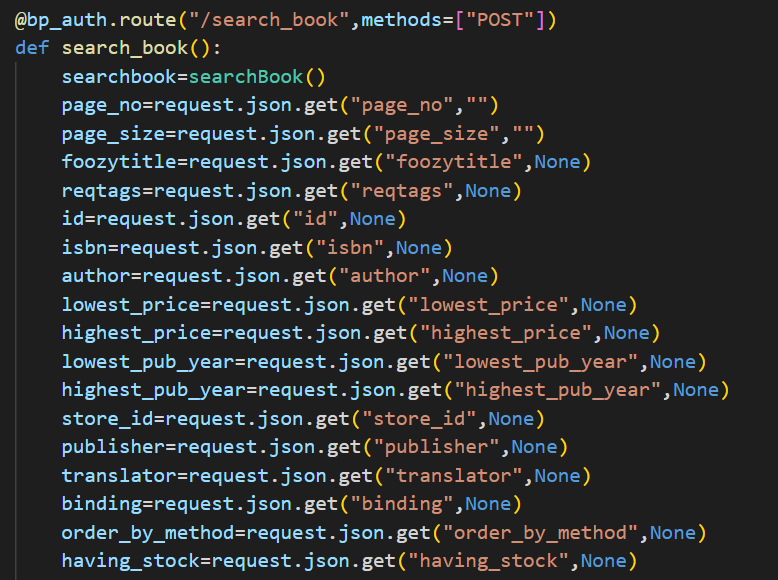
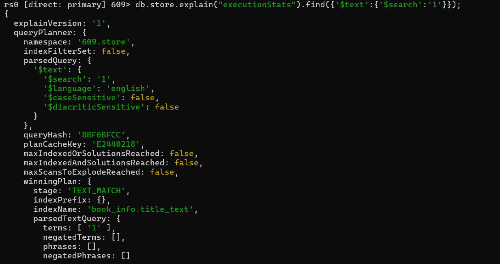

---

---

# 华东师范大学数据科学与工程学院实验报告

| 课程名称：数据管理系统       | 年级：2022级 | 实践日期：2024.4 |
| ---------------------------- | ------------ | ---------------- |
| 实践名称：Project1 bookstore | 组别:     五 |                  |

---


## 环境配置

### 1.

由于本项目将所有原sqlite数据（包括book.db和book_lx.db）迁移到了mongodb中，因此请确保在运行前在您的环境的mongodb的“609”数据库中创建名为book和book_lx的集合，并在其中填入适当的数据。具体数据可以使用原项目提供的book_lx.db的数据。

### 2.

由于本项目使用了mongodb的事务处理功能以确保正确性，所以请确保在运行前将您的环境的mongodb切换成分片模式（mongodb不支持单机状态的事务处理）。

具体步骤：

1.找到mongodb/bin目录下的mongod.cfg文件，并向其中加入：

```
replication:
  replSetName: rs0
```

2.重启mongodb服务（如果无法重启也可以选择重启电脑来完成“硬核”重启）

3.打开shell，执行mongosh命令，并输入：

```
rs.initiate()
```

如果返回成功信息即可。

参考教程：[mongoDB5以上实现单机事务_springboot mongodb实现事务-CSDN博客](https://blog.csdn.net/qq_41369135/article/details/129204920)

只需要执行该教程的前两步。

##  Ⅰ 组员信息与分工

### 组员

本小组为第五组,组员为

XXX 10225101XXX

XXX 10225101XXX

XXX 10225101XXX


### 分工

#### 小人鱼 10225101483

实现查找书籍功能，实现爬虫获取book.db数据。

(分工内容)

#### 徐翔宇 10225101535

补充错误码

以下功能的前端接口、后端接口、各功能测试样例（28个）：

主动取消订单

卖家发货

买家收货

搜索买家订单

搜索卖家订单

搜索订单详细信息


#### XXX 10225101XXX

(分工内容)


## Ⅱ  设计


## Ⅲ  功能&亮点

### 1 书本查询功能

功能参考当当网、中图网的高级搜索页面以及豆瓣的图书搜索页面：


#### 后端接口：

代码路径：be/view/book.py



前端调用时必须填写的参数包括当前页数以及页大小（每页显示几本书信息），其他为可选参数，如模糊标题、标签列表、书本id等。

特殊参数：

foozytitle意为书本title必须包含该子串。

reqtags意为书本的tags必须包含reqtags中的所有tags（例如查找即“浪漫”又“哲学”的书）。

lowest_price是最低价格，highest_price是最高价格。

lowest_pub_year是最早发布年份，highest_pub_year是最晚发布年份。

order_by_method是排序参数。可以选择按照书本的现货量，销量，发布年份，价格 四种方式排序，并且可以选择排序顺序（正序或倒序）。

having_stock表明要筛选出现在有货的书本。

store_id表明要查询的书属于的商店，如果为空则查询所有商店。

#### 后端逻辑：

后端实现为返回所有要求的交集。例如：

​	参数：page_no=1,page_size=7,lowest_price=1,highest_price=10,having_stock=True,author="小强",order_by_method=("price",-1)

返回的是价格在1\~10之间且有货且作者为小强的七本书本，他们是满足这些条件的书本中价格第8\~14贵的（page_no起始为0，因此这是第二页的七本书；排序参数中的-1表示倒序）。

返回值以json格式的列表呈现。列表中的每个元素是一个json格式的书本信息。书本信息本身是字典。

#### 数据库操作：

代码路径：be/model/book.py

```python
cursor = self.conn['store'].find(conditions,limit=page_size,skip=page_size*page_no,sort=sort)
```

其中conditions是所有参数要求的交集。详细到每个参数的实现请见代码本身。

sort为排序规则。

另一种等价实现：

```python
cursor = self.conn['store'].find(conditions).limit(xxx).skip(xxx).sort(xxx)
```

在实现过程中误以为将limit、skip、sort写在find内会更高效，但后续经过实验验证两者应该是等效的。且后者的limit，skip，sort的先后顺序是没有影响的。

#### 代码测试：

代码路径：fe/test/test_search_book.py

对上述参数都有测试。包括但不限于：模糊标题，翻译者，标签，出版商，是否有存货，指定商家，是否有货，正序倒序排序等。

错误检查测试包含有指定商家参数的情况下对商家是否存在的检查。没有满足查询需求的书的情况（例如查找的作家不存在）不视为错误情况。

#### 亮点：索引

所有索引：

```
self.conn["store"].create_index({"store_id":1})
        self.conn["store"].create_index({"book_info.translator":1})
        self.conn["store"].create_index({"book_info.publisher":1})
        self.conn["store"].create_index({"book_info.stock_level":1})
        self.conn["store"].create_index({"book_info.price":1})
        self.conn["store"].create_index({"book_info.pub_year":1})
        self.conn["store"].create_index({"book_info.id":1})
        self.conn["store"].create_index({"book_info.isbn":1})
        self.conn["store"].create_index({"book_info.author":1})
        self.conn["store"].create_index({"book_info.binding":1})
        self.conn['store'].create_index({'book_info.title':'text'})
```

1.

对book_info.title创建全文索引。mongodb的中文全文索引的逻辑和英文全文索引一样，是以空格分隔的单词为粒度的（例如"a good day"被分为a，good，day）。因此其能力较弱，如查询“生”无法查找到“生死遗言”。但可以通过查询“小品”查找到“小品 1”。


使用explain可以发现全文索引被使用。



2.

对其他会使用到的需求建立普通索引。由于大部分情况下单个条件就足以有选择性，能够筛选出少量满足效果的数据，因此不考虑建立复合索引。


### 2 买家取消订单

由买家主动发起


#### 前端接口：

代码路径：fe\access\buyer.py

```python
def cancel(self, order_id: str) -> int:
    json = {
        "user_id": self.user_id,
        "order_id": order_id,
    }
    url = urljoin(self.url_prefix, "cancel")
    headers = {"token": self.token}
    r = requests.post(url, headers=headers, json=json)
    return r.status_code
```

前端须填写的参数包括用户id：`user_id`和订单号：`order_id`。


#### 后端接口：

代码路径：be/view/buyer.py

```python
@bp_buyer.route("/cancel", methods=["POST"])
def cancel():
    user_id = request.json.get("user_id")
    order_id = request.json.get("order_id")
    b = Buyer()
    code, message = b.cancel(user_id, order_id)
    return jsonify({"message": message}), code
```


#### 后端逻辑：

若订单处于未支付状态，买家可以直接取消订单，书籍会加回店铺的库存中；若买家已支付订单但尚未发货，则会将支付的扣款返还买家的账户，书籍同样会加回店铺的库存中。只有买家本人可以主动取消订单。

状态码code：默认200，结束状态message：默认"ok"

```python
def cancel(self, user_id, order_id) -> (int, str):
    session=self.client.start_session()
    session.start_transaction()
    unprosssing_status =["unpaid", "paid_but_not_delivered"]
    try:
        cursor=self.conn['new_order'].find_one_and_update({'order_id':order_id},{'$set': {'status': "canceled"}},session=session)
        if(cursor is None):
            return error.error_non_exist_order_id(order_id)

        if(cursor['status'] not in unprosssing_status):
            return error.error_invalid_order_id(order_id)

        if(cursor['user_id'] !=user_id):
            return error.error_order_user_id(order_id, user_id)

        current_status=cursor['status']
        store_id=cursor['store_id']
        total_price=cursor['total_price']
        detail=list(cursor['detail'])

        for i in detail:
            self.conn['store'].update_one({'book_id':i[0],'store_id':store_id},{'$inc':{"stock_level":i[1],"sales":-i[1]}},session=session)
        if(current_status=="paid_but_not_delivered"):
            cursor=self.conn['user'].find_one_and_update(
                {'user_id':user_id},{'$inc':{'balance':total_price}},session=session)

    except pymongo.errors.PyMongoError as e:return 528, "{}".format(str(e))
    except BaseException as e:return 530, "{}".format(str(e))
    session.commit_transaction()
    session.end_session()
    return 200, "ok"
```


#### 数据库操作：

代码路径：be/model/buyer.py

```python
cursor=self.conn['new_order'].find_one_and_update({'order_id':order_id},{'$set': {'status': "canceled"}},session=session)
```

该sql作用为：通过对应`order_id`找到唯一订单，将该订单状态`status`更新为`canceled`，使用`session`防止订单状态异常。


```python
detail=list(cursor['detail'])
self.conn['store'].update_one({'book_id':i[0],'store_id':store_id},{'$inc':{"stock_level":i[1],"sales":-i[1]}},session=session)
```

该sql作用为：将生成订单时扣除的相应书籍库存信息恢复。此处`i`为`cursor['detail']`中每个迭代对象，在`new_order`中，`detail`储存一个二维`list`包含该订单购买书籍的book_id和对应数量。


```python
total_price=cursor['total_price']
if(current_status=="paid_but_not_delivered"):
	cursor=self.conn['user'].find_one_and_update(
		'user_id':user_id},{'$inc':{'balance':total_price}},session=session)
```

该sql作用为：若订单已支付，将生成订单时扣除的金额返还买家的账户。在`user`中，`balance`储存买家的账户资金；在`new_order`中，`total_price`储存该订单支付的总金额。


#### 代码测试：

代码路径：fe/test/test_cancel_order.py

对多种场景都有测试。包括：成功取消未支付订单、成功取消已支付未发货订单、检查买家账户金额是否正常退还、检查店铺相应书籍库存是否正常恢复。

错误检查测试包含：取消错误订单号订单、取消已取消订单、取消正在运输的订单、非购买用户无权取消订单。


#### 亮点：

##### 事务处理：

事务处理保证了多个数据库操作要么全部执行，要么全部不执行，在数据库发生错误或者并发环境下项目的可靠性。

##### 索引：

执行第一句sql时，`new_order`中`order_id`上的索引能够加速执行过程。


执行第二句sql时，`store`中`store_id`上的索引能够加速执行过程。


执行第三句sql时，`user`中`usr_id`上的索引能够加速执行过程。


##### 测试完备：

对于原有的大部分test_ok代码，基本只对返回的状态码进行断言判断，这并不能保证功能的完全执行。因此对于部分测试，会验证数据库中数据变化是否符合预期。

例如：

1.检查取消订单后已支付的金额是否会返还给用户。

```python
def test_cancel_paid_order_refund_ok(self):
    ok, buy_book_id_list = self.gen_book.gen(
        non_exist_book_id=False, low_stock_level=False
    )
    assert ok
    cursor=self.dbconn.conn['user'].find_one({'user_id':self.seller_id})
    origin_seller_balance=cursor['balance']
    code, order_id = self.buyer.new_order(self.store_id, buy_book_id_list)
    origin_buyer_balance=10000000000
    code = self.buyer.add_funds(origin_buyer_balance)
    code = self.buyer.payment(order_id)
    assert code == 200
    code = self.buyer.cancel(order_id)
    assert code == 200
    cursor=self.dbconn.conn['user'].find_one({'user_id':self.buyer_id})
    check_refund_buyer=(origin_buyer_balance==cursor['balance'])
    assert check_refund_buyer
    cursor=self.dbconn.conn['user'].find_one({'user_id':self.seller_id})
    check_refund_seller=(origin_seller_balance==cursor['balance'])
    assert check_refund_seller
```

2.检查取消订单后书籍库存是否会恢复。

```python
def test_order_stock_ok(self):
    ok, buy_book_id_list = self.gen_book.gen(
        non_exist_book_id=False, low_stock_level=False
    )
    pre_book_stock=[]
    cursor=self.dbconn.conn['store'].find({'store_id':self.store_id})
    for info in buy_book_id_list:
        for item in cursor:
            if item['book_id']==info[0]:
                pre_book_stock.append((info[0], item['stock_level']))
                break

    assert ok
    code, order_id = self.buyer.new_order(self.store_id, buy_book_id_list)
    assert code == 200
    code = self.buyer.cancel(order_id)
    cursor=self.dbconn.conn['store'].find({'store_id':self.store_id})
    for book_info in pre_book_stock:
        for item in cursor:
            if item['book_id']==book_info[0]:
                check_stock=(book_info[1]==item['stock_level'])
                assert check_stock
                break
    assert code == 200
```


### 3 卖家发货

由卖家主动发起


#### 前端接口：

代码路径：fe\access\seller.py

```python
def send_books(
    self,  store_id: str, order_id: str
) -> int:
    json = {
        "store_id": store_id,
        "order_id": order_id,
    }
    url = urljoin(self.url_prefix, "send_books")
    headers = {"token": self.token}
    r = requests.post(url, headers=headers, json=json)
    return r.status_code
```

前端须填写的参数包括店铺id：`store_id`和订单号：`order_id`。


#### 后端接口：

代码路径：be/view/seller.py

```python
@bp_seller.route("/send_books", methods=["POST"])
def send_books():
    store_id = request.json.get("store_id")
    order_id = request.json.get("order_id")
    s = seller.Seller()
    code, message = s.send_books(store_id, order_id)
    return jsonify({"message": message}), code

```


#### 后端逻辑：

若已支付订单但尚未发货，则会将订单状态更新为`delivered_but_not_received`。

状态码code：默认200，结束状态message：默认"ok"

```python
def send_books(self, store_id: str, order_id: str) -> (int, str):
    session=self.client.start_session()
    session.start_transaction()
    try:
        if not self.store_id_exist(store_id,session=session):
            return error.error_non_exist_store_id(store_id)

        cursor = self.conn['new_order'].find_one_and_update(
            {'order_id':order_id},
            {'$set': {'status': "delivered_but_not_received"}},
            session=session)
        if(cursor is None):
            return error.error_invalid_order_id(order_id)
        if(cursor['status'] != "paid_but_not_delivered"):
            return error.error_invalid_order_id(order_id)
        if(cursor['store_id'] != store_id):
            return error.unmatched_order_store(order_id, store_id)
    except BaseException as e:
        return 530, "{}".format(str(e))
    session.commit_transaction()
    session.end_session()
    return 200, "ok"
```


#### 数据库操作：

代码路径：be/model/seller.py

```python
cursor = self.conn['new_order'].find_one_and_update(
    {'store_id':store_id,'order_id':order_id},
    {'$set': {'status': "delivered_but_not_received"}},
	session=session)
```

该sql作用为：通过对应`order_id`找到唯一订单，将该订单状态`status`从`paid_but_not_delivered`更新为`delivered_but_not_received`.


#### 代码测试：

代码路径：fe/test/test_send_order.py

测试功能正确运行：成功发货（`test_ok`）。

对多种错误场景都有测试，错误检查测试包含：对未支付订单执行发货、对不存在的订单号执行发货、对不存在的`store_id`执行发货、对不匹配的`store_id`和`order_id`执行发货。


#### 亮点：

##### 事务处理帮助定位错误：

数据库更新使用了`find_one_and_update`，只要满足基本条件`{'store_id':store_id,'order_id':order_id}`就会更新订单状态。但是此处仍需检查订单的原状态是否是已支付。

巧思在于：没有将订单状态为`paid_but_not_delivered`放入筛选条件，因为数据库不会返回具体的检索失败的原因。将筛选的时机从在数据库中变为在项目中，这样就可以在搜索失败的情况下定位错误原因，而不是只知道这个订单不能发送，事务处理很好地帮助我们实现了定位检索失败原因的功能，只有各种条件筛选通过才会执行数据库操作，且如果某个筛选条件出错，可以返回对应的错误码。

##### 索引：

执行sql时，`new_order`中`order_id`上的索引能够加速执行过程。


### 4 买家收货

由买家主动发起


#### 前端接口：

代码路径：fe\access\buyer.py

```python
def receive_books(self, order_id: str) -> [int, list]:
    json = {
        "order_id":order_id,
        "user_id":self.user_id
    }
    url = urljoin(self.url_prefix, "receive_books")
    headers = {"token": self.token}
    r = requests.post(url, headers=headers, json=json)
    return r.status_code
```

前端须填写包括用户id：`user_id`和订单号：`order_id`


#### 后端接口：

代码路径：be/view/buyer.py

```python
@bp_buyer.route("/receive_books", methods=["POST"])
def receive_books():
    order_id = request.json.get("order_id")
    user_id = request.json.get("user_id")
    b = Buyer()
    code, message = b.receive_books(user_id, order_id)
    return jsonify({"message": message}), code
```


#### 后端逻辑：

若订单已发货，则会将订单状态更新为`received`。

状态码code：默认200，结束状态message：默认"ok"

```python
def receive_books(self, user_id, order_id) -> (int, str):
    session=self.client.start_session()
    session.start_transaction()
    try:
        if not self.user_id_exist(user_id,session=session):
            return error.error_non_exist_user_id(user_id)
        cursor = self.conn['new_order'].find_one_and_update(
            {'order_id': order_id},
            {'$set': {'status': "received"}},
            session=session
        )
        if(cursor==None):
            return error.error_invalid_order_id(order_id)
        if(cursor['status'] != "delivered_but_not_received"):
            return error.error_invalid_order_id(order_id)
        if(cursor['user_id'] != user_id):
            return error.unmatched_order_user(order_id, user_id)
        total_price=cursor['total_price']
        seller_id=cursor['seller_id']
        cursor=self.conn['user'].find_one_and_update({'user_id':seller_id},{'$inc':{'balance':total_price}},session=session)

    except pymongo.errors.PyMongoError as e:return 528, "{}".format(str(e))
    except BaseException as e:return 530, "{}".format(str(e))
    session.commit_transaction()
    session.end_session()
    return 200, "ok"
```


#### 数据库操作：

代码路径：be/model/buyer.py

```python
cursor = self.conn['new_order'].find_one_and_update(
                {'order_id': order_id},
                {'$set': {'status': "received"}},
                session=session)
```

该sql作用为：通过对应`order_id`找到唯一订单，将该订单状态`status`从`delivered_but_not_received`更新为`received`.


```python
cursor=self.conn['user'].find_one_and_update(
    {'user_id':seller_id},
    {'$inc':{'balance':total_price}},
    session=session)
```

该sql作用为：通过对应`seller_id`找到卖家账户，将该订单赚取的`total_price`加入卖家的账户资金`balance`.


#### 代码测试：

代码路径：fe/test/test_receive_order.py

测试功能正确运行：成功收货（`test_ok`）。

对多种错误场景都有测试，错误检查测试包含：对未发货订单执行收货、对不存在的订单号`order_id`执行收货、对不存在的`user_id`执行收货、对不匹配的`user_id`和`order_id`执行收货。


#### 亮点：

##### 事务处理帮助定位错误：

类似卖家发货，将筛选的时机从在数据库中变为在项目中，因为数据库不会返回具体的检索失败的原因，需要通过代码找到导致检索失败错误源头，并返回错误信息。事务处理很好地帮助我们实现了定位检索失败原因的功能，只有各种条件筛选通过才会执行数据库操作，且如果某个筛选条件出错，可以返回对应的错误码。

同时，事务处理保证了不会出现类似订单状态已更新但卖家没收到资金的情况，即只执行第一句sql，没执行第二句sql就被中断。

##### 索引：

执行第一句sql时，`new_order`中`order_id`上的索引能够加速执行过程。


执行第二句sql时，`user`中`usr_id`上的索引能够加速执行过程。


### 5 买家搜索订单

买家搜索所有自己购买的订单


#### 前端接口：

代码路径：fe\access\buyer.py

```python
def search_order(self) -> [int, list]:
    json = {
        "user_id": self.user_id,
    }
    url = urljoin(self.url_prefix, "search_order")
    headers = {"token": self.token}
    r = requests.post(url, headers=headers, json=json)
    response_json = r.json()
    return r.status_code, response_json.get("order_id_list")
```

前端须填写包括用户id：`user_id`.


#### 后端接口：

代码路径：be/view/buyer.py

```python
@bp_buyer.route("/search_order", methods=["POST"])
def search_order():
    user_id = request.json.get("user_id")
    b = Buyer()
    code, message, order_id_list = b.search_order(user_id)
    return jsonify({"message": message, "order_id_list": order_id_list}), code
```


#### 后端逻辑：

找到所有传入`user_id`对应用户购买的订单号，加入`result`作为最后返回结果。

状态码code：默认200，结束状态message：默认"ok"，订单列表result：默认为空列表

```python
def search_order(self, user_id):
    try:
        cursor=self.conn['user'].find_one({'user_id':user_id})
        if(cursor is None):
            return error.error_non_exist_user_id(user_id)+("",)
        cursor=self.conn['new_order'].find({'user_id':user_id})
        result=list()
        for i in cursor:
            result.append(i['order_id'])
    except pymongo.errors.PyMongoError as e:
        return 528, "{}".format(str(e)),""
    except Exception as e:
        return 530, "{}".format(str(e)),""
    return 200, "ok", result
```


#### 数据库操作：

代码路径：be/model/buyer.py

```python
cursor=self.conn['user'].find_one({'user_id':user_id})
```

该sql作用为：通过检查`user`中的对应`user_id`确保用户存在。


```python
cursor=self.conn['new_order'].find({'user_id':user_id})
result=list()
for i in cursor:
    result.append(i['order_id'])
```

该sql作用为：找到所有符合条件的订单号，加入`result`作为最后返回结果。这里只返回订单号，后续有函数`search_order_detail`可以返回订单的购买书单、总价格和订单状态，降低模块耦合度，增加可扩展性。


#### 代码测试：

代码路径：fe/test/test_search_order.py

测试功能正确运行：成功搜索、成功搜索无购买记录用户的历史订单（无报错）、成功搜索单条历史订单、成功搜索多条历史订单。

#### 代码测试：

代码路径：fe/test/test_receive_order.py

测试功能正确运行：成功收货（`test_ok`）。

错误检查为：搜索不存在的用户的订单。


#### 亮点：

##### 索引：

执行第一句sql时，`user`中`usr_id`上的索引能够加速执行过程。


执行第二句sql时，`new_order`中`usr_id`上的索引能够加速执行过程。


##### 测试完备：

对于原有的大部分test_ok代码，基本只对返回的状态码进行断言判断，这并不能保证功能的完全执行。因此对于部分测试，会验证数据库中数据变化是否符合预期。

例如：`test_buyer_many_orders_ok`会测试返回的订单号是否是测试中随机产生的订单。

注：对函数`self.gen_book.gen`有所修改，`high_stock_level`保证店铺有充足的库存。

```python
def test_buyer_many_orders_ok(self):
    order_list=list()
    ok, buy_book_id_list = self.gen_book.gen(
    non_exist_book_id=False, low_stock_level=False, high_stock_level=True
    )
    assert ok
    for i in range(0,5):
        code, order_id = self.buyer.new_order(self.store_id, buy_book_id_list)
        assert code == 200
        order_list.append(order_id)
    code, received_list= self.buyer.search_order()
    assert order_list == received_list
```


### 6 卖家搜索订单

卖家搜索自己某个店铺的所有订单


#### 前端接口：

代码路径：fe\access\seller.py

```python
def search_order(self,  store_id: str) -> [int, list]:
    json = {
        "seller_id":self.seller_id,
        "store_id": store_id,
    }
    url = urljoin(self.url_prefix, "search_order")
    headers = {"token": self.token}
    r = requests.post(url, headers=headers, json=json)
    response_json = r.json()
    return r.status_code, response_json.get("order_id_list")
```

前端须填写包括用户id：`user_id`和订单号：`order_id`


#### 后端接口：

代码路径：be/view/seller.py

```python
@bp_seller.route("/search_order", methods=["POST"])
def search_order():
    seller_id = request.json.get("seller_id")
    store_id = request.json.get("store_id")
    s = seller.Seller()
    code, message, order_id_list = s.search_order(seller_id,store_id)
    return jsonify({"message": message, "order_id_list": order_id_list}), code
```


#### 后端逻辑：

找到传入`seller_id`对应卖家的一个对应`store_id`的店铺的所有订单号，加入`result`作为最后返回结果。

状态码code：默认200，结束状态message：默认"ok"，订单列表result：默认为空列表

```python
def search_order(self, seller_id, store_id):
    try:
        ret=self.conn['user'].find({'user_id':seller_id})
        if(ret is None):
            return error.error_non_exist_user_id(seller_id)+("",)
        ret=self.conn['user'].find({'store_id':store_id})
        if(ret is None):
            return error.error_non_exist_store_id(store_id)+("",)
        ret=self.conn['user'].find_one({'store_id':store_id,'user_id':seller_id})
        if(ret is None):
            return error.unmatched_seller_store(seller_id,store_id)+("",)
        cursor=self.conn['new_order'].find({'store_id':store_id})

        result=list()
        for i in cursor:
            result.append(i['order_id'])

    except pymongo.errors.PyMongoError as e:
        return 528, "{}".format(str(e)),""
    except BaseException as e:
        return 530, "{}".format(str(e)),""
    return 200, "ok", result

```


#### 数据库操作：

代码路径：be/model/seller.py

```python
ret=self.conn['user'].find({'user_id':seller_id})
if(ret is None):
    return error.error_non_exist_user_id(seller_id)+("",)
```

该sql作用为：通过检查`user`中`seller_id`的对应`user_id`确保用户存在。


```python
ret=self.conn['user'].find({'store_id':store_id})
if(ret is None):
    return error.error_non_exist_store_id(store_id)+("",)
```

该sql作用为：通过检查`user`中对应`store_id`确保店铺存在。


```python
ret=self.conn['user'].find_one({'store_id':store_id,'user_id':seller_id})
if(ret is None):
    return error.unmatched_seller_store(seller_id,store_id)+("",)
```

该sql作用为：通过将筛选条件设置为相应的`seller_id`和`store_id`确保该店铺属于该用户，确保只有本人可以查询店铺订单。


```python
cursor=self.conn['new_order'].find({'store_id':store_id})
result=list()
for i in cursor:
    result.append(i['order_id'])
```

该sql作用为：找到所有符合条件的订单号，加入`result`作为最后返回结果。这里只返回订单号，后续有函数`search_order_detail`可以返回订单的购买书单、总价格和订单状态，降低模块耦合度，增加可扩展性。


#### 代码测试：

代码路径：fe/test/test_search_order.py

测试功能正确运行：成功搜索、成功搜索无售卖记录商户的历史订单、成功搜索单条历史订单、成功搜索多条历史订单。

错误检查为：搜索不存在的商店的订单、搜索不存在的用户的商店订单、搜索拥有者id与商店id不匹配的商店订单。


#### 亮点：

##### 索引：

执行第一句sql时，`user`中`usr_id`上的索引能够加速执行过程。


执行第二句sql时，`user`中`store_id`上的索引能够加速执行过程。


执行第四句sql时，`new_order`中`store_id`上的索引能够加速执行过程。


##### 测试完备：

对于原有的大部分test_ok代码，基本只对返回的状态码进行断言判断，这并不能保证功能的完全执行。因此对于部分测试，会验证数据库中数据变化是否符合预期。

例如：`test_seller_many_orders_ok`会测试返回的订单号是否是测试中随机产生的订单。

```python
def test_seller_many_orders_ok(self):
    order_list=list()
    ok, buy_book_id_list = self.gen_book.gen(
    non_exist_book_id=False, low_stock_level=False, high_stock_level=True
    )
    assert ok
    for i in range(0,5):
        code, order_id = self.buyer.new_order(self.store_id, buy_book_id_list)
        assert code == 200
        order_list.append(order_id)
    code, received_list= self.seller.search_order(self.store_id)
    assert order_list == received_list
```


### 7 搜索订单详情信息

搜索某个订单的详细信息。


#### 前端接口：

代码路径：fe\access\auth.py

```python
def search_order_detail(self,order_id) -> [int, list]:
    json = {
        "order_id": order_id,
    }
    url = urljoin(self.url_prefix, "search_order_detail")
    r = requests.post(url, json=json)
    response_json = r.json()
    return r.status_code, response_json.get("order_detail_list")
```

前端须填写订单号：`order_id`


#### 后端接口：

代码路径：be/view/auth.py

```python
@bp_auth.route("/search_order_detail", methods=["POST"])
def search_order_detail():
    order_id = request.json.get("order_id")
    u = user.User()
    code, message, order_detail_list = u.search_order_detail(order_id)
    return jsonify({"message": message, "order_detail_list": order_detail_list}), code
```


#### 后端逻辑：

通过`new_order`表找到传入`order_id`对应的订单号，将订单的详情信息加入`order_detail_list`作为最后返回结果，此处只返回购买书籍列表、书籍总价、订单状态（`unpaid`、`received`等），可根据需求自由更改。

状态码code：默认200，结束状态message：默认"ok"，详情列表order_detail_list：默认为空列表

```python
def search_order_detail(self, order_id):
    try:
        cursor=self.conn['new_order'].find_one({'order_id':order_id})
        if cursor is None:
            ret=error.error_non_exist_order_id(order_id)
            return ret[0],ret[1],""
        order_detail_list=(cursor['detail'],cursor['total_price'],cursor['status'])
    except pymongo.errors.PyMongoError as e:return 528, "{}".format(str(e)),""
    except BaseException as e:return 530, "{}".format(str(e)),""
    return 200, "ok", order_detail_list
```


#### 数据库操作：

代码路径：be/model/user.py

```python
cursor=self.conn['new_order'].find_one({'order_id':order_id})
```

该sql作用为：通过`new_order`表找到传入`order_id`对应的订单号，用于之后将订单的详情信息加入`order_detail_list`。


#### 代码测试：

代码路径：fe/test/test_search_order.py

测试功能正确运行：成功搜索订单详细信息。

错误检查：搜索不存在的订单号的详细信息。


#### 亮点：

##### 索引：

执行sql时，`new_order`中`order_id`上的索引能够加速执行过程。


### 其他：

增加测试：确保书籍库存不会为负数

```python
def test_error_book_stock(self):
    for b in self.books:
        book_id = b.id
        cursor=self.dbconn.conn['store'].find_one({'store_id':self.store_id,'book_id':book_id})
        code = self.seller.add_stock_level(self.user_id, self.store_id, book_id, -(cursor['stock_level']+1))#-(cursor['stock_level']+1)
        assert code != 200
        
def add_stock_level(
    self, user_id: str, store_id: str, book_id: str, add_stock_level: int
):
    session=self.client.start_session()
    session.start_transaction()
    try:
        if not self.user_id_exist(user_id,session=session):
            return error.error_non_exist_user_id(user_id)
        if not self.store_id_exist(store_id,session=session):
            return error.error_non_exist_store_id(store_id)
        if not self.book_id_exist(store_id, book_id,session=session):
            return error.error_non_exist_book_id(book_id)
        ret = self.conn['store'].find_one_and_update({'store_id':store_id,'book_id':book_id,'stock_level':{'$gte':-add_stock_level}},{'$inc': {'stock_level': add_stock_level}},session=session)
        if ret is None:
            return error.error_out_of_stock(book_id)
    except BaseException as e:
        return 530, "{}".format(str(e))
    session.commit_transaction()
    session.end_session()
    return 200, "ok"
```


## Ⅳ  亮点

