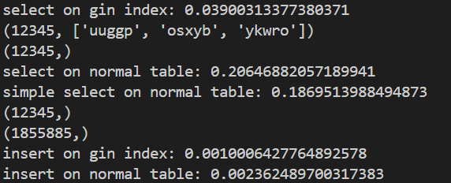
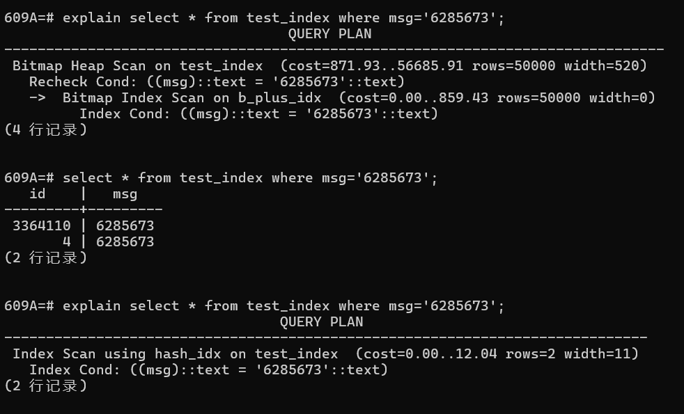
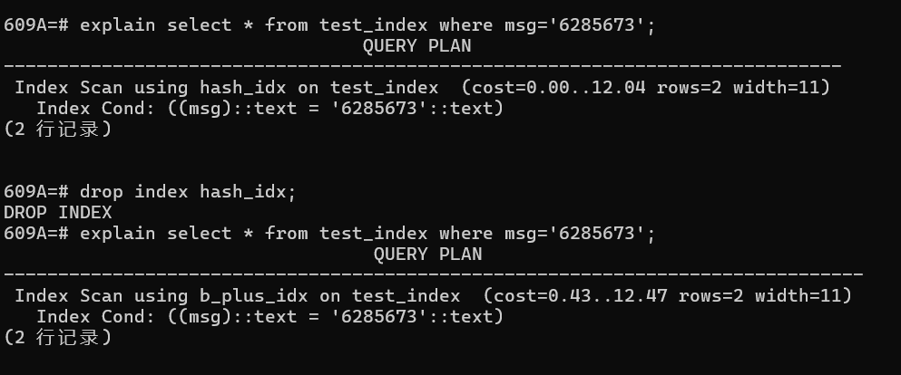
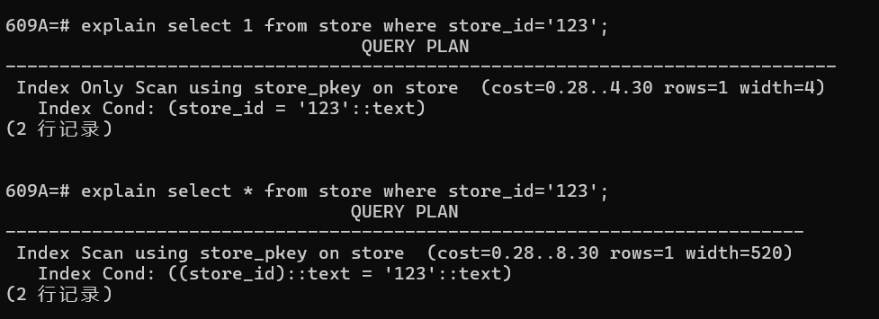
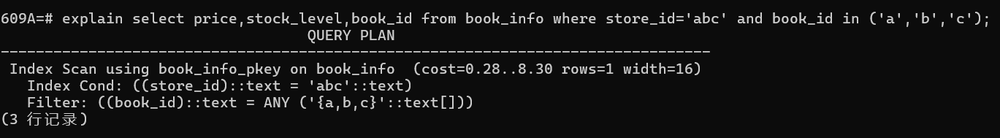
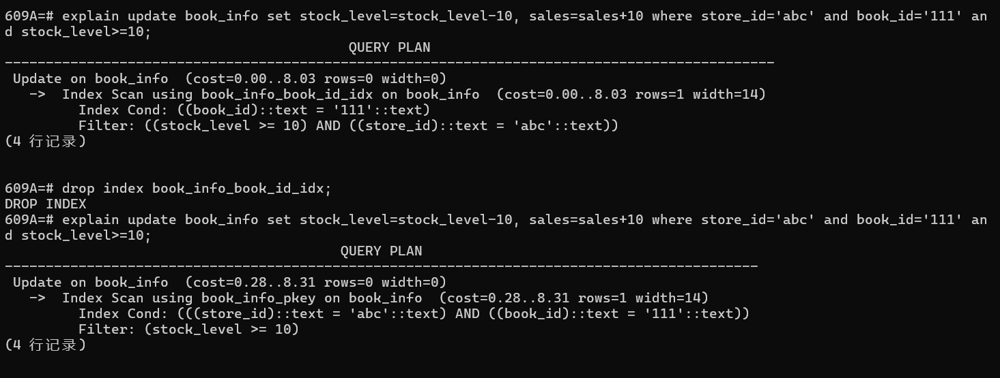

## 性能选择测试

### 1.书本标签：使用数组属性与gin索引 vs 新建书本-tag表

测试文件：

test_gin_index_on_tags.py

我们认为书本的标签（tags）在关系型数据库下有两种存储方式。

第一种是对每本书添加一个tags属性，该属性为数组属性。我们在该表上对数组属性建gin索引（倒排索引）。

第二种是新建一个tags表，表中每个元组为原书本id与其的一个tag。我们在该表上对tag建普通索引（b+树索引）。

我们在大数据量的情况下对两种存储方式分别进行了查询性能比较与插入性能比较。

测试结果：



#### 查询测试

在查询性能上，第一种存储方式性能为第二种存储方式性能的五十倍左右。

我们认为可能的原因如下：

1.我们的业务需求为：用户给出若干标签，我们筛选出拥有所有这些标签的书籍信息。

在该测试中设计的是一个store对应一系列tag。在我们项目中实际是一个book对应一系列tag，这里仅为命名上的区别，并且表结构做了简化，省去了book的其他属性。


使用第一种方式的sql如下：

```py
cur.execute("select * from test_tags where tags @> %s",[[1,2,3],])
```

使用postgres针对数组等属性提供的@>比较符号进行包含匹配。

使用第二种方式的sql大体如下：

```python
cur.execute("select store_id from test_tags_tag "+
                "where tag in (%s,%s,%s) group by store_id having count(1)=3",[x,y,z])#这里的3只是举例，代表用户查询到tag数量，x，y，z为用户查询的tag
res=cur.fetchall()
for i in res:
    cur.execute("select * from test_tags_store where store_id =%s",i)
```

由于每本书的tag不会重复，所以我们查询拥有这些tag且拥有的tag数量等于所查找tag数量的store_id。

在查询到目标的若干个store_id后还需要再次回表查询这些store_id的对应信息。（查询条件可从where store_id=改为where store_id in，使得符合条件的所有store可直接通过一条sql查询得到）

在res的长度为1的情况下（仅有一个匹配的store），其性能仍然比第一种方式慢了将近五十倍。经过检查，第一句sql的查询时间与使用gin索引的查询时间几乎相等。因此这种查询方式主要的劣势就在于需要进行两次查询（若经过where in优化）。

#### 插入测试

第一种方式的插入如下：

```
cur.execute("insert into test_tags values(100000000,%s)",[['abc','cba','acc']])
```

第二种方式的插入如下：

```
cur.execute("insert into test_tags_store values(100000000)")
cur.execute("insert into test_tags_tag values(100000000,'abc')")
cur.execute("insert into test_tags_tag values(100000000,'cba')")
cur.execute("insert into test_tags_tag values(100000000,'acc')")
```

经过测试，两者插入效率相当。

#### 结论

经过查询测试和插入测试，我们决定使用数组属性与倒排索引结合的方式实现书本的tags信息。并且在数据库中我们设置了book_info的tags属性的fastupdate参数为true。该参数使得数组索引并不会在每个元组更改或插入时立刻更新，而是等待一段时间或积累一定的更新量后统一更新索引，以增强插入响应速度。


### 2.等值查询不同索引效率测试

测试文件：

test_hash_bplus.py

我们知道，哈希索引只能针对等值查询进行优化。如果要对字段进行排序或者范围查询，则使用b+树索引更为合适。而在我们的项目中，有许多只涉及等值查询的字段，例如book_info中的author、publisher等。因此我们想要针对等值连接在两种索引下的性能进行测试，由于两种索引的查询实际都十分快速，因此我们借助pg自身的explain功能，来看pg在相同的条件下会优先选择哈希索引还是b+树索引。

在测试文件中，我们对相同字段建立两种索引，一种b+树，一种哈希。

在尚未对表进行任何一次查询前，pg对等值查询会使用bitmap scan筛选出含目标元组的页，再使用b+树索引。

但在表上进行过一次真实查询后，pg将在表上直接使用hash索引进行查询。

将hash索引删除后pg将会使用b+树索引直接进行查询。

通过explain发现，在pg的代价模型中，hash索引的代价在此处是小于b+树索引的。因此，我们认为在实际操作中，哈希索引在等值查询下会更优。

因此我们在创建表结构时，针对只会进行等值查询而不会进行范围查询或排序的字段（如book_info的author，publisher等）创建了哈希索引。





### 3.隔离级别测试

测试代码：test_isolation_level.py

我们希望我们的项目可以支持pg所提供的全部三种隔离级别，包括read-committed隔离级别。使用读已提交隔离级别比使用可重复读或可串行化隔离级别能够支持更好的串行性能。

但我们也需要考虑，在当前项目的代码中，是否存在读已提交隔离级别下可能会导致的错误。

因此，我们进行了一个简单的隔离级别测试。

我们使用多个线程并发执行以下代码。

```
self.cur.execute("select cnt from test_isolation where id=1")
        cnt=self.cur.fetchone()[0]
        if(cnt>=5):
            self.cur.execute("update test_isolation set cnt=cnt-5 where id=1")
```

在读已提交隔离性下，这段代码会发生错误，最终id=1的元组的cnt属性有概率将<0。这个原因是因为读已提交隔离性下的不可重复读错误。在第一次select和第二次update中间，id=1的元组的cnt属性降低了。

而这段代码的复杂版在我们项目的很多处都有涉及，以下将以创建新订单的例子作为说明。

在创建新订单时，我们将先读取所有目标书籍的价格与库存，确定书籍的总价格，以及每本书籍的库存是否足够。

```
cur.execute("select price,stock_level,book_id from book_info where store_id=%s and book_id in %s;",[store_id,tuple(book_id_lst)])
...
for book_id, count in id_and_count:
                        cur.execute("update book_info set stock_level=stock_level-%s, sales=sales+%s where store_id=%s and book_id=%s",[count,count,store_id,book_id])
                    
```

这个写法实际上就等同于我们的测试。因为在第一个select中即使每本书都满足了库存大于new_order所需的数量，但在update时，其库存有可能已经不足。

对于这种问题，我们有两种解决方案。

第一种，使用悲观锁。即，在第一次读取将要修改的数据时，在语句最后增加"for update"。这样会让读操作在元组上尝试获取写锁。在获取锁前保持等待。

```
cur.execute("select price,stock_level,book_id from book_info where store_id=%s and book_id in %s for update;",[store_id,tuple(book_id_lst)])
...
for book_id, count in id_and_count:
                        cur.execute("update book_info set stock_level=stock_level-%s, sales=sales+%s where store_id=%s and book_id=%s",[count,count,store_id,book_id])
                    
```

第二种，使用乐观锁。我们不获取写锁，而是需要在update时再次检查其数量是否满足。这是乐观锁的解决方式。

```
cur.execute("select price,stock_level,book_id from book_info where store_id=%s and book_id in %s for update;",[store_id,tuple(book_id_lst)])
...
for book_id, count in id_and_count:
	cur.execute("update book_info set stock_level=stock_level-%s, sales=sales+%s where store_id=%s and book_id=%s and stock_level>=%s",[count,count,store_id,book_id,count])
                    
```

我们认为对于我们的书店场景下，数量发生变更导致无法满足的情况是比较少见的，因此我们在类似的场景中统一采取了乐观锁的解决方式。

### 4.订单-书信息存储测试

测试代码：test_order_detail.py

在我们查询订单时，我们需要查找该订单所包含的所有书的id。因此我们有两种选择。

第一种，将oder-book关系存储到新的表中，查询书id语句为：

```
cur.execute("select test_detail.book_id from test_order inner join test_detail on test_order.id=test_detail.id where test_order.id=%s",[1234567,])
```

第二种，将book-count键值对以字符串形式作为order表中的一个属性存入，查询语句为：

```
cur.execute("select * from test_order_detail where id=%s",[1234567,])
```

字符串在项目中构造如下：

```
order_detail=""
     for book_id, count in id_and_count:
         order_detail+=book_id+" "+str(count)+"\n"
```

经过测试，第二种存放方式的查询效率是第一种存放方式的查询效率的两倍，这个区别并不太大。但就插入而言，第一种存放方式需要在new_order中插入一条后再在新表中插入等于购买书籍种类的数量条元组，因此其性能不如第二种存放方式。

第一种存放方式的优势为，可以通过在book_id上建立索引来支持 通过书籍id找到购买该书籍的所有订单信息 的功能。二第二种存放方式无法支持这种功能。但我们的项目并不需要支持该功能。即，订单与书籍的多对多关系对于我们的项目只用到了其中订单到书籍的一对多关系。因此，我们采取了第二种存放方式。


## 函数

### new_order

由于该函数实现较为复杂，我们以项目的代码加上额外注释的方式进行初步解读。该函数中有一些部分与之后的函数重复，在之后将不再赘述。

代码：

```python
order_id = ""
        attempt=0
        while(True):##如果操作由于事务之间的冲突而导致被abort，则操作会进行常数次的重试。
            try:
                with self.get_conn() as conn:#创建数据库连接
                    cur=conn.cursor()
                    if not self.user_id_exist(user_id,cur):#如果用户不存在则抛错
                        return error.error_non_exist_user_id(user_id) + (order_id, )
                    
                    cur.execute("select 1 from store where store_id=%s",[store_id,])
                    res=cur.fetchone()
                    if res is None:#如果商店不存在则抛错。使用select 1加速查询（聚合算子不返回元组）。
                        return error.error_non_exist_store_id(store_id) + (order_id, )
                    
                    #订单书本类型数目超限
                    if len(id_and_count)>Order_book_type_limit:
                        return error.error_order_book_type_ex(order_id)+ (order_id, )
                    
                    uid = "{}_{}_{}".format(user_id, store_id, str(uuid.uuid1()))#生成订单id
                    sum_price = 0

                    book_id_lst=list()
                    for i in id_and_count:
                        book_id_lst.append(i[0])#生成书的列表，用于下面的查询。

                    cur.execute("select price,stock_level,book_id from book_info where store_id=%s and book_id in %s;",[store_id,tuple(book_id_lst)])#使用一句查询找到所有目标书本的所需信息

                    res=cur.fetchall()
                    for book_id,count in id_and_count:
                        judge=False
                        for price,stock_level,target_id in res:
                            if(book_id==target_id):#找到目标书籍，则增加总金额，并且先检查一次现有库存是否满足需求，如果不满足则抛错
                                sum_price += price * count
                                if(stock_level<count):
                                    return error.error_stock_level_low(book_id) + (order_id, )
                                else:
                                    judge=True
                                    break
                        if not judge:#如果没找到目标书籍，则抛错
                            return error.error_non_exist_book_id(book_id) + (order_id, )
                        
                    #订单金额超限
                    if sum_price>Order_amount_limit:#如果订单超出单次金额限制则抛错
                         return error.error_order_amount_ex(order_id)+ (order_id, )
                    
                    
                    order_detail=""
                    for book_id, count in id_and_count:
                        cur.execute("update book_info set stock_level=stock_level-%s, sales=sales+%s where store_id=%s and book_id=%s and stock_level>=%s",[count,count,store_id,book_id,count])#对每本书进行update
                        if cur.rowcount == 0:#若update影响数为0，则一定是因为书籍的stock_level在事务执行过程中被其他事务影响而减少，导致不满足条件。（我们的项目不含有将book删除的功能）
                            return error.error_stock_level_low(book_id) + (order_id, )
                        order_detail+=book_id+" "+str(count)+"\n"#生成存储new_order时所需的order_detail字段对应的字符串
                    query="insert into new_order values(%s,%s,%s,%s,%s,%s,%s)"
                    order_id = uid
                    cur.execute(query,[order_id,store_id,user_id,'unpaid',datetime.datetime.now(),sum_price,order_detail])
                    conn.commit()
            except psycopg2.Error as e:
                if e.pgcode=="40001" and attempt<Retry_time:#若错误码为40001，则表示事务遇到并发性失败。我们会尝试常数次的重试。
                    attempt+=1
                    time.sleep(random.random()*attempt)#我们每次重试将等待随机的时间，平均等待时间随尝试次数增加而线性增加（若指数退避则对于我们的项目而言等待时间可能过长，无法接受）。若尝试次数达到上限则失败
                    continue
                else: return 528, "{}".format(str(e.pgerror)), ""
            except BaseException as e:  return 530, "{}".format(str(e)), ""
            return 200, "ok", order_id
```

#### 亮点

1.通过常数次等待重试机制处理事务冲突。

2.通过乐观锁解决保证数据正确性（货物存货量不会降至负数）。

3.使用in操作减少查询次数，提高效率。

4.所有查询与更新均可走索引：

```
 cur.execute("select 1 from store where store_id=%s",[store_id,])
 cur.execute("select price,stock_level,book_id from book_info where store_id=%s and book_id in %s;",[store_id,tuple(book_id_lst)])
 cur.execute("update book_info set stock_level=stock_level-%s, sales=sales+%s where store_id=%s and book_id=%s and stock_level>=%s",[count,count,store_id,book_id,count])
```

以下是对第一句查询的结果。可以看到select 1 效果比select * 更好。并且我们走了索引（使用主键）。select 1走了index only scan，意味着它通过主键找到目标所在元组后不需要再回表查询数据，直接使用索引包含的值即可，减少了目标元组数次IO次数（在本查询中为一次）。



以下是对第二句语句的explain结果。可以看到pg使用了我们的主键：（store_id,book_id）。



以下是对第三句语句的explain结果。可以看到走了book_id索引。而在删除book_id上的索引后会走主键索引。可以看到pg认为book_id上的索引的代价模型的代价小于store_id。这可能是pg通过一些对表的信息统计得出的结果。可能因为book_id在book_info表上相较于store_id更具有选择性（distinct值更多），并且book_id上建的索引是哈希索引。
