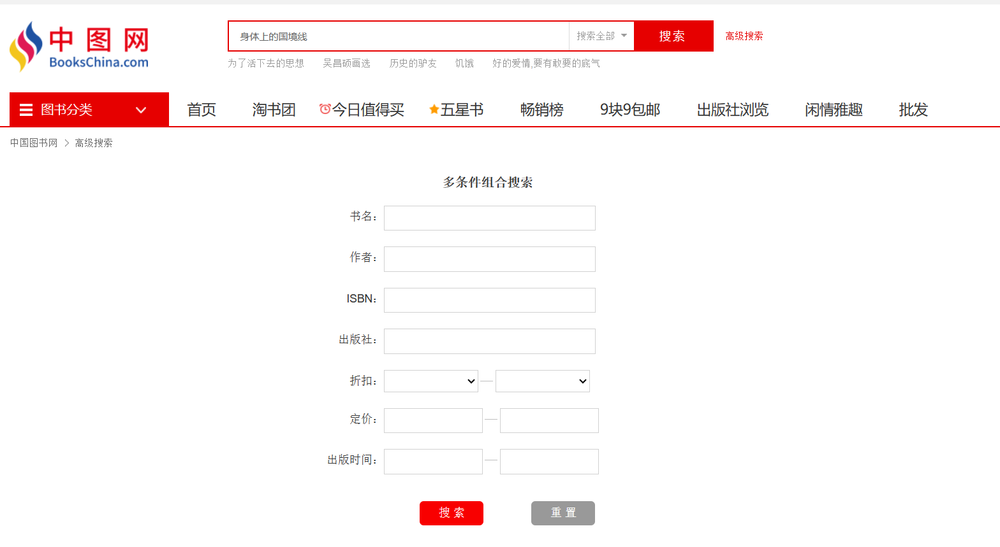
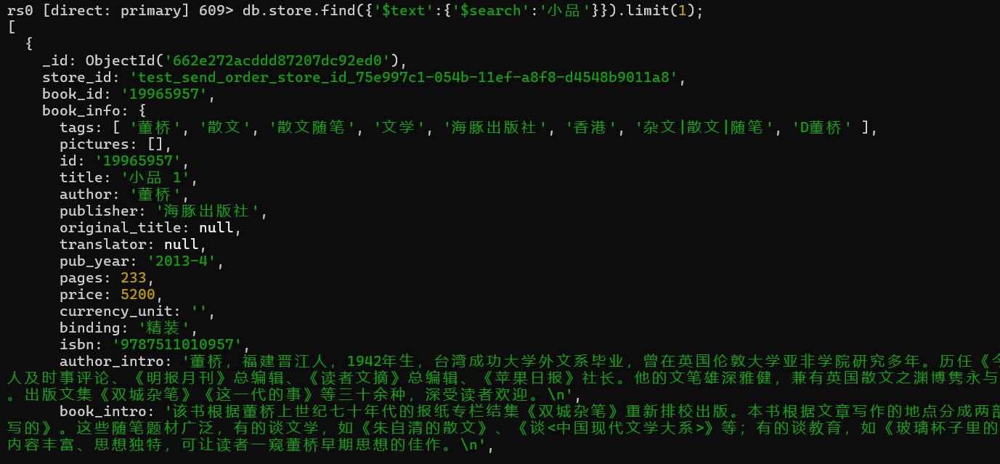
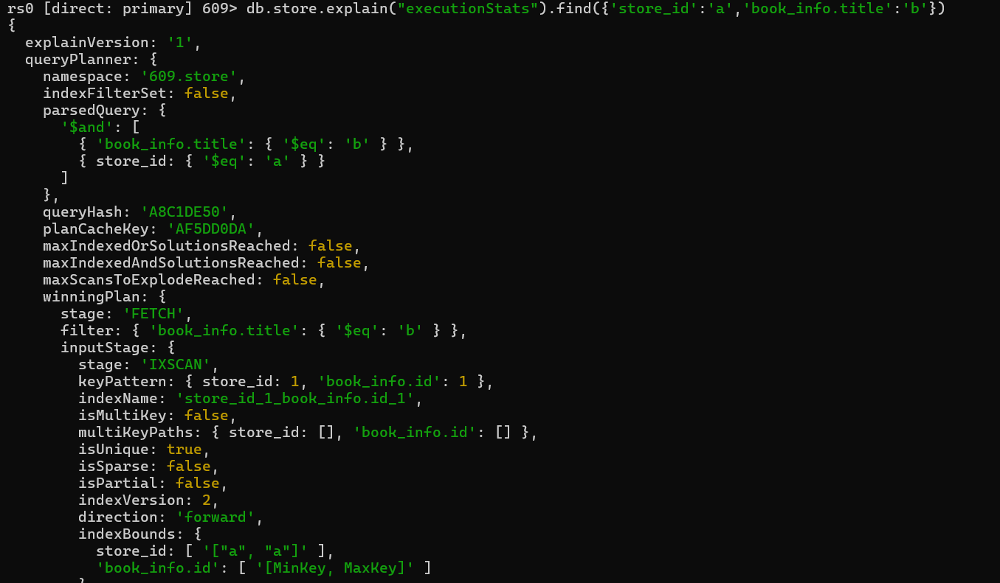
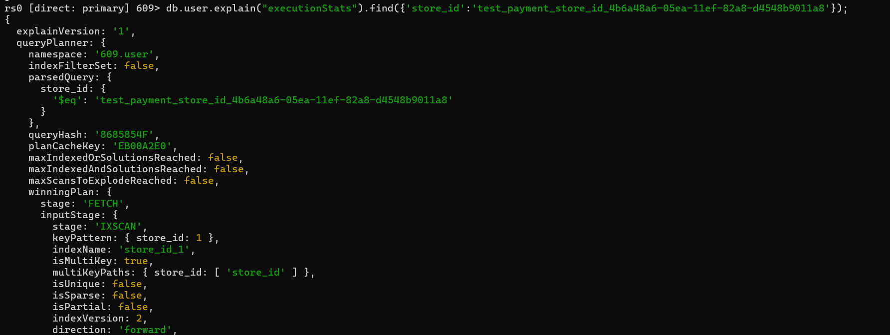

# 华东师范大学数据科学与工程学院实验报告

| 课程名称：数据管理系统       | 年级：2022级 | 实践日期：2024.4 |
| ---------------------------- | ------------ | ---------------- |
| 实践名称：Project1 bookstore | 组别:     五 |                  |

---


## 环境配置

### 1.

由于本项目将所有原sqlite数据（包括book.db和book_lx.db）迁移到了mongodb中，因此请确保在运行前在您的环境的mongodb的“609”数据库中创建名为book和book_lx的集合，并在其中填入适当的数据。具体数据可以使用原项目提供的book_lx.db的数据。

### 2.

由于本项目使用了mongodb的事务处理功能以确保正确性，所以请确保在运行前将您的环境的mongodb切换成分片模式（mongodb不支持单机状态的事务处理）。

具体步骤：

1.找到mongodb/bin目录下的mongod.cfg文件，并向其中加入：

```
replication:
  replSetName: rs0
```

2.重启mongodb服务（如果无法重启也可以选择重启电脑来完成“硬核”重启）

3.打开shell，执行mongosh命令，并输入：

```
rs.initiate()
```

如果返回成功信息即可。

参考教程：[mongoDB5以上实现单机事务_springboot mongodb实现事务-CSDN博客](https://blog.csdn.net/qq_41369135/article/details/129204920)

只需要执行该教程的前两步。

##  Ⅰ 组员信息与分工

### 组员

本小组为第五组,组员为

XXX 10225101XXX

XXX 10225101XXX

XXX 10225101XXX


### 分工

#### 小人鱼 10225101483

实现查找书籍功能及其测试

增加事务处理

重新实现buyer原有功能，即创建新订单、支付模块与增加/减少用户金额功能

在性能测试增加对取消订单、发货、收货的测试以及正确性检查

增加多个用户对热门书并发购买的正确性测试

设计部分索引

以及部分bug fix，代码改进/更新，和mongodb语句优化。

#### XXX 10225101XXX

(分工内容)

#### XXX 10225101XXX

(分工内容)

## Ⅱ  设计


## Ⅲ  功能&亮点

### 书本查询功能

功能参考当当网、中图网的高级搜索页面以及豆瓣的图书搜索页面：





#### 后端接口

代码路径：be/view/book.py

```
@bp_auth.route("/search_book",methods=["POST"])
def search_book():
    searchbook=searchBook()
    page_no=request.json.get("page_no","")
    page_size=request.json.get("page_size","")
    foozytitle=request.json.get("foozytitle",None)
    reqtags=request.json.get("reqtags",None)
    id=request.json.get("id",None)
    isbn=request.json.get("isbn",None)
    author=request.json.get("author",None)
    lowest_price=request.json.get("lowest_price",None)
    highest_price=request.json.get("highest_price",None)
    lowest_pub_year=request.json.get("lowest_pub_year",None)
    highest_pub_year=request.json.get("highest_pub_year",None)
    store_id=request.json.get("store_id",None)
    publisher=request.json.get("publisher",None)
    translator=request.json.get("translator",None)
    binding=request.json.get("binding",None)
    order_by_method=request.json.get("order_by_method",None)
    having_stock=request.json.get("having_stock",None)
```

前端调用时必须填写的参数包括当前页数以及页大小（每页显示几本书信息），其他为可选参数，如模糊标题、标签列表、书本id等。

特殊参数：

foozytitle意为书本title必须包含该子串。

reqtags意为书本的tags必须包含reqtags中的所有tags（例如查找即“浪漫”又“哲学”的书）。

lowest_price是最低价格，highest_price是最高价格。

lowest_pub_year是最早发布年份，highest_pub_year是最晚发布年份。

order_by_method是排序参数。可以选择按照书本的现货量，销量，发布年份，价格 四种方式排序，并且可以选择排序顺序（正序或倒序）。

having_stock表明要筛选出现在有货的书本。

store_id表明要查询的书属于的商店，如果为空则查询所有商店。

#### 后端逻辑

后端实现为返回所有要求的交集。例如：

​	参数：page_no=1,page_size=7,lowest_price=1,highest_price=10,having_stock=True,author="小强",order_by_method=("price",-1)

返回的是价格在1\~10之间且有货且作者为小强的七本书本，他们是满足这些条件的书本中价格第8\~14贵的（page_no起始为0，因此这是第二页的七本书；排序参数中的-1表示倒序）。

返回值以json格式的列表呈现。列表中的每个元素是一个json格式的书本信息。书本信息本身是字典。

#### 数据库操作

代码路径：be/model/book.py

```
cursor = self.conn['store'].find(conditions,limit=page_size,skip=page_size*page_no,sort=sort)
```

其中conditions是所有参数要求的交集。详细到每个参数的实现请见代码本身。

sort为排序规则。

另一种等价实现：

```
cursor = self.conn['store'].find(conditions).limit(xxx).skip(xxx).sort(xxx)
```

在实现过程中误以为将limit、skip、sort写在find内会更高效，但后续经过实验验证两者应该是等效的。且后者的limit，skip，sort的先后顺序是没有影响的。

#### 代码测试

代码路径：fe/test/test_search_book.py

对上述参数都有测试。包括但不限于：模糊标题，翻译者，标签，出版商，是否有存货，指定商家，是否有货，正序倒序排序等。

错误检查测试包含有指定商家参数的情况下对商家是否存在的检查。没有满足查询需求的书的情况（例如查找的作家不存在）不视为错误情况。

#### 亮点：索引

所有索引：

```
self.conn["store"].create_index({"store_id":1})
        self.conn["store"].create_index({"book_info.translator":1})
        self.conn["store"].create_index({"book_info.publisher":1})
        self.conn["store"].create_index({"book_info.stock_level":1})
        self.conn["store"].create_index({"book_info.price":1})
        self.conn["store"].create_index({"book_info.pub_year":1})
        self.conn["store"].create_index({"book_info.id":1})
        self.conn["store"].create_index({"book_info.isbn":1})
        self.conn["store"].create_index({"book_info.author":1})
        self.conn["store"].create_index({"book_info.binding":1})
        self.conn['store'].create_index({'book_info.title':'text'})
```

1.

对book_info.title创建全文索引。mongodb的中文全文索引的逻辑和英文全文索引一样，是以空格分隔的单词为粒度的（例如"a good day"被分为a，good，day）。因此其能力较弱，如查询“生”无法查找到“生死遗言”。但可以通过查询“小品”查找到“小品 1”。




使用explain可以发现全文索引被使用。


2.

对其他会使用到的需求建立普通索引。由于大部分情况下单个条件就足以有选择性，能够筛选出少量满足效果的数据，因此不考虑建立除了store_id+book_info.id以外的复合索引。

下面以store_id + 指定特定title为例。由于store_id和book_info.id建立了复合索引，所以查询计划使用了该复合索引。



在设置了价格限制的情况下，则会使用价格属性上的索引。


### 创建新订单

#### 后端接口

```
@bp_buyer.route("/new_order", methods=["POST"])
def new_order():
    user_id: str = request.json.get("user_id")
    store_id: str = request.json.get("store_id")
    books: [] = request.json.get("books")
```

参数为买家id，目标商店id，购买的书的id以及数量的列表。

#### 后端逻辑

在user表中查询商店属于的卖家。（利用数组索引加速查询）

对书籍列表中的每本书尝试将其数量减少相应的购买数量，如果书本数量不足则回滚事务，保证了整个操作的原子性和正确性。（查询方面使用store_id或book_id索引查询并更新）

在new_order 表中插入该订单，包含了买家，卖家，商店，书籍与购买数量列表。

#### 数据库操作

代码路径：be/model/buyer.py 的 new_order 函数

```python
		   session=self.client.start_session()
            session.start_transaction()
            if not self.user_id_exist(user_id,session=session):
                return error.error_non_exist_user_id(user_id) + (order_id,)

            res=self.conn['user'].find_one({'store_id':store_id},{'user_id':1},session=session)
            if res is None:
                return error.error_non_exist_store_id(store_id) + (order_id,)
            seller_id=res['user_id']

            uid = "{}_{}_{}".format(user_id, store_id, str(uuid.uuid1()))
            sum_price=0
            for book_id, count in id_and_count:
                cursor=self.conn['store'].find_one_and_update({'store_id':store_id,'book_id':book_id},{"$inc":{"stock_level":-count,"sales":count}},session=session)
                results=cursor
                if results==None:
                    return error.error_non_exist_book_id(book_id) + (order_id,)
                stock_level = int(results['stock_level'])
                book_info = results['book_info']
                price = book_info["price"]
                if stock_level < count:
                    return error.error_stock_level_low(book_id) + (order_id,)
                sum_price += price * count
            self.conn['new_order'].insert_one({'order_id':uid,'store_id':store_id,'seller_id':seller_id,'user_id':user_id,'status':'unpaid','order_time':int(time.time()),'total_price':sum_price,'detail':id_and_count},session=session)
            session.commit_transaction()
```

使用find_one_and_update对单本书同时进行查询和更新，将两次查询简化为一次查询。并且由于做了事务处理，所以更新后stock_level如果变为负数，或者之后的某本书库存不足，所有书也会被回滚至原先状态。

#### 代码测试

代码路径：fe/test/test_new_order.py

是原本代码中已写好的test。包括了正确执行的检查，和对非法的书id，用户id，商店id，以及书库存不足的错误处理检查。

#### 亮点：表结构改动与索引

用户与商店的从属关系不再使用原先额外的user_store表记录，而是给每个卖家user记录其管理的商店列表（如果一个user不是卖家，则它的文档中没有这一属性）。另一种没有采用的方案是在store表中给每个商店记录其卖家。但由于store表中一个文档代表着一个store中的一本book，所以存储的user数量会等于book数量，因此造成了冗余。例如：10个用户，每个用户有2家商店，每家商店10本书，则每个用户的id在store表中要存20次（2*10），总数为10\*20=200次。而我们的设计并无冗余，因为每家商店仅属于一个用户。

不再使用new_order_detail来记录每个订单对应的书籍和价格，而是通过在new_order中增加价格总数属性，以及bookid-count对列表来记录书籍id和购买数量。因为后续操作并不需要知道每本书具体价格，只需要知道订单的价格总数。这样的设计增加了new_order中单个文档的大小，但是省去了new_order_detail表，对原本需要用到new_order和new_order_detail两张表的功能会更加友好。总体的存储也变少了，因为金额存的是总金额而不是每本书的金额。

在这种表结构的基础上，我们计划对store_id列表建立数组索引来加快通过store_id查询其所属卖家的user_id的查询。

通过explain可以看到根据store_id的查询使用了我们对store_id建立的索引。



对于具体每本书的存货改动则使用store_id+book_id的聚合索引。

可以看到使用了该索引。


### 支付功能

我们的逻辑是用户支付后的钱并不会立刻转达给商家，仅在用户收到货物后才给商家增加相应的金额。

#### 后端接口

```python
@bp_buyer.route("/payment", methods=["POST"])
def payment():
    user_id: str = request.json.get("user_id")
    order_id: str = request.json.get("order_id")
    password: str = request.json.get("password")
```

参数为支付的用户id，订单id以及用户密码。

#### 后端逻辑

正确性检查：检查用户是否存在，用户密码是否存在，用户金额是否充足，订单是否存在且状态是否正确，订单是否属于该用户，订单对应的卖家是否仍然存在。

通过正确性检查后，给用户减少订单对应的金额数，并改变订单的状态为“已支付，未发货”（该状态下用户仍能够主动取消订单）。

#### 数据库操作

```python
cursor=conn['new_order'].find_one_and_update({'order_id':order_id,'status':"unpaid"},{'$set':{'status':'paid_but_not_delivered'}},session=session)
            if cursor is None:
                return error.error_invalid_order_id(order_id)
            order_id = cursor['order_id']
            buyer_id = cursor['user_id']
            seller_id = cursor['seller_id']
            if not self.user_id_exist(seller_id,session=session):
                return error.error_non_exist_user_id(seller_id)
            total_price = cursor['total_price']
            if buyer_id != user_id:
                return error.error_authorization_fail()
            cursor=conn['user'].find_one_and_update({'user_id':user_id},{'$inc':{'balance':-total_price}},session=session)
            if cursor is None:
                return error.error_non_exist_user_id(buyer_id)
            if password != cursor['password']:
                return error.error_authorization_fail()
            if(cursor['balance']<total_price):
                return error.error_not_sufficient_funds(order_id)
```

由于使用了事务处理和find_one_and_update，可以将原本的多条查询语句（检查用户合法，检查订单合法，更新用户金额，更新订单状态）合并成两句查询且仍能够保证操作的正确性。并且由于在新的表结构中我们的new_order中存入了订单对应的总价格，因此不需要通过查询每本书的价格来获取总价格。

#### 代码测试

代码路径：fe/test/test_payment.py

在原有测试基础上增加了对非法user_id（必须是创建订单的用户才能支付），以及对非法订单号的错误检查。

#### 亮点

第一条查询语句选择以order_id为索引，它可以唯一识别一条文档，而status则不具有选择性（相同status文档过多）。

并且设置了order_id为unique，相当于提示了mongodb该字段非常具有选择性，让其在查询计划中主动选择order_id。

并且实际上它也是这么选择的，效果如图：


### 用户增加/减少金额

减少金额等同于用户从账号中提现。

#### 后端接口

```py
@bp_buyer.route("/add_funds", methods=["POST"])
def add_funds():
    user_id = request.json.get("user_id")
    password = request.json.get("password")
    add_value = request.json.get("add_value")
```

user_id为用户id，password为用户密码，add_value为用户增加或减少的金额。（负数为减少）

#### 后端逻辑

代码路径：be/model/buyer.py

检查用户密码是否正确，如果是减少金额的话不能将金额降低为负数。

#### 数据库操作

```py
cursor=self.conn['user'].find_one_and_update({'user_id':user_id},{'$inc':{'balance':add_value}},session=session)
            if(cursor['password']!=password):
                return error.error_authorization_fail()
            if(cursor['balance']<-add_value):
                return error.error_non_enough_fund(user_id)
```

使用find_one_and_update一条查询语句达成上述两个检查以及更新的效果。因为做了事务处理，因此如果检查信息不通过即可自动回滚事务。（注意，find_one_and_update返回的是update之前目标的结果值）。

#### 代码测试

代码路径：fe/test/test_add_funds.py

原有的测试包括了正确性测试，错误用户id，错误用户密码测试。在此基础上我们增加了超额提现的错误测试。

#### 亮点

使用user_id索引进行查询。

实际证明在user表中根据user_id查询时确实会使用user_id索引，且该元素为unique。


### 性能测试

代码路径：fe/bench/session.py	fe/bench/workload.py	fe/bench/check.py	fe/test/test_bench.py

原有性能测试是用于测试创建新订单以及支付的性能。我们在此基础上增加了对用户取消订单，卖家发货，用户收货三个接口的测试。并且增加了对最终结果的正确性测试（所有用户的金额总数保持不变）。

具体查看性能测试的结果方法为：先运行be/app.py，再运行fe/bench/run.py。注意：由于代码import包使用了相对路径，如果要进行性能测试，请在您的be/app.py与fe/bench/run.py开头处加入如下两行代码：

```python
import sys
sys.path.append('xxx')
```

其中 xxx 是您环境中项目bookstore文件夹的绝对路径。

测试结果会显示在fe/bench/workload.log中。

#### 后端逻辑

对于单个session，它会先创建若干新订单，然后尝试对每个创建成功的订单进行支付，如果支付失败则订单将取消，如果支付成功则用户有概率取消该订单，也有概率不取消。若不取消订单则对应卖家将进行发货，然后用户将进行收货。

#### 代码测试

如果在conf文件中设置的并发数较大的话可能会引发异常。主要是由于mongodb的事务处理是使用的乐观并发控制方法，因此在性能测试中可能会引发事务间的冲突导致一些事务被abort。因此我们的正确性验证不保证所有请求都能成功，而是确保在部分请求成功部分请求失败的情况下系统的一致性仍能够得到保证，即：所有用户的初始总金额 等于 所有用户最终的总金额加上已经支付但还未送货到用户处的订单总金额。

正确性检查代码如下：

```python
def checkSumMoney(money):
    conn=get_db_conn()
    cursor=conn['user'].find({})
    for i in cursor:
        money-=i['balance']
    cursor=conn['new_order'].find({'$or':[{'status':'paid_but_not_delivered'},{'status':'delivered_but_not_received'}]})
    for i in cursor:
        money-=i['total_price']
    assert(money==0)
```


#### 性能测试结果

```
29-10-2024 21:10:07 root:INFO:load data
29-10-2024 21:10:34 root:INFO:seller data loaded.
29-10-2024 21:10:35 root:INFO:buyer data loaded.
29-10-2024 21:10:48 root:INFO:TPS_C=988, NO=OK:96 Thread_num:100 TOTAL:100 LATENCY:0.03018625020980835 , P=OK:94 Thread_num:96 TOTAL:96 LATENCY:0.01627522458632787 , C=OK:30 Thread_num:31 TOTAL:31 LATENCY:0.02146471700360698 , S=OK:63 Thread_num:63 TOTAL:63 LATENCY:0.013920208764454675 , R=OK:52 Thread_num:63 TOTAL:63 LATENCY:0.01530948139372326
29-10-2024 21:10:48 root:INFO:TPS_C=978, NO=OK:191 Thread_num:100 TOTAL:200 LATENCY:0.030438814163208008 , P=OK:188 Thread_num:95 TOTAL:191 LATENCY:0.016189354252440766 , C=OK:57 Thread_num:30 TOTAL:61 LATENCY:0.021360409064371078 , S=OK:127 Thread_num:64 TOTAL:127 LATENCY:0.0139666035419374 , R=OK:108 Thread_num:64 TOTAL:127 LATENCY:0.015475278764259158
29-10-2024 21:10:48 root:INFO:TPS_C=968, NO=OK:286 Thread_num:100 TOTAL:300 LATENCY:0.030630178451538086 , P=OK:280 Thread_num:95 TOTAL:286 LATENCY:0.01633389262886314 , C=OK:86 Thread_num:30 TOTAL:91 LATENCY:0.021207612949413257 , S=OK:189 Thread_num:62 TOTAL:189 LATENCY:0.014156719994923425 , R=OK:163 Thread_num:62 TOTAL:189 LATENCY:0.015333819010901072
29-10-2024 21:10:48 root:INFO:TPS_C=1000, NO=OK:383 Thread_num:100 TOTAL:400 LATENCY:0.030705811977386473 , P=OK:377 Thread_num:97 TOTAL:383 LATENCY:0.016331254346563674 , C=OK:114 Thread_num:32 TOTAL:123 LATENCY:0.020965490883928004 , S=OK:254 Thread_num:65 TOTAL:254 LATENCY:0.014224416627658634 , R=OK:220 Thread_num:65 TOTAL:254 LATENCY:0.015161939493314487
29-10-2024 21:10:48 root:INFO:TPS_C=1019, NO=OK:483 Thread_num:100 TOTAL:500 LATENCY:0.030874167442321777 , P=OK:476 Thread_num:100 TOTAL:483 LATENCY:0.016342603395197455 , C=OK:144 Thread_num:33 TOTAL:156 LATENCY:0.020918589371901292 , S=OK:320 Thread_num:66 TOTAL:320 LATENCY:0.014284470677375793 , R=OK:278 Thread_num:66 TOTAL:320 LATENCY:0.0148724265396595

```

通过临时添加测试代码证实未完成的请求原因确实是由于事务冲突所致，如图：


图中说明一些支付请求由于事务间的写写冲突而无法完成。但在这种冲突发生的情况下依然能够通过正确性测试，验证了项目的完备性。

### 热门书籍并发购买测试

代码路径：fe/bench/session.py	fe/bench/workload.py	fe/bench/check.py	fe/test/test_hot_book.py

#### 后端逻辑

创建一个商店以及一本图书商品，并让多个用户并发的争抢这本图书。程序运行结束后检查 所有用户的初始总金额 和 执行后所有用户的总金额和已支付成功的订单的金额总数 是否相等。

部分代码逻辑如下：

workload:

```py
def gen_database_hot_one_test(self):
        clean_db()
        logging.info("load data")
        user_id, password = self.to_seller_id_and_password(1)
        seller = register_new_seller(user_id, password)
        self.famous_seller=seller
        store_id="the_most_famous_store"
        self.hot_store_id=store_id
        seller.create_store(store_id)
        bk_info=self.book_db.get_book_info(0,2)[0]
        self.hot_book_id=bk_info.id
        seller.add_book(store_id,1000,bk_info)
        self.tot_fund=0
        for k in range(1, self.buyer_num + 1):
            user_id, password = self.to_buyer_id_and_password(k)
            buyer = register_new_buyer(user_id, password)
            buyer.add_funds(self.user_funds)
            self.tot_fund+=self.user_funds
            self.buyer_ids.append(user_id)
    def get_hot_order(self):
        n = random.randint(1, self.buyer_num)
        buyer_id, buyer_password = self.to_buyer_id_and_password(n)
        b = Buyer(url_prefix=conf.URL, user_id=buyer_id, password=buyer_password)
        lst=[]
        lst.append((self.hot_book_id,100))
        new_ord=NewOrder(b,self.hot_store_id,lst,self.famous_seller)
        return new_ord
```

session:

```py
def gen_hot_test_procedure(self):
        for i in range(0, self.workload.procedure_per_session):
            new_order = self.workload.get_hot_order()
            self.new_order_request.append(new_order)

    def all_buy_one(self):
        for new_order in self.new_order_request:
            ok, order_id = new_order.run()
            if ok==200:
                payment = Payment(new_order.buyer, order_id,new_order.seller,new_order.store_id)
                self.payment_request.append(payment)
        for payment in self.payment_request:
                    ok = payment.run()
```

主要的并发点在于多个session并发执行new_order.run()导致的部分用户购买失败。我们期望在这种情况下系统内的金额总数能够保持不变。

#### 代码测试

使用check函数检查金额一致性，与性能测试一致，在此不赘述。


## 成果

最终的代码覆盖率为95%，绝大多数未覆盖到的代码为一些未知异常（如事务冲突，机器掉电）引发的统一错误处理。

```
Alex@Fishingspot MINGW64 /d/dbproject/Project_1/bookstore (master)
$ bash script/test.sh
============================= test session starts =============================
platform win32 -- Python 3.8.1, pytest-8.1.1, pluggy-1.4.0 -- c:\users\alex\appdata\local\programs\python\python38\python.exe
cachedir: .pytest_cache
rootdir: D:\dbproject\Project_1\bookstore
collecting ... frontend begin test
 * Serving Flask app 'be.serve' (lazy loading)
 * Environment: production
   WARNING: This is a development server. Do not use it in a production deployment.
   Use a production WSGI server instead.
 * Debug mode: off
2024-04-29 23:46:44,265 [Thread-1    ] [INFO ]   * Running on http://127.0.0.1:5000/ (Press CTRL+C to quit)
collected 88 items

fe/test/test_add_book.py::TestAddBook::test_ok PASSED                    [  1%]
fe/test/test_add_book.py::TestAddBook::test_error_non_exist_store_id PASSED [  2%]
fe/test/test_add_book.py::TestAddBook::test_error_exist_book_id PASSED   [  3%]
fe/test/test_add_book.py::TestAddBook::test_error_non_exist_user_id PASSED [  4%]
fe/test/test_add_funds.py::TestAddFunds::test_ok PASSED                  [  5%]
fe/test/test_add_funds.py::TestAddFunds::test_error_user_id PASSED       [  6%]
fe/test/test_add_funds.py::TestAddFunds::test_error_password PASSED      [  7%]
fe/test/test_add_funds.py::TestAddFunds::test_decrease_more_than_having PASSED [  9%]
fe/test/test_add_stock_level.py::TestAddStockLevel::test_error_user_id PASSED [ 10%]
fe/test/test_add_stock_level.py::TestAddStockLevel::test_error_store_id PASSED [ 11%]
fe/test/test_add_stock_level.py::TestAddStockLevel::test_error_book_id PASSED [ 12%]
fe/test/test_add_stock_level.py::TestAddStockLevel::test_ok PASSED       [ 13%]
fe/test/test_add_stock_level.py::TestAddStockLevel::test_error_book_stock PASSED [ 14%]
fe/test/test_bench.py::test_bench PASSED                                 [ 15%]
fe/test/test_cancel_order.py::TestCancelOrder::test_unpaid_order_ok PASSED [ 17%]
fe/test/test_cancel_order.py::TestCancelOrder::test_cancel_paid_order_refund_ok PASSED [ 18%]
fe/test/test_cancel_order.py::TestCancelOrder::test_order_stock_ok PASSED [ 19%]
fe/test/test_cancel_order.py::TestCancelOrder::test_non_exist_order_id PASSED [ 20%]
fe/test/test_cancel_order.py::TestCancelOrder::test_non_prossessing_order_id PASSED [ 21%]
fe/test/test_cancel_order.py::TestCancelOrder::test_cancel_error_user_id PASSED [ 22%]
fe/test/test_cancel_order.py::TestCancelOrder::test_delivering_order_id PASSED [ 23%]
fe/test/test_create_store.py::TestCreateStore::test_ok PASSED            [ 25%]
fe/test/test_create_store.py::TestCreateStore::test_error_exist_store_id PASSED [ 26%]
fe/test/test_hot_book.py::test_hot_book PASSED                           [ 27%]
fe/test/test_login.py::TestLogin::test_ok PASSED                         [ 28%]
fe/test/test_login.py::TestLogin::test_error_user_id PASSED              [ 29%]
fe/test/test_login.py::TestLogin::test_error_password PASSED             [ 30%]
fe/test/test_new_order.py::TestNewOrder::test_non_exist_book_id PASSED   [ 31%]
fe/test/test_new_order.py::TestNewOrder::test_low_stock_level PASSED     [ 32%]
fe/test/test_new_order.py::TestNewOrder::test_ok PASSED                  [ 34%]
fe/test/test_new_order.py::TestNewOrder::test_non_exist_user_id PASSED   [ 35%]
fe/test/test_new_order.py::TestNewOrder::test_non_exist_store_id PASSED  [ 36%]
fe/test/test_password.py::TestPassword::test_ok PASSED                   [ 37%]
fe/test/test_password.py::TestPassword::test_error_password PASSED       [ 38%]
fe/test/test_password.py::TestPassword::test_error_user_id PASSED        [ 39%]
fe/test/test_payment.py::TestPayment::test_ok PASSED                     [ 40%]
fe/test/test_payment.py::TestPayment::test_authorization_error PASSED    [ 42%]
fe/test/test_payment.py::TestPayment::test_non_exists_order PASSED       [ 43%]
fe/test/test_payment.py::TestPayment::test_wrong_user_id PASSED          [ 44%]
fe/test/test_payment.py::TestPayment::test_not_suff_funds PASSED         [ 45%]
fe/test/test_payment.py::TestPayment::test_repeat_pay PASSED             [ 46%]
fe/test/test_receive_order.py::TestreceiveOrder::test_ok PASSED          [ 47%]
fe/test/test_receive_order.py::TestreceiveOrder::test_unmatch_user_id_receive PASSED [ 48%]
fe/test/test_receive_order.py::TestreceiveOrder::test_not_paid_receive PASSED [ 50%]
fe/test/test_receive_order.py::TestreceiveOrder::test_no_fund_receive PASSED [ 51%]
fe/test/test_receive_order.py::TestreceiveOrder::test_error_order_id_receive PASSED [ 52%]
fe/test/test_receive_order.py::TestreceiveOrder::test_error_user_id_receive PASSED [ 53%]
fe/test/test_receive_order.py::TestreceiveOrder::test_no_send_receive PASSED [ 54%]
fe/test/test_register.py::TestRegister::test_register_ok PASSED          [ 55%]
fe/test/test_register.py::TestRegister::test_unregister_ok PASSED        [ 56%]
fe/test/test_register.py::TestRegister::test_unregister_error_authorization PASSED [ 57%]
fe/test/test_register.py::TestRegister::test_register_error_exist_user_id PASSED [ 59%]
fe/test/test_register.py::TestRegister::test_unregister_with_buyer_or_seller_order PASSED [ 60%]
fe/test/test_scanner.py::TestScanner::test_auto_cancel PASSED            [ 61%]
fe/test/test_search_book.py::TestSearchBook::test_search_book_id PASSED  [ 62%]
fe/test/test_search_book.py::TestSearchBook::test_search_book_title PASSED [ 63%]
fe/test/test_search_book.py::TestSearchBook::test_search_book_author PASSED [ 64%]
fe/test/test_search_book.py::TestSearchBook::test_search_book_tags PASSED [ 65%]
fe/test/test_search_book.py::TestSearchBook::test_search_book_isbn PASSED [ 67%]
fe/test/test_search_book.py::TestSearchBook::test_search_book_price PASSED [ 68%]
fe/test/test_search_book.py::TestSearchBook::test_search_book_pub_year PASSED [ 69%]
fe/test/test_search_book.py::TestSearchBook::test_search_book_store_id PASSED [ 70%]
fe/test/test_search_book.py::TestSearchBook::test_search_book_publisher PASSED [ 71%]
fe/test/test_search_book.py::TestSearchBook::test_search_book_translator PASSED [ 72%]
fe/test/test_search_book.py::TestSearchBook::test_search_book_binding PASSED [ 73%]
fe/test/test_search_book.py::TestSearchBook::test_search_book_stock PASSED [ 75%]
fe/test/test_search_book.py::TestSearchBook::test_search_book_non_exist_store PASSED [ 76%]
fe/test/test_search_book.py::TestSearchBook::test_search_book_with_order PASSED [ 77%]
fe/test/test_search_order.py::TestSearchOrder::test_search_orders_detail_ok PASSED [ 78%]
fe/test/test_search_order.py::TestSearchOrder::test_search_invalid_orders_detail PASSED [ 79%]
fe/test/test_search_order.py::TestSearchOrder::test_buyer_search_order_ok PASSED [ 80%]
fe/test/test_search_order.py::TestSearchOrder::test_buyer_search_error_user_order PASSED [ 81%]
fe/test/test_search_order.py::TestSearchOrder::test_buyer_search_empty_order PASSED [ 82%]
fe/test/test_search_order.py::TestSearchOrder::test_buyer_one_order_ok PASSED [ 84%]
fe/test/test_search_order.py::TestSearchOrder::test_buyer_many_orders_ok PASSED [ 85%]
fe/test/test_search_order.py::TestSearchOrder::test_seller_search_order_ok PASSED [ 86%]
fe/test/test_search_order.py::TestSearchOrder::test_seller_search_empty_order_ok PASSED [ 87%]
fe/test/test_search_order.py::TestSearchOrder::test_seller_search_error_seller_order PASSED [ 88%]
fe/test/test_search_order.py::TestSearchOrder::test_seller_search_error_store_order PASSED [ 89%]
fe/test/test_search_order.py::TestSearchOrder::test_seller_search_unmatch_order PASSED [ 90%]
fe/test/test_search_order.py::TestSearchOrder::test_seller_one_order_ok PASSED [ 92%]
fe/test/test_search_order.py::TestSearchOrder::test_seller_many_orders_ok PASSED [ 93%]
fe/test/test_send_order.py::TestSendOrder::test_unmatch_send PASSED      [ 94%]
fe/test/test_send_order.py::TestSendOrder::test_ok PASSED                [ 95%]
fe/test/test_send_order.py::TestSendOrder::test_not_paid_send PASSED     [ 96%]
fe/test/test_send_order.py::TestSendOrder::test_no_fund_send PASSED      [ 97%]
fe/test/test_send_order.py::TestSendOrder::test_error_order_id_send PASSED [ 98%]
fe/test/test_send_order.py::TestSendOrder::test_error_store_id_send PASSED [100%]D:\dbproject\Project_1\bookstore\be\serve.py:18: UserWarning: The 'environ['werkzeug.server.shutdown']' function is deprecated and will be removed in Werkzeug 2.1.
  func()
2024-04-30 00:01:05,868 [Thread-19114] [INFO ]  127.0.0.1 - - [30/Apr/2024 00:01:05] "GET /shutdown HTTP/1.1" 200 -


======================= 88 passed in 863.57s (0:14:23) ========================
frontend end test
No data to combine
Name                              Stmts   Miss Branch BrPart  Cover
-------------------------------------------------------------------
be\__init__.py                        0      0      0      0   100%
be\app.py                             5      5      2      0     0%
be\model\__init__.py                  0      0      0      0   100%
be\model\book.py                     70      9     44      3    88%
be\model\buyer.py                   147     12     60      7    90%
be\model\db_conn.py                  29      5      8      0    81%
be\model\error.py                    45      3      0      0    93%
be\model\scanner.py                  34      4     10      3    84%
be\model\seller.py                  102     15     42      6    84%
be\model\store.py                    72      5     10      5    88%
be\model\user.py                    142     14     52      5    85%
be\serve.py                          43      1      2      1    96%
be\view\__init__.py                   0      0      0      0   100%
be\view\auth.py                      71      0      0      0   100%
be\view\buyer.py                     54      0      2      0   100%
be\view\seller.py                    45      0      0      0   100%
fe\__init__.py                        0      0      0      0   100%
fe\access\__init__.py                 0      0      0      0   100%
fe\access\auth.py                    42      0      0      0   100%
fe\access\book.py                    68      2     12      1    96%
fe\access\buyer.py                   55      0      2      0   100%
fe\access\new_buyer.py                8      0      0      0   100%
fe\access\new_seller.py               8      0      0      0   100%
fe\access\seller.py                  44      0      0      0   100%
fe\bench\__init__.py                  0      0      0      0   100%
fe\bench\check.py                    11      0      4      0   100%
fe\bench\run.py                      31      1     14      1    96%
fe\bench\session.py                 117      3     40      2    97%
fe\bench\workload.py                228      3     22      3    98%
fe\conf.py                           11      0      0      0   100%
fe\conftest.py                       19      0      0      0   100%
fe\test\gen_book_data.py             55      0     20      1    99%
fe\test\test_add_book.py             37      0     10      0   100%
fe\test\test_add_funds.py            26      0      0      0   100%
fe\test\test_add_stock_level.py      48      0     12      0   100%
fe\test\test_bench.py                 7      2      0      0    71%
fe\test\test_cancel_order.py         96      0     12      4    96%
fe\test\test_create_store.py         20      0      0      0   100%
fe\test\test_hot_book.py              7      2      0      0    71%
fe\test\test_login.py                28      0      0      0   100%
fe\test\test_new_order.py            40      0      0      0   100%
fe\test\test_password.py             33      0      0      0   100%
fe\test\test_payment.py              70      1      4      1    97%
fe\test\test_receive_order.py        84      0      0      0   100%
fe\test\test_register.py             55      0      0      0   100%
fe\test\test_scanner.py              46      2      6      0    96%
fe\test\test_search_book.py         201      2     88      8    97%
fe\test\test_search_order.py        140      0      6      0   100%
fe\test\test_send_order.py           72      0      0      0   100%
-------------------------------------------------------------------
TOTAL                              2566     91    484     51    95%

```

