---

---

### 前端密码加密

在前端`fe/access`处，涉及向后端发送密码时，会使用`sha256`将密码加密。

```python
import hashlib

class Auth:
    def login(self, user_id: str, password: str, terminal: str) -> (int, str):
        hashed_password = hashlib.sha256(password.encode()).hexdigest()
        json = {"user_id": user_id, "password": hashed_password, "terminal": terminal}
        url = urljoin(self.url_prefix, "login")
        r = requests.post(url, json=json)
        return r.status_code, r.json().get("token")

    def register(self, user_id: str, password: str) -> int:
        hashed_password = hashlib.sha256(password.encode()).hexdigest()
        json = {"user_id": user_id, "password": hashed_password}
        url = urljoin(self.url_prefix, "register")
        r = requests.post(url, json=json)
        return r.status_code

    def password(self, user_id: str, old_password: str,
                 new_password: str) -> int:
        old_hashed_password = hashlib.sha256(old_password.encode()).hexdigest()
        new_hashed_password = hashlib.sha256(new_password.encode()).hexdigest()
        json = {
            "user_id": user_id,
            "oldPassword": old_hashed_password,
            "newPassword": new_hashed_password,
        }
        url = urljoin(self.url_prefix, "password")
        r = requests.post(url, json=json)
        return r.status_code

    def unregister(self, user_id: str, password: str) -> int:
        hashed_password = hashlib.sha256(password.encode()).hexdigest()
        json = {"user_id": user_id, "password": hashed_password}
        url = urljoin(self.url_prefix, "unregister")
        r = requests.post(url, json=json)
        return r.status_code
    
class Buyer:
    def __init__(self, url_prefix, user_id, password):
        self.url_prefix = urljoin(url_prefix, "buyer/")
        self.user_id = user_id
        self.password = password
        self.token = ""
        self.terminal = "my terminal"
        self.auth = Auth(url_prefix)
        code, self.token = self.auth.login(self.user_id, self.password,
                                           self.terminal)#auth.login中会对传入的密码加密
        assert code == 200
        hashed_password = hashlib.sha256(password.encode()).hexdigest()
        self.password = hashed_password#buyer中其他函数会使用密码，需要对其加密
        
class Seller:
    def __init__(self, url_prefix, seller_id: str, password: str):
        self.url_prefix = urljoin(url_prefix, "seller/")
        self.seller_id = seller_id

        self.password = password
        self.terminal = "my terminal"
        self.auth = Auth(url_prefix)
        code, self.token = self.auth.login(self.seller_id, self.password,
                                           self.terminal)#auth.login中会对传入的密码加密
        assert code == 200
        hashed_password = hashlib.sha256(password.encode()).hexdigest()
        self.password = hashed_passwordd#seller中其他函数会使用密码，需要对其加密
```

数据库里表`user`中记录的加密过的密码：


### 1 卖家设置缺货（new）

由卖家主动发起，将书的库存归零，即设置书为缺货状态。


#### 前端接口：

代码路径：fe\access\seller.py

```python
    def empty_book(self, store_id: str, book_id: str) -> int:
        json = {
            "user_id": self.seller_id,
            "store_id": store_id,
            "book_id": book_id,
        }
        url = urljoin(self.url_prefix, "empty_book")
        headers = {"token": self.token}
        r = requests.post(url, headers=headers, json=json)
        return r.status_code
```

前端须填写的参数包括用户id：`store_id`和订单号：`book_id`。


#### 后端接口：

代码路径：be/view/seller.py

```python
@bp_seller.route("/empty_book", methods=["POST"])
def empty_book():
    user_id: str = request.json.get("user_id")
    store_id: str = request.json.get("store_id")
    book_id: str = request.json.get("book_id")
    s = seller.Seller()
    code, message = s.empty_book(
        user_id,
        store_id,
        book_id,
        )
    return jsonify({"message": message}), code
```


#### 后端逻辑：

在一些突发情况下，卖家发现书籍缺货情况发生时，我们希望卖家可以正确地修改书籍库存。与功能`add_stock_level`减少库存的不同处在于不会出现以下情况：卖家查询剩余库存为200本，准备调用`add_stock_level(user_id,store_id,book_id,-200)`。此时一个用户下单购买10本书。在该情况下卖家通过调用`add_stock_level(user_id,store_id,book_id,-200)`修改库存会引发错误，导致修改失败。因此卖家可以使用`empty_book`来直接清空现有书籍库存，此函数会将表`book_info`中的`stock_level`置零，代表该书籍出于缺货状态。

状态码code：默认200，结束状态message：默认"ok"

```python
def empty_book(
    self,
    user_id: str,
    store_id: str,
    book_id: str,
):
    attempt=0
    while(True):
        try:
            with self.get_conn() as conn:
                with conn.cursor() as cur:
                    conn.autocommit = False
                    if not self.user_id_exist(user_id, cur):
                        return error.error_non_exist_user_id(user_id)
                    if not self.store_id_exist(store_id, cur):
                        return error.error_non_exist_store_id(store_id)
                    cur.execute(
                        'select 1 from store where store_id=%s and user_id!=%s',
                        (
                            store_id,
                            user_id,
                        ))
                    ret = cur.fetchone()
                    if ret != None:
                        return error.error_authorization_fail()


                    if not self.book_id_exist(store_id, book_id, cur):
                        return error.error_non_exist_book_id(book_id)
                    
                    cur.execute(
                    'update book_info set stock_level = 0 where book_id=%s and store_id=%s',
                    (
                        book_id,
                        store_id,
                    ))


                    conn.commit()

        except psycopg2.Error as e:
            if e.pgcode=="40001" and attempt<Retry_time:
                attempt+=1
                time.sleep(random.random()*attempt)
                continue
            else:
                return 528, "{}".format(str(e.pgerror+" "+e.pgcode)), ""
        except BaseException as e:
            return 530, "{}".format(str(e))
        return 200, "ok"

```


#### 数据库操作：

代码路径：be/model/seller.py


```python
if not self.user_id_exist(user_id, cur):
    return error.error_non_exist_user_id(user_id)
```

该语句作用为：以`user_id`为条件搜索是否存在的用户，以防出现正确性错误。


```python
if not self.store_id_exist(store_id, cur):
    return error.error_non_exist_store_id(store_id)
```

该语句作用为：以`store_id`为条件搜索是否存在正确的商店，以防出现正确性错误。


```python
cur.execute(
    'select 1 from store where store_id=%s and user_id!=%s',
    (
        store_id,
        user_id,
    ))
ret = cur.fetchone()
if ret != None:
    return error.error_authorization_fail()
```

该语句作用为：以`store_id`和`user_id`为条件搜索用户提供的`store_id`和`user_id`是否匹配，以防恶意用户篡改他人商店的书籍信息。


```python
 if not self.book_id_exist(store_id, book_id, cur):
    return error.error_non_exist_book_id(book_id)
```

该语句作用为：以`store_id`和`book_id`为条件搜索用户提供的`store_id`和`book_id`是否匹配，以防出现商店中不存在相应书籍的正确性错误。


```python
cur.execute(
'update book_info set stock_level = 0 where book_id=%s and store_id=%s',
(
    book_id,
    store_id,
))
```

该语句作用为：以`book_id`和`store_id`为条件，将表`book_info`中的`stock_level`置零，即使该书处于缺货状态。


#### 代码测试：

代码路径：fe/test/test_empty_stock.py

对数据正确性有测试。包括：成功设置书籍缺货、PostgreSQL数据库表中数据更新正确。

错误检查测试包含：设置错误书籍号书籍缺货、设置错误商店号书籍缺货、设置不存在书籍缺货、非商店拥有者用户设置书籍缺货。

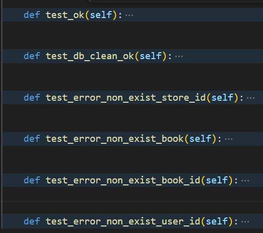


#### 亮点：

##### 事务处理：

事务处理保证了多个数据库操作要么全部执行，要么全部不执行，在数据库发生错误或者并发环境下项目的可靠性。

##### 索引：

执行语句`'select 1 from store where store_id=%s and user_id!=%s',`时，`store`中`primary key(store_id)`上的索引能够加速执行过程。


执行语句`'update book_info set stock_level = 0 where book_id=%s and store_id=%s'`时，`book_info `中`primary key(store_id,book_id)`上的索引能够加速执行过程。

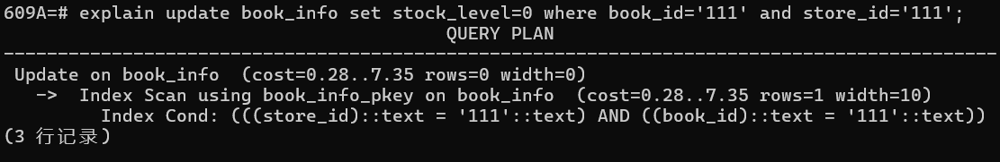


##### 测试完备：

对于原有的大部分test_ok代码，基本只对返回的状态码进行断言判断，这并不能保证功能的完全执行。因此对于部分测试，会验证数据库中数据变化是否符合预期。

例如：

PostgreSQL数据库表中数据更新正确

```python
def test_db_clean_ok(self):
    for b in self.books:
        code = self.seller.add_book(self.store_id, 0, b)
        assert code == 200

    for b in self.books:
        code = self.seller.empty_book(self.store_id, b.id)
        assert code == 200

    conn=self.dbconn.get_conn()
    cursor=conn.cursor()
    for b in self.books:
        cursor.execute(
        'select stock_level  from book_info where book_id=%s and store_id=%s',
        (
            b.id,
            self.store_id,
        ))
        num = cursor.fetchone()
        assert num[0] == 0
    cursor.close()
    conn.close()
```


### 2 买家取消订单

由买家主动发起


#### 后端逻辑：

若订单处于未支付状态，买家可以直接取消订单，书籍会加回店铺的库存中；若买家已支付订单但尚未发货，则会将支付的扣款返还买家的账户，书籍同样会加回店铺的库存中。在第一次大作业中，只有买家本人可以主动取消订单，现在为卖家也提供了取消订单接口。被取消的订单会从表`new_order`删除，被加入到表`old_order`。

状态码code：默认200，结束状态message：默认"ok"

```python
def cancel(self, user_id, order_id) -> (int, str):
    attempt=0
    while(True):
        try:
            with self.get_conn() as conn:
                cur=conn.cursor()
                unprossing_status = ["unpaid", "paid_but_not_delivered"]


                cur.execute("select buyer_id, status, total_price, store_id, order_detail from new_order WHERE order_id = %s", (order_id,))
                order = cur.fetchone()
                if not order:
                        cur.execute("select 1 from old_order WHERE order_id = %s", (order_id,))
                        order = cur.fetchone()
                        if not order:
                                return error.error_non_exist_order_id(order_id)
                        else:
                                return error.error_invalid_order_id(order_id)

                buyer_id=order[0]
                current_status = order[1]
                total_price = order[2]
                store_id = order[3]
                detail=order[4].split('\n')

                if current_status not in unprossing_status:
                        return error.error_invalid_order_id(order_id)

                if buyer_id != user_id:
                        return error.error_order_user_id(order_id, user_id)

                cur.execute("""
                        UPDATE new_order
                        SET status = 'canceled'
                        WHERE order_id = %s and status =%s
                """, (order_id,current_status))
                if cur.rowcount == 0: return error.error_invalid_order_id(order_id)

                for tmp in detail:
                        tmp1=tmp.split(' ')
                        if(len(tmp1)<2):
                                break
                        book_id,count=tmp1
                        cur.execute("""
                                UPDATE book_info 
                                SET stock_level = stock_level + %s, sales = sales - %s 
                                WHERE book_id = %s AND store_id = %s
                        """, (count, count, book_id, store_id))

                if current_status == "paid_but_not_delivered":
                        cur.execute(' UPDATE "user" SET balance = balance + %s WHERE user_id = %s', (total_price, user_id))

                cur.execute('insert into old_order select * from new_order where order_id=%s',(order_id,))
                cur.execute('delete from new_order where order_id=%s',(order_id,))

                conn.commit()
                return 200, "ok"


        except psycopg2.Error as e:
            if e.pgcode=="40001" and attempt<Retry_time:
                attempt+=1
                time.sleep(random.random()*attempt)
                continue
            else: return 528, "{}".format(str(e.pgerror))
        except BaseException as e: return 530, "{}".format(str(e))

```


#### 数据库操作：

代码路径：be/model/buyer.py

```python
cur.execute("select buyer_id, status, total_price, store_id, order_detail from new_order WHERE order_id = %s", (order_id,))
order = cur.fetchone()
if not order:
   	cur.execute("select 1 from old_order WHERE order_id = %s", (order_id,))
    order = cur.fetchone()
    if not order:
        return error.error_non_exist_order_id(order_id)
    else:
        return error.error_invalid_order_id(order_id)

```

该处作用为：通过对应`order_id`在表`new_order`找到唯一订单，取出表中记录的`buyer_id`,` status`, `total_price`, `store_id`，`order_detail`。如果在表`new_order`中未发现订单，说明该订单已失效或该`order_id`订单号不存在，无法取消订单。


```python
cur.execute("""
        UPDATE new_order
        SET status = 'canceled'
        WHERE order_id = %s and status in (%s,%s)
""", (order_id,unprossing_status[0],unprossing_status[1]))
if cur.rowcount == 0:
    return error.error_invalid_order_id(order_id)
```

该语句作用为：通过对应`order_id`在表`new_order`更新唯一订单，并且保证订单的状态是：未支付状态或买家已支付订单但尚未发货，更新后的订单状态为`canceled`。并且会检查是否更新成功，以防出现正确性错误。


```python
for tmp in detail:
    tmp1=tmp.split(' ')
    if(len(tmp1)<2):
            break
    book_id,count=tmp1
    cur.execute("""
            UPDATE book_info 
            SET stock_level = stock_level + %s, sales = sales - %s 
            WHERE book_id = %s AND store_id = %s
    """, (count, count, book_id, store_id))
```

该处作用为：表项`order_detail`记录了这笔订单买的书的`book_id`和购买数量。由于订单取消，应该将生成订单时扣除的相应书籍库存信息恢复，代表销量的属性`sales`也会被恢复。语句`UPDATE book_info SET stock_level = stock_level + %s, sales = sales - %s WHERE book_id = %s AND store_id = %s`会被用于更新书店库存。


```python
 if current_status == "paid_but_not_delivered":
    cur.execute(' UPDATE "user" SET balance = balance + %s WHERE user_id = %s', (total_price, user_id))

```

该语句作用为：若订单已支付，将生成订单时扣除的金额返还买家的账户。在`user`中，`balance`储存买家的账户资金；在`new_order`中，`total_price`储存该订单支付的总金额。


```python
cur.execute('insert into old_order select * from new_order where order_id=%s',(order_id,))
cur.execute('delete from new_order where order_id=%s',(order_id,))
```

该处作用为：在`new_order`中记录的都是进行中的订单，在`old_order`中记录的都是已经失效的订单。订单取消后应该将该订单从`new_order`中删除并加入到`old_order`中。


#### 代码测试：

代码路径：fe/test/test_cancel_order.py

对多种场景都有测试。包括：成功取消未支付订单、成功取消已支付未发货订单、检查买家账户金额是否正常退还、检查店铺相应书籍库存是否正常恢复。

错误检查测试包含：取消错误订单号订单、取消已取消订单、取消正在运输的订单、非购买用户无权取消订单。

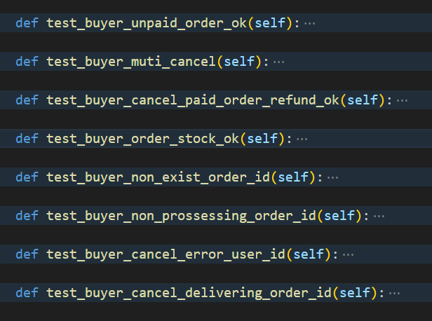


#### 亮点：

##### 事务处理：

事务处理保证了多个数据库操作要么全部执行，要么全部不执行，在数据库发生错误或者并发环境下项目的可靠性。

##### 索引：

执行``select buyer_id, status, total_price, store_id from new_order WHERE order_id = %s`语句时，`new_order`中`primary key(order_id)`上的索引能够加速执行过程。

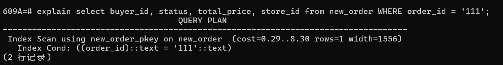

执行`select buyer_id, status, total_price, store_id from old_order WHERE order_id = %s`语句时，`old_order`中`primary key(order_id)`上的索引能够加速执行过程。


执行``UPDATE new_order SET status = 'canceled' WHERE order_id = %s and status in (%s,%s)`语句时，`new_order`中`primary key(order_id)`上的索引能够加速执行过程。

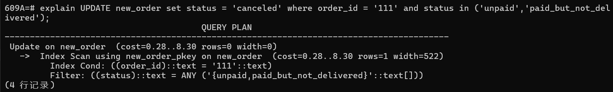

执行`UPDATE book_info  SET stock_level = stock_level + %s, sales = sales - %s WHERE book_id = %s AND store_id = %s`语句时，`book_info`中`primary key(store_id,book_id)`上的索引能够加速执行过程。`


执行`` insert into old_order select * from new_order where order_id=%s`语句时，`new_order`中` primary key(order_id)`上的索引能够加速执行过程。

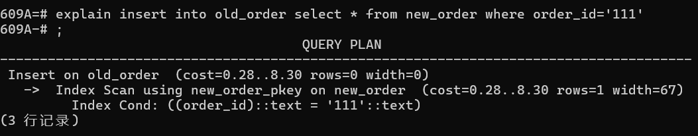

执行`` delete from new_order where order_id=%s`语句时，`new_order`中` primary key(order_id)`上的索引能够加速执行过程。

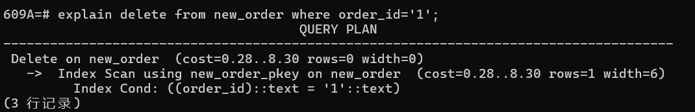


##### 测试完备：

对于原有的大部分test_ok代码，基本只对返回的状态码进行断言判断，这并不能保证功能的完全执行。因此对于部分测试，会验证数据库中数据变化是否符合预期。

例如：

1.检查取消订单后已支付的金额是否会返还给用户。

```python
def test_buyer_cancel_paid_order_refund_ok(self):
    ok, buy_book_id_list = self.gen_book.gen(non_exist_book_id=False,
                                             low_stock_level=False)
    assert ok
    conn=self.dbconn.get_conn()
    cursor=conn.cursor()
    cursor.execute("select balance from \"user\" where user_id=%s",[self.seller_id,])
    res=cursor.fetchone()
    assert(res!=None)
    origin_seller_balance = res[0]
    conn.close()

    code, order_id = self.buyer.new_order(self.store_id, buy_book_id_list)
    origin_buyer_balance = 1000000000
    code = self.buyer.add_funds(origin_buyer_balance)
    assert code==200
    code = self.buyer.payment(order_id)
    assert code == 200
    code = self.buyer.cancel(order_id)
    assert code == 200

    conn=self.dbconn.get_conn()
    cursor=conn.cursor()
    cursor.execute("select balance from \"user\" where user_id=%s",[self.buyer_id,])
    res=cursor.fetchone()
    assert(res is not None)
    new_buyer_balance = res[0]
    conn.close()

    check_refund_buyer = (origin_buyer_balance == new_buyer_balance)
    assert check_refund_buyer

    conn=self.dbconn.get_conn()
    cursor=conn.cursor()
    cursor.execute("select balance from \"user\" where user_id=%s",[self.seller_id,])
    res=cursor.fetchone()
    assert(res is not None)
    new_seller_balance = res[0]
    conn.close()

    check_refund_seller = (origin_seller_balance == new_seller_balance)
    assert check_refund_seller
```

2.检查取消订单后书籍库存是否会恢复。

```python
def test_buyer_order_stock_ok(self):
    ok, buy_book_id_list = self.gen_book.gen(non_exist_book_id=False,
                                             low_stock_level=False)
    pre_book_stock = []
    conn=self.dbconn.get_conn()
    cursor=conn.cursor()
    cursor.execute("select book_id,stock_level from book_info where store_id=%s",[self.store_id,])
    res=cursor.fetchall()
    cursor.close()
    conn.close()

    for info in buy_book_id_list:
        for book_id,stock_level in res:
            if(book_id==info[0]):
                pre_book_stock.append((book_id,stock_level))
                break

    assert ok
    code, order_id = self.buyer.new_order(self.store_id, buy_book_id_list)
    assert code == 200
    code = self.buyer.cancel(order_id)
    assert code == 200
    conn=self.dbconn.get_conn()
    cursor=conn.cursor()
    cursor.execute("select book_id,stock_level from book_info where store_id=%s",[self.store_id,])
    res=cursor.fetchall()
    cursor.close()
    conn.close()
    for book_info in pre_book_stock:
        for book_id,stock_level in res:
            if book_id == book_info[0]:
                check_stock = (book_info[1] == stock_level)
                assert check_stock
                break
    assert code == 200
```


### 3 卖家取消订单（new）

由卖家主动发起


#### 前端接口：

代码路径：fe\access\seller.py

```python
def cancel(self, store_id: str, order_id: str) -> int:
    json = {
        "store_id": store_id,
        "order_id": order_id,
    }
    url = urljoin(self.url_prefix, "cancel")
    headers = {"token": self.token}
    r = requests.post(url, headers=headers, json=json)
    return r.status_code
```

前端须填写的参数包括用户id：`store_id`和订单号：`book_id`。


#### 后端接口：

代码路径：be/view/seller.py

```python
@bp_seller.route("/cancel", methods=["POST"])
def cancel():
    store_id = request.json.get("store_id")
    order_id = request.json.get("order_id")
    b = seller.Seller()
    code, message = b.cancel(store_id, order_id)
    return jsonify({"message": message}), code
```


#### 后端逻辑：

若订单处于未支付状态，卖家可以直接取消订单，书籍会加回店铺的库存中；若买家已支付订单但尚未发货，则会将支付的扣款返还买家的账户，书籍同样会加回店铺的库存中。在第一次大作业中，只有买家本人可以主动取消订单，现在为卖家也提供了取消订单接口。被取消的订单会从表`new_order`删除，被加入到表`old_order`。

状态码code：默认200，结束状态message：默认"ok"

```python
def cancel(self, store_id, order_id) -> (int, str):
    attempt=0
    while(True):
        try:
            with self.get_conn() as conn:
                cur=conn.cursor()
                unprossing_status = ["unpaid", "paid_but_not_delivered"]

                cur.execute("select buyer_id, status, total_price, store_id, order_detail from new_order WHERE order_id = %s", (order_id,))
                order = cur.fetchone()

                if not order:
                    cur.execute("select 1 from old_order WHERE order_id = %s", (order_id,))
                    order = cur.fetchone()
                    if not order:
                        return error.error_non_exist_order_id(order_id)
                    else:
                        return error.error_invalid_order_id(order_id)

                buyer_id=order[0]
                current_status = order[1]
                total_price = order[2]
                store_id_ = order[3]
                detail=order[4].split('\n')

                if current_status not in unprossing_status:
                    return error.error_invalid_order_id(order_id)

                if store_id != store_id_:
                    return error.unmatched_order_store(order_id, store_id)

                cur.execute("""
                    UPDATE new_order
                    SET status = 'canceled'
                    WHERE order_id = %s and status =%s
                """, (order_id,current_status))
                if cur.rowcount == 0:
                        return error.error_invalid_order_id(order_id)

                for tmp in detail:
                        tmp1=tmp.split(' ')
                        if(len(tmp1)<2):
                                break
                        book_id,count=tmp1
                        cur.execute("""
                                UPDATE book_info 
                                SET stock_level = stock_level + %s, sales = sales - %s 
                                WHERE book_id = %s AND store_id = %s
                        """, (count, count, book_id, store_id))

                if current_status == "paid_but_not_delivered":
                    cur.execute(' UPDATE "user" SET balance = balance + %s WHERE user_id = %s', (total_price, buyer_id))

                cur.execute('insert into old_order select * from new_order where order_id=%s',(order_id,))
                cur.execute('delete from new_order where order_id=%s',(order_id,))

                conn.commit()
                return 200, "ok"

        except psycopg2.Error as e:
            if e.pgcode=="40001" and attempt<Retry_time:
                attempt+=1
                time.sleep(random.random()*attempt)
                continue
            else: return 528, "{}".format(str(e.pgerror))
        except BaseException as e: return 530, "{}".format(str(e))
```


#### 数据库操作：

代码路径：be/model/seller.py

```python
cur.execute("select buyer_id, status, total_price, store_id, order_detail from new_order WHERE order_id = %s", (order_id,))
order = cur.fetchone()

if not order:
    cur.execute("select 1 from old_order WHERE order_id = %s", (order_id,))
    order = cur.fetchone()
    if not order:
        return error.error_non_exist_order_id(order_id)
    else:
        return error.error_invalid_order_id(order_id)
```

该处作用为：通过对应`order_id`在表`new_order`找到唯一订单，取出表中记录的`buyer_id`,` status`, `total_price`, `store_id`，`order_detail`。如果在表`new_order`中未发现订单，说明该订单已失效或该`order_id`订单号不存在，无法取消订单。


```python
cur.execute("""
        UPDATE new_order
        SET status = 'canceled'
        WHERE order_id = %s and status in (%s,%s)
""", (order_id,unprossing_status[0],unprossing_status[1]))
if cur.rowcount == 0:
    return error.error_invalid_order_id(order_id)
```

该语句作用为：通过对应`order_id`在表`new_order`更新唯一订单，并且保证订单的状态是：未支付状态或买家已支付订单但尚未发货，更新后的订单状态为`canceled`。并且会检查是否更新成功，以防出现正确性错误。


```python
for tmp in detail:
    tmp1=tmp.split(' ')
    if(len(tmp1)<2):
            break
    book_id,count=tmp1
    cur.execute("""
            UPDATE book_info 
            SET stock_level = stock_level + %s, sales = sales - %s 
            WHERE book_id = %s AND store_id = %s
    """, (count, count, book_id, store_id))
```

该处作用为：表项`order_detail`记录了这笔订单买的书的`book_id`和购买数量。由于订单取消，应该将生成订单时扣除的相应书籍库存信息恢复，代表销量的属性`sales`也会被恢复。语句`UPDATE book_info SET stock_level = stock_level + %s, sales = sales - %s WHERE book_id = %s AND store_id = %s`会被用于更新书店库存。


```python
 if current_status == "paid_but_not_delivered":
    cur.execute(' UPDATE "user" SET balance = balance + %s WHERE user_id = %s', (total_price, user_id))
```

该语句作用为：若订单已支付，将生成订单时扣除的金额返还买家的账户。在`user`中，`balance`储存买家的账户资金；在`new_order`中，`total_price`储存该订单支付的总金额。


```python
cur.execute('insert into old_order select * from new_order where order_id=%s',(order_id,))
cur.execute('delete from new_order where order_id=%s',(order_id,))
```

该处作用为：在`new_order`中记录的都是进行中的订单，在`old_order`中记录的都是已经失效的订单。订单取消后应该将该订单从`new_order`中删除并加入到`old_order`中。


#### 代码测试：

代码路径：fe/test/test_cancel_order.py

对多种场景都有测试。包括：成功取消未支付订单、成功取消已支付未发货订单、检查买家账户金额是否正常退还、检查店铺相应书籍库存是否正常恢复。

错误检查测试包含：取消错误订单号订单、取消已取消订单、取消正在运输的订单、非卖家无权取消订单。

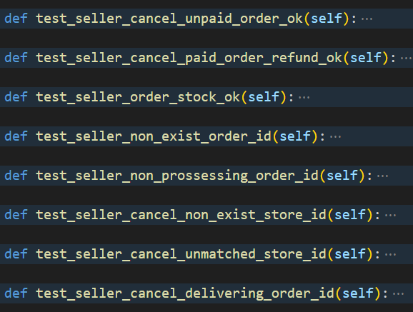


#### 亮点：

##### 事务处理：

事务处理保证了多个数据库操作要么全部执行，要么全部不执行，在数据库发生错误或者并发环境下项目的可靠性。

##### 索引：

执行``select buyer_id, status, total_price, store_id from new_order WHERE order_id = %s`语句时，`new_order`中`primary key(order_id)`上的索引能够加速执行过程。


执行`select buyer_id, status, total_price, store_id from old_order WHERE order_id = %s`语句时，`old_order`中`primary key(order_id)`上的索引能够加速执行过程。


执行``UPDATE new_order SET status = 'canceled' WHERE order_id = %s and status in (%s,%s)`语句时，`new_order`中`primary key(order_id)`上的索引能够加速执行过程。


执行`UPDATE book_info  SET stock_level = stock_level + %s, sales = sales - %s WHERE book_id = %s AND store_id = %s`语句时，`book_info`中`primary key(store_id,book_id)`上的索引能够加速执行过程。`


执行`` insert into old_order select * from new_order where order_id=%s`语句时，`new_order`中` primary key(order_id)`上的索引能够加速执行过程。


执行`` delete from new_order where order_id=%s`语句时，`new_order`中` primary key(order_id)`上的索引能够加速执行过程。


##### 测试完备：

对于原有的大部分test_ok代码，基本只对返回的状态码进行断言判断，这并不能保证功能的完全执行。因此对于部分测试，会验证数据库中数据变化是否符合预期。

例如：

1.检查取消订单后已支付的金额是否会返还给用户。

```python
def test_seller_cancel_paid_order_refund_ok(self):
    ok, buy_book_id_list = self.gen_book.gen(non_exist_book_id=False,
                                             low_stock_level=False)
    assert ok
    conn=self.dbconn.get_conn()
    cursor=conn.cursor()
    cursor.execute("select balance from \"user\" where user_id=%s",[self.seller_id,])
    res=cursor.fetchone()
    assert(res!=None)
    origin_seller_balance = res[0]
    conn.close()

    code, order_id = self.buyer.new_order(self.store_id, buy_book_id_list)
    origin_buyer_balance = 1000000000
    code = self.buyer.add_funds(origin_buyer_balance)
    assert code==200
    code = self.buyer.payment(order_id)
    assert code == 200
    code = self.seller.cancel(self.store_id, order_id)
    assert code == 200

    conn=self.dbconn.get_conn()
    cursor=conn.cursor()
    cursor.execute("select balance from \"user\" where user_id=%s",[self.buyer_id,])
    res=cursor.fetchone()
    assert(res is not None)
    new_buyer_balance = res[0]
    conn.close()

    check_refund_buyer = (origin_buyer_balance == new_buyer_balance)
    assert check_refund_buyer

    conn=self.dbconn.get_conn()
    cursor=conn.cursor()
    cursor.execute("select balance from \"user\" where user_id=%s",[self.seller_id,])
    res=cursor.fetchone()
    assert(res is not None)
    new_seller_balance = res[0]
    conn.close()

    check_refund_seller = (origin_seller_balance == new_seller_balance)
    assert check_refund_seller
```

2.检查取消订单后书籍库存是否会恢复。

```python
def test_seller_order_stock_ok(self):
    ok, buy_book_id_list = self.gen_book.gen(non_exist_book_id=False,
                                             low_stock_level=False)
    pre_book_stock = []
    conn=self.dbconn.get_conn()
    cursor=conn.cursor()
    cursor.execute("select book_id,stock_level from book_info where store_id=%s",[self.store_id,])
    res=cursor.fetchall()
    cursor.close()
    conn.close()

    for info in buy_book_id_list:
        for book_id,stock_level in res:
            if(book_id==info[0]):
                pre_book_stock.append((book_id,stock_level))
                break

    assert ok
    code, order_id = self.buyer.new_order(self.store_id, buy_book_id_list)
    assert code == 200
    code = self.seller.cancel(self.store_id, order_id)
    assert code == 200
    conn=self.dbconn.get_conn()
    cursor=conn.cursor()
    cursor.execute("select book_id,stock_level from book_info where store_id=%s",[self.store_id,])
    res=cursor.fetchall()
    cursor.close()
    conn.close()
    for book_info in pre_book_stock:
        for book_id,stock_level in res:
            if book_id == book_info[0]:
                check_stock = (book_info[1] == stock_level)
                assert check_stock
                break
    assert code == 200
```


### 4 卖家发货

由卖家主动发起


#### 后端逻辑：

若已支付订单但尚未发货，则会将订单状态更新为`delivered_but_not_received`。

状态码code：默认200，结束状态message：默认"ok"

```python
def send_books(self, store_id: str, order_id: str) -> (int, str):
    attempt=0
    while(True):
        try:
            with self.get_conn() as conn:
                cur=conn.cursor()

                cur.execute("SELECT 1 FROM store WHERE store_id = %s", (store_id,))
                if not cur.fetchone():
                    return error.error_non_exist_store_id(store_id)

                cur.execute("""
                    select status,store_id from new_order
                    WHERE order_id = %s
                """, (order_id,))
                order = cur.fetchone()
                if not order:
                    return error.error_invalid_order_id(order_id)

                if order[0] != "paid_but_not_delivered":
                    return error.error_invalid_order_id(order_id)

                if order[1] != store_id:
                    return error.unmatched_order_store(order_id, store_id)

                cur.execute("""
                    UPDATE new_order
                    SET status = 'delivered_but_not_received'
                    WHERE order_id = %s and status='paid_but_not_delivered'
                """, (order_id,))
                conn.commit()
                return 200, "ok"

        except psycopg2.Error as e:
            if e.pgcode=="40001" and attempt<Retry_time:
                attempt+=1
                time.sleep(random.random()*attempt)
                continue
            else:
                return 528, "{}".format(str(e.pgerror+" "+e.pgcode)), ""
        except BaseException as e: return 530, "{}".format(str(e))
```


#### 数据库操作：

代码路径：be/model/seller.py

```python
cur.execute("SELECT 1 FROM store WHERE store_id = %s", (store_id,))
if not cur.fetchone():
    return error.error_non_exist_store_id(store_id)
```

该语句作用为：以`store_id`为条件搜索是否存在的用户，以防出现正确性错误。


```python
cur.execute("""
    select status,store_id from new_order
    WHERE order_id = %s
""", (order_id,))
order = cur.fetchone()
if not order:
    return error.error_invalid_order_id(order_id)
if order[0] != "paid_but_not_delivered":
    return error.error_invalid_order_id(order_id)
if order[1] != store_id:
    return error.unmatched_order_store(order_id, store_id)

```

该语句作用为：以`order_id`为条件在表`new_order`中搜索匹配的订单，返回`status`，`store_id`。正确性检查：订单是否存在、订单状态是否是支付未发送、商店与提交发货的卖家是否匹配。


```python
cur.execute("""
    UPDATE new_order
    SET status = 'delivered_but_not_received'
    WHERE order_id = %s and status='paid_but_not_delivered'
""", (order_id,))
```

该语句作用为：以`order_id`为条件更新`new_order`中的相应订单的状态，将其从`'paid_but_not_delivered'`已支付订单但尚未发货状态更新为`delivered_but_not_received`已发货未收货。


#### 代码测试：

代码路径：fe/test/test_send_order.py

测试功能正确运行：成功发货（`test_ok`）。

对多种错误场景都有测试，错误检查测试包含：对未支付订单执行发货、对不存在的订单号执行发货、对不存在的`store_id`执行发货、对不匹配的`store_id`和`order_id`执行发货。


#### 亮点：

##### 索引：

执行`SELECT 1 FROM store WHERE store_id = %s`语句时，`store`中`primary key(store_id)`上的索引能够加速执行过程。

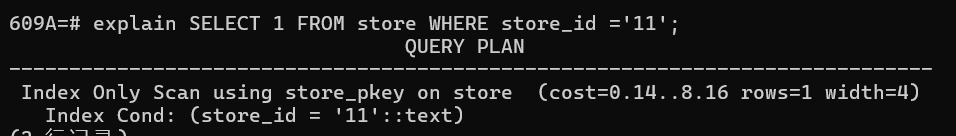

执行``select status,store_id from new_order WHERE order_id = %s`语句时，`new_order`中`primary key(order_id)`上的索引能够加速执行过程。

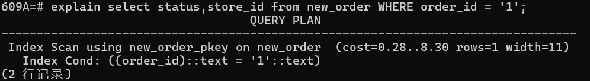

执行``UPDATE new_order SET status = 'delivered_but_not_received' WHERE order_id = %s and status = 'paid_but_not_delivered'`语句时，`new_order`中`primary key(order_id)`上的索引能够加速执行过程。

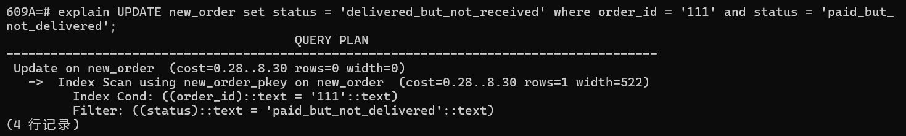


### 5 买家收货

由买家主动发起


#### 后端逻辑：

若订单已发货，则会将订单状态更新为`received`。

状态码code：默认200，结束状态message：默认"ok"

```python
def receive_books(self, user_id, order_id) -> (int, str):
    attempt=0
    while(True):
        try:
            with self.get_conn() as conn:
                cur=conn.cursor()
                cur.execute('SELECT 1 FROM "user" WHERE user_id = %s', (user_id,))
                if not cur.fetchone():
                    return error.error_non_exist_user_id(user_id)

                cur.execute("select buyer_id, status, total_price, store_id from new_order WHERE order_id = %s", (order_id,))
                order = cur.fetchone()
                if not order:
                    return error.error_invalid_order_id(order_id)

                if order[1] != "delivered_but_not_received":
                    return error.error_invalid_order_id(order_id)

                if order[0] != user_id:
                    return error.unmatched_order_user(order_id, user_id)

                total_price = order[2]

                store_id=order[3]
                cur.execute("select user_id from store where store_id=%s",[store_id,])
                res=cur.fetchone()
                if(res is None):
                    return error.error_non_exist_store_id(store_id)
                seller_id = res[0]
                cur.execute("""
                    UPDATE new_order
                    SET status = 'received'
                    WHERE order_id = %s and status= 'delivered_but_not_received'
                """, (order_id,))
                if cur.rowcount == 0:  #受影响行数
                        return error.error_invalid_order_id(order_id)
                cur.execute('UPDATE "user" SET balance = balance + %s WHERE user_id = %s', (total_price, seller_id))

                cur.execute('insert into old_order select * from new_order where order_id=%s',(order_id,))
                cur.execute('delete from new_order where order_id=%s',(order_id,))

                conn.commit()
                return 200, "ok"

        except psycopg2.Error as e:
            if e.pgcode=="40001" and attempt<Retry_time:
                attempt+=1
                time.sleep(random.random()*attempt)
                continue
            else: return 528, "{}".format(str(e.pgerror+" "+e.pgcode)), ""
        except BaseException as e:  return 530, "{}".format(str(e))

```


#### 数据库操作：

代码路径：be/model/buyer.py

```python
cur.execute('SELECT 1 FROM "user" WHERE user_id = %s', (user_id,))
if not cur.fetchone():
    return error.error_non_exist_user_id(user_id)
```

该语句作用为：以`user_id`为条件搜索是否存在的用户，以防出现正确性错误。


```python
cur.execute("select buyer_id, status, total_price, store_id from new_order WHERE order_id = %s", (order_id,))
order = cur.fetchone()
if not order:
    return error.error_invalid_order_id(order_id)
                if order[1] != "delivered_but_not_received":
    return error.error_invalid_order_id(order_id)

if order[0] != user_id:
    return error.unmatched_order_user(order_id, user_id)
```

该语句作用为：通过对应`order_id`找到对应订单，用于检查该订单是否存在、买家信息是否与传入参数一致、订单状态是否为`delivered_but_not_received`发货但未收货。


```python
cur.execute("select user_id from store where store_id=%s",[store_id,])
res=cur.fetchone()
if(res is None):
    return error.error_non_exist_store_id(store_id)

```

该语句作用为：通过对应`store_id`找到商店信息，检查商店是否存在。


```python
cur.execute("""
    UPDATE new_order
    SET status = 'received'
    WHERE order_id = %s and status= 'delivered_but_not_received'
""", (order_id,))
if cur.rowcount == 0:  #受影响行数
        return error.error_invalid_order_id(order_id)

```

该语句作用为：通过对应`order_id`找到唯一订单，将该订单状态`status`从`delivered_but_not_received`更新为`received`.


```python
cur.execute('UPDATE "user" SET balance = balance + %s WHERE user_id = %s', (total_price, seller_id))
```

该语句作用为：通过对应`seller_id`找到唯一卖家账户，将该订单状态的销售总金额加入该卖家用户的账户余额`balance`。


```python
cur.execute('insert into old_order select * from new_order where order_id=%s',(order_id,))
cur.execute('delete from new_order where order_id=%s',(order_id,))

```

该语句作用为：在`new_order`中记录的都是进行中的订单，在`old_order`中记录的都是已经结束或者失效的订单。订单收货后该订单已结束，应该将该订单从`new_order`中删除并加入到`old_order`中。


#### 代码测试：

代码路径：fe/test/test_receive_order.py

测试功能正确运行：成功收货（`test_ok`），货款成功加入卖家账户（`test_seller_fund_ok`）。

对多种错误场景都有测试，错误检查测试包含：对未发货订单执行收货、对不存在的订单号`order_id`执行收货、对不存在的`user_id`执行收货、对不匹配的`user_id`和`order_id`执行收货。

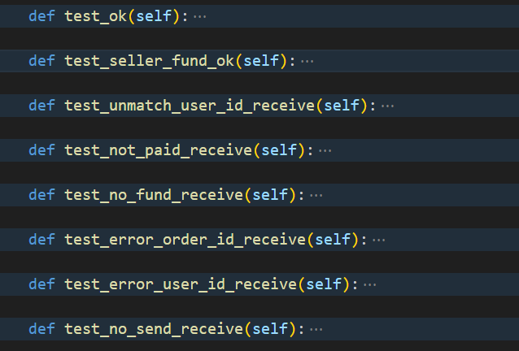


#### 亮点：

##### 索引：

执行`SELECT user_id FROM "user" WHERE user_id = %s`语句时，`user`中`primary key(user_id)`上的索引能够加速执行过程。

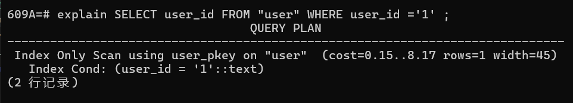

执行`select buyer_id, status, total_price, store_id from new_order WHERE order_id = %s`语句时，`new_order`中`primary key(order_id)`上的索引能够加速执行过程。

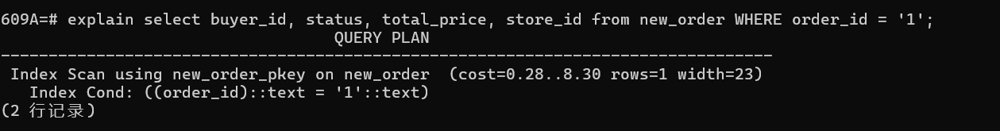

执行`select user_id from store where store_id=%s`语句时，`store`中`primary key(store_id)`上的索引能够加速执行过程。

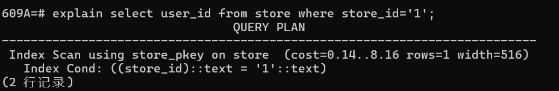

执行`` UPDATE new_order SET status = 'received' WHERE order_id = %s and status= 'delivered_but_not_received''`语句时，`new_order`中`primary key(order_id)`上的索引能够加速执行过程。


执行`'UPDATE "user" SET balance = balance + %s WHERE user_id = %s'`语句时，`user`中`primary key(user_id)`上的索引能够加速执行过程

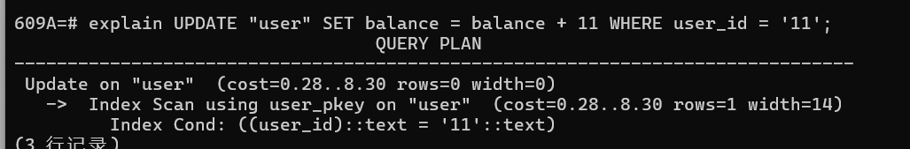

执行`` insert into old_order select * from new_order where order_id=%s`语句时，`new_order`中` primary key(order_id)`上的索引能够加速执行过程。


执行`` delete from new_order where order_id=%s`语句时，`new_order`中` primary key(order_id)`上的索引能够加速执行过程。


##### 测试完备：

对于原有的大部分test_ok代码，基本只对返回的状态码进行断言判断，这并不能保证功能的完全执行。因此对于部分测试，会验证数据库中数据变化是否符合预期。

例如：

检查货款是否被加入卖家账户余额：

```python
def test_seller_fund_ok(self):
    ok, buy_book_id_list = self.gen_book.gen(non_exist_book_id=False,
                                             low_stock_level=False)
    assert ok
    conn=self.dbconn.get_conn()
    cursor=conn.cursor()
    cursor.execute("select balance from \"user\" where user_id=%s",[self.seller_id,])
    res=cursor.fetchone()
    assert(res!=None)
    origin_seller_balance = res[0]
    conn.close()

    code, order_id = self.buyer.new_order(self.store_id, buy_book_id_list)
    origin_buyer_balance = 1000000000
    code = self.buyer.add_funds(origin_buyer_balance)
    assert code==200

    conn=self.dbconn.get_conn()
    cursor=conn.cursor()
    cursor.execute("select total_price from new_order where order_id=%s",[order_id,])
    res=cursor.fetchone()
    assert(res is not None)
    total_price = res[0]
    conn.close()

    code = self.buyer.payment(order_id)
    assert code == 200
    code = self.seller.send_books(self.store_id, order_id)
    assert code == 200
    code = self.buyer.receive_books(order_id)
    assert code == 200


    conn=self.dbconn.get_conn()
    cursor=conn.cursor()
    cursor.execute("select balance from \"user\" where user_id=%s",[self.seller_id,])
    res=cursor.fetchone()
    assert(res is not None)
    new_seller_balance = res[0]
    conn.close()

    check_refund_seller = (origin_seller_balance+total_price == new_seller_balance)
    assert check_refund_seller
```


### 6 买家搜索订单

买家搜索所有自己购买的订单


#### 后端逻辑：

找到所有传入`user_id`对应用户购买的订单号，加入`result`作为最后返回结果。

状态码code：默认200，结束状态message：默认"ok"，订单列表result：默认为空列表

```python
def search_order(self, user_id):
    attempt=0
    while(True):
        try:
            with self.get_conn() as conn:
                cur=conn.cursor()
                cur.execute('SELECT 1 FROM "user" WHERE user_id = %s', (user_id,))
                if not cur.fetchone():
                    return error.error_non_exist_user_id(user_id)+ ("",)

                cur.execute("SELECT order_id FROM new_order WHERE buyer_id = %s", (user_id,))
                orders = cur.fetchall()
                result = [order[0] for order in orders]

                #也在已完成的订单中查找
                cur.execute("SELECT order_id FROM old_order WHERE buyer_id = %s", (user_id,))
                orders = cur.fetchall()
                for od in orders:
                    result.append(od[0])
                return 200, "ok", result

        except psycopg2.Error as e:
            if e.pgcode=="40001" and attempt<Retry_time:
                attempt+=1
                time.sleep(random.random()*attempt)
                continue
            else: return 528, "{}".format(str(e.pgerror+" "+e.pgcode)), ""
        except BaseException as e:  return 530, "{}".format(str(e)), ""
```


#### 数据库操作：

代码路径：be/model/buyer.py

```python
cur.execute('SELECT 1 FROM "user" WHERE user_id = %s', (user_id,))
if not cur.fetchone():
    return error.error_non_exist_user_id(user_id)+ ("",)
```

该语句作用为：通过检查`user`中的对应`user_id`确保用户存在。


```python
cur.execute("SELECT order_id FROM new_order WHERE buyer_id = %s", (user_id,))
orders = cur.fetchall()
result = [order[0] for order in orders]
```

该语句作用为：在表`new_order`中找到正在进行中的符合条件的订单号，加入`result`作为最后返回结果，代表查找所有该买家`buyer_id`正在进行中的订单。这里只返回订单号，后续有函数`search_order_detail`可以返回订单的购买书单、总价格和订单状态，降低模块耦合度，增加可扩展性。


```python
cur.execute("SELECT order_id FROM old_order WHERE buyer_id = %s", (user_id,))
orders = cur.fetchall()
for od in orders:
    result.append(od[0])
```

该语句作用为：在表`old_order`中找到所有已经结束或者被取消的符合条件的订单号，加入`result`作为最后返回结果，代表查找所有该买家`buyer_id`已经结束或被取消的订单。这里只返回订单号，后续有函数`search_order_detail`可以返回订单的购买书单、总价格和订单状态，降低模块耦合度，增加可扩展性。


#### 代码测试：

代码路径：fe/test/test_search_order.py

测试功能正确运行：成功搜索、成功搜索无购买记录用户的历史订单（无报错）、成功搜索单条历史订单、成功搜索多条历史订单。

错误检查为：搜索不存在的用户的订单。

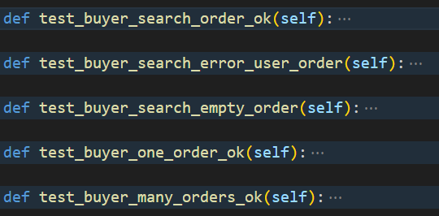


#### 亮点：

##### 索引：

执行`SELECT user_id FROM "user" WHERE user_id = %s`语句时，`user`中`primary key(user_id)`上的索引能够加速执行过程。


执行`SELECT order_id FROM new_order WHERE buyer_id =%s`语句时，`new_order`中`new_order_buyer_id_idx ：hash(buyer_id)`上的索引能够加速执行过程。

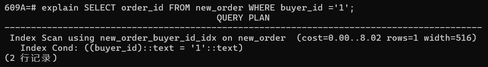

执行`SELECT order_id FROM old_order WHERE buyer_id =%s`语句时，`old_order`中`old_order_buyer_id_idx ：hash(buyer_id)`上的索引能够加速执行过程。

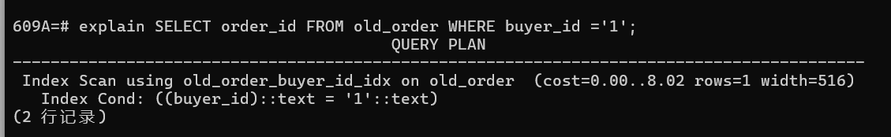


##### 测试完备：

对于原有的大部分test_ok代码，基本只对返回的状态码进行断言判断，这并不能保证功能的完全执行。因此对于部分测试，会验证数据库中数据变化是否符合预期。

例如：`test_buyer_many_orders_ok`会测试返回的订单号是否是测试中随机产生的订单。

注：对函数`self.gen_book.gen`有所修改，`high_stock_level`保证店铺有充足的库存。

```python
def test_buyer_many_orders_ok(self):
    order_list=list()
    ok, buy_book_id_list = self.gen_book.gen(
    non_exist_book_id=False, low_stock_level=False, high_stock_level=True
    )
    assert ok
    for i in range(0,5):
        code, order_id = self.buyer.new_order(self.store_id, buy_book_id_list)
        assert code == 200
        order_list.append(order_id)
    code, received_list= self.buyer.search_order()
    assert order_list == received_list
```


### 7 卖家搜索订单

卖家搜索自己某个店铺的所有订单


#### 后端逻辑：

找到传入`seller_id`对应卖家的一个对应`store_id`的店铺的所有订单号，加入`result`作为最后返回结果。

状态码code：默认200，结束状态message：默认"ok"，订单列表result：默认为空列表

```python
def search_order(self, seller_id, store_id):
    try:
        with self.get_conn() as conn:
            cur=conn.cursor()                
            if not self.user_id_exist(seller_id, cur):
                    return error.error_non_exist_user_id(seller_id)+ ("",)
            if not self.store_id_exist(store_id, cur):
                return error.error_non_exist_store_id(store_id)+ ("",)

            cur.execute('SELECT 1 FROM store WHERE store_id = %s AND user_id = %s', (store_id, seller_id))
            if not cur.fetchone():
                return error.unmatched_seller_store(seller_id, store_id)+ ("",)


            cur.execute("SELECT order_id FROM new_order WHERE store_id = %s", (store_id,))
            orders = cur.fetchall()
            result = [order[0] for order in orders]

            #也在已完成的订单中查找
            cur.execute("SELECT order_id FROM old_order WHERE store_id = %s", (store_id,))
            orders = cur.fetchall()
            for od in orders:
                result.append(od[0])
            conn.commit()
            return 200, "ok", result

    except psycopg2.Error as e:return 528, "{}".format(str(e)), ""
    except BaseException as e:return 530, "{}".format(str(e)), ""
```


#### 数据库操作：

代码路径：be/model/seller.py

```python
if not self.user_id_exist(seller_id, cur):
    return error.error_non_exist_user_id(seller_id)+ ("",)
```

该语句作用为：以`user_id`为条件搜索是否存在的用户，以防出现正确性错误。


```python
if not self.store_id_exist(store_id, cur):
    return error.error_non_exist_store_id(store_id)+ ("",)
```

该语句作用为：以`store_id`为条件搜索是否存在正确的商店，以防出现正确性错误。


```python
cur.execute('SELECT 1 FROM store WHERE store_id = %s AND user_id = %s', (store_id, seller_id))
if not cur.fetchone():
    return error.unmatched_seller_store(seller_id, store_id)+ ("",)
```

该语句作用为：该语句作用为：以`store_id`和`seller_id`为条件搜索用户提供的`store_id`和`seller_id`是否匹配，以防恶意用户窃取信息。


```python
cur.execute("SELECT order_id FROM new_order WHERE store_id = %s", (store_id,))
orders = cur.fetchall()
result = [order[0] for order in orders]
```

该语句作用为：在表`new_order`中找到正在进行中的符合条件的订单号，加入`result`作为最后返回结果，代表查找所有该店铺`store_id`正在进行中的订单。这里只返回订单号，后续有函数`search_order_detail`可以返回订单的购买书单、总价格和订单状态，降低模块耦合度，增加可扩展性。


```python
cur.execute("SELECT order_id FROM old_order WHERE store_id = %s", (store_id,))
orders = cur.fetchall()
for od in orders:
    result.append(od[0])
```

该语句作用为：在表`old_order`中找到所有已经结束或者被取消的符合条件的订单号，加入`result`作为最后返回结果，代表查找所有该店铺`store_id`已经结束或被取消的订单。这里只返回订单号，后续有函数`search_order_detail`可以返回订单的购买书单、总价格和订单状态，降低模块耦合度，增加可扩展性。


#### 代码测试：

代码路径：fe/test/test_search_order.py

测试功能正确运行：成功搜索、成功搜索无售卖记录商户的历史订单、成功搜索单条历史订单、成功搜索多条历史订单。

错误检查为：搜索不存在的商店的订单、搜索不存在的用户的商店订单、搜索拥有者id与商店id不匹配的商店订单。

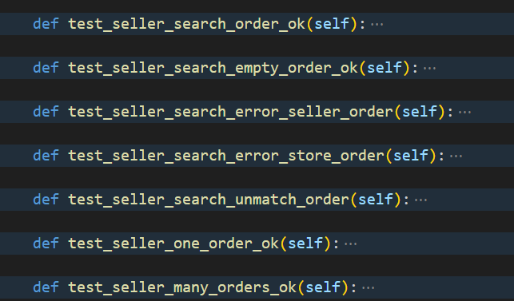


#### 亮点：

##### 索引：

执行`SELECT 1 FROM store WHERE store_id = %s AND user_id = %s`语句时，`store`中`hash(user_id)`上的索引能够加速执行过程。

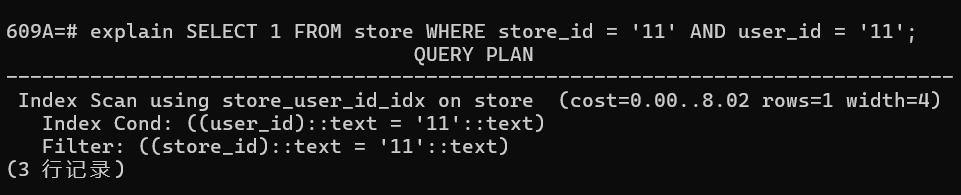

执行`SELECT order_id FROM new_order WHERE store_id = %s`语句时，`new_order`中`hash(store_id)`上的索引能够加速执行过程。

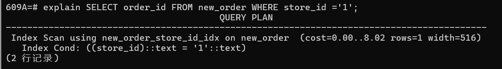

执行`SELECT order_id FROM old_order WHERE store_id = %s`语句时，`old_order`中`hash(store_id)`上的索引能够加速执行过程。

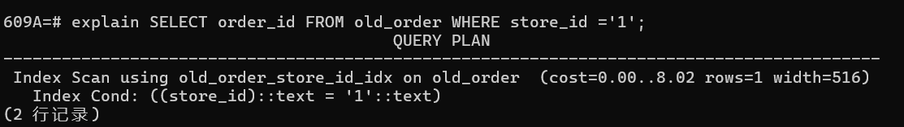


##### 测试完备：

对于原有的大部分test_ok代码，基本只对返回的状态码进行断言判断，这并不能保证功能的完全执行。因此对于部分测试，会验证数据库中数据变化是否符合预期。

例如：`test_seller_many_orders_ok`会测试返回的订单号是否是测试中随机产生的订单。

```python
def test_seller_many_orders_ok(self):
    order_list=list()
    ok, buy_book_id_list = self.gen_book.gen(
    non_exist_book_id=False, low_stock_level=False, high_stock_level=True
    )
    assert ok
    for i in range(0,5):
        code, order_id = self.buyer.new_order(self.store_id, buy_book_id_list)
        assert code == 200
        order_list.append(order_id)
    code, received_list= self.seller.search_order(self.store_id)
    assert order_list == received_list
```


### 8 搜索订单详情信息

搜索某个订单的详细信息。


#### 后端逻辑：

通过`new_order`表找到传入`order_id`对应的订单号，将订单的详情信息加入`order_detail_list`作为最后返回结果，此处只返回购买书籍列表、书籍总价、订单状态（`unpaid`、`received`等），可根据需求自由更改。

状态码code：默认200，结束状态message：默认"ok"，详情列表order_detail_list：默认为空列表

```python
def search_order_detail(self, order_id):
    try:
        with self.get_conn() as conn:
            cur=conn.cursor()
            res=0
            cur.execute("SELECT total_price, status FROM new_order WHERE order_id = %s", (order_id,))
            order = cur.fetchone()
            if order is None:
                cur.execute("SELECT total_price, status FROM old_order WHERE order_id = %s", (order_id,))
                order = cur.fetchone()
                if order is None:
                    ret = error.error_non_exist_order_id(order_id)
                    return ret[0], ret[1], ""
                else:
                    cur.execute("select order_detail from old_order WHERE order_id = %s", (order_id,))
                    res = cur.fetchone()
            else:
                cur.execute("select order_detail from new_order WHERE order_id = %s", (order_id,))
                res = cur.fetchone()

            detail=res[0].split('\n')
            detail_dict=dict()
            for tmp in detail:
                tmp1=tmp.split(' ')
                if(len(tmp1)<2):
                    break
                book_id,count=tmp1
                detail_dict[book_id]=count
            order_detail_list = (detail_dict, order[0], order[1])
            conn.commit()
            return 200, "ok", order_detail_list

    except psycopg2.Error as e:return 528, "{}".format(str(e)),""
    except BaseException as e: return 530, "{}".format(str(e)),""
```


#### 数据库操作：

代码路径：be/model/user.py

```python
cur.execute("SELECT total_price, status FROM new_order WHERE order_id = %s", (order_id,))
order = cur.fetchone()
if order is None:
    cur.execute("SELECT total_price, status FROM old_order WHERE order_id = %s", (order_id,))
    order = cur.fetchone()
    if order is None:
        ret = error.error_non_exist_order_id(order_id)
        return ret[0], ret[1], ""
    else:
        cur.execute("select order_detail from old_order WHERE order_id = %s", (order_id,))
        res = cur.fetchone()
else:
    cur.execute("select order_detail from new_order WHERE order_id = %s", (order_id,))
    res = cur.fetchone()
```

该语句作用为：优先从`new_order`表中查找订单信息；如果在`new_order`表中找不到，再去`old_order`表中查找；如果两个表中都找不到订单，就返回一个错误信息；否则，返回订单的详细信息，后续将订单的详情信息加入`order_detail_list`。


#### 代码测试：

代码路径：fe/test/test_search_order.py

测试功能正确运行：成功搜索订单详细信息。

错误检查：搜索不存在的订单号的详细信息。


#### 亮点：

##### 索引：

执行`SELECT total_price, status FROM new_order WHERE order_id = %s`语句时，`new_order`中`primary key(order_id)`上的索引能够加速执行过程。

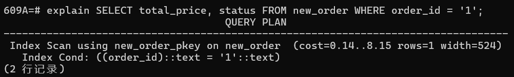

执行`SELECT total_price, status FROM old_order WHERE order_id = %s`语句时，`old_order`中`primary key(order_id)`上的索引能够加速执行过程。

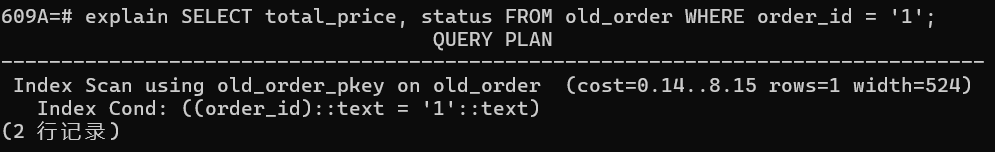

执行`select order_detail from old_order WHERE order_id = %s`语句时，`old_order`中`primary key(order_id)`上的索引能够加速执行过程。

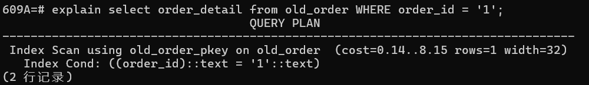执行`select order_detail from new_order WHERE order_id = %s`语句时，`new_order`中`primary key(order_id)`上的索引能够加速执行过程。

